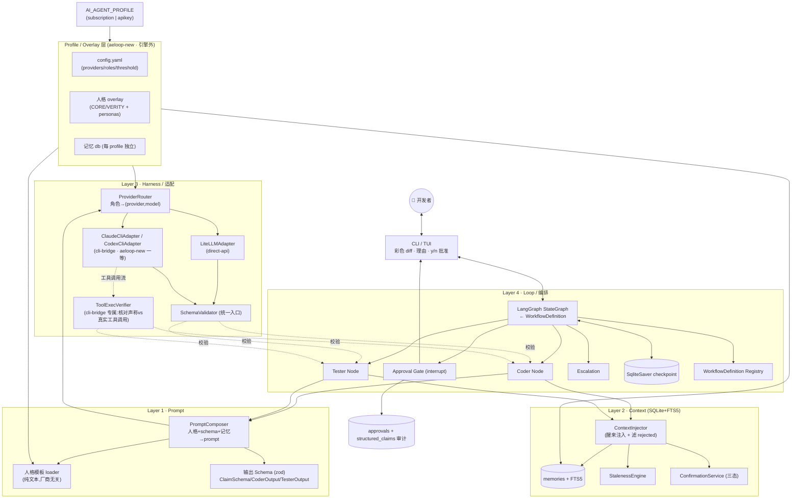
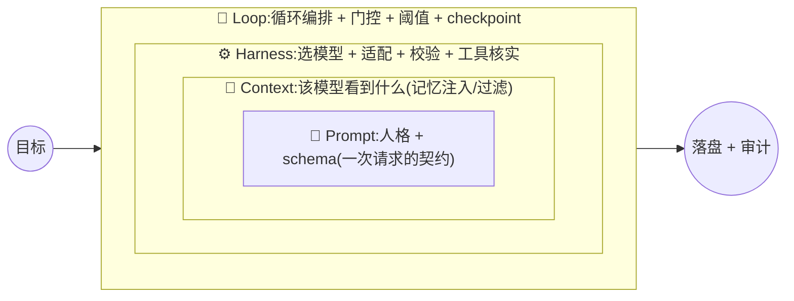
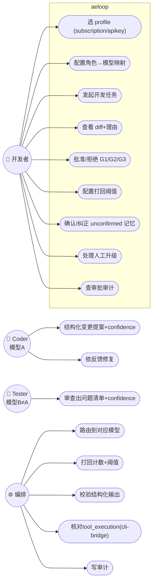
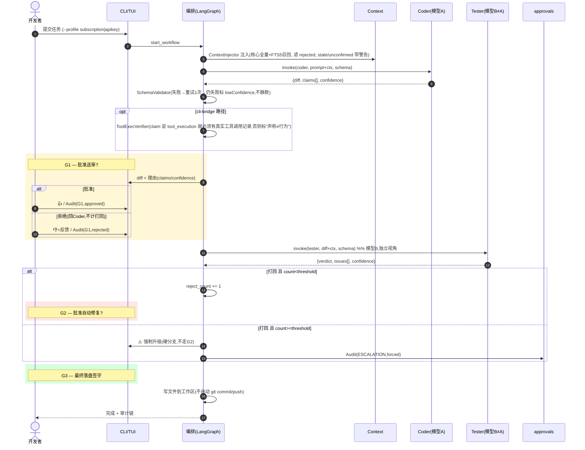
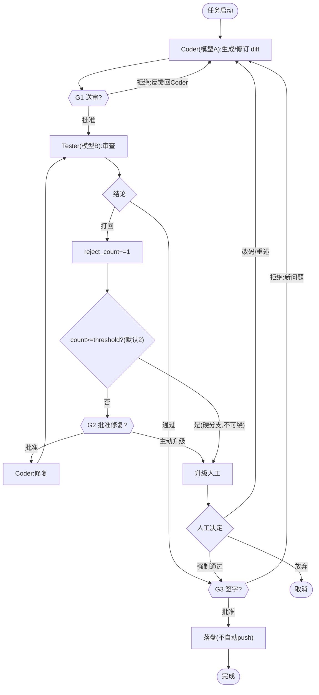
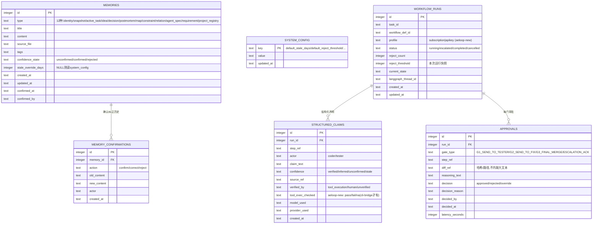

# Aeloop 方案设计(开 /spec 前的完整设计稿)

> 关联:[elishawong/ai-agent#120](https://github.com/elishawong/ai-agent/issues/120) · 上游判断:`UNIFIED-ARCHITECTURE-JUDGMENT.md`
> 引擎:**Aeloop**(私有仓 `elishawong/aeloop`,从零)。状态:**方案设计稿,供转 `/spec`;不是实现指令,未 commit 到 aeloop 仓。**
> 日期:2026-07-20
> 定位:这份是「aeloop 引擎 = Helix/Verity 共用底座」的完整设计。四层机制承接 Verity v2 已跑通的设计(M0-M3 已实测),但**加了两处 aeloop 特有的东西**:① 双适配器都一等公民(不再把 CLI 桥接推到未来)② profile/overlay 机制(一套引擎两张脸)。凡标 `[verity-proven]` = Verity 侧已有实测证据可复用;`[aeloop-new]` = aeloop 相对 Verity 的新增;`[?]` = 待 /spec 或指挥官定。

---

## 0. 这份设计要解决的

aeloop = **模型无关的、治理优先的 coder/tester 引擎**,一套代码两边跑:
- **Helix(跑 subscription profile)**:订阅额度,coder=claude-cli / tester=codex-cli(CLI 桥接)。
- **Verity(跑 apikey profile)**:公司 LiteLLM 代理,coder/tester = 池里不同模型(claude/gpt/deepseek)。

三个必须解决(承接 Verity):①防幻觉(机制化,结构化输出 schema 倒逼)②上下文记忆(醒来接得上)③coder-tester 循环 + 逐步人工门控。

**aeloop 相对 Verity 的三个关键抬升**:
1. `[aeloop-new]` **CLI 桥接适配器一等公民** —— Verity 把它标 🔒未来;aeloop 必须现在做,因为那是 Helix 的主路径,**也是唯一能做「tool_execution 真核实」的路**(纯 API 拿不到工具调用流)。
2. `[aeloop-new]` **profile/overlay 机制** —— 一个 `AI_AGENT_PROFILE` 选中一整套 overlay(config + 人格 + 记忆),引擎中立、不硬编码任何一边。
3. `[aeloop-new]` **双模型独立闭环是核心而非可选** —— coder≠tester 跨模型是两边的汇合点。

---

## 1. 总体架构(五层:四层引擎 + profile)



**分层理由**:换模型只动 H 层(换 adapter/config);换产品(Helix↔Verity)只换 profile overlay;换 workflow 只换 O7 的定义文件。人格文本、记忆结构、引擎代码都不动。

---

## 1.5 四层关系:嵌套,不是并列(Loop Engineering 视角)

上面把四层画成并排框,易误读成"四个平行模块"。实际是**逐层嵌套**——也正是业界 2026 "loop engineering" 的共识框架(Prompt→Context→Harness→Loop 逐年演进,**外层包内层、不替代内层**):

| 层 | 演进 | 拥有什么(唯一职责) | 输入←/输出→ |
|---|---|---|---|
| **Prompt** 最内 | 2022-24 | 一次请求的**契约**:人格(问什么)+ schema(答成什么形状) | ← Context 的记忆;→ 一个 well-formed prompt |
| **Context** 包 Prompt | 2025 | 模型**看到什么**:记忆检索/注入、stale/rejected 过滤 | ← 任务;→ 喂给 Prompt 的上下文 |
| **Harness** 包 Context | 2026 | **谁来跑、怎么跑**:选模型(ProviderRouter)、适配器、结构化校验、工具核实 | ← composed prompt;→ 校验过的结构化输出 |
| **Loop** 最外 | 2026 | **整个循环**:coder→gate→tester→打回计数→阈值→升级→checkpoint | ← 目标;→ 落盘 + 审计链 |

**嵌套 = 外层用内层,内层不知道外层**(M2 审查已验证无反向依赖:prompt 不 import harness/loop,context 不 import harness/loop):
- 一次 **Loop** 迭代 = 多次 **Harness** 调用(coder 一次、tester 一次);
- 一次 **Harness** 调用 = 跑一个 **Prompt**;
- 一个 **Prompt** = 从 **Context** 组装出来的。



**数据流一圈**:Loop 驱动 Coder 节点 → 向 Prompt 层要 prompt(PromptComposer 从 Context 拉记忆 + 拼人格 + schema)→ 经 Harness 选模型 A 发出、校验结构化输出(cli-bridge 还核 tool_execution)→ 回 Loop → G1 门 → 同一圈跑 Tester(模型 B)→ Loop 计打回/阈值/checkpoint → 下一步。

**为什么这个嵌套对 aeloop 承重**:文章点破的核心——**"确定性校验 > 模型自评"**——正是治理优先的命门。它落在**外两层**:Harness 的 SchemaValidator/ToolExecVerifier(机制核实)+ Loop 的独立 Tester(模型 B 审模型 A)。**防幻觉不在 Prompt 层靠"求模型诚实",而在外两层用机制兜住。** 这就是 aeloop 与 ruflo 的分野(2026-07-21 经真读 ruflo 代码核实,详见 ai-agent#127,订正此前"轻内层治理"的过度断言):ruflo **另有**成熟的编排治理——security/反注入反勾结、行为漂移降权、外部真相锚定、回归 witness——不是"轻治理",只是靶子是**防攻击 + 防漂移**,不是"证明编码 agent 没撒谎"。aeloop 的分野更精确地说是:重编排 + 治理偏安全/漂移/资源/外部锚定的 ruflo,**轻"可核实的编码闭环治理"**——缺 aeloop 主打的①确定性 tool_execution 核实(claim vs trace)②强制异模型对抗审③人工审批门+打回强升;aeloop 四层都为这条"可核实的编码闭环"服务。

## 1.6 aeloop 怎么套用这四层(层→代码映射)

| 层 | src 目录 | 关键文件 | profile 影响 |
|---|---|---|---|
| Prompt | `src/prompt/` | schema · personas · composer | 人格文本来自 profile 的 personas/ |
| Context | `src/context/` | store · staleness · confirmation · injector | 记忆 db 每 profile 独立 |
| Harness | `src/harness/` | provider-router · adapters/* · schema-validator · tool-exec-verifier | 用哪个 adapter 由 profile config 定(subscription=cli-bridge / apikey=litellm) |
| Loop | `src/loop/` | graph · nodes · gates · escalation · checkpoint | workflow def + 阈值可 profile 覆盖 |
| (外)Profile | `src/profile/` + `profiles/*` | loader + config.yaml | `AI_AGENT_PROFILE` 选中整套 overlay |

**一句话**:aeloop = 四层各一个 src 目录(严格无反向依赖)+ 一层 profile overlay 把"两张脸"套在最外。换模型只碰 Harness,换产品只碰 Profile,换流程只碰 Loop 的 workflow def。

## 1.7 后期变 dynamic / plugin 的口子(现在留,别现在建)

- 引擎第一天就读 **WorkflowDefinition** 驱动,`NodeSpec.role` 开放字符串,Gate 是边属性——**引擎里不写 `if role==="coder"`**。
- **比 Verity 改进**:persona/schema 按角色名**动态查 registry**,不用 Verity 那个硬编码 `{coder,tester}` Record —— 加角色不改 composer。
- 加角色 = persona.md + schema + config 绑定;加流程 = 加一份 workflow `.json`;真 plugin = `{role,persona,schema,adapter}` 注册进 registry;自定义 workflow **UI**(类 ruflo)= 后加上层,数据模型已支持。
- **纪律**:MVP 只一条 coder-tester loop。**留口子,别现在建 plugin 系统/UI**——那正是 ruflo 变臃肿处;等 2-3 个真实 workflow 需求再硬化(YAGNI)。

> **未来最外层「Conductor / 对话协调层」(排期 A6 后,issue #2,现在只留注记别建)**:四层 `Prompt ⊂ Context ⊂ Harness ⊂ Loop` 再往外一圈 —— 决定「进不进 loop / 何时打断正在跑的 loop / 还是自由讨论头脑风暴」。**profile 差异**:Helix(跑 subscription profile)是**薄壳/直通**(军师 + Claude Code 交互 + `/spec` 头脑风暴已天然承担这层,别重造),Verity(跑 apikey profile)才建真 orchestrator(开发者直接对着产品说话,没有别的东西在路由)。案例来源 = Verity v2 的 orchestrator 计划,但要带**修正版**落地(否则继承它的洞):① 开发者控制命令 approve/reject/stop/confirm 走**确定性代码解析**、不经 LLM;② 打断走**真 checkpoint**、不留悬空路由;③ 对话历史**落 Context 层**、不另造内存持久化;④ 角色 schema 走**动态 registry**(= 本 A0+A1 已落的 `schema-registry.ts`)。详见 issue #2。

---

## 2. Use Case 图



---

## 3. Sequence 图 — 双模型闭环 + 三门



---

## 4. 状态机(打回计数 + 阈值 + 升级)`[verity-proven]` M1 已跑通



---

## 5. DB Schema(SQLite 单文件 · 每 profile 独立一份)`[verity-proven]` M2 已实现

> 引擎定义 schema(同一套);**数据每 profile 独立**(Helix 记忆 ≠ Verity 记忆,各自 db 文件)。相对 Verity M2 实现补齐:`confirmed_at/confirmed_by`(memories)、`actor`(confirmations)、`updated_at`(system_config)—— M2 审查发现这三处缺列,aeloop 一次补上。

> **ContextInjector 的「core memory」定义(权威,Zorro R2 #4 落笔)**:注入时**无条件全量加载**的核心 `type` = `identity` / `constraint` / `decision`(身份内核 + 硬约束 + 已定决策,「醒来」永远要看到);其余类型(`snapshot`/`active_task`/`idea`/`postmortem`/`map`/`agent_spec`/`requirement`/`relation`/`project_registry` 等)**只在 FTS5 关键词召回命中时**才进上下文。这条「core 全量 + 召回 union」的区分让 FTS 召回真正起作用 —— A1 Zorro R1 blocker #3 正是早期 `core = 全表` 使 FTS 成死代码。⚠️ **待重估**:`agent_spec`/`map`/`relation`/`project_registry` 也偏「常要」,A2+ 真消费 memory 时回来重估是否纳入 core 集合(现集合定义在 `injector.ts:CORE_MEMORY_TYPES`)。



**相对 Verity 的 schema 增量** `[aeloop-new]`:`workflow_runs.profile`(哪套 overlay 跑的)、`structured_claims.tool_exec_checked`(cli-bridge 的行为一致性核对结果)。

---

## 6. 文件结构(目标 · 照 Verity 已跑通 src/ 布局改)

> aeloop 现为空仓(仅 README)。以下是**目标结构**,`[verity-proven]` 的文件 Verity 已有对应实现可参照重写(代码过不了空气墙,按设计在个人机重新著作)。

```
aeloop/                              # elishawong/aeloop (私有)
├── package.json / tsconfig.json / vitest.config.ts
├── README.md / LICENSE / .gitignore
├── .env.example                     # LITELLM_BASE_URL / LITELLM_TOKEN 等占位
├── src/
│   ├── index.ts                     # 引擎入口 barrel
│   ├── shared/                      # 跨层公共类型
│   ├── prompt/                      # L1 [verity-proven]
│   │   ├── schema.ts                #   ClaimSchema/CoderOutput/TesterOutput (zod)
│   │   ├── personas.ts              #   人格 loader(从 profile 指定路径读)
│   │   ├── composer.ts              #   PromptComposer(+滤 rejected [补 verity 缺口])
│   │   └── *.test.ts
│   ├── context/                     # L2 [verity-proven]
│   │   ├── store.ts                 #   SQLite+FTS5, RecallError 不静默
│   │   ├── staleness.ts / config.ts #   StalenessEngine + SystemConfig
│   │   ├── confirmation.ts          #   三态(+ db.transaction 包裹 [补 verity 缺口])
│   │   ├── injector.ts              #   ContextInjector [aeloop 补:verity M2 未做]
│   │   ├── types.ts / errors.ts
│   │   └── *.test.ts
│   ├── harness/                     # L3 [verity-proven 部分]
│   │   ├── types.ts / errors.ts / config.ts
│   │   ├── provider-router.ts       #   角色→(provider,model)
│   │   ├── schema-validator.ts      #   统一校验入口(重试1次→lowConfidence)
│   │   ├── adapters/
│   │   │   ├── litellm-adapter.ts   #   [verity-proven] Verity 主路径
│   │   │   ├── claude-cli-adapter.ts#   [aeloop-new] claude -p headless(已验证可行)
│   │   │   └── codex-cli-adapter.ts #   [aeloop-new] codex exec(需先 spike)
│   │   ├── tool-exec-verifier.ts    #   [aeloop-new] cli-bridge 行为一致性核对
│   │   └── *.test.ts
│   ├── loop/                        # L4 [verity M4 未建,aeloop 首建·M1 spike 已证模式]
│   │   ├── graph.ts                 #   LangGraph StateGraph 编译自 WorkflowDefinition
│   │   ├── nodes/coder.ts / tester.ts
│   │   ├── gates.ts                 #   G1/G2/G3 interrupt
│   │   ├── escalation.ts            #   阈值硬分支
│   │   ├── checkpoint.ts            #   SqliteSaver 接线
│   │   └── workflow-def.ts          #   Registry
│   ├── cli/                         # L·交互 [verity M5 未建]
│   │   ├── tui.ts / diff-render.ts / approval-prompt.ts
│   └── profile/
│       └── loader.ts                #   [aeloop-new] AI_AGENT_PROFILE → 加载 overlay
├── workflows/
│   └── coder-tester-loop.json       #   MVP 内置唯一定义
├── profiles/
│   └── subscription/                #   [个人 overlay,私有仓内 OK]
│       ├── config.yaml              #     providers.claude-cli/codex-cli + roles
│       ├── personas/                #     coder/tester 人格(继承 CORE 精神,厂商无关)
│       └── memory.db                #     (gitignore,运行态)
│   # profiles/apikey/  ← 只在公司内部 git,永不进本仓(.gitignore 屏蔽)
└── spikes/                          # 一次性证伪(codex exec / e2e 闭环)
```

**profile 边界**:`profiles/subscription/` 在私有仓内可接受;`profiles/apikey/` **只在公司内部 git**,本仓 `.gitignore` 显式屏蔽,防误入。

---

## 7. 适配层设计(双适配器一等)`[aeloop-new]`

```typescript
interface ModelAdapter {
  readonly id: string;                 // "litellm" | "claude-cli" | "codex-cli"
  readonly kind: "direct-api" | "cli-bridge";
  checkAvailability(): Promise<AvailabilityResult>;   // 必须真实探活(deepseek 列表可见≠可调用)
  invoke(req: InvokeRequest): Promise<InvokeResult>;
  // cli-bridge 专属:返回工具调用流,供 ToolExecVerifier 核对
  toolTrace?(): ToolCallRecord[];
}
```

| profile | coder | tester | 说明 |
|---|---|---|---|
| **subscription** | claude-cli | codex-cli | 订阅、无 apikey;cli-bridge → **可做 tool_execution 真核实** |
| **apikey** | litellm(claude) | litellm(gpt/deepseek) | 公司代理;纯 API → tool_execution 核对不可用,退到「原生 confidence」强度 |

**config.yaml(每 profile 一份)**:
```yaml
profile: subscription                # 或 apikey
providers:
  claude-cli: { kind: cli-bridge, cmd: "claude" }
  codex-cli:  { kind: cli-bridge, cmd: "codex" }
  litellm:    { kind: direct-api, base_url: ${LITELLM_BASE_URL}, api_key: ${LITELLM_TOKEN} }
roles:
  coder:  { provider: claude-cli }
  tester: { provider: codex-cli }    # 必须 ≠ coder 的模型(独立视角)
workflow:
  reject_threshold: 2
```

---

## 8. 里程碑(aeloop 从零 · 复用 Verity 已证设计)

| 里程碑 | 内容 | 相对 Verity |
|---|---|---|
| **A0 脚手架** | 新仓 src/ 骨架 + tsconfig + vitest + profile loader 空壳 | 新著作 |
| **A1 Context+Prompt** | REQ-M1~M4 + P1~P3 **+ ContextInjector + 补三缺口(rejected滤/事务/缺列)** | `[verity-proven]` 设计,重写 + 补 M2 遗留 |
| **A2 Harness** | ProviderRouter + LiteLLMAdapter + SchemaValidator | `[verity-proven]` 重写 |
| **A3 CLI 桥接 + 核实** | ClaudeCliAdapter + CodexCliAdapter + ToolExecVerifier | `[aeloop-new]` 全新,先跑 codex exec spike |
| **A4 Loop** | LangGraph 编排 + G1/G2/G3 + 阈值强升 + 审计 | `[verity M4 未建]`,M1 spike 已证模式 |
| **A5 CLI/TUI** | 彩色 diff + y/n 批准 + 升级视觉区分 | `[verity M5 未建]` |
| **A6 profile 双跑验收** | subscription(claude+codex) 与 apikey(litellm) 各跑通一次真实任务 | `[aeloop-new]` 两边验收 |

**先做钻石**(判断稿定的最高 ROI):A1 的 **ClaimSchema + 结构化输出** + A3 的 **ToolExecVerifier**(唯一真防幻觉的那道闸)优先立起来。

---

## 8.5 Verity M2/M3 已暴露的洞 → aeloop 必修清单(PRD 验收项来源)

> 依据:Verity 侧 M2/M3 对抗式审查证据(2026-07-17)。这些是 Verity clean-room 实现**连续两个里程碑没做到**的地方,aeloop 从第一天避开,PRD 把它们写成硬验收项。

**⚠️ 方法论警示(最重要)**:Verity M2/M3 都是「层写完、测试绿、但没接线」—— 三层各自测试全绿,却没有胶水串起来(ContextInjector 是那瓶空瓶子)。**aeloop 每个里程碑收尾必须有一条薄垂直切片真正接通**(哪怕 mock 下游),证明胶水存在,不许只堆孤立的绿测试。

| # | Verity 的洞 | aeloop 必修(验收项) | 落在 |
|---|---|---|---|
| 1 | ProviderRouter 不存在,LiteLLMAdapter 硬编码 provider、忽略 `RoleConfig.provider` → 实际只能用 LiteLLM | **ProviderRouter 真做**:读 `RoleConfig.provider` → 选 adapter;加 provider 零改编排代码(aeloop 天生 2+ adapter,躲不过) | A2 |
| 2 | ContextInjector 不存在,Context→Prompt→Harness 闭环没形成 | **ContextInjector + 真闭环**是一等交付;A1 收尾要有 Context→Prompt 垂直切片跑通 | A1 |
| 3 | SchemaValidator 重试发一模一样的请求(无助修复) | 重试**把上次校验错误喂回模型**,不是重发相同请求 | A2 |
| 4 | InvokeResult 只有 content/httpStatus | **带 `provider`/`model`(+ aeloop 的 `tool_exec_checked`)**,审计能知道实际谁回的 | A2/A3 |
| 5 | adapter `JSON.parse` 无 try-catch → 抛裸 SyntaxError | 包 try-catch → 统一 `AdapterInvokeError` | A2 |
| 6 | HTTP 错误只覆盖 400;baseUrl 尾斜线 / api_key 缺失未测 | 401/403/429/5xx + 尾斜线 + api_key 缺失**都要有测试** | A2 |
| 7 | confirmation 三方法无 `db.transaction`;memories 缺 confirmed_at/by、confirmations 缺 actor、system_config 缺 updated_at | 事务包裹 + 补齐所有缺列(对齐 §5 ER) | A1 |
| 8 | rejected 过滤无处承担;replaceLatest/persona 缺失路径无测试;dist 不拷 .md;无 lint | ContextInjector 滤 rejected;补这些测试;build 拷 personas/*.md;配 lint 脚本 | A0/A1 |

**验收总纲**:aeloop 的「完成」= 不只测试绿,而是**该里程碑的垂直切片真的接通 + 上表对应项都过**。Zorro 审时拿这张表逐条核(尤其"有没有接线"),照 Verity M3 审查那种**对抗式、真跑命令、不采信文档自我声明**的做法。

---

## 9. 开工前必跑的 spike

1. `[需 spike]` **codex exec 非交互模式**(A3 前置;`claude -p` 已验证,codex `--help` 空返回未验成)。
2. `[需 spike]` **deepseek 探活 + 结构化输出**(apikey profile tester 半边;deepseek-v3.2 曾列表可见调用 400,且 json_schema 支持未验)。
3. `[verity-proven]` LangGraph 跨进程 interrupt/resume、LiteLLM json_schema 透传、e2e 最小闭环 —— Verity 已跑通,aeloop 重写后回归验证即可。

---

## 10. 交给 /spec 细化的开放点

- `[?]` A1~A6 是否就是 /spec 的里程碑划分,还是重新拆。
- `[?]` ContextInjector 的"醒来注入"语义:aeloop 要不要在此层把 Helix 现有 CORE 醒来协议的精神固化进来(判断稿提醒:醒来机制 Helix 现有的比 Verity 完整,别退化)。
- `[?]` profile loader 的 overlay 发现约定(路径/env/默认)。
- `[?]` LangGraph 依赖在公司 JFrog 已过审(个人侧同装),但 node:sqlite 换 better-sqlite3 的减依赖是否要做(判断稿列为可选杠杆)。
- `[?]` workflow-def 的 schema(为未来自定义 workflow 留口子,MVP 只内置一份)。

---

## 附:与判断稿的关系
本设计是 `UNIFIED-ARCHITECTURE-JUDGMENT.md`(方向)的**落地展开**(怎么建)。判断稿定"偷设计不偷实现 + 引擎中立 + 单向阀 + 双模型闭环";本稿把它变成可 /spec 的图/表/结构。两份都未进 aeloop 仓 —— aeloop 骨架由 /spec→Cypher 正式著作。
```
