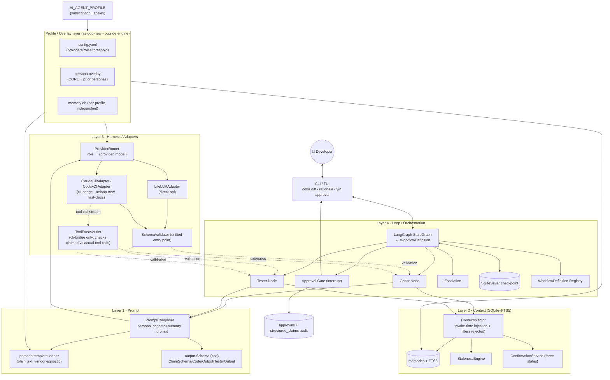
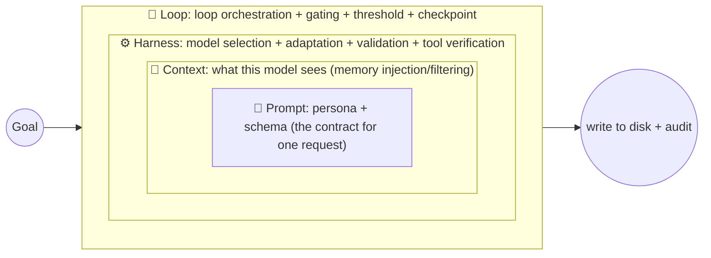
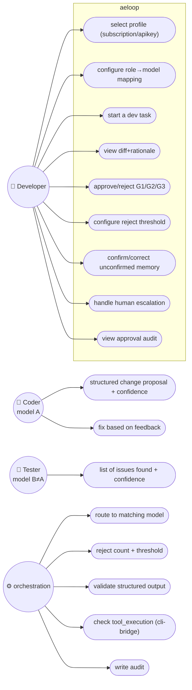
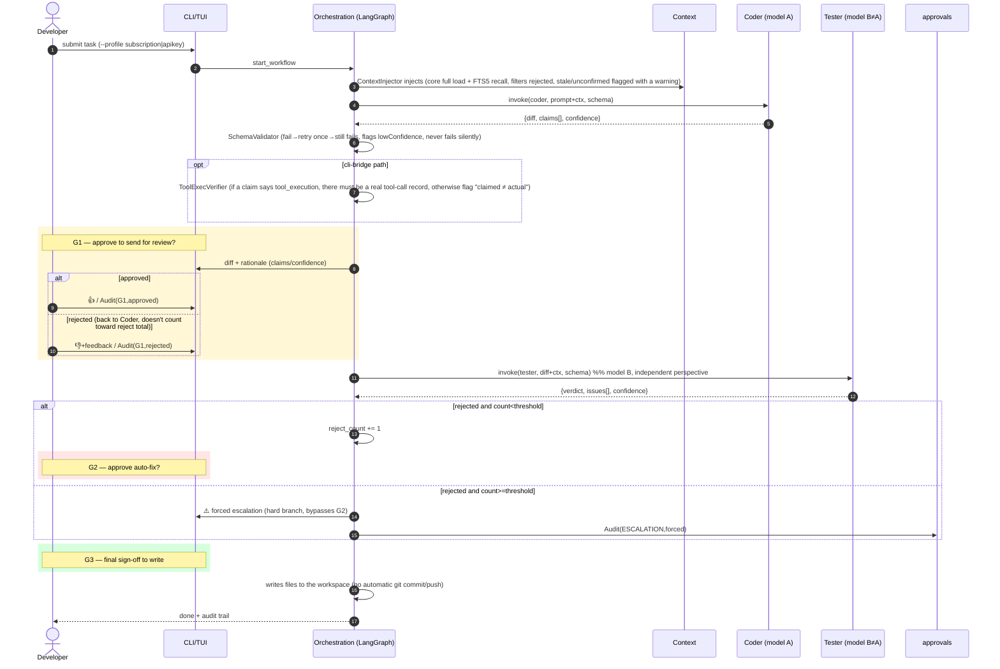
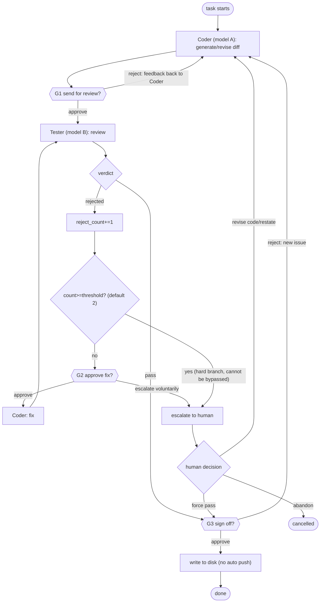
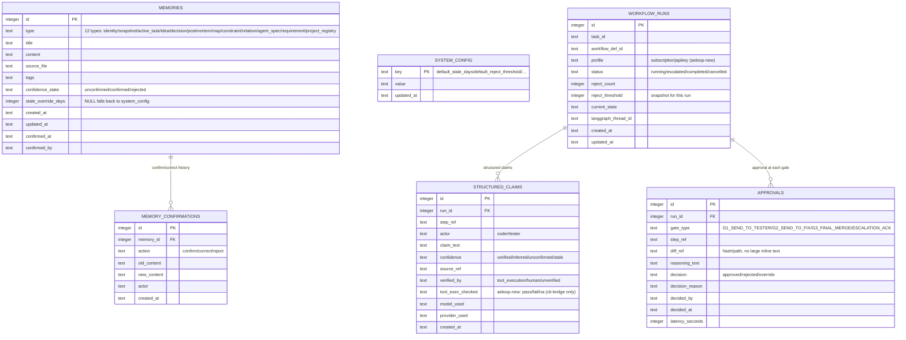

# Aeloop Solution Design (complete design draft before opening /spec)

> Upstream judgment call: `UNIFIED-ARCHITECTURE-JUDGMENT.md`
> Engine: **Aeloop** (private repo `elishawong/aeloop`, built from scratch). Status: **solution design draft, to be handed off to `/spec`; not implementation instructions, not yet committed to the aeloop repo.**
> Date: 2026-07-20
> Positioning: this is the complete design for "aeloop engine = shared foundation for the personal subscription profile and the company API/LiteLLM profile." The four-layer mechanism carries forward a design already proven by a prior internal implementation v2 (M0-M3 tested), but **adds two things specific to aeloop**: ① both adapters are first-class from day one (no longer pushing the CLI bridge into the future) ② a profile/overlay mechanism (one engine, two faces). Anything tagged `[prior-proven]` = already has tested evidence from the prior internal implementation and can be reused; `[aeloop-new]` = new relative to the prior internal implementation; `[?]` = to be resolved during /spec or by decision.

---

## 0. What this design solves

aeloop = a **model-agnostic, governance-first coder/tester engine**, one codebase running both sides:
- **Personal subscription profile**: subscription-based quota, coder=claude-cli / tester=codex-cli (CLI bridge).
- **Company API / LiteLLM profile**: company LiteLLM proxy, coder/tester = different models from the pool (claude/gpt/deepseek).

Three things it must solve (carried forward from the prior internal implementation): ① anti-hallucination (mechanized, enforced via structured-output schemas) ② contextual memory (picking up where it left off on "wake") ③ coder-tester loop + staged human gating.

**Three key upgrades aeloop makes over the prior internal implementation**:
1. `[aeloop-new]` **CLI bridge adapters are first-class** — the prior internal implementation flagged this 🔒future; aeloop has to do it now, because it's the primary path for the personal subscription profile, **and the only path that can do real `tool_execution` verification** (a pure API can't retrieve the tool-call stream).
2. `[aeloop-new]` **profile/overlay mechanism** — a single `AI_AGENT_PROFILE` selects an entire overlay (config + persona + memory); the engine stays neutral and doesn't hardcode either side.
3. `[aeloop-new]` **an independent dual-model closed loop is core, not optional** — coder≠tester cross-model is where both sides converge.

---

## 1. Overall architecture (five layers: four engine layers + profile)



**Why layer it this way**: switching models only touches the H layer (swap adapter/config); switching products (subscription profile ↔ apikey profile) only swaps the profile overlay; switching workflows only swaps O7's definition file. Persona text, memory structure, and engine code all stay untouched.

---

## 1.5 How the four layers relate: nested, not parallel (a Loop Engineering perspective)

The diagram above draws the four layers as side-by-side boxes, which can be misread as "four parallel modules." They're actually **nested layer by layer** — which is exactly the industry's 2026 consensus "loop engineering" framework (Prompt→Context→Harness→Loop evolving year over year, **each outer layer wraps the inner one rather than replacing it**):

| Layer | Evolution | What it owns (sole responsibility) | Input ←/Output → |
|---|---|---|---|
| **Prompt** (innermost) | 2022-24 | The **contract** for a single request: persona (what to ask) + schema (what shape the answer must take) | ← memory from Context; → a well-formed prompt |
| **Context** (wraps Prompt) | 2025 | What the model **sees**: memory retrieval/injection, stale/rejected filtering | ← the task; → context fed to Prompt |
| **Harness** (wraps Context) | 2026 | **Who runs it and how**: model selection (ProviderRouter), adapters, structured validation, tool verification | ← composed prompt; → validated structured output |
| **Loop** (outermost) | 2026 | **The whole loop**: coder→gate→tester→reject count→threshold→escalation→checkpoint | ← the goal; → written to disk + audit trail |

**Nested = the outer layer uses the inner one, the inner one doesn't know the outer exists** (M2 review has already verified there's no reverse dependency: prompt doesn't import harness/loop, context doesn't import harness/loop):
- One **Loop** iteration = multiple **Harness** calls (one for coder, one for tester);
- One **Harness** call = runs one **Prompt**;
- One **Prompt** = assembled from **Context**.



**One turn of the data flow**: Loop drives the Coder node → asks the Prompt layer for a prompt (PromptComposer pulls memory from Context + assembles persona + schema) → goes through Harness, selects model A, sends it, validates the structured output (cli-bridge also checks `tool_execution`) → back to Loop → the G1 gate → the same turn runs Tester (model B) → Loop tallies rejects/threshold/checkpoint → next step.

**Why this nesting is load-bearing for aeloop**: the core insight — **"deterministic validation > model self-assessment"** — is exactly the linchpin of governance-first design. It lands on the **outer two layers**: Harness's SchemaValidator/ToolExecVerifier (mechanized verification) + Loop's independent Tester (model B reviewing model A). **Anti-hallucination doesn't rely on "asking the model to be honest" at the Prompt layer — it's backstopped mechanically by the outer two layers.** This is where aeloop diverges from ruflo (verified 2026-07-21 by actually reading the ruflo source, correcting an earlier overclaim of "light inner-layer governance" — see internal engineering notes): ruflo **separately** has mature orchestration governance — security / anti-prompt-injection / anti-collusion, behavioral-drift downweighting, external ground-truth anchoring, regression witnesses — it isn't "light governance," its target is just **attack prevention + drift prevention**, not "proving a coding agent didn't lie." More precisely, the divide is: ruflo is heavy on orchestration and its governance leans toward security/drift/resources/external anchoring, while it's **light on "verifiable coding-loop governance"** — it lacks what aeloop leads with: ① deterministic `tool_execution` verification (claim vs. trace) ② mandatory cross-model adversarial review ③ human approval gates + forced escalation on repeated rejection; all four of aeloop's layers serve this "verifiable coding loop."

## 1.6 How aeloop applies these four layers (layer → code mapping)

| Layer | src directory | Key files | Profile impact |
|---|---|---|---|
| Prompt | `src/prompt/` | schema - personas - composer | Persona text comes from the profile's `personas/` |
| Context | `src/context/` | store - staleness - confirmation - injector | Memory db is independent per profile |
| Harness | `src/harness/` | provider-router - adapters/* - schema-validator - tool-exec-verifier | Which adapter is used is decided by the profile config (subscription=cli-bridge / apikey=litellm) |
| Loop | `src/loop/` | graph - nodes - gates - escalation - checkpoint | workflow def + threshold can be overridden per profile |
| (outer) Profile | `src/profile/` + `profiles/*` | loader + config.yaml | `AI_AGENT_PROFILE` selects the whole overlay |

**In one sentence**: aeloop = one src directory per layer (strictly no reverse dependencies) + one profile overlay layer that puts "two faces" on the outside. Switching models only touches Harness, switching products only touches Profile, switching flows only touches Loop's workflow def.

## 1.7 The hook for later going dynamic/plugin-based (leave it now, don't build it now)

- From day one the engine is driven by reading a **WorkflowDefinition**; `NodeSpec.role` is an open string, and Gate is an edge attribute — **the engine never hardcodes `if role==="coder"`**.
- **Improvement over the prior internal implementation**: persona/schema is looked up dynamically by role name via the registry, instead of the hardcoded `{coder,tester}` Record a prior internal implementation used — adding a role doesn't require touching the composer.
- Adding a role = binding a persona.md + schema + config; adding a flow = adding a workflow `.json`; a real plugin = registering `{role,persona,schema,adapter}` into the registry; a custom workflow **UI** (ruflo-like) = added as a later layer, the data model already supports it.
- **Discipline**: the MVP is only one coder-tester loop. **Leave the hook, don't build the plugin system/UI now** — that's exactly where ruflo got bloated; harden it once there are 2-3 real workflow needs (YAGNI).

> **A future outermost "Conductor / dialogue coordination layer"** (scheduled after A6, issue #2, just a note for now — don't build it): one more ring outside the four layers `Prompt ⊂ Context ⊂ Harness ⊂ Loop` — deciding "whether to enter the loop / when to interrupt a running loop / or just have free-form discussion and brainstorming." **Profile difference**: the personal subscription profile is a **thin shell / pass-through** (the advisor + Claude Code interaction + `/spec` brainstorming already naturally carries this layer, don't rebuild it), while the company API/LiteLLM profile is the one that needs a real orchestrator (the developer talks directly to the product, with nothing else doing the routing). The source case = a prior internal implementation's v2 orchestrator plan, but it needs to land as a **corrected version** (otherwise it inherits the same holes): ① developer control commands approve/reject/stop/confirm go through **deterministic code parsing**, not an LLM; ② interrupts go through a **real checkpoint**, no dangling routes left behind; ③ conversation history **lives in the Context layer**, no separate memory persistence invented; ④ role schemas go through the **dynamic registry** (= the `schema-registry.ts` already landed in this A0+A1). See issue #2 for details.

---

## 2. Use case diagram



---

## 3. Sequence diagram — dual-model loop + three gates



---

## 4. State machine (reject count + threshold + escalation) `[prior-proven]` M1 already proven



---

## 5. DB schema (single SQLite file - one independent copy per profile) `[prior-proven]` M2 already implemented

> The engine defines the schema (one shared set); **the data is independent per profile** (the subscription profile's memory ≠ the apikey profile's memory, separate db files each). Relative to the prior internal implementation's M2, this fills in: `confirmed_at/confirmed_by` (memories), `actor` (confirmations), `updated_at` (system_config) — M2 review found these three columns missing, and aeloop adds them all at once.

> **ContextInjector's "core memory" definition (authoritative, written down in Review Round 2 #4)**: the core `type`s that are **loaded unconditionally in full** on injection = `identity` / `constraint` / `decision` (identity core + hard constraints + settled decisions — always visible on "wake"); all other types (`snapshot`/`active_task`/`idea`/`postmortem`/`map`/`agent_spec`/`requirement`/`relation`/`project_registry`, etc.) only enter the context **when an FTS5 keyword recall hits them**. This "core loads in full + recall is a union" distinction is what makes FTS recall actually matter — A1's Review Round 1 blocker #3 was exactly this: an early `core = the whole table` turned FTS into dead code. ⚠️ **To be re-evaluated**: `agent_spec`/`map`/`relation`/`project_registry` also lean toward "usually needed" — revisit whether to fold them into the core set once A2+ actually consumes memory (the current set is defined in `injector.ts:CORE_MEMORY_TYPES`).



**Schema additions relative to the prior internal implementation** `[aeloop-new]`: `workflow_runs.profile` (which overlay it ran with), `structured_claims.tool_exec_checked` (the cli-bridge behavioral-consistency check result).

---

## 6. File structure (target - adapted from the src/ layout already proven by the prior internal implementation)

> aeloop is currently an empty repo (README only). Below is the **target structure**; files tagged `[prior-proven]` already have a corresponding implementation in the prior internal implementation that can be referenced when rewriting (code can't cross the air gap, so it's re-authored from the design on a personal machine).

```
aeloop/                              # elishawong/aeloop (private)
├── package.json / tsconfig.json / vitest.config.ts
├── README.md / LICENSE / .gitignore
├── .env.example                     # placeholders for LITELLM_BASE_URL / LITELLM_TOKEN etc.
├── src/
│   ├── index.ts                     # engine entry barrel
│   ├── shared/                      # cross-layer shared types
│   ├── prompt/                      # L1 [prior-proven]
│   │   ├── schema.ts                #   ClaimSchema/CoderOutput/TesterOutput (zod)
│   │   ├── personas.ts              #   persona loader (reads from the path the profile specifies)
│   │   ├── composer.ts              #   PromptComposer (+ filters rejected [fills a gap in the prior implementation])
│   │   └── *.test.ts
│   ├── context/                     # L2 [prior-proven]
│   │   ├── store.ts                 #   SQLite+FTS5, RecallError never fails silently
│   │   ├── staleness.ts / config.ts #   StalenessEngine + SystemConfig
│   │   ├── confirmation.ts          #   three states (+ wrapped in db.transaction [fills a gap in the prior implementation])
│   │   ├── injector.ts              #   ContextInjector [aeloop fills a gap: the prior implementation's M2 never built this]
│   │   ├── types.ts / errors.ts
│   │   └── *.test.ts
│   ├── harness/                     # L3 [partially prior-proven]
│   │   ├── types.ts / errors.ts / config.ts
│   │   ├── provider-router.ts       #   role → (provider, model)
│   │   ├── schema-validator.ts      #   unified validation entry point (retries once → lowConfidence)
│   │   ├── adapters/
│   │   │   ├── litellm-adapter.ts   #   [prior-proven] the prior implementation's primary path
│   │   │   ├── claude-cli-adapter.ts#   [aeloop-new] claude -p headless (already verified feasible)
│   │   │   └── codex-cli-adapter.ts #   [aeloop-new] codex exec (needs a spike first)
│   │   ├── tool-exec-verifier.ts    #   [aeloop-new] cli-bridge behavioral-consistency check
│   │   └── *.test.ts
│   ├── loop/                        # L4 [the prior implementation's M4 was never built; aeloop builds it first - M1 spike already proved the pattern]
│   │   ├── graph.ts                 #   LangGraph StateGraph compiled from a WorkflowDefinition
│   │   ├── nodes/coder.ts / tester.ts
│   │   ├── gates.ts                 #   G1/G2/G3 interrupt
│   │   ├── escalation.ts            #   hard branch on threshold
│   │   ├── checkpoint.ts            #   SqliteSaver wiring
│   │   └── workflow-def.ts          #   Registry
│   ├── cli/                         # L-interaction [the prior implementation's M5 was never built]
│   │   ├── tui.ts / diff-render.ts / approval-prompt.ts
│   └── profile/
│       └── loader.ts                #   [aeloop-new] AI_AGENT_PROFILE → loads the overlay
├── workflows/
│   └── coder-tester-loop.json       #   the one definition built into the MVP
├── profiles/
│   └── subscription/                #   [personal overlay, fine to keep in the private repo]
│       ├── config.yaml              #     providers.claude-cli/codex-cli + roles
│       ├── personas/                #     coder/tester personas (inherit the spirit of CORE, vendor-agnostic)
│       └── memory.db                #     (gitignored, runtime state)
│   # profiles/apikey/  ← only in the company's internal git, never enters this repo (.gitignore blocks it)
└── spikes/                          # one-off disproof spikes (codex exec / e2e closed loop)
```

**Profile boundary**: `profiles/subscription/` is acceptable inside the private repo; `profiles/apikey/` **only lives in the company's internal git**, this repo's `.gitignore` explicitly blocks it to prevent accidental inclusion.

**External persona-set roots** (issue #42, `src/profile/personas-root.ts`): a `config.yaml` may set an optional `personas: <name>` field to point `PromptComposer` at role persona files outside the profile's own directory — `<AELOOP_PERSONAS_ROOT>/<name>/personas` instead of the default `<profileDir>/personas`. This lets a deployment keep `profiles/apikey/config.yaml` in the profile tree while its actual `coder.md`/`tester.md` persona files live in a separate, non-public location. This is unrelated to Conductor's `brains/company/`/`brains/personal/` directories (see `brains/README.md`) — those hold Brain `manifest.yaml`/`system-prompt.md` artifacts consumed by Conductor, not by Aeloop's PromptComposer; `personas` never reads from or points at them. `personas` is optional and has no implicit default — a profile that omits it keeps exactly today's `<profileDir>/personas` behavior. `<name>` must be a single safe path segment (reuses `shared/safe-path.ts`, the same containment/symlink-escape checks `profile`/role names already go through); an unsafe name, a missing `AELOOP_PERSONAS_ROOT`, or a nonexistent root directory all fail closed with a typed error rather than silently falling back to the legacy path.

---

## 7. Adapter layer design (dual adapters, first-class) `[aeloop-new]`

```typescript
interface ModelAdapter {
  readonly id: string;                 // "litellm" | "claude-cli" | "codex-cli"
  readonly kind: "direct-api" | "cli-bridge";
  checkAvailability(): Promise<AvailabilityResult>;   // must do a real liveness probe (visible in deepseek's list ≠ actually callable)
  invoke(req: InvokeRequest): Promise<InvokeResult>;
  // cli-bridge only: returns the tool-call stream for ToolExecVerifier to check
  toolTrace?(): ToolCallRecord[];
}
```

| Profile | coder | tester | Notes |
|---|---|---|---|
| **subscription** | claude-cli | codex-cli | Subscription-based, no apikey; cli-bridge → **can do real `tool_execution` verification** |
| **apikey** | litellm(claude) | litellm(gpt/deepseek) | Company proxy; pure API → `tool_execution` verification isn't available, falls back to "native confidence" strength |

**config.yaml (one per profile)**:
```yaml
profile: subscription                # or apikey
providers:
  claude-cli: { kind: cli-bridge, cmd: "claude" }
  codex-cli:  { kind: cli-bridge, cmd: "codex" }
  litellm:    { kind: direct-api, base_url: ${LITELLM_BASE_URL}, api_key: ${LITELLM_TOKEN} }
roles:
  coder:  { provider: claude-cli }
  tester: { provider: codex-cli }    # must be a different model than coder's (independent perspective)
harness:
  schema_max_attempts: 2               # default 2; positive integer
workflow:
  reject_threshold: 2
```

**Profile boundary — `harness.schema_max_attempts` vs `workflow.reject_threshold`** (issue #45): these are two independent knobs, not aliases of each other.
- `harness.schema_max_attempts` (default `2`, must be a positive integer): the **total number of model attempts allowed per schema validation** inside `SchemaValidator` — i.e. how many times the harness retries a single structured-output call when the model's response fails to parse/validate against the expected schema, before giving up on that call.
- `workflow.reject_threshold` (default `2`): a **tester rejection escalation** counter at the G1/G2/G3 loop level — how many times the tester can reject the coder's work (tracked as `reject_count` against the run's snapshotted `reject_threshold`, see §schema `WORKFLOW_RUN`) before the run forces escalation.

They live in different layers (harness/adapter call retries vs. the LangGraph review loop) and must not be conflated when tuning either profile.

---

## 8. Milestones (aeloop from scratch - reusing the design already proven by the prior internal implementation)

| Milestone | Content | Relative to the prior internal implementation |
|---|---|---|
| **A0 scaffold** | New repo src/ skeleton + tsconfig + vitest + empty profile loader shell | Newly authored |
| **A1 Context+Prompt** | REQ-M1~M4 + P1~P3 **+ ContextInjector + fills three gaps (rejected filtering/transactions/missing columns)** | `[prior-proven]` design, rewritten + fills what M2 left behind |
| **A2 Harness** | ProviderRouter + LiteLLMAdapter + SchemaValidator | `[prior-proven]` rewritten |
| **A3 CLI bridge + verification** | ClaudeCliAdapter + CodexCliAdapter + ToolExecVerifier | `[aeloop-new]` entirely new, run the codex exec spike first |
| **A4 Loop** | LangGraph orchestration + G1/G2/G3 + forced escalation on threshold + audit | `[the prior implementation's M4 was never built]`, M1 spike already proved the pattern |
| **A5 CLI/TUI** | Color diff + y/n approval + visually distinct escalation state | `[the prior implementation's M5 was never built]` |
| **A6 dual-profile acceptance run** | Run one real task through subscription (claude+codex) and one through apikey (litellm) | `[aeloop-new]` acceptance on both sides |

**Do the diamond first** (the highest-ROI call from the judgment doc): stand up A1's **ClaimSchema + structured output** + A3's **ToolExecVerifier** (the one gate that's real anti-hallucination) first.

---

## 8.5 Holes exposed by the prior internal implementation's M2/M3 → aeloop's required fixes (source of PRD acceptance items)

> Basis: adversarial review evidence from the prior internal implementation's M2/M3 (2026-07-17). These are places the prior implementation's clean-room build **missed across two consecutive milestones**; aeloop avoids them from day one, and the PRD writes them up as hard acceptance items.

**⚠️ Methodology warning (the most important one)**: the prior implementation's M2/M3 were both "layer written, tests green, but never wired together" — all three layers had fully green tests individually, but there was no glue stringing them together (ContextInjector was the empty bottle). **Every aeloop milestone must close out with one thin vertical slice actually wired end to end** (even if the downstream is mocked), proving the glue exists — stacking isolated green tests alone is not allowed.

| # | Hole in the prior implementation | aeloop's required fix (acceptance item) | Lands in |
|---|---|---|---|
| 1 | ProviderRouter didn't exist; LiteLLMAdapter hardcoded the provider and ignored `RoleConfig.provider` → in practice only LiteLLM could be used | **Actually build ProviderRouter**: read `RoleConfig.provider` → pick the adapter; adding a provider requires zero changes to orchestration code (aeloop is born with 2+ adapters, can't dodge this) | A2 |
| 2 | ContextInjector didn't exist; the Context→Prompt→Harness loop never actually closed | **ContextInjector + a real closed loop** is a first-class deliverable; A1 must close out with a working Context→Prompt vertical slice | A1 |
| 3 | SchemaValidator retried by sending the exact same request (didn't help it fix anything) | The retry **feeds the previous validation error back to the model**, it doesn't resend the same request | A2 |
| 4 | InvokeResult only had content/httpStatus | **Include `provider`/`model` (+ aeloop's `tool_exec_checked`)**, so the audit trail can know who actually answered | A2/A3 |
| 5 | adapter's `JSON.parse` had no try-catch → threw a bare SyntaxError | Wrap it in try-catch → a unified `AdapterInvokeError` | A2 |
| 6 | HTTP errors only covered 400; a trailing slash on baseUrl / a missing api_key were untested | 401/403/429/5xx + trailing slash + missing api_key **must all have tests** | A2 |
| 7 | none of confirmation's three methods used `db.transaction`; memories was missing confirmed_at/by, confirmations was missing actor, system_config was missing updated_at | Wrap in transactions + fill in every missing column (align with the §5 ER diagram) | A1 |
| 8 | nothing owned rejected filtering; replaceLatest / missing-persona-path had no tests; dist didn't copy .md files; no lint | ContextInjector filters rejected; add these tests; build copies personas/*.md; wire up a lint script | A0/A1 |

**Overall acceptance principle**: aeloop's "done" ≠ tests are green — it means **the milestone's vertical slice is actually wired up + every corresponding item in the table above passes**. Review checks this table item by item (especially "is it actually wired"), following the same **adversarial, actually-run-the-commands, don't-take-the-doc's-word-for-it** approach used to review the prior implementation's M3.

---

## 9. Spikes that must run before work starts

1. `[needs a spike]` **codex exec non-interactive mode** (a prerequisite for A3; `claude -p` is already verified, codex `--help` returning empty hasn't been verified working).
2. `[needs a spike]` **deepseek liveness probe + structured output** (the tester half of the apikey profile; deepseek-v3.2 has been seen visible-in-list but returning 400 on invocation, and json_schema support is unverified).
3. `[prior-proven]` LangGraph cross-process interrupt/resume, LiteLLM json_schema passthrough, minimal e2e closed loop — the prior internal implementation already proved these out; aeloop just needs to re-verify after rewriting.

---

## 10. Open points left for /spec to work out

- `[?]` Whether A1~A6 is exactly how /spec should split milestones, or whether it should re-split them.
- `[?]` The semantics of ContextInjector's "wake-time injection": whether aeloop should bake the spirit of the existing CORE wake protocol from the personal subscription profile's product into this layer (the judgment doc's reminder: the existing wake mechanism on that side is more complete than the prior internal implementation's — don't regress it).
- `[?]` The overlay-discovery convention for the profile loader (path/env/default).
- `[?]` The LangGraph dependency has already cleared review on the company's JFrog (installed the same way on the personal side), but whether to swap `node:sqlite` for `better-sqlite3` to cut a dependency (the judgment doc lists this as an optional lever).
- `[?]` The schema for workflow-def (leaving a hook for future custom workflows; the MVP only ships one built in).

---

## Appendix: relationship to the judgment doc
This design is the **concrete elaboration** (how to build it) of `UNIFIED-ARCHITECTURE-JUDGMENT.md` (the direction). The judgment doc settles "steal the design, not the implementation + engine neutrality + one-way valve + dual-model closed loop"; this doc turns that into diagrams/tables/structure that /spec can work from. Neither document has entered the aeloop repo — the aeloop skeleton will be formally authored during the /spec→build handoff.
