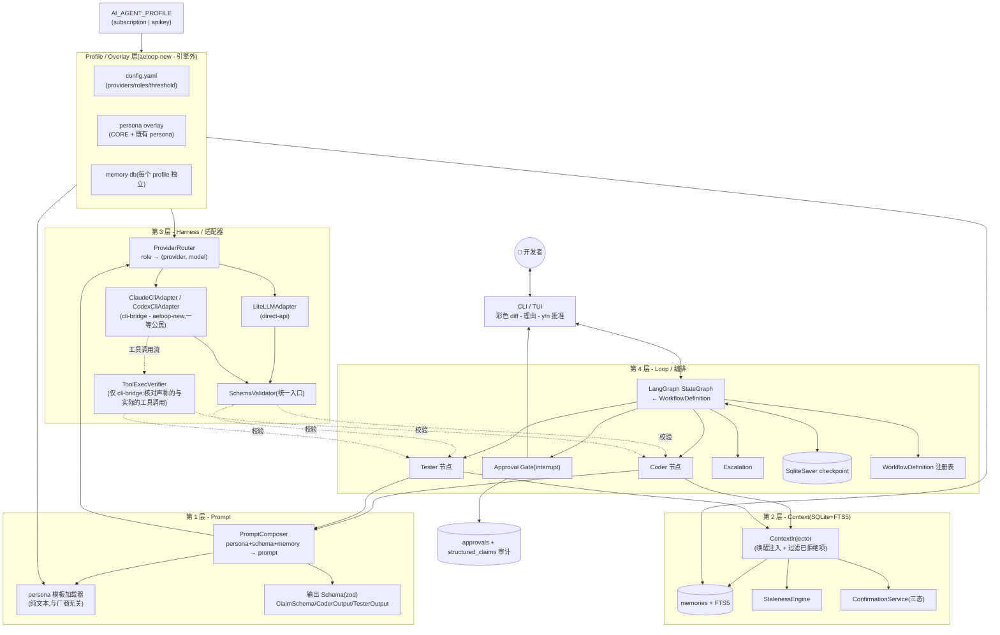
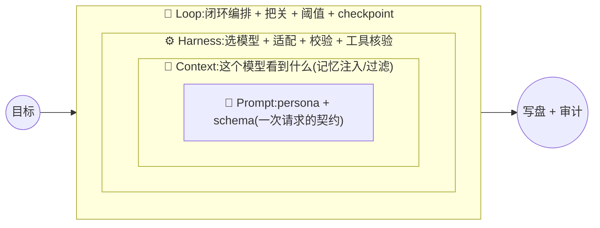
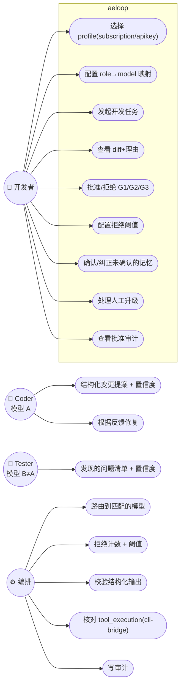
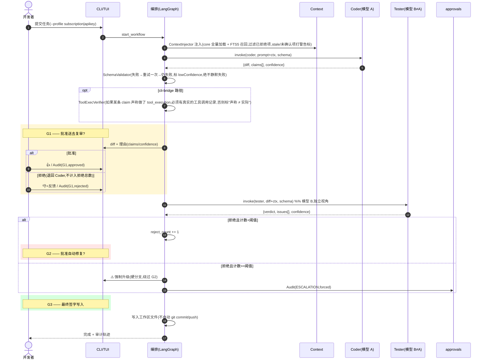
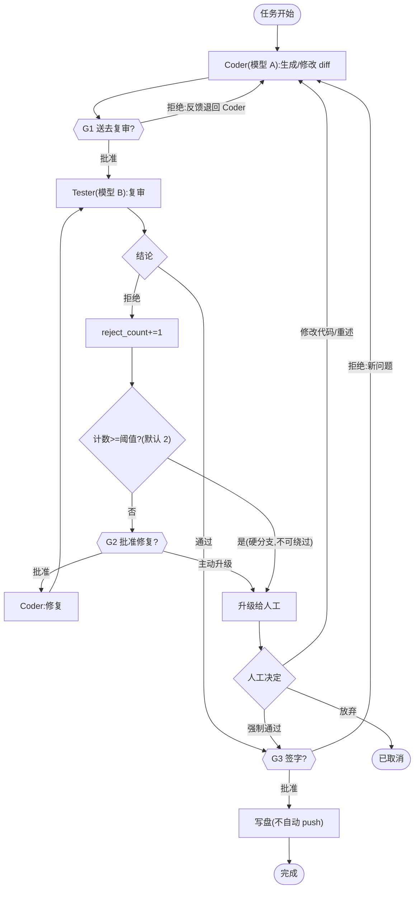
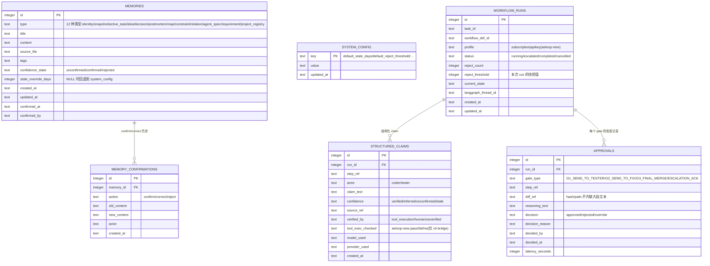

# Aeloop 解决方案设计(开 /spec 前的完整设计草案)

> 上游判断文档:`UNIFIED-ARCHITECTURE-JUDGMENT.md`
> 引擎:**Aeloop**(私有仓 `elishawong/aeloop`,从零搭建)。状态:**方案设计草案,待交给 `/spec`;不是实现指令,尚未提交进 aeloop 仓库。**
> 日期:2026-07-20
> 定位:这是"aeloop 引擎 = 个人订阅 profile 与公司 API/LiteLLM profile 共用的基座"这件事的完整设计。四层机制延续了此前一个内部实现 v2 已经验证过的设计(M0-M3 都有测试),但**新增两件 aeloop 特有的事**:① 两个适配器从第一天起就是一等公民(不再把 CLI bridge 推迟到未来)② 一套 profile/overlay 机制(一个引擎,两副面孔)。标 `[prior-proven]` = 已有此前内部实现的测试证据,可以复用;`[aeloop-new]` = 相对此前内部实现是新增的;`[?]` = 留给 /spec 或后续决策解决。

---

## 0. 这份设计解决什么问题

aeloop = 一个**模型无关、以治理为核心的 coder/tester 引擎**,同一套代码同时支撑两侧:
- **个人订阅 profile**:按订阅额度计费,coder=claude-cli / tester=codex-cli(CLI bridge)。
- **公司 API / LiteLLM profile**:走公司 LiteLLM 代理,coder/tester = 模型池里的不同模型(claude/gpt/deepseek)。

它必须解决三件事(延续自此前内部实现):① 防幻觉(机制化,靠结构化输出 schema 强制)② 上下文记忆("醒来"时能接着上次的进度走)③ coder-tester 闭环 + 分阶段人工把关。

**aeloop 相对此前内部实现的三处关键升级**:
1. `[aeloop-new]` **CLI bridge 适配器从第一天起就是一等公民**——此前的内部实现把这个标成 🔒 未来再做;aeloop 现在就必须做,因为它是个人订阅 profile 的主路径,**也是唯一能做真正 `tool_execution` 核验的路径**(纯 API 拿不到工具调用流)。
2. `[aeloop-new]` **profile/overlay 机制**——一个 `AI_AGENT_PROFILE` 选中整套 overlay(配置 + persona + 记忆);引擎本身保持中立,不为任一侧硬编码。
3. `[aeloop-new]` **独立双模型闭环是核心能力,不是可选项**——coder≠tester 的跨模型核验,是两侧共同收敛的地方。

---

## 1. 总体架构(五层:四层引擎 + profile)



**为什么这样分层**:换模型只动 H 层(换适配器/配置);换产品(subscription profile ↔ apikey profile)只换 profile overlay;换工作流只换 O7 的定义文件。persona 文本、记忆结构、引擎代码全都不用动。

---

## 1.5 四层之间的关系:嵌套而非并列(一个 Loop Engineering 视角)

上面那张图把四层画成并排的方框,容易被误读成"四个并行模块"。它们其实是**逐层嵌套**的——这正是业界 2026 年的共识"loop engineering"框架(Prompt→Context→Harness→Loop 逐年演进,**每一层外层都是包裹内层,而不是替代内层**):

| 层 | 演进年份 | 独占的职责 | 输入 ←/输出 → |
|---|---|---|---|
| **Prompt**(最内层) | 2022-24 | 一次请求的**契约**:persona(问什么)+ schema(答案要长成什么形状) | ← 来自 Context 的 memory;→ 一份组装好的 prompt |
| **Context**(包裹 Prompt) | 2025 | 模型**看到什么**:记忆检索/注入,过滤 stale/已拒绝项 | ← 任务本身;→ 喂给 Prompt 的上下文 |
| **Harness**(包裹 Context) | 2026 | **谁来跑、怎么跑**:选模型(ProviderRouter)、适配器、结构化校验、工具核验 | ← 组装好的 prompt;→ 校验过的结构化输出 |
| **Loop**(最外层) | 2026 | **整个闭环**:coder→gate→tester→拒绝计数→阈值→升级→checkpoint | ← 目标;→ 写盘 + 审计轨迹 |

**嵌套 = 外层用内层,内层不知道外层存在**(M2 复审已经验证过没有反向依赖:prompt 不 import harness/loop,context 不 import harness/loop):
- 一轮 **Loop** 迭代 = 多次 **Harness** 调用(coder 一次、tester 一次);
- 一次 **Harness** 调用 = 跑一次 **Prompt**;
- 一次 **Prompt** = 由 **Context** 组装而来。



**一轮数据流**:Loop 驱动 Coder 节点 → 向 Prompt 层要一份 prompt(PromptComposer 从 Context 拉记忆 + 组装 persona + schema)→ 过 Harness,选模型 A,发送,校验结构化输出(cli-bridge 还会核对 `tool_execution`)→ 回到 Loop → G1 gate → 同一轮跑 Tester(模型 B)→ Loop 汇总拒绝次数/阈值/checkpoint → 下一步。

**这套嵌套关系对 aeloop 为什么是承重的**:核心洞察——**"确定性校验 > 模型自我评估"**——正是治理优先设计的关键支点。它落在**外面两层**:Harness 的 SchemaValidator/ToolExecVerifier(机制化校验)+ Loop 的独立 Tester(模型 B 复审模型 A)。**防幻觉不依赖在 Prompt 层"要求模型诚实"——而是靠外面两层做机制化兜底。** aeloop 和 ruflo 的分野正在这里(2026-07-21 通过实际阅读 ruflo 源码核实,纠正了此前"内层治理偏轻"这个过度断言——详见内部工程笔记):ruflo **另有**一套成熟的编排治理——安全 / 反 prompt injection / 反串谋、行为漂移降权、外部真值锚定、回归见证——它不是"治理轻",它的目标本来就是**防攻击 + 防漂移**,不是"证明一个写代码的 agent 没有说谎"。更准确地说,分野是:ruflo 在编排上很重,它的治理偏向安全/漂移/资源/外部锚定,但在**"可验证的编码闭环治理"上偏轻**——它缺 aeloop 主打的这几样:① 确定性的 `tool_execution` 核验(声称 vs 实际轨迹)② 强制的跨模型对抗式复审 ③ 人工批准 gate + 连续拒绝强制升级;aeloop 的这四层都是为这个"可验证的编码闭环"服务的。

## 1.6 aeloop 如何落地这四层(层 → 代码映射)

| 层 | src 目录 | 关键文件 | 对 profile 的影响 |
|---|---|---|---|
| Prompt | `src/prompt/` | schema - personas - composer | persona 文本来自该 profile 的 `personas/` |
| Context | `src/context/` | store - staleness - confirmation - injector | 每个 profile 的记忆库互相独立 |
| Harness | `src/harness/` | provider-router - adapters/* - schema-validator - tool-exec-verifier | 用哪个适配器由 profile 配置决定(subscription=cli-bridge / apikey=litellm) |
| Loop | `src/loop/` | graph - nodes - gates - escalation - checkpoint | workflow 定义 + 阈值可按 profile 覆盖 |
| (外层)Profile | `src/profile/` + `profiles/*` | loader + config.yaml | `AI_AGENT_PROFILE` 选中整套 overlay |

**一句话**:aeloop = 每层一个 src 目录(严格无反向依赖)+ 一层 profile overlay 把"两副面孔"包在外面。换模型只动 Harness,换产品只动 Profile,换流程只动 Loop 的 workflow 定义。

## 1.7 给以后走向动态化/插件化留的钩子(现在只留钩子,不现在建)

- 引擎从第一天起就靠读取一份 **WorkflowDefinition** 驱动;`NodeSpec.role` 是个开放字符串,Gate 是边上的属性——**引擎从不硬编码 `if role==="coder"`**。
- **相对此前内部实现的改进**:persona/schema 按角色名通过注册表动态查找,不像此前内部实现那样用硬编码的 `{coder,tester}` Record——新增一个角色不需要动 composer。
- 新增一个角色 = 绑定一份 persona.md + schema + config;新增一条流程 = 新增一个 workflow `.json`;真正的插件化 = 把 `{role,persona,schema,adapter}` 注册进注册表;类 ruflo 的自定义工作流 **UI** = 作为后续一层加上去,数据模型已经支持。
- **纪律**:MVP 只有一条 coder-tester 闭环。**留钩子,现在不建插件系统/UI**——这正是 ruflo 变臃肿的地方;等真的出现 2-3 个实打实的工作流需求再去做(YAGNI)。

> **未来最外层的"Conductor / 对话协调层"**(排在 A6 之后,issue #2,这里先记一笔,现在不建):在四层 `Prompt ⊂ Context ⊂ Harness ⊂ Loop` 外面再加一圈——决定"要不要进入闭环 / 什么时候打断正在跑的闭环 / 还是就自由讨论头脑风暴"。**profile 差异**:个人订阅 profile 是一层**薄壳 / 透传**(顾问 + 与 Claude Code 的交互 + `/spec` 头脑风暴本身天然就带着这一层,不用重建),而公司 API/LiteLLM profile 才真正需要一个编排器(开发者直接对着产品说话,没有别的东西做路由)。原始案例 = 此前内部实现 v2 的编排方案,但落地时需要是一个**修正版**(否则会继承同样的坑):① 开发者的控制指令 approve/reject/stop/confirm 走**确定性代码解析**,不走 LLM;② 中断走**真正的 checkpoint**,不留悬空路由;③ 对话历史**活在 Context 层**,不另造一套记忆持久化;④ 角色 schema 走**动态注册表**(= 这份 A0+A1 里已经落地的 `schema-registry.ts`)。详见 issue #2。

---

## 2. 用例图



---

## 3. 时序图 —— 双模型闭环 + 三道 gate



---

## 4. 状态机(拒绝计数 + 阈值 + 升级)`[prior-proven]` M1 已验证



---

## 5. 数据库 schema(单个 SQLite 文件 - 每个 profile 各一份独立副本)`[prior-proven]` M2 已实现

> 引擎定义 schema(一套共用结构);**数据按 profile 各自独立**(subscription profile 的记忆 ≠ apikey profile 的记忆,各自独立的 db 文件)。相对此前内部实现的 M2,这里补上了:`confirmed_at/confirmed_by`(memories)、`actor`(confirmations)、`updated_at`(system_config)——M2 复审发现这三列缺失,aeloop 一次性全部补齐。

> **ContextInjector"核心记忆"的定义(权威,写在 Review Round 2 #4)**:注入时**无条件全量加载**的核心 `type` = `identity` / `constraint` / `decision`(身份核心 + 硬约束 + 已定决策——"醒来"时始终可见);其余所有类型(`snapshot`/`active_task`/`idea`/`postmortem`/`map`/`agent_spec`/`requirement`/`relation`/`project_registry` 等)只在 **FTS5 关键词召回命中时**才进入上下文。"核心全量加载 + 召回是并集"这个区分,正是让 FTS 召回真正发挥作用的关键——A1 的 Review Round 1 阻断项 #3 说的正是这个:早期版本"core = 整张表"导致 FTS 变成死代码。⚠️ **待重新评估**:`agent_spec`/`map`/`relation`/`project_registry` 也偏向"通常都需要"——等 A2 以后真正开始消费记忆时,重新评估是否要把它们并入核心集合(当前集合定义在 `injector.ts:CORE_MEMORY_TYPES`)。



**相对此前内部实现新增的 schema** `[aeloop-new]`:`workflow_runs.profile`(用哪个 overlay 跑的)、`structured_claims.tool_exec_checked`(cli-bridge 行为一致性核验结果)。

---

## 6. 文件结构(目标态 - 沿用此前内部实现已验证的 src/ 布局改造而来)

> aeloop 目前是个空仓库(只有 README)。下面是**目标结构**;标 `[prior-proven]` 的文件在此前内部实现里已有对应实现,重写时可以参照(代码不能跨过隔离边界,所以是在个人机器上照设计重新编写)。

```
aeloop/                              # elishawong/aeloop(私有)
├── package.json / tsconfig.json / vitest.config.ts
├── README.md / LICENSE / .gitignore
├── .env.example                     # LITELLM_BASE_URL / LITELLM_TOKEN 等占位符
├── src/
│   ├── index.ts                     # 引擎入口 barrel
│   ├── shared/                      # 跨层共享类型
│   ├── prompt/                      # L1 [prior-proven]
│   │   ├── schema.ts                #   ClaimSchema/CoderOutput/TesterOutput(zod)
│   │   ├── personas.ts              #   persona 加载器(从 profile 指定的路径读取)
│   │   ├── composer.ts              #   PromptComposer(+ 过滤已拒绝项 [补上此前实现的缺口])
│   │   └── *.test.ts
│   ├── context/                     # L2 [prior-proven]
│   │   ├── store.ts                 #   SQLite+FTS5,RecallError 绝不静默失败
│   │   ├── staleness.ts / config.ts #   StalenessEngine + SystemConfig
│   │   ├── confirmation.ts          #   三态(+ 包进 db.transaction [补上此前实现的缺口])
│   │   ├── injector.ts              #   ContextInjector [aeloop 补的缺口:此前实现的 M2 从没建过这个]
│   │   ├── types.ts / errors.ts
│   │   └── *.test.ts
│   ├── harness/                     # L3 [部分 prior-proven]
│   │   ├── types.ts / errors.ts / config.ts
│   │   ├── provider-router.ts       #   role → (provider, model)
│   │   ├── schema-validator.ts      #   统一校验入口(重试一次 → lowConfidence)
│   │   ├── adapters/
│   │   │   ├── litellm-adapter.ts   #   [prior-proven] 此前实现的主路径
│   │   │   ├── claude-cli-adapter.ts#   [aeloop-new] claude -p headless(已验证可行)
│   │   │   └── codex-cli-adapter.ts #   [aeloop-new] codex exec(需要先跑 spike)
│   │   ├── tool-exec-verifier.ts    #   [aeloop-new] cli-bridge 行为一致性核验
│   │   └── *.test.ts
│   ├── loop/                        # L4 [此前实现的 M4 从没建过;aeloop 第一次建 - M1 spike 已验证过模式]
│   │   ├── graph.ts                 #   由 WorkflowDefinition 编译出的 LangGraph StateGraph
│   │   ├── nodes/coder.ts / tester.ts
│   │   ├── gates.ts                 #   G1/G2/G3 interrupt
│   │   ├── escalation.ts            #   阈值触发的硬分支
│   │   ├── checkpoint.ts            #   SqliteSaver 接线
│   │   └── workflow-def.ts          #   注册表
│   ├── cli/                         # L-interaction [此前实现的 M5 从没建过]
│   │   ├── tui.ts / diff-render.ts / approval-prompt.ts
│   └── profile/
│       └── loader.ts                #   [aeloop-new] AI_AGENT_PROFILE → 加载 overlay
├── workflows/
│   └── coder-tester-loop.json       #   MVP 内置的唯一一份定义
├── profiles/
│   └── subscription/                #   [个人 overlay,放在私有仓里没问题]
│       ├── config.yaml              #     providers.claude-cli/codex-cli + roles
│       ├── personas/                #     coder/tester persona(继承 CORE 的精神,与厂商无关)
│       └── memory.db                #     (已 gitignore,运行态)
│   # profiles/apikey/  ← 只活在公司内部 git,永不进这个仓库(.gitignore 挡住)
└── spikes/                          # 一次性验证 spike(codex exec / e2e 闭环)
```

**Profile 边界**:`profiles/subscription/` 放在私有仓里是可以的;`profiles/apikey/` **只活在公司内部 git**,本仓的 `.gitignore` 明确挡住它以防误提交。

---

## 7. 适配器层设计(双适配器,一等公民)`[aeloop-new]`

```typescript
interface ModelAdapter {
  readonly id: string;                 // "litellm" | "claude-cli" | "codex-cli"
  readonly kind: "direct-api" | "cli-bridge";
  checkAvailability(): Promise<AvailabilityResult>;   // 必须做真实的存活探测(在 deepseek 的列表里能看到 ≠ 真的能调用)
  invoke(req: InvokeRequest): Promise<InvokeResult>;
  // 仅 cli-bridge:返回工具调用流,供 ToolExecVerifier 核验
  toolTrace?(): ToolCallRecord[];
}
```

| Profile | coder | tester | 备注 |
|---|---|---|---|
| **subscription** | claude-cli | codex-cli | 按订阅额度,不用 apikey;cli-bridge → **能做真正的 `tool_execution` 核验** |
| **apikey** | litellm(claude) | litellm(gpt/deepseek) | 公司代理;纯 API → 拿不到 `tool_execution` 核验,退回用"模型自报置信度"这个较弱的信号 |

**config.yaml(每个 profile 一份)**:
```yaml
profile: subscription                # 或 apikey
providers:
  claude-cli: { kind: cli-bridge, cmd: "claude" }
  codex-cli:  { kind: cli-bridge, cmd: "codex" }
  litellm:    { kind: direct-api, base_url: ${LITELLM_BASE_URL}, api_key: ${LITELLM_TOKEN} }
roles:
  coder:  { provider: claude-cli }
  tester: { provider: codex-cli }    # 必须和 coder 用不同模型(独立视角)
workflow:
  reject_threshold: 2
```

---

## 8. 里程碑(aeloop 从零搭建 - 复用此前内部实现已验证的设计)

| 里程碑 | 内容 | 相对此前内部实现 |
|---|---|---|
| **A0 脚手架** | 新仓 src/ 骨架 + tsconfig + vitest + 空的 profile loader 壳 | 全新编写 |
| **A1 Context+Prompt** | REQ-M1~M4 + P1~P3 **+ ContextInjector + 补齐三个缺口(过滤已拒绝项/事务/缺失列)** | `[prior-proven]` 设计,重写 + 补上 M2 落下的部分 |
| **A2 Harness** | ProviderRouter + LiteLLMAdapter + SchemaValidator | `[prior-proven]` 重写 |
| **A3 CLI bridge + 核验** | ClaudeCliAdapter + CodexCliAdapter + ToolExecVerifier | `[aeloop-new]` 完全新建,先跑 codex exec spike |
| **A4 Loop** | LangGraph 编排 + G1/G2/G3 + 阈值触发强制升级 + 审计 | `[此前实现的 M4 从没建过]`,M1 spike 已验证过模式 |
| **A5 CLI/TUI** | 彩色 diff + y/n 批准 + 视觉上区分升级状态 | `[此前实现的 M5 从没建过]` |
| **A6 双 profile 验收跑** | 通过 subscription(claude+codex)跑一个真实任务、通过 apikey(litellm)跑一个真实任务 | `[aeloop-new]` 两侧都要验收 |

**先啃硬骨头**(判断文档里 ROI 最高的建议):优先搭起 A1 的 **ClaimSchema + 结构化输出** + A3 的 **ToolExecVerifier**(这是唯一真正意义上的防幻觉 gate)。

---

## 8.5 此前内部实现 M2/M3 暴露的坑 → aeloop 必须补的修复(PRD 验收项的来源)

> 依据:对此前内部实现 M2/M3 的对抗式复审证据(2026-07-17)。这些是此前实现的洁净室搭建**连续两个里程碑都踩过**的坑;aeloop 从第一天起就要避开,PRD 把它们写成硬性验收项。

**⚠️ 方法论警告(最重要的一条)**:此前实现的 M2/M3 都是"每层各自写完,测试全绿,但从没被真正串起来"——三层各自测试都是全绿,但没有胶水代码把它们串在一起(ContextInjector 就是那个空瓶子)。**aeloop 每个里程碑收尾时都必须真正端到端串起一条薄的垂直切片**(哪怕下游是 mock 的),证明胶水真的存在——只堆孤立的绿色测试是不被允许的。

| # | 此前实现的坑 | aeloop 必须补的修复(验收项) | 落在哪个里程碑 |
|---|---|---|---|
| 1 | ProviderRouter 根本不存在;LiteLLMAdapter 硬编码 provider,忽略 `RoleConfig.provider` → 实际上只能用 LiteLLM | **真正建出 ProviderRouter**:读 `RoleConfig.provider` → 选适配器;新增一个 provider 不需要改动任何编排代码(aeloop 生来就有 2+ 个适配器,躲不开这个) | A2 |
| 2 | ContextInjector 根本不存在;Context→Prompt→Harness 这条链从没真正闭环过 | **ContextInjector + 真正的闭环**是第一等交付物;A1 收尾时必须有一条能跑通的 Context→Prompt 垂直切片 | A1 |
| 3 | SchemaValidator 重试时发的是一模一样的请求(对修复毫无帮助) | 重试**要把上一次的校验错误喂回给模型**,不是重发同一个请求 | A2 |
| 4 | InvokeResult 只有 content/httpStatus | **补上 `provider`/`model`(+ aeloop 的 `tool_exec_checked`)**,让审计轨迹知道到底是谁回答的 | A2/A3 |
| 5 | 适配器的 `JSON.parse` 没有 try-catch → 直接抛出裸的 SyntaxError | 包进 try-catch → 统一成 `AdapterInvokeError` | A2 |
| 6 | HTTP 错误只覆盖了 400;baseUrl 结尾带斜杠 / 缺 api_key 都没测过 | 401/403/429/5xx + 结尾斜杠 + 缺 api_key **必须全部有测试** | A2 |
| 7 | confirmation 的三个方法都没用 `db.transaction`;memories 缺 confirmed_at/by,confirmations 缺 actor,system_config 缺 updated_at | 包进事务 + 补齐每一个缺失列(对齐 §5 的 ER 图) | A1 |
| 8 | 没有任何东西负责过滤已拒绝项;replaceLatest / persona 路径缺失都没测试;dist 没有拷贝 .md 文件;没有 lint | ContextInjector 过滤已拒绝项;补上这些测试;build 拷贝 personas/*.md;接上 lint 脚本 | A0/A1 |

**总体验收原则**:aeloop 的"完成" ≠ 测试全绿——它意味着**这个里程碑的垂直切片真正被串起来了 + 上表每一项都过了**。复审要逐条核对这张表(尤其是"是不是真的串起来了"),沿用复审此前实现 M3 时那套**对抗式、实际跑命令、不轻信文档自己怎么说**的做法。

---

## 9. 动手前必须先跑的 spike

1. `[需要 spike]` **codex exec 非交互模式**(A3 的前置条件;`claude -p` 已验证过,codex `--help` 返回空还没验证能跑通)。
2. `[需要 spike]` **deepseek 存活探测 + 结构化输出**(apikey profile 里 tester 那一半;deepseek-v3.2 曾经出现在列表里但调用返回 400,json_schema 支持未验证)。
3. `[prior-proven]` LangGraph 跨进程 interrupt/resume、LiteLLM json_schema 透传、最小 e2e 闭环——此前内部实现已经验证过这些;aeloop 重写后只需要重新验证一遍。

---

## 10. 留给 /spec 定夺的开放项

- `[?]` A1~A6 是不是 /spec 应该采用的里程碑切法,还是要重新切分。
- `[?]` ContextInjector"唤醒时注入"的语义:aeloop 是否应该把个人订阅 profile 产品里既有 CORE 唤醒协议的精神,也灌进这一层(判断文档里的提醒:那一侧现有的唤醒机制比此前内部实现更完整——不要退步)。
- `[?]` profile loader 的 overlay 发现约定(路径/环境变量/默认值)。
- `[?]` workflow-def 的 schema(为未来自定义工作流留钩子;MVP 只内置一条)。

---

## 附:与判断文档的关系
本设计是 `UNIFIED-ARCHITECTURE-JUDGMENT.md`(方向)的**具体展开**(怎么建)。判断文档定了"抄设计不抄实现 + 引擎中立 + 单向阀 + 双模型闭环";这份文档把它变成 /spec 能直接使用的图/表/结构。这两份文档都还没进 aeloop 仓库——aeloop 的骨架会在 /spec→build 的交接过程中正式编写。
