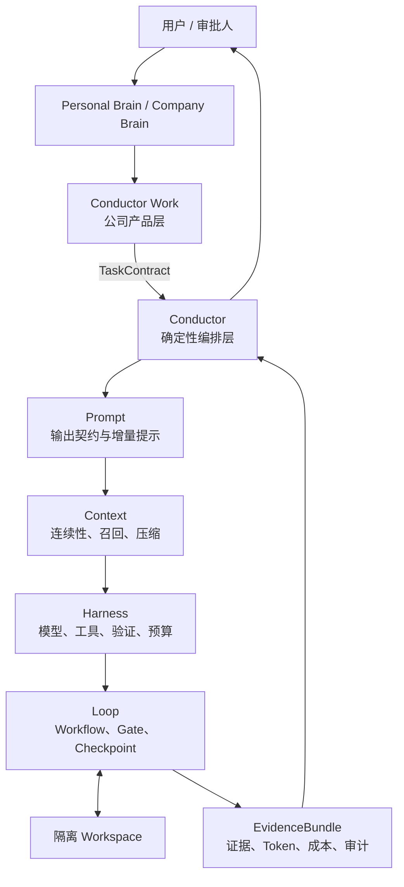
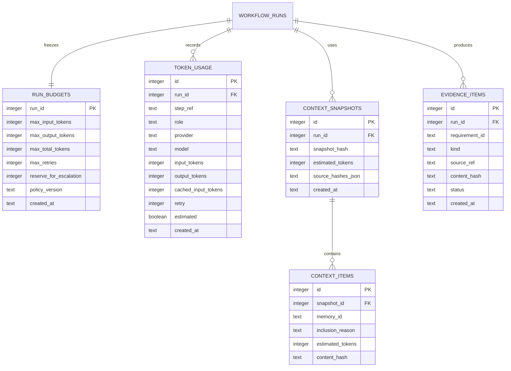

# Aeloop / Conductor / Conductor Work 分层技术设计

> 目标：同时解决幻觉、上下文断裂、Token 浪费和执行漂移。
>
> 原则：模型负责生成候选结果；系统负责约束、验证、记忆、预算和审计。

## 1. 总体架构



四层 Prompt ⊂ Context ⊂ Harness ⊂ Loop 仍然是 Aeloop 内核；Conductor 和产品 Brain 是外层。Token Budget 是横切控制面，不是第五个业务层。

## 2. 三个必须达成的结果

### 2.1 防幻觉

任何模型声明都必须落入以下一种状态：

- `verified`：有工具或独立检查证据；
- `failed`：证据明确失败；
- `not_proven`：没有足够证据，不能当作事实；
- `stale`：证据或上下文已过期。

禁止把以下内容当证据：模型说“我已经运行了测试”、模型 confidence、模型的 chain-of-thought、另一个模型的无证据复述。

### 2.2 上下文连贯

每一次执行都使用稳定的：

```text
brain_id + contract_id + workflow_id + run_id + thread_id + context_snapshot_id
```

上下文分成长期记忆、任务契约、执行状态和证据四类。换聊天窗口、换进程、换模型时，恢复的是这些结构化数据，不是把旧聊天全文重新塞给模型。

### 2.3 节省 Token

每个 Run 在开始时冻结预算：

```ts
interface TokenBudget {
  maxInputTokens: number;
  maxOutputTokens: number;
  maxTotalTokens: number;
  maxRetries: number;
  reserveForEscalation: number;
}
```

预算不足时只能按确定顺序处理：压缩 Context → 降低输出上限 → 切换低成本模型 → 停止并升级给人。

## 3. Layer 1：Prompt

### 3.1 职责

Prompt 只负责单次模型调用的输入契约，不负责记忆、路由、审批或数据库。

### 3.2 防幻觉机制

- 每个 role 绑定结构化 output schema；
- 强制区分 `claim`、`evidence`、`assumption`；
- Coder 不能声明“已验证”，除非提供 `sourceRef`；
- Tester 必须按 `Requirement ID` 输出 `PASS / FAIL / NOT_PROVEN`；
- Prompt 明确“缺证据时输出 NOT_PROVEN，不要猜”；
- system/persona、TaskContract、Context、当前 delta 分段，禁止互相覆盖。

### 3.3 上下文连贯机制

- 每次调用带 `contract_id` 和 `context_snapshot_id`；
- 只传本轮需要的 `previous_delta`，不传完整历史；
- 反馈使用结构化字段，不把上轮自然语言对话原样拼接；
- schema 和固定规则保持稳定，变化部分单独标记版本。

### 3.4 Token 节省机制

- system prompt 固定，支持 provider prompt cache；
- schema 只保留 workflow 真正消费的字段；
- Coder 输入：TaskContract + 相关 Context + 上轮反馈；
- Tester 输入：TaskContract + diff + claims + tool evidence，不传 Coder 全部思考过程；
- retry 输入只包含 validation error 和需要修正的片段；
- 长内容使用 `artifact_ref`，不重复内联全文。

### 3.5 接口

```ts
interface PromptRequest {
  role: string;
  contractId: string;
  contextSnapshotId: string;
  stableInstructions: string;
  taskDelta: string;
  artifactRefs: string[];
  outputSchemaVersion: string;
}
```

## 4. Layer 2：Context

### 4.1 职责

Context 决定模型“看什么”，负责长期记忆、任务快照、连续性和压缩。

### 4.2 记忆优先级

超出预算时按以下顺序保留：

```text
requirement > constraint > decision > active_task > verified_evidence > recall > idea
```

`rejected` 永不注入；`stale` 和 `unconfirmed` 可以保留，但必须显式标记。

### 4.3 防幻觉机制

- 每条 memory 有 `source_file/source_ref/source_hash`；
- source snapshot 变化后自动标记 stale；
- 冲突 memory 不自动合并，进入 `CONFLICT` 状态；
- 只允许已确认的 constraint/decision 覆盖旧规则；
- ContextInjector 输出 warning，Prompt 必须显示 warning。

### 4.4 上下文连贯机制

- `context_snapshots` 保存每次 Run 实际注入了哪些 memory；
- checkpoint 保存 LoopState，memory store 保存长期知识，两者不混淆；
- resume 根据 `run_id + thread_id` 恢复，而不是依赖进程内对象；
- 新窗口只需加载 contract、active task、最近 evidence 和必要 core memory；
- 每轮生成 `context_delta`，记录新增、删除、过期和冲突项。

### 4.5 Token 节省机制

- core memory 全量加载，其他内容 FTS/关键词召回；
- 去重：同一 source/hash 只注入一次；
- 压缩：旧 round 变成结构化摘要，不保留完整自然语言；
- 按 role 过滤：Coder 不加载 Tester 的无关上下文，Tester 不加载 Coder 的内部推理；
- 每个 role 有独立 `maxInputTokens`；
- 召回先估算 token，超预算时按优先级截断，而不是调用后才失败。

## 5. Layer 3：Harness

### 5.1 职责

Harness 负责“谁来执行、如何验证、花多少 Token”，但不决定业务流程。

### 5.2 防幻觉机制

- ProviderRouter 按 role 选择模型，Coder 与 Tester 默认不同模型；
- SchemaValidator 在结果进入 Loop 前验证；
- ToolExecVerifier 对比模型 claim 与真实工具 trace；
- 非法 JSON、缺字段、未知 confidence、伪造 tool evidence 直接失败；
- retry 只修复结构问题，不允许模型借 retry 扩大任务范围。

### 5.3 上下文连贯机制

- Adapter 只接受结构化 `PromptRequest`；
- 每次调用携带 `run_id/step_ref/context_snapshot_id`；
- 记录 provider、model、prompt hash、response hash；
- 跨模型切换时传递 Contract 和 evidence，不传供应商特有聊天格式。

### 5.4 Token 节省机制

- 简单任务使用低成本模型，复杂任务才使用高能力模型；
- 设置 `max_output_tokens`，避免模型无限解释；
- 支持 prompt cache，并记录 cached input tokens；
- retry 使用压缩 prompt；
- 预算 preflight 失败时不发起模型调用；
- 记录真实 usage，无法获得 usage 时明确标记 `estimated: true`。

### 5.5 接口

```ts
interface HarnessRequest {
  prompt: PromptRequest;
  budget: TokenBudget;
  trace: { runId: number; stepRef: string };
}

interface HarnessResult<T> {
  data: T;
  usage: TokenUsage;
  evidence: EvidenceRef[];
}
```

## 6. Layer 4：Loop

### 6.1 职责

Loop 负责 Workflow 状态、节点、Gate、重试、checkpoint、resume 和终止条件。

### 6.2 防幻觉机制

- Coder → 人工 G1 → Tester → G3 的独立审核链；
- Tester 只读，不修改 workspace；
- tester rejection 达阈值后强制 escalation；
- 任何 Gate 决定先写 audit，再推进状态；
- apply 前必须有 Requirement coverage 和 evidence；
- `not_proven` 不得自动当作 pass。

### 6.3 上下文连贯机制

- LangGraph checkpoint 保存 LoopState；
- AuditStore 保存业务审计，不能用自然语言聊天替代；
- event stream 记录节点开始、完成、gate、失败和终止；
- resume 只恢复 pending gate 和 step counters，不重复发送完整历史；
- zero-chunk、跨进程、重复 resume 都必须有测试。

### 6.4 Token 节省机制

- 节点之间只传结构化 state；
- Tester 接收 diff/claims/evidence，不接收 Coder 思考过程；
- 每轮只发送变更 delta；
- `maxRetries`、reject threshold、escalation reserve 为硬限制；
- 低价值重复测试和重复摘要在 Loop 层去重；
- 达到预算上限立即暂停并交给 Conductor/人工，而不是继续循环。

## 7. Conductor：外层确定性编排

### 7.1 职责

- 接收 Brain 输出；
- 校验并冻结 TaskContract；
- 选择 Workflow 和版本；
- 计算 TokenBudget；
- 执行 preflight policy；
- 解析人工命令；
- 将 Aeloop 事件聚合成 EvidenceBundle。

### 7.2 必须禁止

- 不让模型决定是否有权限执行；
- 不让模型修改 TokenBudget；
- 不把自然语言“批准”当成系统 Gate；
- 不用另一个 LLM 代替 policy 检查；
- 不把个人 Brain 的长期记忆写入公司 Run。

### 7.3 RunPlan

```ts
interface RunPlan {
  contractId: string;
  workflowId: string;
  workflowVersion: string;
  policyVersion: string;
  tokenBudget: TokenBudget;
  roleBudgets: Record<string, TokenBudget>;
  contextSnapshotId: string;
  sourceSnapshots: Record<string, string>;
}
```

## 8. Conductor Work：公司产品层

### 8.1 防幻觉

- PRD 需求必须有稳定 ID；
- Figma、GitLab、仓库规则都保存 snapshot hash；
- 不允许模型新增 PRD 没有的功能；
- 公司 Tester 按需求矩阵输出 PASS/FAIL/NOT_PROVEN；
- EvidenceBundle 直接展示证据、命令、退出码、hash 和未证明项。

### 8.2 上下文连贯

- 每个公司 Run 绑定 PRD/Figma/GitLab snapshot；
- 公司 profile、公司 Brain、公司 memory 通过 tenant/workspace 隔离；
- 私有配置由 `AELOOP_PROFILES_ROOT` 注入，不进入公共仓库；
- resume 只能回到原 workspace 和原 contract snapshot。

### 8.3 Token 节省

- PRD 先解析成 requirements，不把整份 PRD 每轮重复发送；
- Figma 只发送相关 node/component 摘要；
- GitLab 只发送允许路径和相关 diff；
- 公司按风险给 Coder/Tester/Gate 分配预算；
- 低风险检查使用低成本模型，高风险实现才使用高能力模型；
- Dashboard 展示 token、cache、retry、cost 和节省率。

## 9. 数据库增量设计

在现有 `workflow_runs / structured_claims / approvals / step_markers` 之上增加：



## 10. 验收指标

### 防幻觉

- 每条 requirement 都能追溯到 artifact、tool execution 或明确 `NOT_PROVEN`；
- 删除 ToolExecVerifier、SchemaValidator、独立 Tester 任一机制时，mutation test 必须失败；
- 模型声称通过但无 trace 时必须被标为 failed/not_proven。

### 上下文连贯

- 新进程只凭 `run_id + thread_id + db path` 恢复；
- resume 不重复注入完整历史；
- source snapshot 变化会阻止静默继续；
- 同一 Run 的 contract、policy、workflow version 不漂移。

### Token

- 每个 Run 有预算、实际 usage 和成本；
- 超预算不会继续调用模型；
- retry 输入小于首次输入；
- Tester 输入不包含 Coder chain-of-thought；
- 统计 context 重复率、cache 命中率、retry 率和单位 requirement 成本。

## 11. 实施顺序

1. 定义 `TokenBudget / TokenUsage / RunPlan`；
2. Context budget manager 和 context snapshot；
3. Harness usage adapter、cache 和 preflight；
4. Loop budget guard 与 EvidenceBundle；
5. Conductor RunPlan 和 GateCommand；
6. Conductor Work 公司 PRD/Figma/GitLab adapters；
7. 真实 subscription/company profile 校准默认预算；
8. 再扩展 research、PRD、design-compliance Workflow。

