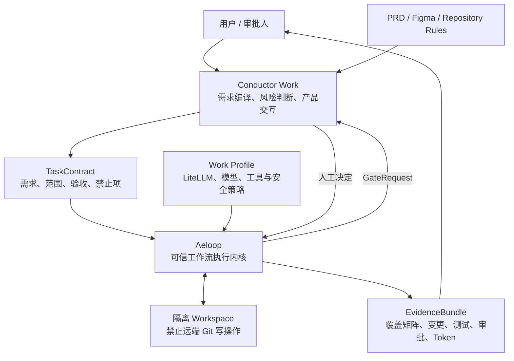
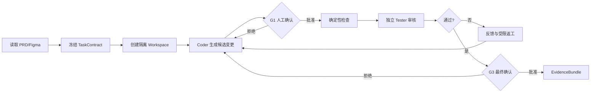
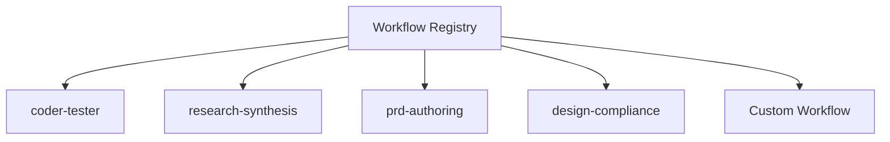
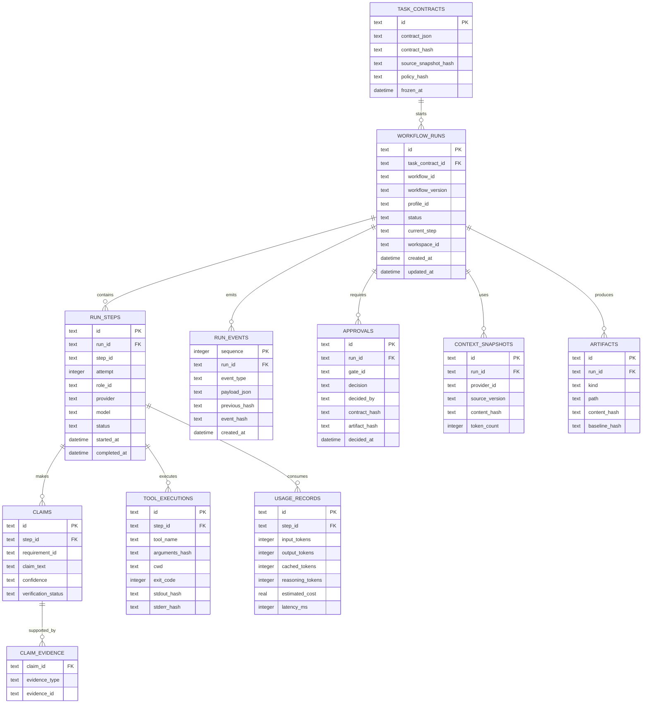

# Conductor Work：可信 AI 工作流平台方案

> 状态：领导评审稿  
> 日期：2026-07-21  
> 范围：仅介绍工作场景，不包含私人产品、私人记忆或个人项目规划。  
> 工作名称：`Conductor Work`（产品层）+ `Aeloop`（执行内核）。名称为暂定名。

---

## 1. 项目摘要

Conductor Work 是一个面向企业研发与知识工作场景的可信 AI 工作流平台。它解决的不是“再增加一个聊天机器人”，而是把 AI 从一次性对话升级为：

- 能严格读取和冻结需求；
- 能调用不同模型完成任务并独立复核；
- 能暂停等待人工审批；
- 能跨进程恢复；
- 能记录每一步证据和资源消耗；
- 能通过安全策略限制文件、工具、依赖与 Git 操作；
- 能扩展为编程、调研、PRD、设计核对等多种工作流。

系统由两部分组成：

- **Conductor Work**：负责理解工作需求、生成任务契约、应用公司政策、向用户展示进度与结果。
- **Aeloop**：负责模型调用、上下文、工作流执行、人工闸门、恢复、审计和证据。

当前首个验证工作流是“Coder 生成候选变更 + 独立 Tester 审核”，但架构不绑定程序员流程。

---

## 2. 业务问题

企业使用生成式 AI 时常见的障碍不是模型不会生成内容，而是生成结果难以进入可控流程：

1. **需求漂移**：模型会补充 PRD 没有要求的功能，或遗漏边界条件。
2. **幻觉与假验证**：模型可能声称已经运行测试，但没有可追溯证据。
3. **上下文断裂**：换聊天、换模型或中断后，需要重新解释完整背景。
4. **缺乏独立复核**：同一个模型生成并自审，错误模式高度相关。
5. **安全风险**：自动工具可能修改错误文件、引入未批准依赖或执行 Git 远端操作。
6. **流程不可复用**：对话提示散落在临时聊天中，无法版本化、测试和审计。
7. **成本不可见**：缺少每个任务、模型、步骤的 Token、延迟和重试数据。

Conductor Work 的目标是将这些问题转化为可执行、可测试的机制，而不是依赖提示词中的自觉要求。

---

## 3. 系统架构



### 架构原则

- 需求与执行分离：Conductor Work 负责“做什么”，Aeloop 负责“如何可靠执行”。
- 模型与流程分离：更换模型只更换 Profile/Adapter，不重写 Workflow。
- 长期知识与执行状态分离：工作知识保存在产品层，Aeloop 只保存本次 Run 的快照和证据。
- 人工决定与模型建议分离：模型可以建议，但不能伪装成人类批准。
- 本地变更与远端 Git 操作分离：Aeloop 永不自动 commit、push、创建 PR 或 merge。

---

## 4. 首个工作流：严格代码变更与独立审核



### TaskContract

需求进入执行前被转换成稳定契约：

```json
{
  "objective": "Implement the approved feature without changing unrelated behavior",
  "requirements": [
    {
      "id": "REQ-001",
      "text": "The user can filter results by status",
      "sourceRef": "PRD.md#status-filter"
    }
  ],
  "allowedPaths": ["src/features/search/**", "tests/search/**"],
  "forbiddenChanges": [
    "Do not add unrequested features",
    "Do not change public API behavior",
    "Do not commit, push, open a merge request, or merge"
  ],
  "riskLevel": "medium"
}
```

当 PRD、Figma 或仓库状态变化时，系统检测 snapshot hash，不会静默使用旧需求继续运行。

---

## 5. 防幻觉和可信机制

### 5.1 Claim-to-Evidence

```text
Requirement
  -> Claim
  -> Changed Artifact
  -> Tool Execution
  -> Exit Code / Output Hash
  -> Verification Result
```

模型声明不直接视为事实。每条声明被标记为：

- `verified`
- `failed`
- `not_proven`
- `stale`

“测试已经通过”必须能够关联到具体命令、工作目录、退出码和输出摘要。

### 5.2 独立模型复核

- Coder 与 Tester 使用不同模型；
- Tester 使用只读权限；
- Tester 获取需求、候选变更和相关证据，不继承 Coder 的全部推理上下文；
- Tester 按 Requirement ID 给出 PASS/FAIL/NOT_PROVEN；
- 连续失败达到阈值后升级给人，不无限消耗 Token。

### 5.3 Requirement Coverage

| Requirement | Implementation | Evidence | Result |
|---|---|---|---|
| REQ-001 | `src/...` | `test:status-filter`, exit 0 | PASS |
| REQ-002 | 未找到完整实现 | 无 | NOT_PROVEN |

---

## 6. 安全与合规边界

工作版默认采用 fail-closed 策略：

### Workspace

- 每个 Run 使用隔离工作区；
- 记录 baseline commit、初始 dirty state 和允许修改范围；
- 从错误目录恢复时拒绝继续，而不只是警告；
- Reviewer 只读；
- 最终产出为本地候选变更和证据。

### Git

永久禁止：

- `git commit`
- `git push`
- 创建 Merge Request/Pull Request
- merge
- 修改远端分支或标签

如未来需要自动化 SCM，必须由独立产品模块和新的审批政策实现，不进入 Aeloop 内核。

### Dependencies

- 只允许公司批准的包；
- 只允许批准的内部 registry；
- 未在 allowlist 中的依赖直接失败；
- 依赖策略版本随 Run 固化并进入审计。

### Network and Data

- 默认无网络或仅允许 LiteLLM、内部 GitLab、批准的 Figma 入口；
- 凭据来自环境或公司 secret manager；
- PRD、Figma、仓库内容和日志不进入公共代码仓库；
- 日志可配置脱敏与保留周期。

---

## 7. 可扩展 Workflow

首个工作流是 `coder-tester`，未来扩展通过 Workflow Plugin 完成：

```ts
interface WorkflowPlugin<TInput, TOutput> {
  manifest: WorkflowManifest;
  inputSchema: Schema<TInput>;
  outputSchema: Schema<TOutput>;
  build(deps: WorkflowDependencies): CompiledWorkflow<TInput, TOutput>;
}
```

计划支持：

| Workflow | 目标 |
|---|---|
| `coder-tester` | 代码生成、验证、返工和人工闸门 |
| `research-synthesis` | 多源调研、引用核验、结论分级 |
| `prd-authoring` | 需求收集、冲突检测、PRD 生成与审核 |
| `design-compliance` | PRD/Figma/实现一致性检查 |
| `release-readiness` | 测试、依赖、安全和发布证据汇总 |

第一阶段使用强类型 TypeScript 插件，第二阶段再为简单流程提供声明式 YAML/JSON DSL，避免过早建设难以验证的通用动态图平台。



---

## 8. 产品界面与 Demo

Demo 使用一个简单的任务运行台，重点让观众快速理解“系统正在做什么、为什么暂停、最后证明了什么”。

### 页面结构

1. **任务头部**：任务名称、需求版本、风险级别、使用的 Workflow/Profile。
2. **实时流程条**：当前步骤、已完成步骤、等待人工审批的位置。
3. **事件流**：模型开始/完成、gate、验证和失败事件。
4. **需求覆盖**：每条 Requirement 的实现与证据状态。
5. **候选变更**：修改文件和 diff 摘要。
6. **安全状态**：Workspace、依赖、网络、SCM policy。
7. **最终报告**：EvidenceBundle、Token、耗时和未证明项。

### Demo 流程

```text
Load sample PRD
-> Compile TaskContract
-> Start coder-tester workflow
-> Show live step progress
-> Pause at G1
-> Approve candidate
-> Run independent review
-> Show requirement coverage
-> Approve G3
-> Display EvidenceBundle
```

演示默认使用隔离样例仓库；不使用真实核心工作仓库作为首次自动写入试验对象。

---

## 9. 目标文件结构

### Aeloop

```text
aeloop/
├── src/
│   ├── contracts/                 # Public neutral contracts
│   ├── prompt/
│   ├── context/                   # Providers, snapshots and budgets
│   ├── harness/                   # Models, tools, workspace, telemetry
│   ├── policy/                    # File, tool, dependency and SCM policy
│   ├── evidence/                  # Claim-to-evidence verification
│   ├── loop/                      # Workflow runtime, gates and checkpoint
│   ├── workflows/
│   │   ├── registry.ts
│   │   └── coder-tester/
│   ├── plugins/
│   ├── cli/
│   └── index.ts                   # Stable public API
├── profiles/examples/
├── docs/                          # English
├── examples/
├── SECURITY.md
├── CONTRIBUTING.md
├── LICENSE
└── README.md                      # English; Chinese section optional
```

### Conductor Work

```text
conductor-work/
├── src/
│   ├── brain/
│   │   ├── strict-planner.ts
│   │   ├── requirement-compiler.ts
│   │   └── ambiguity-detector.ts
│   ├── orchestrator/
│   ├── memory/
│   ├── context-providers/
│   │   ├── prd.ts
│   │   ├── figma.ts
│   │   ├── gitlab-readonly.ts
│   │   └── repository-rules.ts
│   ├── aeloop-client/
│   ├── policies/
│   │   ├── work-strict.ts
│   │   ├── dependency-allowlist.ts
│   │   ├── network-allowlist.ts
│   │   └── scm-deny.ts
│   ├── projections/
│   ├── reports/
│   └── ui/
├── config/examples/
├── docs/                          # English
├── local/                         # gitignored runtime overlay
├── SECURITY.md
├── CONTRIBUTING.md
├── LICENSE
└── README.md                      # Bilingual allowed
```

---

## 10. 数据模型



LangGraph checkpoint 表继续由官方 SQLite saver 管理，与业务审计表分离。

---

## 11. 实施路线

### A6 timing decision

A6 的双 profile 真实验证（subscription 与 LiteLLM）暂不作为本轮改造的前置条件。先完成公共契约、事件、workspace/evidence、context/token 与 workflow seam 的重构，再用公司允许的 LiteLLM 配置执行一次真实验收。这样可以避免在旧边界上固化 profile 行为，同时仍保留 A6 作为 Engine Baseline Acceptance，不用 mock 结果替代真实验证。

| 阶段 | 目标 | 主要结果 |
|---|---|---|
| 1 | Engine baseline | subscription 与 LiteLLM 两种路径真实运行 |
| 2 | Public contracts/events | 稳定的 TaskContract、RunPolicy、Events、Evidence API |
| 3 | Trusted workspace/evidence | 隔离 workspace、artifact、claim-evidence、SCM deny |
| 4 | Conductor Work MVP | PRD 编译、严格 policy、实时 UI、审计报告 |
| 5 | Context and token efficiency | snapshot、预算、telemetry、增量上下文 |
| 6 | Workflow plugins | coder-tester 插件化，增加 research/PRD 工作流 |
| 7 | Evaluation and hardening | 安全评估、基准测试、开源准备 |

### 首版验收

- 能从示例 PRD 生成 TaskContract；
- 能通过 LiteLLM 选择两个不同模型；
- 能展示实时步骤与事件；
- 能在人工 gate 暂停与恢复；
- 能输出候选变更、Reviewer 结果与 Requirement Coverage；
- 能证明没有执行 commit、push、PR 或 merge；
- 能输出 EvidenceBundle；
- 能明确区分 verified、failed 和 not_proven。

---

## 12. 价值与差异化

Conductor Work 的价值不在于“比普通聊天多一个 Agent”，而在于形成一个受控、可复用、可审计的 AI 工作方式：

- 从聊天上下文升级为持久任务契约；
- 从模型自述升级为证据链；
- 从单模型自审升级为独立模型复核；
- 从一次性 Prompt 升级为可版本化 Workflow；
- 从人工反复解释升级为跨进程恢复；
- 从不可见消耗升级为按任务统计 Token、时间和成本；
- 从自由工具调用升级为企业安全策略。

最终目标是让 AI 自动化从“看起来能做”变成“过程可控、结果可查、失败可恢复、人仍掌握最终决定”。
