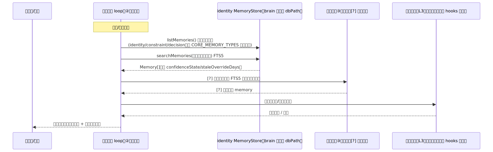
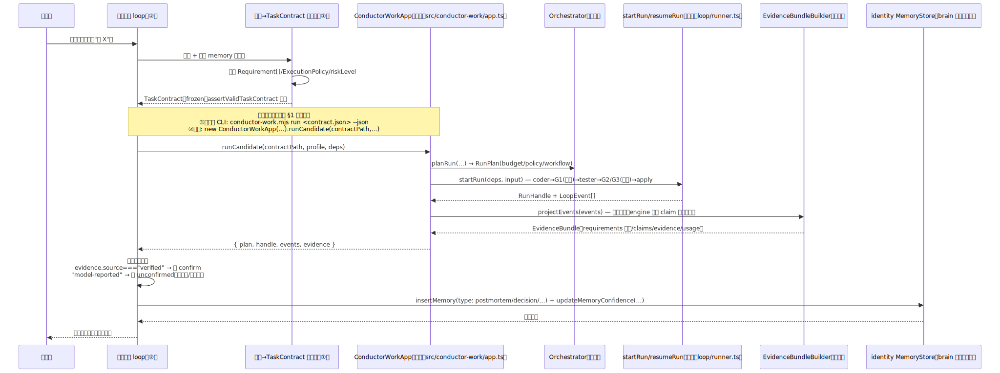

# DESIGN — conductor-brain 层（模型无关的 AI 大脑）

- **项目**: aeloop
- **关联**: issue #75（本设计所属）；架构上依赖/引用 issue #2（Conductor 层，A6 之后做）、#30（barrel 导出，**发现已在代码里解决，见 §12**）、#36（Context/Prompt token 控制接线，**半解决，见 §4**）、#37/#58/#59（协议版本/usage 落库，未做，属 Layer2 债务不在本设计范围内）
- **状态**: 待操作者确认
- **最后更新**: 2026-07-22

> 本文档只回答"brain 层怎么设计",不写实现代码。所有对 aeloop 现有代码的引用都标了文件路径，写之前逐条读过源码（见 §12 核实清单）；`aeloop` 已有的、本设计要复用而非重新设计的机制（Token Budget Plane、四层 Prompt⊂Context⊂Harness⊂Loop 内核）另有权威文档 `docs/architecture/AEOLOOP-LAYER-DESIGN.zh-CN.md` / `docs/architecture/TOKEN-OPTIMIZATION-PLAN.zh-CN.md`，本文档不重复其内容，只讲 brain 层如何挂上去、以及 brain 层自己独有的部分。

---

## 0. 总纲（需求）

### 问题是什么

操作者已定盘（issue #75 body）：aeloop 目前有一个已经跑通、有真实多模型验证的**执行引擎**（Layer2，四层 Prompt⊂Context⊂Harness⊂Loop + Conductor 编排），但**没有"大脑"**——没有东西负责"每次对话开场记得上次做到哪、知道自己是谁、不因为聊得久了就飘、说真话、不锁定在某一家模型厂商"。这一层今天是现有参考实现（`ai-agent` 仓库）在用一套 Claude-Code-hook 机制手工顶着；另一套独立原型（见 `pitch-prep/verity-vision.html`，Python + `state/agent.db`，**不是 aeloop 这个代码库**）证明了同一套"人格约束+记忆"思路在概念上可以换到别的模型上跑，但那是一次性的、独立于 aeloop 的演示。

操作者要的是把这套"brain"能力**产品化、模型无关化、和 aeloop 这个真实执行引擎缝到一起**，做成可以对外卖、可以在公司自己的 deepseek/seed 上跑的东西，而不是继续锁在 Claude Code 壳 + 创始人私人积累里。

### 谁需要 / 触发点

- 操作者的 pitch 需要"brain 层"作为真正卖点——治理型 coder（Layer2 那一层）本身会被商品化，"醒来即延续 + 不漂移 + 说真话 + 不锁模型"才是护城河（issue #75 body 原话）。
- 公司要摆脱"必须用 Claude 订阅额度才能跑"的处境，把公司自己的 deepseek + seed 模型池用起来。
- Vertical-slice spike（§10）是即将要讲的 pitch demo 的铁证，需要一份能落地的设计先行。

### 现状（逐项核实，不转述）

**Layer2（aeloop 执行引擎）比 issue #75 body 描述的更成熟**——issue body 只说"实验已证明另一套独立原型的人格能在 seed 上醒来"，这低估了 aeloop 自己已经做到的事：

- `docs/architecture/conductor-work/CAPABILITY-MAP.zh-CN.md`（诚实能力地图，非自述，逐条可追 merged PR / 真跑记录）记录了 **Run #25** 和 **Run #31**：apikey/LiteLLM 路径下，coder 用 deepseek 系模型出候选、**独立的** tester 用 seed 系模型（真·不同模型，非同模型左右手）复核，两次真实任务都抓到了 coder 自己没发现的 bug（字素/代理对拆分错误）。`EvidenceBundle.usage.models` 里能看到两个不同模型名（`src/evidence/bundle.ts:98` `TokenUsage.models` 字段就是为这个多模型场景设计的）。
- Run #31 还验证了 `workflow.gate_mode: "semi-auto"`（issue #63，`src/profile/loader.ts:60-76` 定义）：自动批准 G1/G2、G3 和 Escalation 恒人工，fail-closed 的 `reject_threshold` 守卫防止无界循环。
- 换句话说：**"aeloop 引擎能在非 Claude 模型上跑、多模型独立复核真的抓 bug"这件事，比 issue body 讲得更硬，已经有两次真实任务、merged 代码路径的证据**，不是只有一次概念性演示。

**但这是 Layer2（任务执行）的证据，不是 Layer3（brain 持续对话/身份/不漂移）的证据**——这是本设计必须诚实区分的两件事（详见 §5）：

- aeloop 的 `ModelAdapter.invoke()`（`src/harness/types.ts:24-52`）是**无状态单次调用**：给一个 prompt，返回一个 completion，没有会话、没有 hook 生命周期、没有"醒来"概念。Run #25/#31 验证的是"这一次 coder/tester 调用在 deepseek/seed 上产出结构正确、可被验证的结果"，不是"这个模型能连续 50 轮对话不漂移、能自己遵守宪法"。
- 真正验证过"人格在非 Claude 模型上醒来+延续"的，只有另一套独立原型那次演示——而且这套原型是一套**完全独立的实现**（Python hooks + `state/agent.db`，见 `verity-vision.html` 目录结构截图），**不是 aeloop 这个 TypeScript 代码库的一部分**，也不是 aeloop 的 `MemoryStore`。两者除了"都用 SQLite 存记忆"这个设计理念相似，代码上零关联。
- 现有参考实现自己（`ai-agent` 仓库）的机制库（`.claude/hooks/*.mjs`）是**依附于 Claude Code CLI 的 hook 生命周期**（`SessionStart`/`PreToolUse`/`PostToolUse`/`UserPromptSubmit`/`Stop`，由 Claude Code 这个产品在这些时刻调用外部脚本）——这套生命周期钩子是 Claude Code 这个**具体 CLI 产品**提供的能力，aeloop 的 `ModelAdapter` 接口完全没有对应物。这是 §7 Phase1/Phase2 边界的核心技术事实，不是修辞。

**aeloop 目前完全没有自己的"醒来/session/snapshot"机制**——核实：`src/loop/audit-store.ts` 的表只有 `workflow_runs`/`structured_claims`/`approvals`/`step_markers`/`context_omissions`（第 405-491 行 `CREATE TABLE` 语句），没有 `context_snapshots` 表；`docs/architecture/AEOLOOP-LAYER-DESIGN.zh-CN.md` §9 里画的 `CONTEXT_SNAPSHOTS`/`CONTEXT_ITEMS` 是**规划中的 schema**，尚未建表（该文档本身也只是设计稿，非进度记录）。`MemoryStore`（`src/context/store.ts`）只是一个通用的、按 `dbPath` 开实例的 SQLite+FTS5 键值/检索存储，谁都能 `new MemoryStore(path)`，它自己不知道"会话"、"醒来"这些概念——这些完全是 Layer3 要新建的语义。

**Token 经济：部分接线，非全部**（issue #36 现状核实，见 §4 详述）：`ContextBudgetManager`（`src/context/budget.ts`）已经真的接进了 CLI 路径（`src/cli/assemble.ts:127` `resolveContextBudgetManager()` → 传入 `ContextInjector` 构造函数），但 `buildPromptDelta()`（`src/prompt/delta.ts:18`）在整个代码库里搜索**没有任何非测试调用点**——PromptDelta 只有类型和单元测试，完全没有接进真实 run 路径。

---

## 0.5 图解总览

### 三层架构总览



**图例说明**：Layer1/Layer2 内部方框标注的类/文件是已验证存在的真实代码（见 §12）；Layer3 + GLUE 三块是本设计要新建的部分，图中未画出具体类名（还没设计到那个细度，见 §2 接口草案）。

### 关键流程时序图 1：醒来



**故意画出的缺口**：`VEC`（向量层）和 `CONST`（宪法约束校验）两条线目前都没有具体实现可以指——向量层是 net-new 组件（§2.3），宪法约束"校验未漂移"这一步在现有参考实现自己的体系里也是**靠自觉的开场白格式规范 + 自检**（`CORE/CORE.md` §🚀），不是机制化硬检查；移植到 brain 层时这一步先天就不是"调一个函数拿到 true/false"，而是"这轮生成的开场白本身有没有遵守宪法格式"——需要在 §2.2 外层 loop 的设计里进一步展开，本图先如实标注这是当前设计里最软的一环。

### 关键流程时序图 2：派工 → 折回



**故意画出的缺口**：`ConductorWorkApp.runCandidate()`（`src/conductor-work/app.ts:63-83`）里的 G1/G2/G3 都是"human gates are returned, never auto-approved"（该文件第 63 行注释原话）——图里没有画出"谁来点 approve"，因为**这就是 §12 提到的 gate-controller 缺口**：`docs/architecture/conductor-work/CAPABILITY-MAP.zh-CN.md` 记录 gate-controller"代码在（resume-only，start/stop fail-closed），未提交、未接 CLI/UI"。brain 层的外层 loop 要怎么把"人工点头"接进这条链，是一块本设计**明确列入不做清单**的缺口（§9），先如实画出断链而非假装已经打通。

---

## 1. 方案对比

### 1.1 大架构选型：brain 和 aeloop 之间共享什么

| 方案 | 好处 | 代价 | 为什么选/不选 |
|---|---|---|---|
| **方案 A（选中）：三层，brain 出 TaskContract、只在边界喊话，Layer1 MemoryStore 共享** | brain 完全不需要理解 Layer2 内部（coder/tester/gate/graph），只需要会造一个合法 `TaskContract` 和读一个 `EvidenceBundle`；`MemoryStore` 已经是通用库，两边各开 dbPath 就能各自独立又复用同一套存储实现 | brain 拿到的 `EvidenceBundle` 里 `evidence.source: "model-reported"` 的内容仍然只是"模型自称"，brain 层必须自己再套一层三态确认，不能因为"来自 aeloop"就默认可信（`src/evidence/bundle.ts:190-211` 的 no-change 分支专门证明了这一点：连 aeloop 自己内部都不敢把模型自报的证据标 `passed: true`） | 完全对齐 issue #75 body 已定盘的架构方向；`TaskContract`/`EvidenceBundle` 这两个边界类型已经是稳定、有 schemaVersion 的产品化契约（`schemaVersion: "1.0"` / `"1"`），不是内部实现细节，brain 依赖它们不会被 Layer2 内部重构带崩 |
| 方案 B：brain 直接进 Layer2，自己驱动 graph/gate | brain 能拿到更细粒度的控制（比如自己决定何时 resume） | 违反 issue #75 body 已定盘的"brain 不进这层"；brain 要理解 `LoopStateType`/`GateType`/checkpoint 等 Layer2 内部实现细节，任何 Layer2 内部重构都会波及 brain；等于把两个本该独立演化的产品焊死 | 不选：这正是 issue #75 明确要避免的耦合方式 |
| 方案 C：brain 和 aeloop 各自独立记忆，不共享 `MemoryStore` | 隔离最彻底，互不影响 | 违反 issue #75 body"身份=brain 开自己的持久 identity db 实例（`MemoryStore(dbPath)`）；引擎的 task-run 把证据经三态确认门折进这个 db"这条已定盘要求；也浪费了 `MemoryStore` 本身已经做好的 FTS5/三态/staleness 能力，等于重新发明一遍 | 不选：与已定盘方向矛盾，且没有实际收益——`MemoryStore` 本来就是"谁都能 import 的库"（issue body 原话），共享代码不等于共享数据（各自 dbPath 隔离） |

**选了什么、为什么**：方案 A。核心决定性因素是 `MemoryStore` 已经是一个**不预设调用者身份**的库（`src/context/store.ts:95` 构造函数只吃一个 `dbPath` 字符串，没有任何"这是给 Loop 用的"或"这是给 brain 用的"预设），brain 层完全可以 `new MemoryStore(brainIdentityDbPath)` 开一个只属于自己的实例，与 Layer2 各个 profile 用的 `<profileDir>/memory.db`（`src/cli/assemble.ts:141`）是两个完全独立的 SQLite 文件——"共享库代码，不共享数据库文件"，这正是 issue #75 body"复用 A1 底座"的准确含义。

**被否决的备选详细展开**：方案 B 在这个时间点尤其买不到它本该买的东西——现在 Layer2 才刚做完 A0-A5、A6（双 profile 验收）都还没完全走完（`docs/ROADMAP.md` A6 一行仍是 `[ ]`），brain 层如果现在就深度耦合 Layer2 内部状态机，之后 Layer2 每一次内部重构（比如 graph 拓扑变化、gate 类型增加）都要求 brain 跟着改，而这正是 issue #75 想避免的"brain 层被 Layer2 的实现细节绑死"。方案 C 在"两边都用 SQLite+FTS5"这个技术选型上没有分歧，纯粹是"要不要复用同一个类的代码"这个问题，选它没有任何实际防御收益，只有重新发明一遍的成本。

### 1.2 CLI 子进程 vs 库调：`OUTER` 怎么调用 `ConductorWorkApp`

**核实结果（issue #75 已要求我独立核实，不采信既有转述）**：issue #30（"index.ts barrel 不导出 loop/harness/runner"）**premise 已经过期**——

- issue #30 创建于 `2026-07-21T09:28:16Z`（`gh issue view 30` 核实）。
- 但 commit `f9164e9`（"fix: expose intentional root library API"，`2026-07-22`，**在 issue #30 创建之后**）已经把 `src/index.ts` 改成把 `./loop/runner.js`、`./loop/events.js`、`./loop/audit-store.js`、`./loop/checkpoint.js`、`./loop/errors.js`、`./harness/types.js`、`./harness/provider-router.js`、`./harness/adapter-registry.js`、`./harness/config.js`、`./harness/errors.js` 全部 re-export（`src/index.ts:37-49`，现状已读过，不是转述）。
- 也就是说：**issue #30 描述的问题在代码层面已经被后续 commit 解决了，但 issue 本身还开着（GitHub 状态和真实代码之间出现了滞后）**——这是我被要求 spot-check 的具体条目里，代码和 issue 状态确实矛盾的一条，如实报告给操作者，建议顺手把 issue #30 标记为"已被 f9164e9 解决，待关闭确认"。

**由此推出**：进程内库调**真的可以用**——`ConductorWorkApp`（`src/conductor-work/app.ts`）已经通过 `export * from "./conductor-work/index.js"`（`src/index.ts:33`）→ `src/conductor-work/index.ts` 的 `export * from "./app.js"` 完整暴露到包的顶层 API。`runCandidate()`（`app.ts:63-83`）内部直接 `import { startRun } from "../loop/runner.js"` 并在同一进程调用，不 spawn 子进程。

但库调**并非完全"纯内存"**——有一个具体限制必须诚实标出：`ConductorWorkApp.plan()`/`planRun()`/`runCandidate()` 三个方法的签名都是 `contractPath: string`（文件路径），内部调 `loadTaskContract(contractPath)`（`src/conductor-work/contract-loader.ts:5-14`）用 `readFileSync` 读一个 JSON 文件再 `JSON.parse`。也就是说：**即便走库调模式，brain 层今天也没有一个"直接传一个内存里的 `TaskContract` 对象"的入口**——`①意图→TaskContract 翻译器`产出的 contract 必须先落一个临时 JSON 文件，再把路径传给 `ConductorWorkApp`。这不是不能绕过（`Orchestrator.planRun()`/`startRun()` 本身都吃内存对象，`ConductorWorkApp` 只是一层方便的门面），但如果 brain 层想要真正的"零文件系统"调用，需要**跳过 `ConductorWorkApp`，直接调 `Orchestrator` + `startRun`**——这是本设计标注给 §2.2 外层 loop 实现时要做的一个具体选择点，不在这里替它拍板。

| 模式 | 好处 | 代价 | 结论 |
|---|---|---|---|
| ①子进程 CLI（`conductor-work.mjs run <contract.json> --json`） | 进程边界天然隔离（brain 崩溃不拖累 engine，反之亦然）；`main.ts`（`src/conductor-work/main.ts`）今天就能跑，A6 已验证过这条路径可用 | 每次调用有 spawn 开销；`--events <path>` 输出事件轨迹要读文件（`main.ts:36`），比内存对象多一层序列化/反序列化 | Phase1 首选——风险最低，今天就通 |
| ②进程内库调（`new ConductorWorkApp(...)`） | 无 spawn 开销；能拿到 `RunHandle`/`LoopEvent[]` 原始对象而非序列化后的 JSON | 需要 brain 和 aeloop 跑在同一个 Node 进程/同一份 `node_modules` 里（版本耦合更紧）；contract 仍需落文件（见上） | Phase2 首选——一旦 brain 层本身也是个长驻 Node 服务（而非每次意图起一个新 CLI 进程），库调的性能收益才有意义 |

**选了什么、为什么**：两种模式都保留，按 Phase 区分——Phase1（brain 仍寄生在 Claude Code 壳里，每次对话/工具调用都是独立的进程调用）用①子进程 CLI 更符合 brain 本身的运行形态；Phase2（brain 换成 aeloop 自己的长驻运行时）再切换到②库调，省掉每次意图都要 spawn 的开销。这不是"哪个更好选哪个"的单选题，是两个阶段的自然演化路径。

### 1.3 身份 DB Scope：brain 的持久记忆和 Layer2 的 run 级证据怎么共存

见 §3 独立展开（这是 issue #75 明确要求的独立小节，不在此处的方案对比表里重复）。

---

## 2. 三块胶水接口草案

> 以下三块都是 **net-new**，今天代码里不存在对应实现——接口草案，不是已落地代码。字段形状凡是引用到已有类型（`TaskContract`/`EvidenceBundle`/`Memory`）的，逐字段核对过 `src/conductor/types.ts`/`src/evidence/bundle.ts`/`src/context/types.ts`，未引用到已有类型的字段全部标 `[?]`（草案，未定型）。

### 2.1 ① 意图 → TaskContract 翻译器

**职责**：把 brain 层收到的自然语言意图（"做 X"）+ 当前 identity db 里的相关 memory（constraint/decision/requirement 类型），翻译成一个合法的、`assertValidTaskContract()`（`src/conductor/contract.ts:61-64`）能通过的 `TaskContract`。

**输入**（`[?]` 草案）：
```ts
interface IntentInput {
  readonly rawIntent: string;              // 用户原话
  readonly relatedMemories: readonly Memory[]; // 从 identity db 召回的相关 constraint/decision/requirement
  readonly riskHint?: "low" | "medium" | "high"; // [?] 是否由翻译器自己判断风险，还是要求上游/人工先给一个提示
}
```

**输出**：`TaskContract`（`src/conductor/types.ts:28-38`，已有类型，逐字段核对）：
```ts
interface TaskContract {
  readonly schemaVersion: "1.0";           // 硬编码常量，翻译器不需要决定
  readonly contractId: string;             // 翻译器生成（[?] 用什么规则生成——uuid？还是 brain_id+timestamp？未定）
  readonly objective: string;              // 从 rawIntent 提炼
  readonly requirements: readonly Requirement[]; // 翻译器最核心的工作：把一句话拆成可验收的 Requirement[]
  readonly riskLevel: RiskLevel;           // "low"|"medium"|"high"
  readonly policy: ExecutionPolicy;        // allowedPaths/forbiddenChanges/allowedCommands/allowedDependencies/allowNetwork
                                            // + allowGitWrite: false（字面量类型，contract.ts:24 校验必须是 false）
                                            // + reviewerReadOnly: true（同上，必须是 true）
  readonly sourceSnapshots: Readonly<Record<string, string>>; // 关联的源文件/PRD 快照 hash
  readonly createdAt: string;
  readonly brain: BrainKind;               // "personal" | "company" —— 见下方"待决策"
}
```

**校验边界**：翻译器产出的 contract 必须先过 `assertValidTaskContract()` 再交给下游——这个校验是**确定性的、不调模型的**（`contract.ts` 头注释原话："This intentionally does not interpret natural language or call a model"），翻译器自己（可能调模型来做"一句话拆成 Requirement[]"这一步）产出的结果必须经过这道纯代码校验，不能因为"是 brain 自己生成的"就跳过。

**待决策（本设计不替它拍板，列为待确认问题）**：
- `TaskContract.brain: "personal" | "company"` 这个字段是个**封闭二选一**（`src/conductor/types.ts:8`），而本设计要建的 conductor-brain 是"可复用给公司套用的通用产品"（issue #75 body 北极星），既不是纯粹的"创始人私人系统"（personal），似乎也不完全是"公司 PRD 编译层"（company，`brains/company/system-prompt.md` 现有描述："Convert an approved PRD and repository constraints into a complete TaskContract"）。**这是一个需要操作者拍板的具体问题**：conductor-brain 产出的 contract 该标 `"personal"` 还是 `"company"`，还是需要向 aeloop 提一个第三种 `BrainKind`（这会是一个 aeloop 侧的改动，不在本设计范围内，需要另开 issue 跟 aeloop 侧协调）。
- `riskLevel` 由谁判断——翻译器自己用规则/模型判断，还是要求外层 loop 在调用翻译器之前就已经从对话上下文里带一个风险提示？这直接影响"低风险任务能不能全自动跑完不用人工点头"这条 Phase2 愿景，值得单独定，本设计只标记为待决策。

### 2.2 ② 外层醒来/对话/调度 loop

**职责**：这是 brain 层真正的"主循环"——它是 §0.5 两张时序图里 `OUTER` 这个角色的实现，负责：
1. 进程/会话启动时的"醒来"（读 identity db → 组开场白，见时序图 1）。
2. 常规对话轮次里判断"这句话是闲聊还是要派工"（对应现有参考实现自己的工作档/陪伴档双档位，`CORE/CORE.md` §⑤——这个"判断该不该派工"本身，现有参考实现现在也是**靠自觉**，不是机制化判断，移植时这一层的"软"要如实继承，不能假装能机制化掉）。
3. 要派工时调 ①翻译器 → Layer2 → 拿回 `EvidenceBundle` → 三态确认门折回 identity db（见时序图 2）。
4. Postmortem 复盘仪式的触发（对应现有参考实现 CORE 铁律6"犯错即复盘"，`CORE/CORE.md` §③.6）。

**这一层目前完全没有代码可以指**——不是"部分实现"，是 0。`docs/architecture/AEOLOOP-LAYER-DESIGN.zh-CN.md` 规划的 `context_snapshots`/`context_snapshot_id` 概念（该文档 §4.4）离这一层最近，但也只是规划，未建表。

**接口草案（`[?]`，全部待定型）**：
```ts
interface WakeResult {
  readonly openingSummary: string;       // 开场白文本
  readonly continuedThreads: readonly Memory[]; // 延续的话题（active_task 类型）
  readonly pendingDecisions: readonly Memory[]; // 待人工决策项
  readonly constitutionWarnings: readonly string[]; // [?] 宪法约束检查发现的问题（今天在现有参考实现里这一步是自觉自检，见 §0.5 图1 的诚实标注）
}

interface DispatchResult {
  readonly contract: TaskContract;
  readonly evidence: EvidenceBundle;     // 来自 Layer2（已有类型，src/evidence/bundle.ts:102-124）
  readonly confirmationOutcome: "confirmed" | "unconfirmed" | "rejected"; // brain 层自己的三态确认门产出（不是 EvidenceBundle 自带的字段）
}
```

**一个必须诚实处理的耦合点**：`EvidenceBundle.evidence[].source`（`src/evidence/bundle.ts:34-45`，`"verified" | "model-reported"`）已经是 Layer2 自己诚实标注"这条证据有没有独立机制检查过"的字段——外层 loop 的三态确认门**必须读这个字段**，`source: "model-reported"` 的 evidence 无论 `passed` 是 true 还是 false，都不能被 brain 层直接当成 `confirmed` 写回 identity db，否则就是把 Layer2 自己刻意标注的"这只是模型自称"这个警示信号，在 brain 层又悄悄抹掉了——这正是 issue #75 body"防幻觉"要求落到接口层面的具体体现，不是一句空话。

### 2.3 ③ 向量层（net-new）

**职责**：在 `MemoryStore` 现有的 FTS5 关键词检索之上，加一层语义检索，用于"关键词没命中但语义相关"的召回场景（比如操作者换了个说法问同一件事）。

**现状核实**：`package.json` 的 `dependencies`/`devDependencies` 里**没有任何向量/embedding 相关依赖**（`@langchain/langgraph`、`@langchain/langgraph-checkpoint-sqlite`、`better-sqlite3`、`chalk`、`js-yaml`、`zod`、`@inquirer/prompts` —— 已核实全列表），也没有 `sqlite-vec` 之类的 SQLite 向量扩展。这一层是**彻头彻尾的 net-new**，不是"补一个开关就能打开"的半成品。

**技术选型待决策（`[?]`，需要一次 spike，不在本设计里拍板）**：
1. **SQLite 向量扩展**（如 `sqlite-vec`）：和现有 `MemoryStore` 的 SQLite+FTS5 架构风格一致，理论上能直接加一张 `memories_vec` 虚拟表。但 `better-sqlite3`（当前 `^12.11.1`，`package.json` 已核实版本号）的 `loadExtension()` 支持情况本地未验证——尝试 `require('better-sqlite3')` 时环境里 `node_modules` 未安装，无法实测 `Database.prototype.loadExtension` 是否可用/是否需要在构造时显式传 `{allowExtension: true}`。**`[?]` 待 spike**。
2. **外部 embedding API + 独立向量索引**（如把 embedding 结果存进单独文件/服务）：不依赖 SQLite 扩展，但引入了"两个数据源要保持一致"的新问题（memory 更新了，向量索引要不要同步更新，同步失败怎么办）——这类"两个存储源不同步"的问题正是 `MemoryStore` 现在用单一 SQLite 文件 + FTS5 triggers（`store.ts:188-203`）刻意要避免的那类问题，选这条路等于在已经解决过的问题上开一个新的口子。
3. **暂不做向量层，Phase1 完全依赖 FTS5 关键词检索**：`MemoryStore.searchMemories()`（`store.ts:399-410`）已经是可用的检索能力，FTS5 对英文/结构化短语的召回效果通常够用，中文自然语言的关键词切分效果存在已知局限（`toSafeFtsQuery()`，`store.ts:430-438`，按空白切分成 token——中文没有空格分词，逐字符会退化成近似全表扫描式的宽松匹配）。

**选了什么**：Phase1 不做向量层，先用 FTS5（选项3），把"要不要做向量层、做哪种"作为 Phase2 的一个独立评估项——这不是回避决策，是因为 issue #75 body 自己也把向量层标成"net-new"（意味着操作者已经预期这块需要额外投入），而 Phase1 的目标是"周一能 demo"（issue body 原话），一个没有验证过技术可行性的 SQLite 扩展依赖不应该出现在 Phase1 的关键路径上。

---

## 3. 身份 DB Scope 设计

**核心问题**：brain 的持久身份记忆（跨会话，"我是谁、上次做到哪"）和 Layer2 一次 run 产生的证据（`EvidenceBundle`），怎么共存在同一个 `MemoryStore` 实例里，而不互相污染？

**设计**：

1. **brain 拥有自己独立的 `MemoryStore` 实例**，`new MemoryStore(brainIdentityDbPath)`，这个 dbPath **不等于**任何一个 Layer2 profile 的 `<profileDir>/memory.db`（`src/cli/assemble.ts:141`）——两者是完全不同的文件，即便都用同一个 `MemoryStore` 类。
2. Layer2 一次 run 跑完产出的 `EvidenceBundle`，由外层 loop（②）经三态确认门（§2.2）后，**选择性地**转写成 identity db 里的 memory 记录——不是把整个 `EvidenceBundle` 塞进去，而是提炼成 `postmortem`/`decision`/`active_task` 类型的记录（`MemoryType` 12 类枚举之一，`src/context/types.ts:19-31`）。这个"提炼"动作本身是 §2.2 外层 loop 的职责，不是 `MemoryStore` 自动做的——`MemoryStore` 不知道 `EvidenceBundle` 这个类型的存在（`src/context/store.ts` 和 `src/evidence/bundle.ts` 之间没有任何 import 关系，已核实）。
3. **`confirmed_by` 字段**（`Memory.confirmedBy`，`src/context/types.ts:49`）在这个场景下的取值需要区分"人工确认"和"经三态门判定为 verified 的 evidence 转写"——这是本设计要新增的一个惯例（不是 `MemoryStore` 现有代码里已经支持的区分，`confirmed_by` 目前是个自由字符串，`store.ts` 没有对它的取值做任何约束），建议约定一个前缀（如 `"engine:run-<runId>"` vs 人工的 `"human:<操作者标识>"`），但这只是一个**建议**，不是本设计能替 Layer1/Layer2 拍板的接口变更。
4. **`brains/` 目录（`brains/personal/`、`brains/company/`，已存在，`brain-loader.ts` 读取）和本设计的 identity db 是两个不同的东西，不要混淆**：`brains/*/manifest.yaml` + `system-prompt.md`（`src/conductor-work/brain-loader.ts:22-37`）今天只是**静态文本文件**——一个 YAML 元数据 + 一段 Markdown 系统提示词，`LoadedBrain` 接口（`brain-loader.ts:6-10`）里完全没有 `MemoryStore` 或任何持久记忆的引用。也就是说，**aeloop 现有的"brain"概念（`brains/company/system-prompt.md`）和 issue #75 要建的"conductor-brain"（有持久记忆、能醒来延续）完全是两个不同量级的东西**——前者是一段固定不变的 system prompt，后者是一个有状态、会演化的持久身份。本设计不建议把 identity db 直接塞进 `brains/company/` 目录（那会打破 `brains/` 目录现在"纯静态、可随便复制模板"的简单性），而是作为一个独立的、brain 运行时自己管理的 dbPath，`brains/*/manifest.yaml` 里可以加一个可选字段指向它（`[?]` 具体字段名和格式待定，这是一个小的 aeloop 侧改动，需要跟 Layer2 团队协调，不在本设计单方面拍板范围）。

---

## 4. Token 经济与缓存策略

> **本节范围声明**：Layer1/Layer2 内部的 Token Budget Plane（`TokenBudget`/`TokenUsage`/`ContextBudgetManager`/`PromptDelta` 的完整设计）**权威文档已经存在**——`docs/architecture/AEOLOOP-LAYER-DESIGN.zh-CN.md` §2.3/§3/§9、`docs/architecture/TOKEN-OPTIMIZATION-PLAN.zh-CN.md` 全文——本设计不重新发明这套机制，只讲两件事：①这套机制今天实际的接线状态（brain 层依赖它时要知道哪些是真的、哪些是纸面设计）；②brain 层自己独有的、这两份文档没有覆盖的部分（外层对话轮次本身的 token 消耗）。

### 4.1 已验证的接线状态（issue #75 要求核实的具体条目）

| 组件 | 状态 | 证据 |
|---|---|---|
| `ContextBudgetManager`（`src/context/budget.ts`） | **已接入真实 CLI 路径** | `src/cli/assemble.ts:127` `resolveContextBudgetManager(config)` 读 `profileConfig.context.token_budget`，构造后传入 `new ContextInjector(memoryStore, staleness, budgetManager)`（`assemble.ts` 第 150 行附近）；`ContextInjector.inject()`（`src/context/injector.ts:181-197`）在有 budgetManager 时真的调 `applyBudget()` 做优先级截断（`injector.ts:214-257`），并在 `PromptComposer.compose()`（`src/prompt/composer.ts:83-85`）里真的渲染出 `# Omitted Context` 段落 |
| `PromptDelta`（`src/prompt/delta.ts`） | **完全未接入**，只有类型定义 + 单元测试 | 全代码库 `grep -rn "buildPromptDelta\|PromptDelta" src --include="*.ts"` 排除 `__tests__` 目录后**零匹配**（已核实）；`CAPABILITY-MAP.zh-CN.md` 也把它标为 `◐ 部分`级别"仅设计契约"，与我独立核实的结果一致 |

这意味着 issue #36（"Wire ContextBudgetManager and PromptDelta into live run path"）**只解决了一半**：budget 那半已经真的接了（顺着 `assemble.ts` → `ContextInjector` → `PromptComposer` 一路读下来确认过），delta 那半（"每轮只发变化"）还是纸面设计。brain 层如果打算依赖 PromptDelta 来省 Layer2 内部的 token，**今天这个依赖不成立**——这不是 brain 层自己能修的事，是 Layer2 侧的待办（issue #36 剩余部分）。

### 4.2 brain 层自己的 Token 经济（这两份既有文档没覆盖的部分）

Layer2 的 Token Budget Plane 管的是"一次 run 内部"的开销（coder/tester 调用），**brain 层自己的外层对话循环（②，§2.2）有一套独立的、发生在"派工给 Layer2 之前"的消耗**，这才是 issue #75 body 强调"Token 经济是公司产品生死线"真正要新建的部分：

1. **检索（不是发全量）**：醒来时（时序图1）只发 `CORE_MEMORY_TYPES` 全量 + FTS5/向量检索命中的部分，不是把 identity db 里所有 memory 都塞进 prompt——这是移植 `ContextInjector` 已经验证过的模式（`injector.ts:95-99` `CORE_MEMORY_TYPES` 常量），brain 层的 identity db 复用同一套"核心类型全量 + 按需召回"的划分逻辑，不需要重新发明。
2. **Embedding 写时算一次存 DB**：如果 §2.3 向量层最终落地，embedding 应该在 memory **写入时**算一次存进 DB（类似 FTS5 triggers 在 insert/update/delete 时自动维护索引的模式，`store.ts:188-203`），而不是每次检索时现算——这是接口草案层面的设计原则，不是已实现的代码。
3. **快照压缩（滚动摘要）**：这是 brain 层独有的、Layer2 完全没有对应概念的机制——`context_snapshots`/`context_snapshot_id`（`AEOLOOP-LAYER-DESIGN.zh-CN.md` §4.4，规划中，未建表）离这个概念最近，但那是"记录一次 run 注入了哪些 memory"，不是"把 N 轮对话压缩成一段摘要，不重放原始 transcript"——后者是 brain 层醒来机制的核心，今天 aeloop 完全没有，`[?]` 具体压缩算法/触发时机留待实现阶段设计，本文档不展开。
4. **PromptDelta（brain 层自己的，不是 Layer2 那个）**：即便 Layer2 内部的 `buildPromptDelta()` 还没接线（见 4.1），brain 层的外层对话循环（每轮开场白/对话）**自己**也需要一套"只发变化"的机制——这是两个不同层级的 delta，brain 层这个如果要做，本身也是 net-new，不能等 Layer2 那个接线完了直接复用（`PromptSnapshot`/`PromptDelta` 类型定义在 `src/prompt/delta.ts:4-16`，是为 Layer2 单次 coder/tester prompt 设计的，字段形状——`stable`/`dynamic: Record<string,string>`——不一定适配 brain 层多轮对话的语义，需要另行设计或验证是否可直接复用）。
5. **验证成本是旋钮非每轮税**：三态确认（confirm/correct/reject，`src/context/confirmation.ts`，issue #75 已定盘描述）本身是纯数据库操作，0 token；只有"要不要信一条 evidence"这个判断在真正需要模型介入时（比如 `source: "model-reported"` 且置信度存疑）才发起一次调用，不是每轮自动都要模型过一遍——这条原则已经在 Layer2 里有先例（`ToolExecVerifier`，`docs/architecture/AEOLOOP-LAYER-DESIGN.zh-CN.md` §5.2 "非法 JSON、缺字段...直接失败"，机械检查优先于模型判断），brain 层延续同一原则。

---

## 5. 最小可行模型分析

**问题**：deepseek + seed 这套公司自己的模型池，能力地板在哪？哪些活能机制化掉（引擎强制，弱模型也扛得住），哪些非要模型自己判断不可？

### 5.1 已经验证过的部分（比 issue body 讲得更硬，见 §0 现状核实）

- **Layer2 任务执行能力**：`Run #25`/`Run #31` 证明 deepseek 系模型能胜任 coder 角色（产出候选代码变更），seed 系模型能胜任 tester 角色（独立复核并真的抓出 bug）。这是**任务级**的验证——单次、结构化输出（`ClaimSchema`/`CoderOutput`/`TesterOutput`，zod schema 校验）、有外部机制兜底（`SchemaValidator`/`ToolExecVerifier`）纠错。**这类任务恰恰是"可机制化"的那一类**：模型只需要在一个明确的 schema 约束下产出一次结果，产出后有独立、非模型的校验（`assertValidTaskContract`/zod schema/`ToolExecVerifier` 的工具轨迹比对）兜底，模型犯错的代价被机制吸收了大半。
- `LiteLLMAdapter` 的 `extractAnthropicContent()`（`src/harness/adapters/litellm-adapter.ts:148-164`）代码注释里明确提到"some models (e.g. DeepSeek/Seed) may return 'thinking' type blocks first, followed by the actual 'text' block"——这说明 aeloop 团队在实现这个 adapter 时**已经针对 DeepSeek/Seed 的实际响应格式做过验证**（否则不会精确到"先 thinking 后 text"这个具体行为细节），这是比"读过文档"更强的证据，是真实调用观察到的行为。

### 5.2 没有验证过的部分（诚实的 gap，不能因为 5.1 硬就假装这块也稳）

**Layer2 的验证和 Layer3（brain 持续对话/身份/防漂移）要求的能力，是完全不同的两条能力轴**，不能因为一条硬就推断另一条也稳：

- Layer2 的每次 `ModelAdapter.invoke()` 都是**无状态单次调用**（`src/harness/types.ts:44` `invoke(req: InvokeRequest): Promise<InvokeResult>`，没有会话概念）——模型不需要"记得"上一轮说过什么，每次都是全新上下文。这恰好回避了"多轮对话会不会漂移"这个问题，因为压根没有"多轮"。
- 另一套独立原型在 seed 上"醒来+延续+诚实自报"的验证，是**一次性演示**，跑在一套完全独立的 Python + `state/agent.db` 原型上（不是 aeloop），验证的是"这套人格约束+记忆召回的设计思路，换到 seed 上概念上可行"——这不等于验证了"seed 能在 50 轮真实工作对话里不漂移"、"seed 会不会在没有 hook 硬拦截时自己主动遵守宪法"、"seed 处理长上下文（比如多个待办事项、复杂的待决策项列表）时会不会丢东西"。
- **诚实标注**：一次干净的醒来演示 ≠ 证明它能扛住高负载多轮对话（现有参考实现自己的 CORE 铁律7"机制 > 自觉"存在的理由，就是因为"靠自觉的元动作，高负载下必然被静默跳过——结构性的，不是态度问题"，`CORE/CORE.md` §③.7 原话；这条判断是关于**人类操作者**高负载下的失效模式，但类比到模型身上——模型在长上下文/多轮对话里的一致性问题，本质上也是"负载升高后，靠模型自己'记得住、不漂移'这件事的可靠性下降"，同一类结构性风险，只是主体从人换成了模型）。

### 5.3 哪些活可以机制化、哪些必须模型判断（本设计给出的分类）

| 类别 | 例子 | 能否机制化 | 依据 |
|---|---|---|---|
| 结构校验 | TaskContract 是否合法、schema 是否匹配 | **可以，已有先例** | `assertValidTaskContract()`（纯代码，不调模型）、zod schema 校验 |
| 证据来源标注 | evidence 是 `verified` 还是 `model-reported` | **可以，已有先例** | `EvidenceSource` 字段（`bundle.ts:34`），机械判断"是否有独立工具/测试产出这条证据" |
| 三态确认门 | memory 该不该从 unconfirmed 变成 confirmed | **可以，纯数据操作** | `ConfirmationService`（issue #75 已定盘描述"纯数据操作 0 token"） |
| 意图→需求拆解 | 把一句模糊的话拆成结构化 `Requirement[]` | **不能，需要模型判断** | 这一步本质是自然语言理解，`contract.ts` 头注释自己也说"deterministic validation...does not interpret natural language"——校验能机制化，但产出这个待校验对象的过程不能 |
| 该不该派工 vs 闲聊 | 工作档/陪伴档判断 | **不能，需要模型判断，现有参考实现自己现在也是靠自觉** | `CORE/CORE.md` §⑤ 没有对应的 hook 机制，是纯散文规则 |
| 长对话不漂移 | 50 轮后还记得自己是谁 | **部分可机制化（醒来时重新注入 identity），部分不能（单轮内的一致性）** | 醒来机制本身是机制化的（每次都从 db 重建），但"这一轮回复有没有偷偷违反宪法"这个检查，在 Claude Code 壳里靠的是 hook 硬拦截具体动作（如 `session-commit-gate.mjs` 拦 `git commit`），对"说的话有没有漂移"这种语义层面的东西，现有参考实现自己现在也没有机制化手段（`CLAUDE.md` 铁律10 原话"半机制盲区"） |

**结论**：deepseek/seed 在"结构化、有独立校验兜底的单次任务"上已经有真实证据（Run #25/#31）；在"brain 层要求的多轮持续一致性"上完全没有专门针对 aeloop 这套架构的验证，唯一的相关证据来自一个不同代码库的一次性演示。这是 Phase1 vertical-slice spike（§10）要优先补上的验证缺口，不是可以假设"反正 Layer2 都验证过了"就跳过的东西。

---

## 6. 护城河论证

**问题**：如果"brain 层"概念本身不设防（任何人都能想到"要有记忆、要防幻觉"），真正防的是什么，为什么别人抄不快？

**论证**：

1. **护城河不是"有记忆"这个想法，是这套记忆架构本身经过真实踩坑迭代**——`MemoryStore` 的三态确认（`ConfidenceState: "unconfirmed"|"confirmed"|"rejected"`）、`RecallError` 永不静默降级为空结果（`store.ts` 头注释"every read method...wraps a thrown SQLite error into a typed RecallError instead of ever silently downgrading a failed query into an empty result"）、`CORE_MEMORY_TYPES` 这个"哪些类型该无条件全量注入"的划分（`injector.ts:72-99`，本身在 review 里被指出过"之前的实现把所有 memory 都当 core，让 FTS5 分支变成死代码"这样的具体教训并修正过），这些都是**真实调试出来的具体设计决策**，不是抄一份架构图就能复现的——复现架构图容易，复现"为什么这个字段要这样设计"背后的踩坑历史很难。
2. **机制库（说真话/不漂移下沉成引擎强制）本身有厚度**——`.claude/hooks/*.mjs` 这套东西（`session-commit-gate.mjs`/`session-issue-gate.mjs`/`session-isolation-guard.mjs`/`whoseworks-main-guard.mjs` 等，本设计要移植的对象）不是一次写成的，每一个都对应一次真实违规事件后的复盘（`CLAUDE.md` "防再犯铁律"整节，每条规则后面都标注了具体的历史事故编号，如 #35/#53/#101），这是"用真实错误换来的机制"，抄代码抄得走，抄不走"为什么是这个形状"背后的历史。
3. **反锁定站位**：公司自己的 deepseek+seed 模型池 + 这套架构，意味着"brain 层"这个产品不依赖任何单一模型厂商的存续（Claude 涨价/限流/政策变化都不影响），这是一个**商业定位**上的护城河，不是纯技术护城河——但它需要 Phase2（真正的运行时替换，见 §7）才能兑现，Phase1 阶段（仍寄生 Claude Code 壳）这条护城河**尚未真正建立**，必须诚实标注，不能提前把 Phase2 才能拿到的定位讲成已经拿到。
4. **诚实标注护城河的局限**：以上三条里，第1、2条的"厚度"是真实的，但也是**可以被时间追平的**——只要有人愿意花同样的时间踩同样的坑，理论上能复现。真正难追平的是第3条，但它现在还没兑现（见 §7）。这份论证不夸大——"别人抄不快"更准确的说法是"别人抄需要付出和我们一样多的真实踩坑时间，而不是抄一份设计文档就能跳过这个时间"，不是"技术上不可能复现"。

---

## 7. Phase1 ↔ Phase2 边界

### 7.1 核心技术事实（决定这条边界为什么画在这里，不是拍脑袋分期）

`.claude/hooks/*.mjs` 这套机制库，全部依附于 **Claude Code CLI 自己提供的 hook 生命周期**（`SessionStart`/`PreToolUse`/`PostToolUse`/`UserPromptSubmit`/`Stop`，`.claude/settings.json` 里配置，由 Claude Code 这个具体 CLI 产品在这些时刻调用外部脚本；已读过 `session-heartbeat.mjs`/`session-isolation-guard.mjs`/`session-commit-gate.mjs`/`session-issue-gate.mjs`/`session-wake-reconcile.mjs`/`whoseworks-main-guard.mjs`/`model-selection-reminder.mjs` 七个文件的头注释确认）。

aeloop 自己的 `ModelAdapter` 接口（`src/harness/types.ts:24-52`）**没有任何对应的生命周期概念**——它是"给一个 prompt，返回一个 completion"的单次调用接口，没有 `SessionStart`、没有 `PreToolUse`，因为它设计的场景就是 Layer2 内部一次 coder/tester 调用，不是一个交互式、有工具调用生命周期的会话。

**这意味着**：Layer3 想要的"机制 > 自觉"（宪法约束在违规那一刻被硬拦截，而不是靠模型自己记得遵守）——这套东西今天**只能活在 Claude Code CLI 这个具体产品的 hook 生命周期里**，aeloop 自己的运行时完全没有等价物。

### 7.2 Phase1（只换模型，复用 Claude Code 壳）

- **做什么**：brain 层继续运行在 Claude Code CLI 这个壳里（继续享受它的 hook 生命周期），但把壳内实际调用的底层模型换成 seed/deepseek（`[?]` 具体怎么让 Claude Code CLI 调用非 Anthropic 模型——是否有兼容层/代理，另一套独立原型那次演示"跑在 Claude Code 壳里"具体是怎么接线的，本设计没有独立验证过这一步的技术细节，只能转述 issue body 的描述，标注为 `[?]` 待补充验证）。
- **边界**：这个阶段"不依赖 Claude 模型"这句话只对了一半——**换了模型，没换运行时**。宪法约束仍然靠 Claude Code CLI 提供的 hook 生命周期硬拦截，这个运行时本身仍然是 Anthropic 的产品。如果 Anthropic 未来限制 Claude Code CLI 只能配合自家模型使用，Phase1 这套方案会失效——这是一个必须写清楚、不能藏起来的风险，不能把 Phase1 说成"完全不锁 Claude"。
- **可达性**：这是 issue body 说的"周一能 demo"那个目标对应的阶段——因为它复用了另一套独立原型已经验证过的路径（同一个壳，只是把模型换了），风险最低。
- **派工路径**：走 §1.2 的①子进程 CLI 模式（`conductor-work.mjs run <contract.json> --json`），因为 brain 本身就是 Claude Code CLI 里的一个交互式会话，每次派工天然是"从这个会话里 spawn 一个子进程"的形态。

### 7.3 Phase2（换运行时）

- **做什么**：aeloop 自己的 harness/session 运行时**取代** Claude Code CLI 壳——这意味着需要在 aeloop 侧（或一个新的、brain 专属的运行时层，`[?]` 具体归属哪个代码库待定）**重新实现一套等价于 `SessionStart`/`PreToolUse`/`PostToolUse`/`Stop` 的生命周期钩子**，因为 §7.1 已经确认 aeloop 现有的 `ModelAdapter` 完全没有这个概念——这不是"多加几个字段"就能补上的小活，是要新建一整套会话/工具调用生命周期管理，工作量应该按"新建一个类 Claude-Code-hook 系统"来估，而不是"给 aeloop 加个功能"来估。
- **边界**：只有到这个阶段，"不锁定任何模型厂商，也不锁定任何 CLI 产品的运行时"这句话才真正成立，护城河论证（§6 第3条）才真正兑现。
- **派工路径**：可以切换到 §1.2 的②进程内库调模式，因为 brain 自己也变成了一个长驻运行时，不再是每次意图都要重新起一个 CLI 会话。

### 7.4 明确写出的风险

- Phase1 完成后，如果操作者满足于"demo 能跑就行"而不推进 Phase2，公司实际上仍然 100% 依赖 Claude Code CLI 这个产品——这不是本设计能控制的执行风险，但设计文档有责任把这句话说清楚，不能让 Phase1 的"能跑"被误读成"已经不锁 Claude 了"。

---

## 8. Trade-off

- **复杂度**：三层架构（brain / aeloop / 共享 MemoryStore）比"brain 自己全包"复杂——多了一层"TaskContract 边界契约要维护"的心智负担，`assertValidTaskContract` 的校验规则变化会同时影响 brain 和 Layer2 两侧。换来的是 Layer2 可以独立演化（A6 之后 aeloop 团队继续迭代 coder/tester/gate 逻辑）而不需要 brain 跟着改。
- **性能**：Phase1 走子进程 CLI 模式，每次派工有 spawn 开销（未量化，`[?]` 需要实测），Phase2 切库调能省掉这部分，但要求 brain 和 aeloop 共处同一进程/`node_modules`，版本耦合更紧。
- **迁移/学习成本**：`.claude/hooks/*.mjs` 这套机制移植到 brain 层不是简单复制粘贴——Claude Code 的 hook payload 格式（stdin 传 `session_id`/`cwd` 等，`session-heartbeat.mjs` 头注释提到"三者 stdin 都带 session_id+cwd"）是 Claude Code 产品自己的约定，移植时要么继续在 Claude Code CLI 里跑（Phase1，直接复用不用改格式）要么在 Phase2 自建运行时里重新设计一套等价 payload 格式（工作量见 §7.3）。
- **残留风险（如实写，不藏）**：
  - identity db（brain 自己的 `MemoryStore` 实例）和 Layer2 各 profile 的 `memory.db` 是**进程级/文件级隔离，不是权限级隔离**——如果 brain 运行时和某个 Layer2 profile 恰好跑在同一台机器、同一个用户权限下，没有任何机制阻止代码手滑把两个 dbPath 传错（比如误把 brain 的 identity db 路径传给了 `assembleProfileDeps`）。这类"路径传错"的风险目前完全靠人工/代码审查兜底，没有类似 `session-issue-gate.mjs` 那种机制化拦截。
  - Phase1 阶段的"三态确认门"（brain 层新建的，§2.2）目前只是接口草案，没有验证过在真实多轮对话里，操作者/用户会不会嫌"每次都要确认"太啰嗦而养成"无脑全部 confirm"的习惯——这是现有参考实现自己 CORE 里也承认过的软肋（防幻觉铁律需要人工确认这个环节本身依赖人工不敷衍），brain 层新建的这套门不会自动免疫同样的问题。

---

## 9. 明确不做清单

- **不在本设计里拍板 `TaskContract.brain` 该标 `"personal"` 还是 `"company"`**（§2.1 待决策）——需要操作者单独决定，可能需要向 aeloop 提一个新 issue 讨论是否要开放第三种 `BrainKind`。
- **不在本设计里选定向量层的具体技术方案**（§2.3）——需要一次独立的 spike 验证 `better-sqlite3` 的 `loadExtension()` 能力，本设计只列出三个选项和为什么 Phase1 先不做。
- **不在本设计里设计 gate-controller**（§0.5 时序图2 标注的断链）——"谁来点 approve"这件事，`docs/architecture/conductor-work/CAPABILITY-MAP.zh-CN.md` 已经记录 gate-controller 是一个"代码在但未提交、未接 CLI/UI"的独立半成品（在另一个 worktree `company-gate-controller` 里），brain 层的外层 loop 要怎么对接它，留给实现阶段单独设计，本设计只如实标注这条链目前是断的。
- **不解决 Layer2 自己的技术债**——issue #37（协议版本兼容运行时校验，仅文档层）、#58（逐 attempt token + retry-waste 核算）、#59（usage 落库/跨进程持久化）都是 Layer2 侧待办，不属于 brain 层设计范围，本设计只在依赖它们的地方标注现状（如 §4.1 的 PromptDelta 未接线）。
- **不建立"aeloop 自己的运行时替代 Claude Code CLI hook 生命周期"的具体实现方案**——§7.3 Phase2 只说明了这件事的存在和大致工作量级别，具体怎么设计一套等价的生命周期钩子系统，是 Phase2 阶段自己的 DESIGN 文档该做的事，本设计不提前把 Phase2 的实现方案写在这里。
- **不重新设计 Layer1/Layer2 已有的 Token Budget Plane**（§4 范围声明已写明）——`docs/architecture/AEOLOOP-LAYER-DESIGN.zh-CN.md`/`TOKEN-OPTIMIZATION-PLAN.zh-CN.md` 是该部分的权威文档，本设计只讲 brain 层依赖它时的现状和 brain 层自己独有的部分。
- **和历史决策的关系**：本设计是 issue #75 的正式化，延续 issue #75 body 已定盘的三层架构方向，不推翻任何已有决策；对 issue #30/#36 的现状核实是**新发现**（issue #30 premise 已过期、issue #36 半解决），建议顺手同步给 aeloop 团队更新 issue 状态，但这本身不是"推翻"，是"发现文档滞后于代码"。

---

## 10. Vertical-slice spike 定义

**目标**：这是 pitch demo 要打通的最小闭环，也是 §5.2 提到的"brain 层持续一致性"验证缺口里，第一块真正针对 aeloop 这套架构（而非另一套独立原型）做的验证。

**闭环步骤**（对应 §0.5 两张时序图的串联）：

1. **seed 醒来** → 从（brain 自己的）identity db 的 FTS5 读记忆（对应时序图1，暂不依赖 §2.3 向量层，Phase1 范围内 FTS5 已足够）。
2. **吐一个 TaskContract** → 经①翻译器产出，过 `assertValidTaskContract()` 校验（§2.1）。
3. **aeloop 执行** → 走§1.2①子进程 CLI 模式（`conductor-work.mjs run <contract.json> --json`），复用今天已验证可用的路径（issue #75 body"A6 已证明"）。
4. **EvidenceBundle 经三态门折回记忆** → 外层 loop 读 `evidence[].source` 字段区分 verified/model-reported（§2.2），只把经得住三态确认的部分写回 identity db。
5. **再醒来看到延续** → 新起一次 wake 流程，验证上一轮的 `active_task`/`decision` 类型 memory 真的被下一次醒来的开场白引用了。

**这一条打通 = pitch 铁证**——因为它是第一次让"aeloop 引擎已验证的多模型能力"（§5.1，Run #25/#31 那套硬证据）和"brain 层的持续记忆闭环"（§5.2 目前唯一的软证据来自不同代码库）在**同一套代码路径**里连起来，把两条目前独立的证据线合并成一条。**验证通过的标准**：第5步真的观察到延续（不是"理论上应该能"），且全程没有绕过三态确认门直接把 model-reported 证据当 confirmed 写回——这是这次 spike 唯一要证明的两件事，其余（性能、多轮鲁棒性、向量检索效果）都不在这次 spike 范围内，留给后续迭代。

---

## 11. 附：本设计依赖的既有类型/文件一览（供实现阶段直接引用，均已逐条读过源码）

| 类型/组件 | 文件 | 用途 |
|---|---|---|
| `MemoryStore` | `src/context/store.ts` | Layer1 共享记忆底座，brain 开自己的 dbPath 实例 |
| `Memory`/`MemoryType`/`ConfidenceState` | `src/context/types.ts` | 12 类 memory type 封闭枚举 + 三态确认状态 |
| `TaskContract`/`BrainKind`/`ExecutionPolicy` | `src/conductor/types.ts` | brain→engine 边界契约 |
| `assertValidTaskContract`/`validateTaskContract` | `src/conductor/contract.ts` | 确定性、不调模型的契约校验 |
| `EvidenceBundle`/`EvidenceBundleBuilder`/`EvidenceSource` | `src/evidence/bundle.ts` | engine→brain 边界契约，`source` 字段是三态确认门的判断依据 |
| `ConductorWorkApp`/`companyBrainDirectory` | `src/conductor-work/app.ts` | 库调模式的门面类 |
| `run()`（CLI 入口） | `src/conductor-work/main.ts` | 子进程模式的入口 |
| `loadBrain`/`LoadedBrain` | `src/conductor-work/brain-loader.ts` | 现有的静态 brain 概念（manifest+system-prompt），与本设计的 identity db 是两个东西 |
| `Orchestrator`/`RunPlan` | `src/conductor/orchestrator.ts`、`src/conductor/run.ts` | 确定性编排 |
| `startRun`/`resumeRun`/`StartRunDeps` | `src/loop/runner.ts` | Layer2 内核入口 |
| `ContextInjector`/`CORE_MEMORY_TYPES`/`ContextBudgetManager` | `src/context/injector.ts`、`src/context/budget.ts` | Token 经济已接线部分 |
| `buildPromptDelta`/`PromptDelta` | `src/prompt/delta.ts` | Token 经济未接线部分 |
| `ModelAdapter`/`InvokeRequest`/`InvokeResult` | `src/harness/types.ts` | 无状态单次调用接口，Phase1/2 边界的核心事实来源 |
| `LiteLLMAdapter` | `src/harness/adapters/litellm-adapter.ts` | 已验证处理 DeepSeek/Seed 响应格式的 adapter |
| `buildAdapterRegistry` | `src/harness/config.ts` | cli-bridge 今天只认 `"claude"`/`"codex"` 两个 flavor（严格相等），非 Claude/Codex 模型只能走 direct-api（LiteLLM）路径 |
| `docs/architecture/AEOLOOP-LAYER-DESIGN.zh-CN.md` | — | Layer1-4 + Conductor/Conductor Work 完整分层设计权威文档 |
| `docs/architecture/TOKEN-OPTIMIZATION-PLAN.zh-CN.md` | — | Token Budget Plane 权威文档 |
| `docs/architecture/conductor-work/CAPABILITY-MAP.zh-CN.md` | — | 诚实能力地图，Run #25/#31 记录来源 |
| `.claude/hooks/*.mjs`（ai-agent 仓库） | — | Layer3 机制库移植源，Phase1/2 边界依据 |
| `CORE/CORE.md`（ai-agent 仓库） | — | 现有参考实现的醒来协议+铁律，Layer3 行为约束移植源 |
