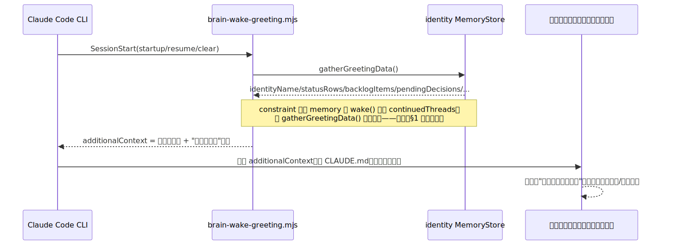
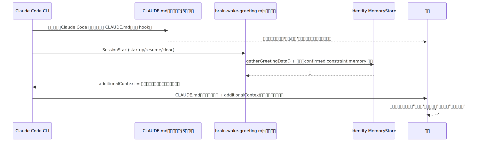
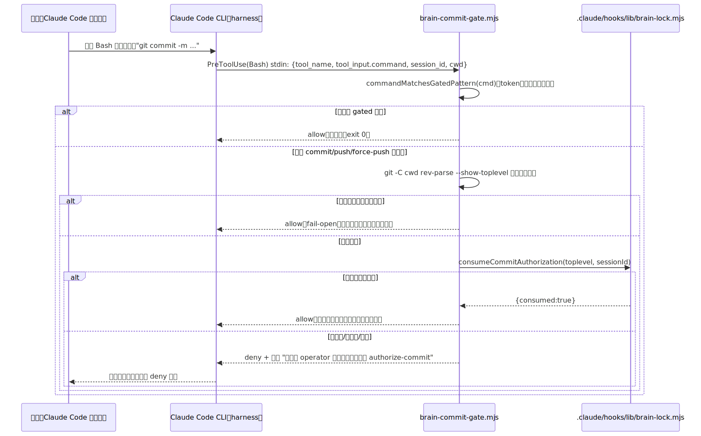

# TURNKEY-DESIGN — conductor-brain 落地打包：开箱即用公司大脑包

- **项目**: aeloop
- **关联**: issue #88（本设计所属，epic）；依赖 `DESIGN.md`（issue #75，三层架构权威——本设计**不重复**其架构论证，只讲"Layer3 怎么落地成一个可 drop 的包"）；起点是 #84（已合并，PR #85，醒来开场白 hook）+ #86/#89（`out/` gitignore，无关但同批）。
- **状态**: operator 已确认（2026-07-23）——§4 人格加载方案、§7 issue-gate 范围两处开放决策已拍板，焊进正文（见 §4/§6/§7 变更标注）
- **最后更新**: 2026-07-23
- **不写码**：本文档是大设计节点的产物，只出方案，不落地实现。

> 本文档只回答"turnkey 包怎么设计"，不写实现代码。所有对 aeloop 现有代码的引用都标了文件路径，写之前逐条读过源码（见 §9 依赖清单）；对 issue #88 body 和军师 prompt 里的结构性断言，本设计独立核实过，核实结果和纠正见 §1。

---

## 0. 总纲

### 问题是什么

#84 交付的东西（PR #85）在公司电脑实测（operator 已验）是 generic 的——不是因为渲染代码有 bug，而是因为两个更根本的原因：① 没配 `AELOOP_BRAIN_IDENTITY_DB` + 身份库没有种子数据；② 更关键的一条：**这套机制从设计上就只解决了"醒来说什么"，完全没有解决"这个会话本身有没有人格/铁律"**——`BRAIN.md` 自己在 §5 就写明"这次只做醒来出开场白"，`WAKE-GREETING-RUNBOOK.md` 也自己承认"aeloop 仓库本身没有 `CLAUDE.md`"。

本设计要解决的，是把这套东西从"一个 SessionStart hook + 一份讲醒来协议的文档"升级成一个**开箱即用的包**：往 aeloop 工作区（或未来任何项目工作区）里一放，打开 Claude Code 会话就是——

1. 有人格（直接、精准、有主见，不奉承）；
2. 说真话（防幻觉铁律真的在约束渲染，不是一句空话）；
3. 醒来记得上次做到哪（#84 已有，本设计延续）；
4. 红线动作被真机制拦住（commit/push 审批门、无 issue 不动手、`rm -rf`/`.env`/force-push 硬拦），不是"写在文档里希望模型自己记得"。

### 谁需要 / 触发点

- operator 已经用公司电脑实测过 #84 的产物，发现"看起来还是通用助手"——这是本 epic 的直接触发。
- issue #75/DESIGN.md 定的北极星是"brain 层要能对外卖、给公司自己的模型池套用"——turnkey 包是这条路径上第一个必须先做实的具体交付物，不然连"公司自己内部用起来"这一步都过不去。

### 现状（逐项核实，见 §1，不转述 issue body / 军师 prompt）

---

## 1. 现状核实：对军师 prompt 的对抗式核实结果

军师在派工 prompt 里给了一批结构性断言，要求我独立核实、发现错误当场纠正。逐条结果：

| 军师的断言 | 核实结果 | 证据 |
|---|---|---|
| "#84 hook 只注入开场白文本，不注入人格" | **确认，且比军师原判断更精确一层** | `.claude/hooks/brain-wake-greeting.mjs:45-51` 的 `emitAdditionalContext()` 只吐渲染好的开场白字符串；`render-greeting.mjs:36-54` 的 `renderGreeting()` 只读 `identityName/lastStop/statusRows/backlogItems/pendingDecisions/followUp` 六个字段，没有任何"铁律/人格"文本进入这段输出。**更精确的发现**：`wake.mjs:44-47` 的 `wake()` 确实会把 `type:"constraint"` 的 memory（`CORE_MEMORY_TYPES` 之一，`src/context/injector.ts:95-99`）读进 `continuedThreads`，**但 `greeting-data.mjs:117` 的 `gatherGreetingData()` 根本不消费 `wakeResult.continuedThreads`**（只用了 `wakeResult.pendingDecisions`，`greeting-data.mjs:167-168`）——也就是说，即便今天手动往身份库塞一条 `confirmed` 的 `constraint` memory，它会被 `wake()` 读到、但在从 `wake()` 到 `renderGreeting()` 的路上被整个丢弃，**永远不会出现在开场白文本里**。这不是"没有机制读宪法数据"，是"读了但渲染链路把它丢在半路"——这是本设计 §4 必须堵上的具体断点，不是空对空的架构讨论。 |
| "Helix 有 `session-commit-gate.mjs`/`session-issue-gate.mjs`/`session-isolation-guard.mjs` 三个现成 deny hook，可移植" | **`session-commit-gate.mjs`/`session-issue-gate.mjs` 确认，`session-isolation-guard.mjs` 需要纠正一处分类** | 前两个确实是 PreToolUse deny hook：命中条件时 stdout 吐 `{"hookSpecificOutput":{"hookEventName":"PreToolUse","permissionDecision":"deny",...}}`（`session-commit-gate.mjs:123-134`、`session-issue-gate.mjs:63-74`），这是 Claude Code 真识别的硬拦格式。**但 `session-isolation-guard.mjs` 不是 deny hook**——它挂在 `SessionStart`（`.claude/settings.json` 已核实），只会 `additionalContext` 注入一段告警文字，自己头注释原话"v1 只告警不硬拦"（`session-isolation-guard.mjs:11`）。issue #88 body 把"worktree 隔离"归进"能硬机制化（做成真 deny）"一类——**这个分类本身对 Helix 现有实现不准确，需要在这里纠正**：worktree 隔离今天在 Helix 自己的系统里也只是软警告，不是真 deny。移植到 aeloop 时，如果要让"worktree 隔离"真的变成硬拦，那是本设计要**新做**的东西，不是"移植一个已经硬的机制"。 |
| "新建 red-line 破坏性命令拦截（`rm -rf`/`.env`/force-push）" | **确认这块是 Helix 自己也没有的东西，不是"移植"，是从零设计** | `grep -rn "rm -rf\|\.env" .claude/hooks/*.mjs`（ai-agent 仓库）零命中真实拦截逻辑——命中的全是 `process.env.HELIX_SKIP_*` 这类变量名里带 `env` 三个字母的误报。Helix 自己的三个 PreToolUse hook（commit-gate/issue-gate/whoseworks-main-guard）管的分别是"commit/push 授权"“无 issue 不动手"“push 到别的项目 main 分支"，**没有一个管 `rm -rf`/写 `.env`/`git push --force`**。这块本设计只能借用 `commit-gate-match.mjs` 的**方法论**（token 化 + 命令位置解析，而非正则堆叠），不存在可直接抄的 Helix 代码。军师 prompt 原话已经用了"新建"这个词，没有说错，这里只是把"新建"落实成"确实没有蓝本可抄，需要从零设计判据"，避免实现阶段误以为存在一份现成文件可以复制。 |
| "evidence 红线（verified 当且仅当 tool_execution）是防幻觉的机制版" | **确认，且能给出精确行号** | `src/evidence/bundle.ts:206-207`：`function evidenceSourceFor(claim, toolExecChecked) { return claim.verifiedBy === "tool_execution" && toolExecChecked === "pass" ? "verified" : "model-reported"; }`——机械判断，不调模型，`passed` 字段永远不能靠"模型自己说 verified"就变成 `true`（`bundle.ts:305-317` 的 no-change 分支专门证明了这一点）。 |
| "aeloop 无 CLAUDE.md" | **确认** | `find . -iname "CLAUDE.md" -not -path "*/node_modules/*"` 零命中；`WAKE-GREETING-RUNBOOK.md:108` 自己也写"aeloop 仓库本身没有 `CLAUDE.md`（已核实）"。 |

**一个军师没提到、但核实中顺手发现、值得记录的事实**：aeloop 的 GitHub 仓库已经在用 `status:awaiting-commander`/`status:in-progress`/`status:prd-draft`/`status:awaiting-zorro` 四个 label（`gh label list --search status` 已核实），标签描述文字甚至直接写着"Cypher batch 执行中"“等 Zorro/Codex 审核"“等指挥官确认"——这是 aeloop 项目自己从 Helix/ai-agent 仓库整套照搬过来的 label 命名（人名都没换）。这本身是一个小的"去品牌"遗留问题（不在本 epic 范围内，只在这里如实记录，供 §9 明确不做清单参考），但对本设计是个**利好**：§2c 的一键 seed 脚本可以直接复用这套已经存在的 `status:*` label 体系去读"当前真实在途"，不需要发明新的状态源。

---

## 2. 图解总览

### 2.1 醒来时序：今天（#84 现状，人格缺口画出来）

**故意画出的缺口**：即便身份库配置完整、`AELOOP_BRAIN_IDENTITY_DB` 也设了，今天这条链路里**没有任何一步**告诉模型"你有铁律""你该怎么说话""commit 前要不要经过谁批准"。这正是 operator 在公司电脑上观察到"看起来还是通用助手"的根因，不是配置问题，是设计缺口。

### 2.2 醒来时序：本设计后（人格真正加载）

### 2.3 red-line 拦截时序（commit/push 审批门为例，其余 hook 同构）

---

## 3. 4 块交付物设计

### 3.a 去品牌公司宪法（`BRAIN.md` 升级版）

**现状**：`BRAIN.md`（122 行）目前只覆盖"我是谁 / 醒来协议 / 防幻觉铁律 / 身份库记录约定 / Phase1 诚实边界"五节——这五节质量很高（尤其防幻觉那节的三态区分、sanitize 红线，都是真实 Zorro/Codex 复审 blocker 修出来的），**但完全没有"人格"和"红线以外的行为铁律"这两节**——这正是 §1 核实发现的缺口在文档层面的对应物。

**设计**：不推翻现有五节，**新增两节**，插在"我是谁"和"醒来协议"之间：

1. **§1.5 人格**（新增，去品牌版本的 `CORE/CORE.md §⑤` + issue #88 body"共用内核"清单里的措辞）：
   - 直接、精准：不说模糊话，不确定的事标 `[?]`，不为了让对话顺畅而含糊其辞。
   - 有主见：觉得一个方向有问题就说，不因为"这是 operator 说的"就无脑执行；但决策权在 operator，分歧摆出来，不擅自改。
   - 不奉承：不为了讨好而夸大进度/简化风险；坏消息和好消息同等权重报告。
   - **不写**：Helix 的"生存使命"“双档位（工作档/陪伴档）”“companion 关系记忆"——这三样是 ai-agent 项目对 operator 这个具体人的私有关系设计，issue #88 body 已经明确列进"去掉"清单，本设计原样遵守，不移植。

2. **§1.6 铁律**（新增，🔒/👁 两档，对齐 `CORE/CORE.md §🔒👁` 的划分法但重新逐条核实能否在 aeloop 做到硬机制化——见 §5 完整表，这里只放精简版供 `CLAUDE.md`/`BRAIN.md` 引用）：
   - 🔒 commit/push 未经 operator 明确同意不执行（§3.b 机制）
   - 🔒 写代码前先绑 issue（§3.b 机制，范围见 §5 开放决议）
   - 🔒 `rm -rf`/写 `.env`/force-push 硬拦（§3.b 机制）
   - 🔒 防幻觉：`confidenceState !== "confirmed"` 的 memory 绝不当事实渲染（已有，`BRAIN.md` 现有 §3，本设计不改）
   - 👁 生产者≠审查者（若未来 aeloop 引入独立 reviewer 角色，需要另设计——Phase1 本设计不预设 aeloop 有这个角色分工，标注失效风险，见 §5）
   - 👁 犯错即复盘：postmortem 类型 memory 已经是 `MemoryType` 12 类之一（`src/context/types.ts:19-31`），但"复盘后怎么修改 constraint memory"这条闭环本设计不做（见 §7 不做清单）

**保留原样**（不动）：现有 §2 醒来协议、§3 防幻觉铁律、§4 身份库记录约定、§5 Phase1 诚实边界——这些是 #84 已经过 Zorro/Codex 两轮复审的成果，本设计只在 §4 追加一条新约定（见下）。

**§4 新增一条约定**（宪法约束怎么进身份库）：

| 概念 | Memory 表示方式 |
|---|---|
| 宪法约束（铁律） | `type: "constraint"`，`title` = `"constraint:<slug>"`（如 `constraint:commit-gate`），`content` = 人话描述，`tags` 含 `hardness:hard`（🔒）或 `hardness:soft`（👁）二选一，`confidenceState: "confirmed"`（宪法内容本身是 operator 已确认的，不是候选） |

这条约定是给 §3.c seed 脚本消费的——但**光把 constraint memory 写进身份库不解决 §1 发现的"读了但渲染链路丢弃"问题**，真正解决靠 §4（人格加载）的方案选择，这里只是先把"约定"钉死，具体谁来读这批 constraint memory 留给 §4 定。

### 3.b 强制 hook 套件

四个 hook，逐条设计 matcher / deny 判据 / fail-open 边界 / kill-switch。**移植策略**：`brain-commit-gate.mjs`/`brain-issue-gate.mjs` 结构性移植 Helix 对应文件（同款 PreToolUse deny JSON、同款 token 化命令匹配方法论）；`brain-red-line-guard.mjs` 从零设计（§1 已核实无蓝本）；`brain-isolation-guard.mjs` 保留 Helix 现有的"warn-only"定位（不夸大成 deny，纠正见 §1）。

| Hook | Matcher | Deny 判据 | Fail-open 边界 | Kill-switch |
|---|---|---|---|---|
| **`brain-commit-gate.mjs`** | `PreToolUse` / `Bash` | 命令命中 `git commit`/`git push`/`gh pr merge`/`git merge...main` 类模式（移植 `commit-gate-match.mjs` 的 token 化解析，非正则堆叠——原因见该文件头注释，本设计不重复论证） **且**目标仓库 = 本包所在仓库 **且**本会话无有效一次性授权令牌 | ① 非 Bash 工具 → allow；② 命令不命中 gated 模式 → allow；③ 目标不是本包所在仓库（`git -C cwd rev-parse --show-toplevel` 判定，与 `getOriginOwnerRepo()` 同款方法论）→ allow；④ 任意内部异常 → allow | `AELOOP_BRAIN_SKIP_COMMIT_GATE=1` |
| **`brain-issue-gate.mjs`** | `PreToolUse` / `Edit\|Write` | **operator 已确认（2026-07-23）：默认档位收窄，不是"移植即默认全拦"**——`AELOOP_BRAIN_ISSUE_GATE` 未设置或值不是 `enforce` → 整个 hook 恒 allow（不 deny、不警告，零摩擦，理由：aeloop 是单 operator 场景，operator 本人可信，Helix 那种多 agent 信任边界不成立，逐次强制绑 issue 是纯摩擦）；`AELOOP_BRAIN_ISSUE_GATE=enforce` → 判据同 Helix 原版："会话未绑定 issue"（用 §3.b 下方"精简移植"的 `brain-lock.mjs` 判定）→ deny。**能力做满、默认关闭**：这是 pitch 时展示"无 issue 不动手"硬拦的治理演示模式，日常开发默认不启用 | ① env 不是 `enforce` → 恒 allow（默认档，见上）；② 非 Edit/Write → allow；③ 非 git 目录 → allow；④ 已绑定合法 issue → allow；⑤ 异常 → allow | `AELOOP_BRAIN_SKIP_ISSUE_GATE=1`（enforce 模式下的应急放行，与"默认不 enforce"是两层不同的开关，前者是演示模式内部的例外阀，后者是默认档位本身） |
| **`brain-red-line-guard.mjs`**（新） | `PreToolUse` / `Bash` **和** `PreToolUse` / `Edit\|Write`（同一逻辑文件，两个 matcher 条目） | Bash 侧：命令位置解析出的命令是 `rm` 且参数含 `-rf`/`-fr`/`-r -f` 等价组合、目标路径不在一个显式允许的临时目录白名单内；或 `git push` 命令含 `--force`/`-f` 且不含 `--force-with-lease`；或命令是向 `.env`/`.env.*` 文件写入内容的重定向（`>`/`>>`/`tee`）。Edit/Write 侧：`tool_input.file_path` 命中 `.env`/`.env.*`（不含 `.env.example`） | 同 `brain-commit-gate.mjs` 的 fail-open 惯例；**额外**：白名单目录（如 `/tmp/**`、系统临时目录）内的 `rm -rf` 不拦——这是"不误伤正常操作"的具体落点（issue #88 body 开放问题 2），而不是空泛地说"要注意别误伤" | `AELOOP_BRAIN_SKIP_REDLINE_GUARD=1` |
| **`brain-isolation-guard.mjs`** | `SessionStart` | 不 deny，`additionalContext` 警告注入——同一 worktree 内检测到另一个活会话心跳锁 | 始终 `additionalContext` 注入 + exit 0，**不阻断会话**（正确移植 Helix 现有语义，不是升级成硬拦——纠正见 §1） | `AELOOP_BRAIN_SKIP_ISOLATION_GUARD=1` |

**关于 `brain-issue-gate.mjs` 的"精简移植"说明（诚实标注一个规模判断）**：Helix 的 `session-issue-gate.mjs` 依赖 `_engine/session-lock.mjs`（700+ 行），后者管的是"多个具名角色（cypher/zorro）在多个 worktree 并发工作"这套操作模型——这是 ai-agent 项目自己真实存在的多 agent 舰队场景。**aeloop 今天没有这套操作模型**（没有区分 cypher/zorro 角色的 env 约定，Phase1 是单 operator + 单会话的使用场景）。本设计**不建议照抄** `session-lock.mjs` 的完整复杂度，而是移植一个大幅精简的等价物（只留"一次性 commit 授权令牌"+"issue 绑定记录"两个语义，不带多角色/多 worktree 并发探测），命名为 `.claude/hooks/lib/brain-lock.mjs`——如果 aeloop 未来真的长出多 agent 编排（DESIGN.md §2.2 的外层调度 loop 落地后），再按需把并发语义补回来，不提前建。

**关于"无配置零副作用"的具体落点**（issue #88 body 开放问题 2）：这四个 hook 一旦通过 `.claude/settings.json` 注册，就对**这个仓库里 Claude Code 会话发起的工具调用**始终生效——不依赖 `AELOOP_BRAIN_IDENTITY_DB` 是否配置（红线拦截是仓库级卫生规则，不是 brain 身份库的功能）。"零副作用"指的是**这份 `.claude/settings.json` 提交进一个还没有配置 `AELOOP_BRAIN_IDENTITY_DB` 的 checkout 时不会报错/不会让会话卡住**（同 #84 现有惯例，`brain-wake-greeting.mjs` 未配置时安静跳过）。这四个 hook **只管 Claude Code 这个具体工具的 Bash/Edit/Write 调用**，operator 自己在终端手敲 `git commit` 完全不受影响——这是必须写清楚的边界，不是"什么都拦住"。

### 3.c 一键 seed 脚本

**设计**：`scripts/seed-brain-identity.mjs`（放 aeloop `scripts/` 目录，与现有 `scripts/demo-company.mjs`/`scripts/conductor-work.mjs` 同级），职责：

**输入**：两类，各自独立可运行（互不阻塞）：

1. **宪法约束**：脚本内置一份硬编码的 constraint 列表（`CONSTITUTION_CONSTRAINTS` 常量数组，每条 `{slug, content, hardness}`），**内容是 `BRAIN.md` §1.6 铁律清单的机器可读镜像**——这是一个必须诚实标注的设计取舍：`BRAIN.md`（人读散文）和这份常量数组（机器写 memory）是同一份铁律的两份独立表示，脚本不会自动从 `BRAIN.md` 解析生成（Phase1 不做 Markdown 解析器，成本不对），**这意味着两者会漂移**——`BRAIN.md` 改了铁律，脚本里的常量数组不会自动跟着改，需要人工同步，这是 §6 Trade-off 里要写清楚的残留风险，不是可以忽略的细节。
2. **当前真实在途**：脚本调 `gh issue list --repo <owner>/<repo> --state open --json number,title,labels`（复用 §1 发现的既有 `status:*` label 体系），按下表映射成 `active_task` memory：

   | GitHub label | `active_task` 的 `status:` tag |
   |---|---|
   | `status:in-progress` | `status:in-progress` |
   | `status:prd-draft` | `status:in-progress`（草拟本身是在推进，不是空转） |
   | `status:awaiting-zorro` | `status:blocked` |
   | `status:awaiting-commander` | `status:pending-decision` |
   | 无 `status:*` label 的 open issue | `status:todo` |

   `title` = issue 标题，`content` = `"#<n> — <body 前 200 字符（sanitize 过）>"`，`tags` = `["status:<映射值>", "gh-issue:<n>"]`（`gh-issue:<n>` 是本设计新增的**幂等 key**，见下）。

**幂等性**：`MemoryStore` 没有 upsert（`insertMemory()` 每次都新建一行，`src/context/store.ts:237`），脚本自己实现幂等：
1. `store.listMemories()` 拉全量，按 `tags` 里的 `gh-issue:<n>` 建一个 `Map<issueNumber, Memory>`。
2. 对每条要写的 issue：Map 里已存在 → 比对 `content`/`status tag` 是否变化，变了就用 `store.updateMemoryContent()` + 必要时新建一条 `insertConfirmation` 记录变更；没变就跳过（不产生无意义的重复写入）。不存在 → `insertMemory()` 新建。
3. Map 里有、但这次 `gh issue list` 没拉到（issue 已关闭/状态不再是"open"）的 → 不删除（`MemoryStore` 的哲学是"不静默丢弃"，`RecallError` 那条设计原则同理），而是打上 `archived` tag（复用 `BRAIN.md` §4 现有"已归档、不再显示的任务"约定），保留审计轨迹。
4. 宪法约束同理：`title` 是稳定的 `"constraint:<slug>"`，按 `title` 匹配做 upsert。

**幂等运行方式**：`node scripts/seed-brain-identity.mjs`（无参数，读 `AELOOP_BRAIN_IDENTITY_DB` 和 `git remote get-url origin` 自动推 owner/repo）——设计目标是 operator 在任何时间点重跑都安全、不产生垃圾数据，可以放进"日常习惯"甚至未来的 cron/hook 里（本设计不做自动定时，见 §7）。

### 3.d env setup 文档

**新增/扩展 `WAKE-GREETING-RUNBOOK.md`（已有文件，不新建一份）**，补两节：

1. **shell profile 正确姿势**：`WAKE-GREETING-RUNBOOK.md` 现有内容（`export AELOOP_BRAIN_IDENTITY_DB=...`）只讲了"在当前终端 session 里 export"，没讲"写进 `.zshrc`/`.bashrc` 让它对所有终端持久生效"——补充具体两行示例（`echo 'export AELOOP_BRAIN_IDENTITY_DB=...' >> ~/.zshrc`）+ 一句提醒："改完要开一个新终端窗口/`source ~/.zshrc`，已经开着的终端不会自动重新读"。
2. **IDE 启动读不到 env 的坑**：macOS 上从 Dock/Spotlight/IDE 图形界面启动的进程**不继承** shell profile 的 export（这是 macOS 本身的行为，不是 aeloop/Claude Code 的 bug）——只有从终端里敲命令启动的进程才会读到 `.zshrc` 里 export 的变量。两条修法：
   - **推荐**（更稳）：`launchctl setenv AELOOP_BRAIN_IDENTITY_DB "<绝对路径>"` 一次性对图形界面启动的所有进程生效（写进一次性 setup 脚本或文档提醒手动跑一次，重启后失效需要重新跑——诚实标注这个局限，不是"跑一次永久生效"）。
   - **备选**（本设计新增的机制，比纯文档提醒更可靠）：`brain-wake-greeting.mjs` 的 dbPath 解析加一层 fallback——`AELOOP_BRAIN_IDENTITY_DB` 环境变量优先，读不到时尝试读项目根目录下 `.claude/brain.local.json`（gitignore，每个 operator 自己机器上的本地配置，不进 git）里的 `identityDbPath` 字段。这样即便 IDE 启动的进程读不到 shell profile，只要这个本地 JSON 文件存在，hook 依然能找到 dbPath——**这是本设计对"env 配置只能靠自觉记得/靠文档提醒"这个软骨头给出的一个具体机制化改进**，不是仅仅把坑写进文档了事。

**排查清单**（新增小节）：
- `echo $AELOOP_BRAIN_IDENTITY_DB` 在当前终端里为空 → 没 export 或者开了新终端没 `source`。
- 终端里能读到，但 Claude Code 会话里开场白没出现 → 检查是不是从 IDE/图形界面启动的会话（走上面 IDE 坑那条）。
- 一切都配了，仍然没有开场白 → `node docs/conductor-brain-layer/spike/demo-wake-greeting.mjs` 本机验证（`WAKE-GREETING-RUNBOOK.md` 已有的路径），排除"hook 本身没触发" vs "触发了但数据是空的"两种可能。

---

## 4. 人格怎么真加载（关键开放问题）

§1 已经核实清楚问题的精确形状：`constraint` 类型的 memory 今天被 `wake()` 读到、但从未进入渲染输出。三个候选方案：

| 方案 | 做法 | 好处 | 代价 |
|---|---|---|---|
| **(i) 项目 `CLAUDE.md`** | 在 aeloop 根新建 `CLAUDE.md`，内容 = `BRAIN.md` §1（我是谁）+ §1.5（人格，新增）+ §1.6（铁律精简版，新增）的去品牌宪法正文——Claude Code **原生**在会话启动时读取项目 `CLAUDE.md` 并注入系统级上下文，不需要任何 hook | 最可靠：这是 Claude Code harness 自己的一等公民机制，不依赖模型"愿不愿意遵守一条注入的复述指令"；**全程有效**（不只是第一句话），系统提示词级别，比 SessionStart 注入的 `additionalContext` 权重更高更持久 | 静态文本——铁律变了要手动改这个文件；和 `BRAIN.md` 存在内容重叠，需要明确"谁是权威源、谁是引用"的关系（建议：`CLAUDE.md` 是精简的、面向模型的行为指令；`BRAIN.md` 是完整的、面向人读的设计说明，`CLAUDE.md` 结尾一行"完整设计见 `docs/conductor-brain-layer/BRAIN.md`"） |
| **(ii) hook 注入 constraint memories** | 延伸 `brain-wake-greeting.mjs`（或新增一个专门的 hook），每次 SessionStart 把身份库里 `confirmed` 的 `constraint` memory 渲染成一段文字，塞进 `additionalContext` | 动态：铁律改了只要更新身份库（走 seed 脚本或三态确认），不用改代码/文件；和"醒来"这个概念本身是同一条数据管线，天然一致 | **可靠性低于 (i)**：`additionalContext` 依赖模型"读了这段注入、并且愿意在后续行为里遵守它"，SessionStart 只在会话开始时触发一次——长对话里模型有没有持续遵守，没有机制复核（`DESIGN.md` §0.5 图1 自己也承认这是"故意画出的缺口"，本设计不假装能解决）；constraint memory 的 `content` 字段是自由文本，塞进 `additionalContext` 前必须过 `sanitize.mjs` 的 `sanitizeText()`（同 #84 已有红线，否则重蹈"一条 memory 伪装成多条"的老 bug） |
| **(iii) 两者结合** | `CLAUDE.md`（i）承载**静态**的身份/人格/铁律主体；SessionStart hook（延伸 #84 已有的，不新增一个）继续只做**动态**的"在途/待办/decisions"，**外加**一小段"若身份库里有 unconfirmed 的新 constraint（可能是 postmortem 后新提的修宪建议），在待你决策里点名"——不是把全部 constraint 都动态注入一遍（那是方案 ii 的重复劳动），只把"还没定案、需要 operator 表态"的 constraint 变更放进已有的 pendingDecisions 管线（`greeting-data.mjs:167-177` 已有的结构，直接扩展，不新建一条平行逻辑） | 静态部分吃到 (i) 的可靠性，动态部分保留"宪法可以通过身份库演化"这个 (ii) 的核心价值，且**复用**已有的 pendingDecisions 渲染管线而不是新增一条 | 需要维护"`CLAUDE.md` 和 `constraint` memory 谁是权威源"的边界——设计约定：`CLAUDE.md` 是**已确认**铁律的正本；身份库里 `unconfirmed` 的 `constraint` memory 是**候选修宪项**，被 operator 确认后才应该被人工誊写进 `CLAUDE.md`（本设计不做"自动把 confirmed constraint 拼回 CLAUDE.md 文件"这种自动生成，Phase1 范围内这一步仍是人工，见 §7） |

**operator 已确认（2026-07-23）：方案 (iii)**，本设计推荐的方案，operator 采纳，焊死为最终决议。理由：(i) 单独用，铁律"能通过身份库动态演化"这条 issue #88 body 隐含的价值（宪法内核和 Verity/Helix 同源、允许犯错后修宪）就没了着落；(ii) 单独用，可靠性明显弱于系统提示词级别的注入，且 issue #88 body 自己也把"机制强制是硬要求"列为定盘决策，"人格靠一条会话开始时的提醒"这件事本身就不算真正的机制化。(iii) 的具体分工——`CLAUDE.md` 管定案的静态部分、hook 管待决策的动态部分——是最终落地形态。

**§4(iii) 落地时的一个重要核实（写 PRD 前必须先确认，直接影响任务量）**：动态部分（"若身份库里有 unconfirmed 的新 constraint，在待你决策里点名"）**不需要新代码**——重新核实 `wake.mjs:44-61` 发现：`wake()` 的 `continuedThreads` 本来就是 `CORE_MEMORY_TYPES`（`identity`/`constraint`/`decision`）全量 + FTS5 命中的并集，`pendingDecisions = continuedThreads.filter(confidenceState === "unconfirmed")`（`wake.mjs:61`）；`greeting-data.mjs:167-170` 已经把 `wakeResult.pendingDecisions` 原样并入渲染用的 `pendingDecisions` 数组（`label: "[${memory.type}] ${memory.title} — ${memory.content}"`）。也就是说，**一条 `unconfirmed` 的 `constraint` memory 今天就已经会出现在"待你决策"段**——这条管线从 #84 起就是通的，本设计 §1 发现的"死路"只存在于 `confirmed` constraint（`gatherGreetingData()` 不消费 `continuedThreads`，只消费 `pendingDecisions`）。这意味着方案 (iii) 真正的新增工作只有：① 新建 `CLAUDE.md`（静态部分，见下）；② `greeting-data.mjs` 的 pendingDecisions label 对 `constraint` 类型可选地换一个更可读的措辞（如"候选修宪：<content>"而非通用的 `[constraint] title — content"`）——这是锦上添花，不是打通闭环的必要条件，PRD 里按 P2/可选处理，不阻塞主线。

---

## 5. 机制 vs 自觉：诚实划线表（issue #88 body 要求，CORE 铁律7 精神）

| 铁律条款 | 🔒能硬机制化 / 👁只能软 | 依据 | 失效风险（若👁，必须写） |
|---|---|---|---|
| commit/push 审批门 | 🔒 | `brain-commit-gate.mjs`（§3.b）PreToolUse deny，真拦截 | **两条已知局限，缺一不完整**（Zorro 2026-07-23 复审 finding-3：此前这里只写了第①条，漏了源文件本身记入风险清单的第②条，本次补齐，不是新发现，是移植时漏披露）：① 只挡 Bash 里 token 化能解析的命令位置，绕不过变量拼接/`eval`（同 Helix `session-commit-gate.mjs` 已知局限①，逻辑完全一致）；② **只用 `cwd` 判定目标仓库，不解析命令文本里的 `-C`/`--git-dir=` 参数**——从仓库外用 `cd /path/to/aeloop && git commit`、`git -C /path/to/aeloop commit`、`gh -R owner/aeloop pr merge` 把目标重定向回 aeloop，本 gate 会因为 `cwd` toplevel 不是 aeloop 而直接 allow，是**真正的绕过路径**（精确对应源文件 `session-commit-gate.mjs:57-61` finding-3）。**两条都是和 ai-agent 生产基线完全相同的、已接受的软门局限，不是本设计引入的新缺陷，也不在本次修复范围**——`brain-commit-gate.mjs` 头注释已同步补齐这两条披露 |
| 无 issue 不动手 | 🔒（**operator 已确认：能力保留真 deny，但默认档位关闭**，见 §3.b/§7） | `brain-issue-gate.mjs`（§3.b），`enforce` 模式下机制与 Helix 一致 | 只挡 Edit/Write，不挡 Bash 里 `cat >> file`/`sed -i` 类绕过（同 Helix `session-issue-gate.mjs` 已知局限，逻辑一致）；**新增一条**：默认档位关闭意味着"无 issue 不动手"这条铁律在日常模式下**完全不生效**，只有 operator 主动切到 `enforce` 才生效——这不是"机制没做到"，是 operator 主动选择的产品档位，如实标注这条边界，不要在 `CLAUDE.md`/`BRAIN.md` 里把这条铁律写得像默认就在生效 |
| `rm -rf`/`.env`/force-push 硬拦 | 🔒 | `brain-red-line-guard.mjs`（§3.b，新设计） | 命令混淆同上；`.env` 侧只挡通过 Bash 重定向或 Edit/Write 工具的写入，挡不住模型用其他工具间接达成（如通过一个自定义脚本文件写 `.env`，脚本本身不叫 `.env` 这个名字） |
| worktree 隔离 | 👁（纠正 issue body 分类，见 §1） | `brain-isolation-guard.mjs` 只是 SessionStart 警告注入 | 高负载/心急时模型或 operator 都可能无视警告继续操作；真正做成硬拦（比如检测到并发会话就 deny 所有写操作）Phase1 不做——代价是"防止两个会话互相踩脚"这件事没有真正的安全网，只有提醒 |
| 醒来注入 | 🔒（#84 已建，本设计延伸） | `brain-wake-greeting.mjs` SessionStart 强制触发，内容来自渲染器而非模型自由发挥（`render-greeting.mjs` 头注释原话） | 无（这是少数几个"渲染器拼数据，模型只负责复述"的场景，机制边界清楚——但"模型是否真的原样复述"本身仍依赖模型服从那条注入指令，这条局限继承自 #84，不是本设计引入的新风险） |
| 防幻觉输出习惯（`[?]` 标注/不编造） | 👁 | 无对应 hook——`confidenceState !== "confirmed"` 不渲染是**数据层**的机制（`BRAIN.md` §3 已有），但"模型在自己的自然语言输出里是否额外编造了身份库之外的内容"没有任何机制能检测 | 结构性风险：长对话/高负载下，靠模型自己记得"不要编造"这件事，可靠性会下降——这是 aeloop 自己 `LiteLLMAdapter` 的 `ModelAdapter.invoke()` 无状态单次调用（`src/harness/types.ts:24-52`）架构决定的：没有一个独立于模型自身输出的机制去比对"这句话是不是编的"。唯一的机制化替代是 evidence 红线（`bundle.ts:206-207`，见 §1），但那是 Layer2 任务执行场景的证据分级，不能覆盖 brain 层日常对话里的每一句话——这条差距是结构性的，本设计不假装能补上 |
| 生产者≠审查者分工 | 👁 | 无对应机制——aeloop 今天没有 Helix 那种"Cypher 写、Zorro 独立审"的角色框架（本设计 §3.b 已明确说明不预设这个角色分工） | 若 aeloop 未来真的引入多 agent 编排（DESIGN.md §2.2 外层调度 loop），"生产者是否真的不能自审自批"这件事，除非引入类似"两个不同 API key / 不同进程身份，A 的输出必须由 B 的进程签字才能落地"这种硬隔离，否则永远是流程约定而非机制——这正是 Helix 自己虽然把它标 🔒 但实际靠的也是"分开派工 + HANDOFF 交接"这套人工流程习惯，不是代码级隔离，本设计如实继承同样的软肋，不夸大 |

---

## 6. Trade-off

- **`CLAUDE.md` vs `BRAIN.md` 内容重叠**：§4 推荐方案要求维护两份部分重叠的文档（一份给模型系统提示词吃，一份给人读+存档设计决策），漂移风险真实存在——缓解手段是约定`CLAUDE.md` 只写"精简、面向行为的指令"，完整论证/历史决策留在 `BRAIN.md`，两者不是简单复制粘贴关系。
- **seed 脚本的宪法常量数组 vs `BRAIN.md` 散文**：§3.c 已经写明这是两份独立表示，会漂移，需要人工同步——本设计认为这个代价可接受（宪法内容变化频率低），但如实标注，不假装有自动同步。
- **`brain-issue-gate.mjs` 的范围（operator 已确认，2026-07-23）**：不移植 Helix 的 `HELIX_ROLE` 白名单机制（aeloop 没有角色框架，§3.b 已排除），改用更简单的**档位开关**——默认（未设 `AELOOP_BRAIN_ISSUE_GATE` 或非 `enforce` 值）恒 allow，`AELOOP_BRAIN_ISSUE_GATE=enforce` 才启用真 deny。理由：operator 本人在单 operator 场景下是可信的，逐次强制绑 issue 对探索性小改动是纯摩擦，没有 Helix 那种"防止某个角色绕开流程"的多 agent 信任边界 rationale；但**能力必须做满**（真 deny，不是只做 warn 停在半成品），因为 pitch 时需要演示"治理能真拦"这个卖点——用 env 开关承担"平时不摩擦、演示时能拦"两个互斥需求，不需要新增第三档（"warn-only"中间态被评估后放弃，理由是两态已经覆盖"演示 vs 日常"这个唯一真实场景，三态徒增复杂度无实际收益）。
- **`brain-red-line-guard.mjs` 的白名单维护成本**：`rm -rf` 允许在临时目录执行，这个白名单需要随实际使用场景增补（比如未来 `out/` 目录下的批量清理算不算"正常操作"，需要具体使用中观察）——Phase1 先给一个保守的最小白名单（仅系统临时目录），过窄导致的误拦比过宽导致的漏拦更安全，符合红线"宁可误伤不可放过"的方向。
- **性能**：四个 PreToolUse hook 都是同步子进程调用（`git rev-parse` 等），每次 Bash/Edit/Write 工具调用增加的延迟未量化（`[?]`，需要实测）——同 Helix 现有四个 hook 的既有代价量级，不是本设计引入的新增开销类型，只是多了一个仓库在承担。

---

## 7. 开放问题决议

1. **包 drop 进 aeloop 的 `.claude/` 还是可移植 overlay？** 推荐：**先按 drop-in 方式落在 aeloop 自己的 `.claude/`+`docs/conductor-brain-layer/`+`scripts/`**（延续 #84 已有先例，零新增打包抽象），但所有新文件保持"自包含、不硬编码 aeloop 特有绝对路径"（相对 `import.meta.url` 定位，同 #84 `brain-wake-greeting.mjs` 已有写法）——这样即便 Phase1 不做正式的 overlay 打包机制，未来要复制到别的项目时，物理上也只是"复制这几个目录"，不需要重构。真正的"可安装 overlay 模板"（比如一个 `npx create-brain` 之类的东西）**本设计不做**，留给 issue #75 北极星兑现时的独立设计（见 §9）。
2. **hook fail-open/fail-closed 边界**：已在 §3.b 表格逐个 hook 写明——commit-gate/issue-gate/red-line-guard 对"命中判据"fail-closed（deny），对"判定不出目标/工具不匹配/内部异常"fail-open（allow），isolation-guard 全程只警告不拦截。这条不是开放问题，是本设计已给出的具体决议，在此汇总确认。
3. **seed 脚本的宪法约束怎么被行为/开场白用到**（**operator 已确认 = 方案 (iii)**，见 §4）：confirmed constraint 走 `CLAUDE.md`（人工维护，seed 脚本只负责把它们也写进身份库供审计/未来演化用，不负责渲染进开场白），unconfirmed constraint 走已有的 pendingDecisions 管线（§4 已核实：这条管线 `wake.mjs`/`greeting-data.mjs` 今天就是通的，零新代码）。
4. **`brain-issue-gate.mjs` 是否区分角色 / 全量拦截 Edit\|Write**（**operator 已确认（2026-07-23）= opt-in 档位开关，默认关闭、`enforce` 模式真 deny**，见 §3.b/§6，不移植 Helix 的角色白名单机制，改用更简单的二态 env 开关）。

---

## 8. 明确不做清单

- **不在本设计里选定"是否给 aeloop 增加多角色（cypher/zorro 等价物）编排框架"**——`brain-issue-gate.mjs`/生产者≠审查者的机制局限都依赖这个前提，Phase1 本设计假设 aeloop 是单 operator 场景。
- **不做 `CLAUDE.md`/身份库 constraint memory 之间的自动同步**（§4 方案 iii 的已知代价）——confirmed constraint 从身份库"誊写"回 `CLAUDE.md` 是人工步骤，不做自动生成脚本。
- **不做正式的可安装 overlay/模板打包机制**（§7 开放问题 1）——只保证新文件"物理上可复制"，不做打包 CLI。
- **不做"意图 → TaskContract → 执行 → 折回"完整闭环的机制强化**——那是 `DESIGN.md` §2.2 外层调度 loop 的范围，本设计只覆盖"醒来 + 红线拦截 + 身份库种子"这一层，不重复 `DESIGN.md` 已经论证过的 Phase1/Phase2 边界（DESIGN.md §7）。
- **不重新设计 `MemoryStore`/三态确认/FTS5 检索**——完全复用 #84 已经在用的既有能力，本设计不碰 `src/context/**` 一行代码（同 `WAKE-GREETING-RUNBOOK.md` 现有"项目自身约束"承诺）。
- **不解决"命令混淆绕过 hook"这类根本性局限**——§5 已逐条如实标注，这是 Claude Code hook 机制本身（纯文本模式匹配）的天花板，不是本设计能在这一层解决的问题。
- **不量化 hook 带来的延迟**——§6 已标 `[?]`，需要实现阶段实测，不在设计阶段假设一个数字。

---

## 9. Vertical-slice spike 定义

**目标**：验证"drop 进一个干净 checkout 后，一条命令跑通"这个 turnkey 承诺本身，而不是逐个验证四块交付物的每个细节（那是实现阶段 + Zorro 复审的事）。

**闭环步骤**：

1. 全新 clone 一份 aeloop（或全新 worktree），**不带**任何预先配置的 `AELOOP_BRAIN_IDENTITY_DB`。
2. 跑 env setup 文档（§3.d）里的最短路径：export 环境变量 + （若走方案 iii）确认 `CLAUDE.md` 已经在仓库里（不需要 operator 再手写）。
3. 跑一次 `node scripts/seed-brain-identity.mjs`（§3.c）——验证：宪法常量数组全部成功写入/upsert；`gh issue list` 拉到的真实在途任务被正确映射进 `active_task` memory（§3.c 映射表）。
4. 开一个新 Claude Code 会话：验证开场白里"意识已加载。我是你的 AI 调度员"+ 真实在途任务表格出现（复用 #84 已有验证方式，`demo-wake-greeting.mjs` 同款 diff 比对逻辑，扩展到覆盖新增字段）。
5. 故意在这个会话里发起一个 `git commit`（无预先授权）：验证 `brain-commit-gate.mjs` 真的 deny，不是靠模型自己记得不该 commit。
6. 故意发起一个 `rm -rf /tmp/some-scratch-dir`（白名单内）和一个 `rm -rf src/`（白名单外）：验证前者 allow、后者 deny——证明 §3.b 表格里"不误伤正常操作"这条不是空话。
7. 观察模型在**没有被明确问起"你是谁"**的情况下，一段较长对话（比如 10 轮以上）之后的语气/行为，是否仍然带着 §3.a 定义的人格特征（直接/精准/不奉承）——这一步**不是**一个可以自动化判定 pass/fail 的机制检查（§5 已标注这条是 👁 结构性软肋），只能是人工主观评估，**如实标注这一步验证的局限，不假装能写出一个自动化断言**。

**验证通过的标准**：步骤 3-6 全部机制层面可自动验证（PASS/FAIL 明确）；步骤 7 是人工主观判断，作为"turnkey 承诺是否真的兑现"的最后一道感受性检查，不纳入自动化验收标准。这条闭环第一次把"人格加载"“红线拦截"“身份库种子"三块从各自独立的交付物，串进同一次真实的"新开一个会话"体验里——这正是 operator 在公司电脑上原本想看到、但 #84 没做到的东西。

---

## 附：本设计依赖的既有文件一览（供实现阶段直接引用，均已逐条读过源码）

| 文件 | 用途 |
|---|---|
| `docs/conductor-brain-layer/DESIGN.md` | 三层架构权威，issue #75，本设计不重复其论证 |
| `docs/conductor-brain-layer/BRAIN.md` | 现有去品牌宪法（醒来协议部分），本设计 §3.a 在此基础上扩展 |
| `docs/conductor-brain-layer/WAKE-GREETING-RUNBOOK.md` | #84 现有配置说明，本设计 §3.d 在此基础上扩展 |
| `.claude/hooks/brain-wake-greeting.mjs` | #84 现有 SessionStart hook，§4 方案(iii)会延伸它 |
| `docs/conductor-brain-layer/spike/lib/{wake,greeting-data,render-greeting,status-table,sanitize}.mjs` | #84 现有渲染管线，§1 核实其数据流向的关键依据 |
| `.claude/settings.json`（aeloop） | 现有 hook 注册方式，§3.b 新 hook 会追加进这份文件 |
| `src/context/types.ts` | `MemoryType`/`ConfidenceState` 定义，12 类枚举 + 三态确认 |
| `src/context/store.ts` | `MemoryStore`/`insertMemory`/`updateMemoryContent` 等 API，§3.c 幂等设计依据 |
| `src/context/injector.ts:95-99` | `CORE_MEMORY_TYPES = {identity, constraint, decision}`，§1 核实关键依据 |
| `src/evidence/bundle.ts:206-207` | `evidenceSourceFor()`，evidence 红线机制的精确行号来源 |
| `.claude/hooks/session-commit-gate.mjs`（ai-agent 仓库） | commit/push 审批门移植蓝本 |
| `.claude/hooks/session-issue-gate.mjs`（ai-agent 仓库） | 无 issue 不动手移植蓝本 |
| `.claude/hooks/session-isolation-guard.mjs`（ai-agent 仓库） | worktree 隔离移植蓝本（§1 纠正其实际定位为 warn-only） |
| `_engine/session-lock.mjs`（ai-agent 仓库） | `authorizeCommit`/`consumeCommitAuthorization`/`resolveSessionId` 精简移植依据 |
| `_engine/commit-gate-match.mjs`（ai-agent 仓库） | token 化命令匹配方法论移植依据 |
| `_engine/gh.mjs:147-163`（ai-agent 仓库） | `getOriginOwnerRepo()`，目标仓库判定方法论移植依据 |
| `CORE/CORE.md`（ai-agent 仓库） | 🔒/👁 划分法参考（§5 采用同款分类法但逐条重新核实 aeloop 场景） |
