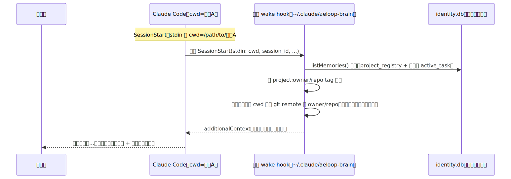
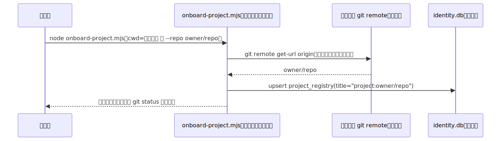

# DESIGN — conductor-brain 多项目地基（架构认路 Y，片①）

- **项目**: aeloop
- **关联**: issue #93（本设计所属，epic）；架构上延续 issue #75（conductor-brain 层，`docs/conductor-brain-layer/DESIGN.md`）、#84（醒来开场白）、#88（turnkey 包，`docs/conductor-brain-layer/TURNKEY-DESIGN.md`）——**本设计不重复这三份文档已经论证过的内容**（`MemoryStore`/三态确认/FTS5 检索/护城河论证/机制 vs 自觉划线表），只讲 #93 独有的"从单项目变多项目"这一层要新增/要修正什么。
- **状态**: 待指挥官确认
- **最后更新**: 2026-07-23

> 本文档只回答"多项目大脑地基怎么设计"，不写实现代码。所有对 aeloop 现有代码的引用都标了文件路径，写之前逐条读过源码——三个硬点（安装机制/MemoryStore 依赖/project-scope 数据模型）已经**实测核实**，不是转述军师的倾向解——§1 每个方案对比表都标注了具体的验证方式（本机真实观测 / 源码核对 / 官方文档），拍脑袋的地方一律标 `[?]`。

---

## 0. 总纲（需求）

### 问题是什么

issue #93 body 已定盘（架构认路 Y）：一个大脑 + N 个项目，全程带人格。在任意真实项目里开 Claude Code → 醒成"调度员"（conductor）→ 看到该项目在途 + 能调起 aeloop 引擎做治理编码。三层：①人格/开场白（✅ 已建，见下）②conductor=Claude Code 壳本身 ③引擎=aeloop governed coder/tester。

**🔒 第一原则硬约束（issue #93 body 原话）**：onboard 进每个项目的 brain 层绝不进 project repo、不提交、只在本地。

### 现状（逐项核实，不转述）

**issue #75/#84/#88 已经把"单项目"这层做完、且做得比 #93 body 描述的更细**——这是本设计动笔前第一件要如实说清楚的事，不能假装从零开始：

- `docs/conductor-brain-layer/DESIGN.md`（#75，447 行）已经把三层架构（Brain/Glue/Layer1/Layer2）、`TaskContract`/`EvidenceBundle` 边界契约、身份 DB scope（brain 自己开一个独立 `MemoryStore(dbPath)` 实例，不与任何 Layer2 profile 的 `memory.db` 混用）、Phase1/Phase2 边界（Phase1 = 复用 Claude Code CLI 的 hook 生命周期，换模型不换壳；Phase2 = aeloop 自建运行时替代 Claude Code CLI）全部定盘并**已经实现**（`.claude/hooks/brain-wake-greeting.mjs`、`scripts/seed-brain-identity.mjs`、`docs/conductor-brain-layer/spike/lib/*.mjs` 均为真实存在的代码，非规划稿）。
- `docs/conductor-brain-layer/TURNKEY-DESIGN.md`（#88，1000+ 行）已经把强制 hook 套件（`brain-commit-gate.mjs`/`brain-issue-gate.mjs`/`brain-red-line-guard.mjs`/`brain-isolation-guard.mjs`）、宪法怎么真加载（`CLAUDE.md` 静态正本 + hook 动态候选的方案 iii）、一键 seed 脚本（`scripts/seed-brain-identity.mjs`，issue→active_task 映射）全部落地，`.claude/settings.json` 已经把四个 hook 注册进**这个仓库自己的** SessionStart/PreToolUse 生命周期。
- **但今天这一整套东西，物理上 100% 绑定在 aeloop 自己的 checkout 里**——`.claude/settings.json` 是 aeloop 仓库自己提交的项目级配置（`git log --oneline -1 -- .claude/settings.json` 核实为 `75cf2a9`，已提交），hook 脚本用 `${CLAUDE_PROJECT_DIR}` 相对定位，`brain-wake-greeting.mjs` 内部用 `path.join(HERE, "..", "..", "docs", "conductor-brain-layer", "spike", "lib")` 相对 aeloop 仓库自己的目录结构定位 `wake.mjs`/`greeting-data.mjs`（`.claude/hooks/brain-wake-greeting.mjs:50`，已读源码）。**这套东西今天只能在 aeloop 自己的 checkout 里跑，换到任何其它项目目录（如 whoseorder）打开 Claude Code，这些 hook 根本不会被注册、不会触发**——TURNKEY-DESIGN.md §7 开放问题 1 自己也已经诚实标注过这一点："真正的'可安装 overlay 模板'……本设计不做，留给 issue #75 北极星兑现时的独立设计"。**#93 正是这个被明确留白的下一步**，不是重新发明。
- `MemoryType` 的 12 类封闭枚举里已经有一个 `"project_registry"` 类型（`src/context/types.ts:31`），但**全代码库零处消费**——`grep -rn "project_registry"` 命中的只有类型声明本身、`injector.ts:56` 里给它一个默认 `"general"` 优先级、以及三份设计文档里"以后可能要重新评估要不要归进核心集合"的一句话，**没有任何 `insertMemory({type: "project_registry", ...})` 的真实调用点**。这是一个**已经预留、从未使用**的类型槽位——多项目场景下"一个项目的注册记录"这个概念，天然应该落在这个槽位上，不需要扩 schema。

### 谁需要 / 触发点

指挥官的 pitch 需要"一个大脑管全公司项目"这个产品形态本身可演示；今天的实现只能在 aeloop 自己的 checkout 里醒来，不能在真实客户项目（whoseorder/whosehere 这类）里醒来，这是 #93 body 明确点名的差距。

---

## 0.5 图解总览

### 架构总览：全局装一次，N 个项目零污染

**图例说明**：`HOME` 子图内的一切都是本设计新建的（今天不存在）；`P1`/`P2` 里"零污染"这句是本设计要用物理机制（不是靠自觉）保证的核心承诺，验证方式见 §1.1。

### 关键流程时序图 1：多项目醒来

**故意画出的缺口**：`HOOK->>HOOK` 那两步"按 tag 分组"/"当前项目置顶"是本设计**要新建**的逻辑，今天 `status-table.mjs`/`greeting-data.mjs` 完全没有项目维度（§1.3 详述），图里画出来是因为这是本设计新增的行为，不是已有代码。

### 关键流程时序图 2：onboard 项目（零文件落地）

---

## 1. 方案对比

### 1.1 硬点1：安装形态——全局 `~/.claude/` vs 项目本地 gitignored vs 混合

**核实方式**：本机真实观测（不是查文档猜测）+ 官方文档交叉验证（`claude-code-guide` agent 独立核查，`docs.claude.com/en/hooks.md`/`settings.md`/`memory.md`）。

**关键实测证据（本机，2026-07-23，真实数据，非构造）**：

1. 我自己机器的 `~/.claude/settings.json` 里，`hooks.SessionStart`/`hooks.SessionEnd` 已经注册了一套第三方 hook（`tmux-assistant-resurrect`），**不是本设计安装的**，纯粹是我机器上已经在用的另一个工具——这本身就是"全局 hook 确实在跑"的活证据，不是假设。
2. 该 hook 的状态文件（`${TMPDIR}/tmux-assistant-resurrect/claude-*.json`）里，`cwd` 字段被真实、完整地记录了下来——抓取本机当前 10 个活跃状态文件，`cwd` 字段分别是 `/Users/elishawong/code/github/elishawong/ai-agent`（4 条）和 `/Users/elishawong/code/github/elishawong/aeloop`（6 条），**同一个全局 hook，在两个完全不同的项目目录里各自触发、各自拿到正确的 `cwd`**——这就是 #93 body 要的"全局装一次、按 cwd 判当前项目"的直接实证，不是理论推演。
3. 该 hook 脚本自己的头注释（`~/.tmux/plugins/tmux-assistant-resurrect/hooks/claude-session-track.sh:3-11`）写明"Receives JSON on stdin with `session_id`, `cwd`, `model`, `source`, `permission_mode`, `transcript_path`, `hook_event_name`……Install: add to `~/.claude/settings.json` under `hooks.SessionStart`"——第三方工具自己的安装文档就是"装进 `~/.claude/settings.json`"，进一步印证这是 Claude Code 官方支持、被广泛使用的模式，不是边缘用法。

**官方文档交叉验证结果**（`claude-code-guide` agent 独立核查）：
- `~/.claude/settings.json`（user 级）/ `<project>/.claude/settings.json`（project 级，通常提交）/ `<project>/.claude/settings.local.json`（project-local，通常 gitignore）三级 scope，`docs.claude.com/en/settings.md` 有官方表格确认，优先级 managed > CLI 参数 > local > project > user。
- `docs.claude.com/en/hooks.md` 的 hook 位置表明确写"`~/.claude/settings.json` | **All projects** | No"——文档原文直接确认全局生效。
- `$CLAUDE_PROJECT_DIR` 环境变量、stdin JSON 的 `cwd` 字段，均有官方文档记录。
- **文档留了一个真实的不确定点**：project 级 `.claude/settings.json`/`settings.local.json` 需要过一次"workspace trust dialog"才生效（`memory.md` 原文），但文档没有明确说 **user 级** `~/.claude/settings.json` 的 hooks 是否也要过这个门——**这一点本机实测已经替代性回答**：我机器上的全局 hook 完全没有经过任何肉眼可见的信任弹窗，在 ai-agent/aeloop 两个项目里都是静默生效的，这是比文档更强的证据（真实生产使用数据，非单次 demo）。

**方案对比**：

| 方案 | 好处 | 代价 | 结论 |
|---|---|---|---|
| **方案 A（选中）：全局 `~/.claude/` 固定安装目录 + 全局 `settings.json` 追加注册 hooks** | 装一次全项目生效（已实测确认）；对"零文件进 project repo"是**物理保证**——onboard 流程从不写任何文件到目标项目的 `.claude/` 下，git status 干净不依赖"目标项目恰好已经 gitignore 了某个路径"这种运气 | 需要一个新的、和 aeloop 仓库解耦的固定安装位置 + 一个不能破坏性覆写用户已有全局 hooks 的合并安装脚本（见 §2 Trade-off） | 选中——是唯一能不靠"祈祷目标项目的 `.gitignore` 恰好覆盖某个路径"就物理满足 #93 第一原则的方案 |
| 方案 B：项目本地、但 gitignored（延续 #75/#88 现有 `.claude/brain.local.json` 模式，每个项目各配一份） | 复用现有代码零改动；`db-path.mjs` 的 fallback 逻辑（`env 优先 → <cwd>/.claude/brain.local.json`）已经写好、已经在跑 | **这正是"军师倾向解"里最容易被想当然复用、但实测发现站不住的一环**：`.claude/settings.local.json`/`brain.local.json` 要真的"零污染"，必须依赖目标项目自己的 `.gitignore` 已经覆盖这个路径——`aeloop` 自己的 `.gitignore` 确实覆盖了（`.gitignore:30`，已核实），因为这是 aeloop 团队自己加的；但一个任意的真实第三方项目（whoseorder/whosehere）大概率**没有**在自己的 `.gitignore` 里预先写好 `.claude/brain.local.json` 这条规则——如果 onboard 流程往目标项目 `.claude/` 下写这个文件，`git status` 会把它显示成一个未追踪文件，**直接违反 issue #93 body 的第一原则验收标准**（"git status 干净"）。这不是"理论上可能"，是本设计核实 `.gitignore` 后发现的具体矛盾点 | 不选：对 aeloop 自己的 checkout 成立（因为 aeloop 自己的 `.gitignore` 已经覆盖），但**不能直接套用到任意被 onboard 的第三方项目**——这是一处"现有单项目机制不能直接照搬"的具体技术点，需要写清楚，不能让读者以为 #75/#88 的现成方案原样复用即可 |
| 方案 C：混合（全局装 hook 本体，但 dbPath 配置走项目本地文件） | 兼顾"hook 只装一次"和"dbPath 可以按项目覆盖" | 目标项目里仍然要放一个配置文件（哪怕只是一个 dbPath 指针），同样撞上方案 B 的 `.gitignore` 依赖问题；而且"按项目覆盖 dbPath"这件事本身也不是 #93 想要的——#93 要的是**一个**身份库同时装 N 个项目的记忆（同一个大脑），不是每个项目各开一个独立库（那是方案 C 的旧 issue #75 §1.1 方案 C，已经在 #75 DESIGN 里被否决，理由同样适用于这里） | 不选：dbPath 应该是全局唯一（默认落在安装目录自己的 `data/identity.db`，`AELOOP_BRAIN_IDENTITY_DB` 环境变量可覆盖），不需要、也不应该按项目再分裂一次 |

**选了什么、为什么**：方案 A。核心理由是"零文件进 project repo"这条 #93 body 的第一原则，只有方案 A 能给出**不依赖目标项目自身配置状态**的物理保证——方案 B/C 的"零污染"承诺实际上是有条件的（"前提是目标项目已经 gitignore 了这个路径"），这个前提在真实的第三方项目里大概率不成立，本设计核实后明确否决。

**新增的安装位置决议（`[?]` 待指挥官/PRD 阶段最终拍板具体路径字符串，本设计只定方向）**：固定安装目录建议 `~/.claude/aeloop-brain/`（和 Claude Code 自己的 `~/.claude/` 同级命名空间，语义上"这是 Claude Code 生态下的一个 brain 包"，不新开一个不相关的顶层目录如 `~/.aeloop/`）。默认 identity db 路径落在 `~/.claude/aeloop-brain/data/identity.db`（新增的"零配置默认路径"，见 §1.2），`AELOOP_BRAIN_IDENTITY_DB` 环境变量可覆盖到别的位置（保留 #75/#88 已有的 override 能力，不破坏兼容性）。

**一处需要诚实标注的残留不确定性**：`settings.json` 的"hooks 合并语义"——多个 scope（user/project/local）各自定义了同一个事件（比如都定义了 `SessionStart`）时，是全部叠加执行还是后者覆盖前者，`claude-code-guide` agent 核查官方文档后**没有找到明确说明**，只找到标量值的 override 优先级表，没找到数组类字段（`hooks`）的合并规则。本机实测能确认的只是"user 级 hook 会执行"，**不能确认"如果某个项目自己的 `.claude/settings.json` 也定义了 `SessionStart`，两边会不会都跑、跑的顺序是什么"**——这个问题在片①范围内影响有限（大部分被 onboard 的第三方项目不会自己也定义 SessionStart hook），但如实标 `[?]`，不假装已验证。

### 1.2 硬点2：MemoryStore 依赖怎么解

**核实方式**：读 `package.json`（`private: true`，`name: "aeloop"`，未发布）+ 实测 `npm view aeloop` 返回 404（本机真实执行，见下）+ 读 `.gitignore`/`db-path.mjs`/`brain-wake-greeting.mjs`/`seed-brain-identity.mjs` 源码核实现有导入路径。

**关键实测证据**：
- `npm view aeloop` 本机真实执行返回 `404 Not Found`——`aeloop` 从未发布到 npm registry，`package.json` 的 `"private": true` 也明确禁止发布。"装 aeloop 当 npm 依赖"这条军师倾向解**今天不成立**，除非先做一次"是否要把 aeloop 发布成 npm 包"的独立产品决策（这本身是一个不小的范围变更，可能涉及要不要把私有工程细节公开，不在本设计单方面拍板范围）。
- `brain-wake-greeting.mjs`/`scripts/seed-brain-identity.mjs`/`docs/conductor-brain-layer/spike/lib/wake.mjs`/`translator.mjs` 现有代码，全部通过**相对路径**导入 `dist/context/store.js`/`dist/context/injector.js`/`dist/conductor/contract.js`（如 `wake.mjs:27` `import { MemoryStore } from "../../../../dist/context/store.js"`）——这些相对路径今天之所以能解析成功，完全依赖"这个脚本本身就活在 aeloop 仓库自己的 checkout 里，`dist/` 就在旁边"这个前提。`dist/` 本身是 `pnpm run build` 的产物、`.gitignore` 里 `dist/` 一行明确排除（已核实），不随仓库分发，每个开发者/环境要自己本地 build 一次。
- `better-sqlite3`（`package.json` `dependencies`，`^12.11.1`）是一个**原生模块**（需要预编译二进制或本地编译），不是纯 JS——这意味着"MemoryStore 依赖"不只是几个 `.ts`/`.js` 文件的问题，还牵涉一个平台相关的原生二进制文件。

**方案对比**：

| 方案 | 好处 | 代价 | 结论 |
|---|---|---|---|
| npm 依赖（军师倾向解之一） | 语义最干净，`npm install aeloop`/`pnpm add aeloop` 一条命令 | **今天不可行**——package 未发布、`private:true`，需要先做独立的"要不要发布"产品决策；即便发布，全局 hook 脚本运行时也不是"某个 npm 项目的一部分"，没有天然的 `node_modules` 解析上下文可以 `require("aeloop")`，除非额外在全局安装目录里也放一份 `package.json` + `npm install`——这和"打包 dist"方案本质是同一件事，只是多绕了一层 npm registry | 不选（今天不可行，且即便可行也不比方案③更简单） |
| 自带只读 reader（不依赖 aeloop dist，重新实现一个精简 SQLite 查询层） | 不需要打包 `dist`，脚本自包含 | **违反 #88 TURNKEY-DESIGN.md §9 已经拍板的原则**（"不重新设计 `MemoryStore`/三态确认/FTS5 检索——完全复用 #84 已经在用的既有能力，本设计不碰 `src/context/**` 一行代码"）——多项目场景下，seed 脚本/onboard 脚本**不是只读**，需要 `insertMemory`/`updateMemoryContent`/`updateMemoryConfidence`（`seed-brain-identity.mjs` 已经在用这三个写方法），"只读 reader"覆盖不了实际需要的写路径；如果连写路径也一起精简重实现，等于分叉出第二套 `MemoryStore` 实现，FTS5 triggers/三态确认这些"真实踩坑迭代出来的设计"（#75 DESIGN §6 护城河论证第1条）要各维护一份，两份实现随时间必然漂移 | 不选：省下的"不用打包 dist"的便利，换不回"两份实现会漂移"的长期代价，且已经和 #88 已拍板的原则冲突 |
| **方案③（选中）：打包 build 产物（`dist/` + 精简后的生产依赖，含 `better-sqlite3` 原生二进制）到 §1.1 的固定全局安装目录** | 完整复用已验证的 `MemoryStore` 实现，不分叉、不重新发明；一次 `pnpm run build` + 一次拷贝，产出物自包含（不依赖任何项目的 `node_modules`，因为原生二进制和 JS 产物都在安装目录自己的 `node_modules` 里） | 需要一个"安装/更新"脚本负责"build → 拷贝 dist + 必要的生产依赖 + 拷贝 hook/lib 脚本 → 合并写入 `~/.claude/settings.json`"这条流水线（§4 批次 B0）；aeloop 源码变更后，全局安装目录不会自动跟着更新，需要显式重装（这是一个必须写清楚的残留成本，见 §2） | 选中——是唯一同时满足"不违反 #88 §9 既有原则"+"今天技术上可行"+"不需要先做发布 npm 的产品决策"三个条件的方案 |

**选了什么、为什么**：方案③。npm 依赖方案今天不可行（未发布），自带 reader 方案违反 #88 已经拍板的"不重新设计 MemoryStore"原则且覆盖不了写路径需求，打包 dist 是唯一站得住的路径。

**由此推出的一个具体技术要求（现有代码需要改，不是原样照搬）**：现有 `brain-wake-greeting.mjs` 用 `path.join(HERE, "..", "..", "docs", "conductor-brain-layer", "spike", "lib")`（`.claude/hooks/brain-wake-greeting.mjs:50`）这种"相对自己在 aeloop 仓库里的位置"的路径写法，搬进全局安装目录后**这个相对路径关系不再成立**（全局安装目录不会有 `docs/conductor-brain-layer/` 这层目录结构，或者即便保留同构目录也是一份新的拷贝，语义上不再是"相对 aeloop 仓库根"）。全局变体的 hook 脚本需要改成相对**自己在全局安装目录里的位置**定位 lib 文件——这是 §4 批次拆解里明确要做的一项具体改动，不是"复制粘贴就能跑"。

### 1.3 硬点3：project-scope 数据模型

**核实方式**：读 `src/context/types.ts`（`MemoryType`/`Memory` 完整字段）+ `scripts/seed-brain-identity.mjs`（现有 issue→active_task 映射逻辑）+ `docs/conductor-brain-layer/spike/lib/status-table.mjs`/`greeting-data.mjs`（现有渲染逻辑，逐行读过）+ `.claude/hooks/lib/git-remote.mjs`（`getOriginOwnerRepo()` 的稳定 key 来源）。

**现状核实（今天完全没有项目维度，不是"部分实现"）**：
- `scripts/seed-brain-identity.mjs` 的 `resolveActiveTaskTags()`（`seed-brain-identity.mjs:169-178`）今天只打两类 tag：`status:<value>` 和 `gh-issue:<n>`，**没有任何 `project:*` tag**。owner/repo 只在运行时通过 `getOriginOwnerRepo(cwd)`（`.claude/hooks/lib/git-remote.mjs:20-36`）算出来，用于决定"从哪个 GitHub repo 拉 issue"，算完就扔，**不落进 memory 的 tags 里**——今天的种子脚本设计假设了"这个身份库只服务一个项目"（seed 一次只处理 `cwd` 所在这一个仓库的 issue）。
- `status-table.mjs` 的 `collectStatusRows()`（`status-table.mjs:86-108`）对 `active_task` 的过滤/排序/渲染，完全没有 project 维度——所有项目（如果真塞进同一个库）的任务会被拍平成一张表，无法区分"这条在途是哪个项目的"。
- `greeting-data.mjs` 的 `pickFocusTask()`（当前焦点选取，"上次停在"/结尾"继续「X」"的依据）同理，全局只挑一条，没有"每个项目各自的焦点"这个概念。
- **但 schema 层已经预留了刚好合适的槽位**：`MemoryType` 的 `"project_registry"`（`types.ts:31`）从声明到今天零调用点（§0 现状已述）——这是本设计的一个具体机会，不需要改 schema（`MemoryType` 是封闭枚举，改它是破坏性变更，本设计明确不做，见 §3），只需要**开始使用**这个已经存在的类型。

**方案对比**：

| 方案 | 好处 | 代价 | 结论 |
|---|---|---|---|
| **方案 A（选中）：`project_registry` 类型存一条"项目登记"记录 + 所有其它类型（尤其 `active_task`）新增 `project:<owner>/<repo>` tag** | 不改 schema（`MemoryType`/`Memory` 结构零变更）；完全复用现有 tag 机制（`status:*`/`gh-issue:*` 已经是这个模式）；`owner/repo` 由 `getOriginOwnerRepo()` 算出，是一个跨机器/跨 worktree 稳定的 key（不依赖本地路径，`resolveToplevel(cwd)` 才依赖路径，两者已经在 `git-remote.mjs` 里被正确区分） | tag 是自由字符串，没有 DB 级约束保证"这个 tag 值真的是一个已注册的 project"——如果 seed 脚本在目标项目没有被 onboard（没有对应 `project_registry` 记录）的情况下也被误跑，会产生"孤儿" `project:*` tag（渲染层需要能优雅处理，见 §4 批次）；`owner/repo` 改名/仓库迁移会让历史 tag 失效（接受的已知风险，见 §2） | 选中——是成本最低、和现有代码风格（`status:*`/`gh-issue:*` 已经证明这个模式可行）最一致的方案 |
| 方案 B：每个项目开一个独立的 `MemoryStore(dbPath)` 实例（一个项目一个 db 文件） | 项目间物理隔离最彻底 | **直接违反 #93 body"一个大脑"的核心定位**——这是把"一个大脑 + N 项目"做成了"N 个大脑各管一项目"，跨项目聚合（开场白同时看到所有项目在途）需要额外再做一层"打开 N 个 db 文件、逐个查询再合并"的胶水逻辑，比单库多 tag 更复杂；也是 #75 DESIGN §1.1 已经讨论过并否决的"方案 C"思路的翻版（那里是 brain db vs Layer2 profile db 要不要分离，这里是"项目 A 的 brain db vs 项目 B 的 brain db 要不要分离"，理由同构：没有实际收益，只有拆分成本） | 不选：与"一个大脑"的产品定位矛盾 |
| 方案 C：给 `Memory` 表加一个新的 `projectId` 结构化列（而不是塞进自由文本 tag） | 类型安全，可以加 DB 级外键约束 | 这是一个**破坏性 schema 变更**——`Memory`/`NewMemoryInput` 接口（`types.ts:35-61`）、SQLite 表结构、`store.ts` 的所有 CRUD 方法都要跟着改，且 #75/#88 已经拍板"不碰 `src/context/**` 一行代码"（TURNKEY-DESIGN §9），这条原则对本设计同样适用——多项目是 tag 层面能解决的问题，不值得为它破坏一条已经用真实代码验证过的既有 schema | 不选：为一个 tag 能解决的问题去动 schema，收益不成比例 |

**选了什么、为什么**：方案 A。`project_registry` 类型 + `project:<owner>/<repo>` tag 约定，是唯一不破坏 #75/#88 已经拍板的"不碰 `src/context/**`"原则、又能真正做到"一个大脑同时装 N 个项目"的方案。

**开场白按项目分组渲染 / 跨项目焦点优先级（`[?]` 具体渲染细节留给 PRD 定，这里定方向）**：
- `status-table.mjs`/`greeting-data.mjs` 需要新增"按 `project:*` tag 分组"这一层（今天完全没有，见上）——`collectStatusRows()` 返回值增加一个 `project` 字段（从 tag 解析），渲染层按 project 分组成多张小表或一张带"项目"列的大表（`[?]` 具体选哪种留 PRD 定，不在本设计拍板，两种都不需要动 schema）。
- 跨项目焦点优先级：延续现有 `FOCUS_PRIORITY`（`greeting-data.mjs:57-64`，in-progress > blocked/pending-decision > todo/done）作为**项目内**的一层排序不变，新增**项目间**的第二层——建议"当前 cwd 所在项目"（由 SessionStart stdin 的 `cwd` 反查 `getOriginOwnerRepo` 得到）优先置顶展示完整表格，其它已 onboard 项目只展示一行摘要（"项目 X：N 条在途，最高优先级 = 🟡 进行中"），避免开场白随项目数增长而线性变长、掩盖当前最相关的信息。这是本设计给出的方向性建议，不是最终像素级渲染规格。

### 1.4 onboard 动作：纯中心注册 vs 薄壳文件

**方案对比**：

| 方案 | 好处 | 代价 | 结论 |
|---|---|---|---|
| **方案 A（选中）：纯中心注册**——`onboard-project.mjs`（全局安装目录内的脚本）只读目标项目的 `git remote get-url origin`（只读命令，不写任何文件），算出 `owner/repo`，写一条 `project_registry` memory 到全局 identity db | 物理上不可能污染目标项目——脚本对目标项目目录唯一的操作是一次只读 `git remote get-url`，`git status` 在整个 onboard 流程前后不变（可作为自动化验收断言） | 项目"显示名"/"描述"这类元数据只能从 `owner/repo` 反推或要求操作者手动传参补充（`--display-name` 之类），不能自动读取目标项目自己的 README/package.json 之类文件来丰富元数据——这是本设计刻意不做的（读取目标项目文件已经是"接触"目标项目内容，即便不写入，也超出"纯注册"的最小范围，留给以后按需再加，不在片①做） | 选中——完全物理满足 #93 第一原则，且已经是"最小够用"的实现，onboard 一个项目只需要一次只读 git 调用 + 一次 db 写入 |
| 方案 B：薄壳文件（在目标项目里放一个极小的标记文件，比如一个空的 `.aeloop-onboarded`） | 目标项目里"看得见"自己被 onboard 了 | 即便声称"薄"，仍然是**至少一个文件**，仍然要面对 §1.1 方案 B 同样的 `.gitignore` 依赖问题（除非明确要求它被追踪进 git，那就更违反"不提交"这条硬约束）——没有必要，也是本设计要极力避免的模式 | 不选：任何"薄壳"都是在往目标项目里放东西，和 #93 第一原则的方向本身相反 |

**选了什么、为什么**：方案 A。onboard 完全不需要在目标项目里留下任何痕迹——`owner/repo` 这个稳定 key 本身就足够标识一个项目，元数据全部存在全局 identity db 里。

---

## 2. Trade-off

- **全局安装目录 vs aeloop 源码的一致性维护成本**：§1.2 选中的"打包 dist"方案意味着全局安装目录是 aeloop 源码在某个时间点的**快照**，不会随源码变更自动更新——aeloop 团队改了 `MemoryStore`/hook 逻辑后，已经装好的全局安装不会自动跟上，需要操作者显式重新跑一次安装脚本。这是一个真实的、需要写进操作手册的残留风险，不是可以忽略的细节；缓解手段是把安装脚本设计成幂等、可安全重跑（覆盖式更新，不是增量 patch），降低"忘记重装"的心智负担，但"忘记重装"本身这件事无法被机制杜绝，只能靠操作习惯。
- **`~/.claude/settings.json` 合并写入的复杂度/风险**：本机实测已经证明这个文件上真实存在其它工具（如我自己机器上的 `tmux-assistant-resurrect`）注册的 hooks——本设计的安装脚本**不能**简单地整体覆写这个文件（会销毁用户已有的其它全局 hook 配置），必须做 JSON 层面的合并（对 `hooks.SessionStart`/`hooks.PreToolUse` 等数组做"追加，不是替换"）。这比"生成一份全新配置文件"复杂，但是必须付的代价——覆写是绝对不可接受的（会破坏用户其它工具），这一点在 §4 批次拆解里需要显式列为一个独立任务，不能顺手带过。
- **project-scope 靠自由字符串 tag，没有 DB 级完整性约束**：§1.3 选中方案换来的代价——`project:<owner>/<repo>` 打错、拼错、或者对应的 `project_registry` 记录被误删，不会有任何数据库层面的报错，只会在渲染层表现为"这条任务分不到组里"（需要有一个明确的"未分组/未知项目"兜底展示，而不是静默丢弃——延续 `status-table.mjs` 现有"打了 tag 但值不认识要显式标 ❓，不能静默兜成已知状态"的红线精神，见 §1.3 现状核实里引用的 `resolveStatus()` 设计）。
- **Phase1 的 Phase1/Phase2 边界局限，本设计原样继承 #75 DESIGN §7 的结论，不重新论证**：全局装的仍然是"Claude Code CLI 的 hook 生命周期"，不是 aeloop 自己的独立运行时——如果指挥官希望"brain 不依赖任何单一 CLI 产品"这条护城河兑现，仍然需要 #75 DESIGN §7.3 描述的 Phase2（aeloop 自建运行时），#93 片①不改变这条边界，只是把 Phase1 的覆盖范围从"一个项目"扩到"N 个项目"。
- **`owner/repo` 作为项目 key 的脆弱性**：GitHub 仓库改名/迁移会让已经写入的 `project:<old-owner>/<old-repo>` tag 全部失效（不会自动跟着改名同步）——本设计接受这个残留风险，不做自动化的"检测仓库改名并迁移已有 tag"机制（成本超过片①范围，真的发生改名时的处理方式留给操作手册，不是代码层面要解决的问题）。

---

## 3. 明确不做清单

- **片②（下个里程碑，issue #93 body 已经明确排除）——conductor 真调引擎"落盘"**：让 aeloop 在目标项目上产出的候选变更真的写进目标项目的文件系统（接 `apply` 步骤 + #31 沙箱边界）。本设计片①的验收标准是"候选 + EvidenceBundle"，不含任何真实文件写入目标项目——这一点在 aeloop 现有代码里也有结构性佐证：`ConductorWorkApp.runCandidate()`（`src/conductor-work/app.ts:63`）的方法名和注释本身就是"candidate-only; human gates are returned, never auto-approved"，`StartRunDeps`（`src/loop/runner.ts:101-130`）今天完全没有 `cwd`/`repoRoot`/`workdir` 这类"目标仓库根目录"字段——**这不是本设计漏看，是 Layer2 引擎今天的真实接口形状**，佐证"落盘"确实是一块独立的、尚未打通的能力，留给片②。
- **不换 Claude Code 壳做独立 conductor 程序**（issue #93 body 明确要求，路 Y 已定用 Claude 壳）。
- **不把 `brain-commit-gate.mjs`/`brain-issue-gate.mjs`/`brain-red-line-guard.mjs` 三个写侧防护 hook 全局化、套到任意被 onboard 的第三方项目上**——这三个 hook 今天的判据（`.claude/hooks/brain-commit-gate.mjs`/`brain-issue-gate.mjs`/`brain-red-line-guard.mjs`，逐条读过 `TURNKEY-DESIGN.md` §3.b 的设计表）本质是"保护 aeloop 自己这个仓库的 git 卫生"，不是通用的"保护任意项目"的机制；把它们套到 whoseorder/whosehere 这类有自己独立 git 卫生规则的项目上，是一个需要独立评估、可能不受欢迎的决定（那些项目可能已经有自己的 commit 门禁），不在 #93 body 的验收范围内（验收标准只提到"醒来+看到进度+调起引擎"，没提"防护 hook 也要保护每个被 onboard 的项目"）。片①只把**读侧**的 wake-greeting hook 全局化。
- **不做正式的、可安装的 overlay/模板打包机制**（如 `npx create-brain` 之类）——延续 #88 TURNKEY-DESIGN §9 已经拍板的排除项，本设计的"全局安装脚本"是一次性的、针对 aeloop 团队自己使用场景的安装/更新脚本，不是一个要发布给外部用户使用的产品化 CLI 工具。
- **不把 aeloop 发布成 npm 包**——§1.2 已经论证"打包 dist"方案不需要这个前提，发布 npm 是一个独立的、可能涉及要不要公开私有工程细节的产品决策，不在本设计范围内拍板。
- **不改 `MemoryType`/`Memory` 的 schema**（§1.3 已经论证，多项目是 tag 层面能解决的问题）。
- **不做"检测 GitHub 仓库改名并自动迁移已有 `project:*` tag"的机制**（§2 已标注为接受的残留风险）。
- **不解决 §1.1 标注的"多 scope hooks 合并语义" `[?]` 不确定性**——官方文档没有明确说明，本设计已经如实标注，不是遗漏；片①范围内影响有限（大部分被 onboard 的第三方项目不会自己也定义 `SessionStart` hook），留给实测中如果真的撞上再处理。
- **和历史决策的关系**：本设计是 issue #75/#84/#88 三份既有设计的自然延伸，不推翻任何一条已有决策；§1.1 发现的"`.claude/brain.local.json` 项目本地 fallback 模式不能直接套用到第三方项目"是一处**新发现的、需要明确标注的边界**（不是"推翻"，是"这条既有机制的适用范围原本就只覆盖 aeloop 自己的 checkout，本设计把这个隐含前提显式化"）。

---

## 4. 片①实现批次拆解建议（供 PRD 定逐文件任务，非最终拍板）

> 按依赖关系排序，每批次都应该能独立本地自检。以下是本设计给 PRD 阶段的起点建议，不是逐文件任务清单（那是 PRD 的职责）。

| 批次 | 内容 | 依赖 | 对应 §1 决策 |
|---|---|---|---|
| **B0** | 全局安装脚本：`pnpm run build` → 拷贝 `dist/` + 精简后的生产依赖（含 `better-sqlite3` 原生二进制）+ hook/lib 脚本到 `~/.claude/aeloop-brain/`；JSON 层面**合并**写入 `~/.claude/settings.json`（不覆盖已有 hooks，§2 已标注的风险点）；幂等可重跑 | 无 | §1.1 + §1.2 |
| **B1** | Hook 脚本路径改造：`brain-wake-greeting.mjs`（及其依赖的 `lib/db-path.mjs`/`spike/lib/*.mjs`）从"相对 aeloop 仓库自己的目录结构定位"改成"相对全局安装目录自己的位置定位"；`resolveIdentityDbPath()` 新增"全局默认路径"这一档（`~/.claude/aeloop-brain/data/identity.db`，零配置可用），保留 env var override，**不**给全局变体启用 `<cwd>/.claude/brain.local.json` 这层 fallback（§1.1 方案 B 已经论证的具体风险点） | B0 | §1.1 + §1.2 |
| **B2** | `onboard-project.mjs`：读目标项目 `git remote get-url origin`（只读）→ upsert `project_registry` memory（`title: "project:<owner>/<repo>"`）；自动化验收断言"运行前后目标项目 `git status` 输出字节级相同" | B0 | §1.4 |
| **B3** | `seed-brain-identity.mjs` 多项目扩展：给每条 `active_task` 增加 `project:<owner>/<repo>` tag（复用 B2 同款 `getOriginOwnerRepo()` 调用）；对"目标项目未被 B2 注册"的情况给出明确报错而不是静默写入孤儿 tag | B2 | §1.3 |
| **B4** | `status-table.mjs`/`greeting-data.mjs` 项目分组渲染：`collectStatusRows()` 增加 `project` 字段；开场白按"当前项目置顶 + 其它项目摘要"渲染（§1.3 建议方向）；至少 2 个真实 onboard 项目验证聚合（对应 epic 验收标准） | B1 + B3 | §1.3 |
| **B5** | 真实项目 vertical-slice 验证：至少一个 aeloop 之外的真实项目走完整链路——onboard → 醒来看到分组开场白 → 会话内调起 aeloop（Phase1 子进程 CLI 模式，`docs/conductor-brain-layer/DESIGN.md` §1.2 已定）对该项目一个真任务产出候选 + EvidenceBundle。**这一步有一个诚实标注的技术缺口需要 PRD 阶段先验证**：`translator.mjs`（`docs/conductor-brain-layer/spike/lib/translator.mjs:29-33`）今天硬编码 `policy.allowedPaths: ["docs/conductor-brain-layer/spike/**"]`（aeloop 自己的路径），要对第三方项目产出有意义的候选，这个字段需要参数化成目标项目自己的路径；`src/harness/cli-exec.ts:123-124` 已经证明 cli-bridge adapter 的 `spawnImpl` 支持一个可配置的 `cwd`（默认 `process.cwd()`），这是"让 coder/tester 的工具执行指向目标项目目录"在机制上可行的证据，但 PRD 阶段仍需验证这条 `cwd` 参数今天有没有从 `ConductorWorkApp`/`ProfileConfig` 一路透传下来，还是需要新增透传——本设计到此为止，不在 DESIGN 阶段替 PRD 拍板这条具体线路 | B4 | 对应 epic 验收标准第4条 |

---

## 5. 已验证依据清单（供实现阶段直接引用，均已逐条读过源码/实测）

| 依据 | 文件/命令 | 用途 |
|---|---|---|
| `MemoryType`（含未用的 `project_registry`） | `src/context/types.ts:19-31` | §0/§1.3 |
| `MemoryStore`/`insertMemory`/`updateMemoryContent`/`updateMemoryConfidence` | `src/context/store.ts` | §1.2/§1.3 |
| `CORE_MEMORY_TYPES`/`project_registry` 优先级 | `src/context/injector.ts:56` | §0 |
| 现有全局装一次的真实证据 | `~/.claude/settings.json`（本机）、`${TMPDIR}/tmux-assistant-resurrect/claude-*.json`（本机，`cwd` 字段跨项目实测） | §1.1 |
| `~/.claude/settings.json` hooks 全局生效 + `$CLAUDE_PROJECT_DIR`/stdin `cwd` | `docs.claude.com/en/hooks.md`（`claude-code-guide` agent 交叉核查） | §1.1 |
| settings scopes 优先级 + CLAUDE.md 分层 | `docs.claude.com/en/settings.md`/`memory.md` | §1.1 |
| `npm view aeloop` → 404 | 本机真实执行 | §1.2 |
| `dist/` 未提交、build 产物 | `.gitignore:3` | §1.2 |
| `better-sqlite3` 原生依赖 | `package.json` `dependencies` | §1.2 |
| 现有 hook 相对路径定位方式（需要为全局变体改造） | `.claude/hooks/brain-wake-greeting.mjs:50` | §1.2/§4 B1 |
| `resolveIdentityDbPath()` 现有 env/项目本地 fallback | `.claude/hooks/lib/db-path.mjs` | §1.1/§4 B1 |
| `getOriginOwnerRepo()`/`resolveToplevel()` | `.claude/hooks/lib/git-remote.mjs` | §1.3/§1.4/§4 B2/B3 |
| issue→active_task 现有映射（无 project 维度） | `scripts/seed-brain-identity.mjs:152-178` | §1.3/§4 B3 |
| `collectStatusRows()`/`resolveStatus()`（无 project 维度） | `docs/conductor-brain-layer/spike/lib/status-table.mjs` | §1.3/§4 B4 |
| `gatherGreetingData()`/`pickFocusTask()`（全局单一焦点，无跨项目概念） | `docs/conductor-brain-layer/spike/lib/greeting-data.mjs` | §1.3/§4 B4 |
| `wake()` | `docs/conductor-brain-layer/spike/lib/wake.mjs` | §1.3 |
| `translateIntent()` 硬编码 aeloop 自己的路径 | `docs/conductor-brain-layer/spike/lib/translator.mjs:29-33` | §4 B5 |
| `runCandidate()` candidate-only、`StartRunDeps` 无 `cwd`/`repoRoot` | `src/conductor-work/app.ts:63-87`、`src/loop/runner.ts:101-130` | §3/§4 B5 |
| cli-bridge adapter 支持可配置 `cwd` | `src/harness/cli-exec.ts:109-178` | §4 B5 |
| #75 三层架构/身份 DB scope/Phase1-2 边界（本设计延续，不重复） | `docs/conductor-brain-layer/DESIGN.md` | §0/§2 |
| #88 强制 hook 套件/宪法加载方案/overlay 打包排除项 | `docs/conductor-brain-layer/TURNKEY-DESIGN.md` §3/§7/§9 | §0/§1.2/§3 |
