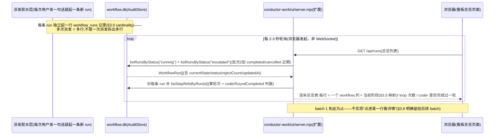

# DESIGN — Conductor 层 MVP（issue #2，最外层对话协调 + 多 workflow 实时进度看板）

- **项目**: aeloop（`elishawong/aeloop`，private repo）
- **分支**: `feature/issue-2-conductor-mvp`（原始 cut 基线 `origin/main` @ `13c2bf1`；**#106 已于
  2026-07-24 merge 到 origin/main(`1e36531`)，本分支已 rebase + reconcile，当前 HEAD =
  `1e36531`**）。
- **关联**: #2（本设计所属，issue body 是设计基线，见 §0）、#75/#80/#93（conductor-brain 既有实现，
  本设计大量复用/引用其产物，不重造）、#96/#98/#103（醒来开场白既有红线，原样遵守）、#106（VSCode
  醒来触发可移植性，**与 batch 1 并行，非 CLI demo 阻塞项，见 §2.3/§9.3——已于 2026-07-24 merge，
  本分支已完成 rebase + reconcile，见 §2.3 末尾"与 #106 的合并——已完成"）、#31（**开放风险，
  Zorro R1 blocker B1**：candidate-only 今天只是 prompt/契约层约束，非运行时机械强制，见 §1.5）。
- **状态**: 指挥官已确认（方向 + §9 关键决策，2026-07-24）；Zorro R1 = FAIL（6 blocker + 7 yellow
  已修）→ Zorro R2 = FAIL，离 PASS 很近（2 个小 blocker + #106 rebase/reconcile + 4 个低优先级
  yellow 已修）→ **Zorro R3 = FAIL（纯文档自相矛盾，零代码问题，本轮零代码改动，只做文档一致性
  sweep）**，见 `progress.md` "Zorro R3 返工"一节的完整对照。
- **最后更新**: 2026-07-24（Zorro R3 文档一致性 sweep）
- **防幻觉声明**：本文档每一条"已建/未建"判断都逐条读过 aeloop 当前源码（文件路径已在下方
  列出），不是转述 issue body 或凭记忆；`[?]` = 未能独立核实，不编接口/字段/行为。
- **2026-07-24 增量①**：指挥官读了现有 `conductor-work/ui/` 后追加一等需求——把"多 workflow
  实时进度看板"纳入本设计（原因：现有 UI 是 fixture、单 run 视图、状态藏在字符串里，看不清"每个
  workflow 到底跑到哪了"）。已并入 §1.4（缺陷清单）、§3（看板架构，一等章节）、§7.5-7.6（方案
  对比）、PRD 的 batch 拆解。
- **2026-07-24 增量②（覆盖增量①的批次顺序）**：指挥官重排优先级——**batch 1 = 多-run 总览看板
  优先**（一眼看到"这次派发开了几个 workflow、各自卡在哪个 node、loop 了几次、有没有产出
  artifact"），单条 run 的详细 UI + 操作（gate approve/reject、完整 diff、重跑）拆到后续 batch。
  §3 已按新优先级重写，并核实了一个直接决定看板结构的数据模型问题：**今天引擎是
  `1 个 TaskContract → 1 个 workflow(run) → N 个 node`，没有"一次派发拆成多个并行 workflow"的
  fan-out 机制**——见 §3.0。

---

## 0. 问题(issue #2 原文 + 指挥官已拍方向,不重复论证,只摘要)

四层嵌套 `Prompt ⊂ Context ⊂ Harness ⊂ Loop` 再往外的**最外圈**——决定"要不要进 loop / 何时打断
loop / 还是自由讨论"的对话协调层。由来:Verity v2 把开发者压成 Workflow 的 Gate 审批节点、失去了
平等协作;那份 orchestrator 计划的"单向阀"设计洞见可借,但有 4 个真洞必须带修正落地(见 §4)。

**指挥官定的 MVP 头号亮点**："聊天→自动派发"——用户对醒来的调度员说一句自然语言,自动 translate
成 `TaskContract` → 派 conductor-work 跑 coder+tester → 回候选+证据。入口 = 会话内的醒来调度员
(依赖 #106,让这套体验在 VSCode 里也能稳定醒来)。范围 = 完整 #2,但分批做,batch 1 = 能独立 demo
的精简演示切片。

**追加的一等需求(2026-07-24)**：派发之后"看不清每个 workflow 跑到哪了"——需要一个多 workflow
实时进度看板,不是现在这个 fixture-only、单 run、状态藏在字符串里的演示页面。

---

## 1. 已核实的事实基线——真实已建 vs 未建(逐条列源)

这是本设计最重要的一节:指挥官要求"别凭想象设计",下面每一行都读过真实代码。**结论先说**:#2 要的
"聊天→自动派发"这条闭环,**核心机制几乎全部已经存在并被证明过一次**——真正缺的不是"翻译器"或
"派发引擎"本身,而是"把已验证的手动驱动脚本,接进一个真实的、模型会主动触发的对话入口"这一层胶水,
外加 4 项修正里 3 项目前只在**引擎层**满足、**没有接到对话层**;看板需求同理——**多 run 注册表
已经存在并在生产 CLI 里用了**,缺的是"给它一个 web 面、把它变成可视化 stepper"。

### 1.1 conductor-work / Aeloop 产品层今天建了什么

| 能力 | 状态 | 源 |
|---|---|---|
| `TaskContract` 确定性 schema + 校验(`assertValidTaskContract`) | ● 已建、有测试 | `src/conductor/types.ts`、`src/conductor/contract.ts` |
| `Orchestrator`(brain × contract × workflow 确定性匹配,不调模型) | ● 已建 | `src/conductor/orchestrator.ts` |
| `ConductorWorkApp`(`plan`/`planRun`/`runCandidate`/`projectEvents`) | ● 已建、有测试 | `src/conductor-work/app.ts` |
| `conductor-work` CLI(`plan`/`run` 子命令) | ◐ 能跑,但 `run` 子命令**只调一次 `startRun()`,必然停在 G1、无 `resume` 子命令**——单独跑这条 CLI 命令拿不到完整闭环 | `src/conductor-work/main.ts:11-65`(已读全文);判定过程见 `docs/conductor-brain-layer/spike-PRD.md §0.2`(2026-07-22 已核实,非本次新发现) |
| coder/tester 闭环(G1/G2/G3/Escalation + 独立复核 + 跨进程 resume) | ● 已建、已真跑通(公司 LiteLLM,Run #25/#31,双不同模型互抓 bug) | `docs/architecture/conductor-work/CAPABILITY-MAP.zh-CN.md` |
| `semi-auto` gate mode(G1/G2 自动批,G3/Escalation 恒人工) | ● 已建、Zorro+Codex 双审 PASS、真跑过——但**只在 `src/cli/run-loop.ts` 的 `runInteractiveLoop()` 里生效,这条路径吃裸 task 字符串,完全绕开 `TaskContract`/`Orchestrator`** | `src/cli/run-loop.ts:21-33,141-175,204-228` |
| 库调模式手动驱动闭环(wake → translate → `startRun`/`resumeRun` 自动批 G1/G2 → 停 G3 前 → `projectEvents` → 三态门折回 → 再 wake) | ● 已建、已真跑通(issue #80 spike,`run-spike.mjs`;issue #93 B5,`scripts/dispatch-brain-task.mjs`) | `docs/conductor-brain-layer/spike/run-spike.mjs`(232 行,全读)、`scripts/dispatch-brain-task.mjs`(293 行,全读,Zorro+Codex 两轮 must-fix 已修) |
| 自然语言→`TaskContract` 翻译器 | ◐ **纯模板,不是 NLP**——把 `rawIntent` 原样塞进 `objective`/唯一一条 `Requirement.text`,`riskLevel` 硬编码 `"low"`,`brain` 硬编码 `"company"`,`allowedPaths` 硬编码指向一个安全沙箱目录、不是任何目标项目真实路径 | `docs/conductor-brain-layer/spike/lib/translator.mjs`(69 行,全读) |
| `parseGateCommand()`(control 命令 start/resume/stop 的**确定性解析**,不经 LLM) | ● **已建、已有单测**——GateCommand 是一个独立于模型输出的强类型联合,`type: "resume"` 要求 `decision` 必须命中 `GATE_DECISIONS` 白名单(`approved/rejected/escalate/revise/force_pass/abandon`) | `src/conductor/run.ts:68-115` |
| 真 checkpoint pause/resume(不是"写了没接线") | ● **引擎层已建、可跨进程 resume**——LangGraph `BaseCheckpointSaver` + SQLite,`resumeRun()` 从磁盘 `rebuildStepCounters()`,新进程也能正确续接 | `src/loop/runner.ts` 头注释(已读,`@langchain/langgraph-checkpoint-sqlite`) |
| 对话可视化 UI(`conductor-work/ui/`) | ◐ **是任务监控台,不是对话入口**——时间线/gate/需求覆盖/EvidenceBundle 展示,数据源是**硬编码 fixture**(`FIXTURE_EVENTS`),不接任何真实 run;human-gate 按钮只改本地显示,不发送任何决定 | `conductor-work/ui/server.mjs`(全读)、`conductor-work/ui/README.md` |
| `gate-controller`(点 approve → 真 resume 的桥) | ◐ 代码在(resume-only),**未提交、未接 CLI/UI**,所在 worktree `feature/company-gate-controller` 落后 origin/main 数十个 PR,大概率是废弃/待重做 | `docs/architecture/conductor-work/CAPABILITY-MAP.zh-CN.md`;`git worktree list` 核实过该分支 `fed3214` 远落后当前 `origin/main`(214 files diff) |
| 多 run 注册表(哪些 run 存在、各自当前状态) | ● **已建、生产 CLI 在用**——`AuditStore.listRunsByStatus("running"|"escalated"|"completed"|"cancelled")`,持久化在每个 profile 自己的 `workflow.db`(SQLite);`WorkflowRun.currentState` 是 LangGraph 节点名字符串(`draft`/`review`/`g1`/`g2`/`g3`/`escalation`/`apply`/`cancel`),`updateRunProgress()` 在每次 `startRun`/`resumeRun` 调用跑到下一个中断点后写入;`aeloop list` CLI 子命令已经在用它渲染文本表格(`formatRunsTable`) | `src/loop/audit-store.ts:51-64,629`(`WorkflowRun`/`listRunsByStatus`)、`src/cli/main.ts:176-220`(`runList`) |
| 每个 run 的细粒度节点级历史(`step_markers`/`approvals`) | ● 已建、持久化——每次 draft/review 完成、每次 gate 决策都落一行(`insertStepMarker`/`insertApproval`),和内存态 `LoopEvent` 不是同一套但覆盖同样的"发生过什么" | `src/loop/runner.ts:644,691,779`(调用点)、`src/loop/audit-store.ts` |
| `LoopEventEmitter`(细粒度事件,`node_started`/`gate_requested`等) | ● 已建,但**只存在于单次 `startRun`/`resumeRun` 调用的调用方进程内存里,不跨进程、不持久化**——`EvidenceEventProjector` 消费的正是这个内存态事件数组 | `src/loop/events.ts:224-260`、`conductor-work/ui/server.mjs` 的 `FIXTURE_EVENTS` 消费方式(已验证形状合法) |

### 1.2 conductor-brain(醒来层)今天建了什么——这是"入口"的现状

| 能力 | 状态 | 源 |
|---|---|---|
| SessionStart hook 渲染延续式开场白(身份库 → 三态渲染 → "请原样复述") | ● 已建、生产用了数月 | `.claude/hooks/brain-wake-greeting.mjs`(228 行,全读) |
| "只到醒来出开场白,不含完整意图→派工→折回闭环" | **BRAIN.md §5 原话** | `docs/conductor-brain-layer/BRAIN.md:182-184`——"issue #80 spike 已经用手动驱动脚本 `run-spike.mjs` 验证过闭环本身可行,但没有接进这个 hook 里,不是这个增量的范围" |
| 单项目意图→派发的库函数封装(`dispatchBrainTask({owner,repo,rawIntent})`) | ● 已建、已测(issue #93 B5,Zorro+Codex 两轮 must-fix 已修:cwd 互斥锁、`process.chdir()` 串行化) | `scripts/dispatch-brain-task.mjs` |
| `dispatchBrainTask()` 被**任何 hook/对话流程调用** | ○ **零调用点**——`grep -rl "dispatchBrainTask"` 命中的全是它自己的定义/测试/PRD 文档,没有一处从 `.claude/hooks/*.mjs` 或任何 SessionStart/UserPromptSubmit 路径调用它 | 已 grep 核实(见研究记录) |
| VSCode 环境下醒来触发本身是否可靠 | ◐ SessionStart 在 VSCode **确认不 fire**;UserPromptSubmit **确认 fire**;#106 已出 DESIGN(三层+共享守卫)并**指挥官已确认**,但**尚未 build/合并** | `docs/wake-trigger-portability/DESIGN.md`(另一 worktree `issue-106-wake-claudemd`,已读全文) |
| 对话历史持久化进 Context 层 `memories` 表 | ○ **未建**——三态门(`three-state-gate.mjs`)只把 `EvidenceItem`/`run status` 折回身份库,不记录"用户说了什么、系统回了什么"这层原始对话交换本身 | `docs/conductor-brain-layer/spike/lib/three-state-gate.mjs`(全读) |
| 角色 schema 动态 registry(加 conductor 角色不改 composer) | `[?]` 本次未逐行读 `src/harness/` 的 composer/registry 实现——issue #2 原文说这是"A0+A1 Zorro blocker #4 的正解",指向一个已有的模式,但本设计未独立核实"新增一个 conductor 角色"具体要动哪些文件、动态 registry 机制今天覆盖到什么程度。**标记为 batch 待办前必须先核实的 `[?]`**,不是"已解决"也不是"完全空白" | 未核实,如实标注 |

### 1.3 关键结论(承接上面两张表)

1. **"精简演示切片"不是要新造一条闭环,是要把 `dispatch-brain-task.mjs` 这条已经验证过的库调闭环
   接进一个真实模型会主动触发的对话入口**——目前它只是一个 operator 手动敲命令行才会跑的脚本。
2. **"必须带的 4 个修正"里,①(控制命令确定性解析)和 ②(真 checkpoint)在引擎层(`src/conductor/run.ts`
   的 `parseGateCommand`、`src/loop/runner.ts` 的 checkpointer)已经满足**——缺的是"对话层有没有一条
   真实路径把用户打的 `approve`/`reject` 文本变成一次 `parseGateCommand()` 调用,再驱动
   `resumeRun()`"。这条路径今天**不存在**(`gate-controller` 半成品、落后主干,不可直接用)。
3. **③(对话历史落 Context memories 表)和 ④(角色 schema 动态 registry)今天都没有着落**——③ 有明确
   缺口(三态门不记原始对话);④ 是 `[?]`,需要 batch 0 先花时间核实清楚再排期,不能直接假设"和 issue
   原文说的一样简单"。
4. **翻译器"质量"从设计初期就被定性为"不是要证明的东西"**(spike PRD/translator.mjs 头注释原话)——
   这不是本设计新引入的降级,是延续既有的、经过论证的决定。batch 1 的"翻译"精度问题,见 §6.4。
5. **Level 1 范围约束(issue #93 B5 已定)对本设计同样成立,且本设计不解除它**:coder/tester 的实际
   工具执行 cwd **今天不指向任何目标项目**——`allowedPaths` 只是契约文本层面"允许被改动的路径"这个
   字段需要一个值,不代表任务真的会碰这个目录;真正"cwd 透传到目标项目"的管线**没有建**,issue #93
   判定"新增该管线超出地基定位,片①不做"。本设计 batch 1 继承同一判定——demo 的 coder/tester 只在
   aeloop 自己仓库内的安全沙箱路径下操作,不碰任何真实业务项目文件。
6. **多 run 注册表(哪些 run、各自什么状态)不是要新建的东西**——`AuditStore.listRunsByStatus()` +
   `WorkflowRun.currentState` 已经是生产 CLI(`aeloop list`)在用的真实数据源,持久化在磁盘上,天然
   支持"另一个进程(UI server)只读轮询"。**真正缺的是两样**:(a) 细粒度的"节点内部进展"事件流
   (`LoopEvent`)今天只活在单次调用的内存里,不跨进程;(b) 现有 web UI 完全不接这个注册表,只喂
   fixture。见 §3。

### 1.4 现有 `conductor-work/ui/` 的具体缺陷(指挥官已读源核实,逐条列出,不重复"够用"的判断)

1. **fixture、未接真实 run**——`server.mjs` 模块作用域硬编码 `FIXTURE_EVENTS`(5 条 `LoopEvent`)
   喂给真实的 `EvidenceEventProjector`;`README.md` 自己标注"事件流本身"是"还处于演示阶段/尚未
   接线的部分"。**投影器/builder/ledger 这几个类本身是真实的**(不是页面手写的假数据),缺的只是
   "喂给它们的事件从哪来"这一环。
2. **单 run 视图**——整个页面只有一份 `FIXTURE_RUN_ID = 1042`,`GET /api/state` 返回单个对象,
   没有任何"列出多个 run"的端点/数据结构;`index.html`/`app.js` 也没有列表/看板组件(`app.js` 只
   渲染 `/api/state` 单个对象的字段)。
3. **"现在在哪一步"只是个字符串**——`FIXTURE_STATE`(`staticFallbackState()`)里
   `displayStatus: "WAITING FOR G1"` 是一个手写字符串,不是从一组"阶段"枚举渲染出来的 stepper;
   `timelineFrom()` 产出的是一个线性事件列表("Run started"/"Coder completed"/"G1 waiting"/
   "Tester pending"),阅读时需要逐行看完整个列表才能定位"现在卡在哪",不是一眼可读的进度指示器。

### 1.5 candidate-only 今天的真实强制层级——开放风险(issue #31,Zorro R1 blocker B1,指挥官已拍处理方式)

**如实结论**:candidate-only(**措辞收窄,Zorro R1 yellow⑥**:准确说法是"不把候选写进目标工作区
/不 apply/不 git write"——不是笼统的"不写盘",共享核心确实会把 `TaskContract` JSON 写到磁盘的
安全沙箱路径,`runner.ts`/三态门也确实会写 `workflow.db`/身份库,这些是有意的、审计需要的落盘,
和"候选代码写进工作区"是两回事)今天**只是 prompt/契约层约束**,不是
**运行时机械强制**。逐条列源:

- `TaskContract.policy.allowGitWrite` 恒 `false`(`assertValidTaskContract()` 强制校验)——这是
  **契约字段级**约束,校验的是"这份契约声明了什么",不是"运行时有没有东西真的挡住 coder 去写盘/
  执行 git 命令"。
- coder 的模型调用走 `bypassPermissions`(`--allowedTools Bash`)——`Bash` 工具本身**不是只读**
  的,coder 理论上能执行任意 shell 命令,包括 `git commit`/写文件。
- `evaluateExecutionPolicy()`(`src/policy/` 一带,fail-closed 的执行策略检查函数——覆盖路径/
  命令/依赖/网络/Git 写操作/reviewer 写操作)**今天没有接进 batch 1 这条派发链路**——它是
  `SOLUTION-DESIGN.zh-CN.md` §5 描述的机制,存在于代码库里,但 `runConductorDispatch()`/
  `dispatch-conductor-task.mjs` 这条新链路没有调用它。
- coder 的工具执行 cwd 钉在 **aeloop 仓库自身**(§4.3 已述的 Level 1 沙箱约束)——这解决了"不碰
  真实业务项目"这个问题,但**没有解决"coder 理论上能写 aeloop 自己的工作树"这个问题**:今天没有
  任何运行时机制阻止一次自动派发的 coder 执行 `git add`/写文件/甚至 `git commit`(即便契约字段
  声明了 `allowGitWrite:false`,没有代码在执行时检查这个字段并拒绝违反它的工具调用)。

**指挥官定的 MVP 处理方式(2026-07-24,不是本设计自行判断)**:
- **诚实记风险,不建机械隔离**——真正的机械隔离(真·只读 coder 工作区/移除可写 Bash 权限/落地
  `evaluateExecutionPolicy()` 接线)是一块独立的、有真实工作量的安全加固,**延后到 issue #31 单独
  做**,不在本轮(batch 0-1)范围内。
- **本轮只做"诚实声明 + 标风险"**:`docs/conductor-brain-layer/BRAIN.md` §6 那句"candidate-only
  是代码层 posture,不靠自觉"的不实声明已改写为诚实版本(见该文档);本文档、`impact.md` 明确把
  这条标为开放风险,不是已解决项。
- **demo 范围的现实兜底**:因为没有机械隔离,batch 1 的 demo **只在 aeloop 自己仓库这个沙箱内跑,
  绝不指向任何真实业务项目**——这不是"因为设计选择了 Level 1 沙箱所以顺便安全",而是"今天没有
  机械强制,所以沙箱边界(demo 只碰自己仓库)是唯一现实的安全网,必须严格遵守,不能心存侥幸"。

**红线未被弱化**:AUTO_APPROVE_GATES 只含 G1/G2、G3/Escalation 恒人工、`allowGitWrite:false` 这些
既有约束**原样保留**——B1 只是如实标注"这些约束今天在哪个层级生效(prompt/契约,不是运行时机械)",
不是放开或降低任何一条既有约束的字面要求。

---

## 2. 架构总纲

### 2.1 分层关系(不是本设计新提出,issue #2/#75 已定,这里只重申+标注 batch 1 触达范围)

```text
Conductor(对话协调,#2 本设计范围)
   ↓ 用户自然语言 → 确定性/LLM 意图路由 → TaskContract 或 GateCommand
Company Brain / Personal Brain(#75/#93 已建,brains/company/ manifest + translateIntent())
   ↓ TaskContract
Conductor(确定性编排,src/conductor/,已建)
   ↓ Workflow selection + policy decision(Orchestrator.plan/planRun)
Aeloop(执行内核,src/loop/、src/workflow/,已建)
   ↓ model calls / context / checkpoints / gates / evidence
Workspace(candidate-only,不写候选到工作区/不 apply/不 git write——见 §1.5 开放风险)
   ↓ 持久化(workflow.db: WorkflowRun/StepMarker/Approval;身份库: MemoryStore)
多 workflow 实时进度看板(#2 追加需求,本设计 §3)
```

> ⚠️ 命名重叠提醒(如实标注,不假装不存在):`docs/conductor-brain-multiproject/DESIGN.md`/
> `REFACTOR-ROADMAP.zh-CN.md` 里的 "Conductor" 特指 `src/conductor/`(确定性编排层,已建);issue #2
> 的 "Conductor"(本设计标题)指的是**再往外一圈**的对话协调层——issue #2 原文自己也点明这是"四层
> 之外的最外圈"。本设计后文用 **"Conductor 层"** 特指 #2 范围,用 **`src/conductor/`** 指代码路径,
> 避免读者把两者混成同一个东西。

### 2.2 Batch 1 精简演示切片——调用链时序图

```mermaid
sequenceDiagram
    participant User as 用户
    participant Session as Claude Code 会话(醒来调度员)
    participant Dispatch as 派发胶水层(batch 1 新建)
    participant Translate as translateIntent()(已建,模板化)
    participant Orch as ConductorWorkApp/Orchestrator(已建)
    participant Loop as Aeloop coder/tester loop(已建)
    participant Audit as workflow.db(AuditStore,已建)
    participant Store as 身份库 MemoryStore(已建)

    Note over User,Session: 前置:#106 三层醒来触发已生效(SessionStart/UserPromptSubmit 之一 fire)
    User->>Session: 自然语言意图("帮我实现 X")
    Session->>Session: 识别"这是一个工作请求"(靠模型自身判断,非确定性路由——见 §6.2)
    Session->>Dispatch: 调用派发脚本/函数,传入 rawIntent
    Dispatch->>Translate: translateIntent(rawIntent, {allowedPaths: 安全沙箱})
    Translate-->>Dispatch: TaskContract(brain:"company", riskLevel:"low")
    Dispatch->>Orch: planRun(contractPath) → assembleProfileDeps() → startRun()
    Orch->>Loop: draft(coder) → G1 中断
    Loop->>Audit: updateRunProgress(currentState:"g1", status:"running")
    Loop-->>Dispatch: interrupt{gate:"G1_SEND_TO_TESTER"}
    Dispatch->>Loop: resumeRun(decision:"approved", decidedBy:"dispatch (auto, not human)")
    Loop->>Loop: review(独立 tester,不同模型) → G2 中断(若需要修)
    Loop->>Audit: updateRunProgress(currentState:"g3"|"escalation", ...)
    Loop-->>Dispatch: interrupt{gate:"G3_FINAL_MERGE"} 或 done(no_change/cancel)
    Note over Dispatch,Loop: G3/Escalation 恒人工——batch 1 停在这里,不自动批(candidate-only 红线)
    Dispatch->>Dispatch: projectEvents() → EvidenceBundle
    Dispatch->>Store: applyThreeStateGate()(evidence 折回,model-reported 绝不 confirm)
    Dispatch-->>Session: {plan, candidateSummary, evidenceBundle, pendingGate}
    Session->>User: 候选变更摘要 + Requirement Coverage + 证据链接 + "等你批 G3"
```

**batch 1 明确止步于此**:G3/Escalation 停在这里、用户此刻**不能靠打字"approve"驱动 `resumeRun()`
真的继续**(那是 §4 修正①②的对话层接线,拆进后续 batch)。用户看到的是"候选已产出、证据已展示、
需要在下一次显式操作里批准"——诚实反映当前机制边界,不假装闭环完整。

### 2.3 #106(醒来触发跨 host 可移植性)与 batch 1 的关系——**指挥官已确认(2026-07-24)**

**定盘结论**:#106 与 batch 1 **并行**推进,**不阻塞** batch 1 的 CLI demo。batch 1 先在纯终端 CLI
里跑起来(SessionStart 在 CLI 环境已验证可靠,§1.2);#106 merge 后,VSCode 入口(UserPromptSubmit/
Layer3 兜底网)自动补上——两者本来就是"同一个醒来层,不同 host 的触发路径",batch 1 的派发胶水层
不关心自己是被 SessionStart 还是 UserPromptSubmit 触发的上下文调用,**这一点在设计层面成立不变**。

**#106 从"硬前置"降级为"VSCode 入口的前置,不阻塞 batch 1 的 CLI demo"**(推翻本文档早前"batch 1
demo 是否要求先完成 #106"这条待拍板 `[?]`——已拍板,不再是开放问题)。`#106` 本身已出 DESIGN、
**指挥官已确认**(2026-07-24),**已于 2026-07-24 merge 到 origin/main(`1e36531`)**,不再是 batch 1
的阻塞项。

**✅ 与 #106 的合并——已完成(Zorro R2,2026-07-24)**:"设计层面不冲突"不等于"代码合并不冲突"。
本分支和 #106 分支**都改动了同一个文件** `.claude/hooks/brain-wake-greeting.mjs`——本分支追加约
25 行(状态 C 分支追加 `CONDUCTOR_DISPATCH_INSTRUCTION`),#106 分支大改约 171 行(新增 event 分派、
`--standalone` 模式、guard 插入点)+ 重写 `docs/conductor-brain-layer/spike/test-hook-greeting.mjs`
+ 改 `docs/conductor-brain-layer/BRAIN.md`。**本轮已执行**:`git fetch origin` → `git stash`(含
未跟踪文件)→ `git rebase origin/main`(无本分支自有 commit,纯 fast-forward,零冲突)→
`git stash pop`(`brain-wake-greeting.mjs`/`BRAIN.md` 两个文件产生真实冲突,`test-hook-greeting.mjs`
三方合并自动成功)→ 手工 reconcile 两处冲突:①`brain-wake-greeting.mjs` 保留 #106 的
`VALID_HOOK_EVENT_NAMES`/`claimAndEmit()`/新版 `emitAdditionalContext(text, hookEventName)` 签名,
`CONDUCTOR_DISPATCH_INSTRUCTION` 常量本身及"只拼进状态 C `injected` 文本"这条逻辑原样保留(git
三方合并对状态 C 那一行本身已经自动正确合并,只有常量声明区域附近需要手工排布顺序);
②`BRAIN.md` §5"Phase1 诚实边界"合并两条各自更新过的 bullet(#106 的三层触发说明 + 本分支的
"现在有一条会话触发路径"说明),不是二选一丢弃另一边。**融合后重跑验证**:#106 的三路径守卫测试
(`test-hook-greeting.mjs` ⑫-㉑,共 10 组)+ 本分支的 A/B/C 派发指令断言(⑧⑨⑩)**共 21 组测试
全部重跑通过**;`pnpm build && pnpm test` 全绿(基线切到 `1e36531` 后,`.claude/hooks/lib/` 下
#106 真正新增的 `wake-session-guard.mjs`/`test-wake-session-guard.mjs`——已用
`git diff 13c2bf1..origin/main --diff-filter=A` 核实过,不是猜的——连同该目录下既有的
`test-brain-lock`/`test-command-match`/`test-db-path`/`test-git-remote`/`test-task-source` 一并
跑过,零回归)。完整证据见 `progress.md`"Zorro R2 返工"一节。

---

## 3. 多 workflow 实时进度看板(一等章节,2026-07-24 追加需求,当日二次重排优先级)

### 3.0 先核实清楚的数据模型问题(cardinality,直接决定看板结构——指挥官点名要求)

指挥官问的原话:"一个任务开了多少个 workflow"。逐条读代码核实的结论:

- `Orchestrator.plan()`(`src/conductor/orchestrator.ts:37-44`)对**一个** `TaskContract` 只做
  **一次** `this.workflows.get(request.workflowId ?? request.brain.defaultWorkflowId)`——返回单个
  `WorkflowManifest`,没有任何循环/拆分逻辑把一个 contract 拆成多个 workflow 去分别跑。
- `WorkflowRegistry`(`src/workflow/registry.ts:63-83`)是一个 `Map<string, WorkflowPlugin>`——
  `get(workflowId)` 按 id 查单个 plugin。今天**只注册了一个** workflow:`coder-tester-loop`
  (`coderTesterWorkflow`,`src/workflow/coder-tester.ts`——`main.ts`/`dispatch-brain-task.mjs` 的
  `workflows.register(coderTesterWorkflow)` 调用点已核实)。registry 本身设计上支持注册多种
  workflow **类型**(未来 `research-synthesis`/`prd-authoring` 等,`REFACTOR-ROADMAP.zh-CN.md` §5
  已有的路线图),但那是"系统支持几种 workflow 定义",不是"一个任务拆成几个并行实例"。
- `ConductorWorkApp.runCandidate()`(`src/conductor-work/app.ts:64-87`)每次调用产出**一个**
  `RunHandle`(对应 `AuditStore` 里**一行** `workflow_runs` 记录)。

**结论(如实,不编造)**:今天的真实 cardinality 是 **`1 个 TaskContract(=1 次派发/1 句自然语言意图)
→ 1 个 workflow 实例(= `workflow_runs` 表的 1 行,`AuditStore.WorkflowRun`)→ N 个 node**(draft →
g1 → review → g2 → g3/escalation → apply/cancel,可能因 reject 循环多轮)。**不存在"一句自然语言
派发 → 翻译器/orchestrator 自动拆成多个子 TaskContract → 并行多个 workflow"这条路径**——这是
`[?]` 未建的能力,不是本设计范围内要做的事(见 §8 明确不做清单)。

**"看板上出现多个 workflow" 在今天的机制下,只能来自"用户多次派发"(或未来有多用户/多会话并发
派发)——每次派发各自产出一行独立的 `workflow_runs` 记录,看板把这些行并列展示**。这不是"退而
求其次的凑合方案",是**如实反映当前架构的唯一正确解读**——"一个任务拆多个 workflow"作为一个
可扩展点写入 §8/§9,留给指挥官判断是否要单独立项(那涉及 orchestrator 新增"意图分解"能力,超出
本设计的对话协调/看板范围)。

### 3.1 目标(指挥官原话,2026-07-24 二次重排后的最新版本)

"看的东西有点多但是看不清每一个 workflow 到底跑到哪了。"——**batch 1 明确优先级 = 多-workflow
总览看板**,一眼看到:
1. 我(用户)这一段时间派发出去的**所有 workflow(=所有 `workflow_runs` 行)**列在一起——不是
   "一次派发拆出多个",是"多次派发各自一行,并列展示"(§3.0 结论)。
2. 每个 **workflow/node 的基本信息**:当前卡在哪个 node、在干嘛(§3.5 阶段映射表);coder 是否
   已经完整跑完至少一轮(`coderRoundCompleted`,不是"是否已有可查看的候选 diff"——见 §3.2 表格
   第 4 行的措辞收窄);loop 了几次(reject/重试轮数)。
3. **只到"基本信息、一眼可扫"为止**——不在 batch 1 堆完整 diff、完整证据链、gate 操作按钮;
   这些留给"点进单条 run 的详细 UI + 操作"这个后续 batch(见 PRD)。

### 3.2 数据源分层(核心设计决策——复用已建的持久化注册表,不重造事件总线)

| 看板元素(§3.1 指挥官点名的 3 项) | 数据源 | 状态 |
|---|---|---|
| **总览列表本身**(有哪些 workflow/run) | `AuditStore.listRunsByStatus()`(`running`/`escalated`,批次 2 再加 `completed`/`cancelled` 的近期历史)读 `workflow.db`(每个 profile 自己的 SQLite 文件) | ● 数据源已建、生产 CLI(`aeloop list`)已在用;**新增的只是"读它的第二个消费者"**(web,不是 CLI 文本表) |
| **每条卡在哪个 node/在干嘛** | `WorkflowRun.currentState`(§3.5 映射表直接可用) | ● 已建 |
| **loop 了几次** | `WorkflowRun.rejectCount`(总拒绝/循环次数,已是现成字段)+ `AuditStore.listStepRefsByRun(runId)`(更精细:能数出 `draft#1`/`draft#2`... 具体第几轮) | ● 已建 |
| **coder 是否完成过至少一轮(`coderRoundCompleted`,build 时从"是否有候选 diff"改名——见下)** | `AuditStore.listStepRefsByRun(runId)`,判据:是否存在 `draft#N` 这个 step_ref | ● 已建(`src/conductor-work/board.ts` 的 `coderRoundCompletedFromStepRefs()`) |

**⚠️ build 时的两处订正(Zorro R1 blocker B4 + yellow①,均已修复,如实记录不是原设计就对)**:
1. 原设计设想的判据是 `Approval.diffRef`(`approvals` 表,`insertApproval()` 写入)——build 时
   发现 `AuditStore` 今天**没有**公开的"按 runId 查完整 `Approval` 行"方法(只有单点
   `getApprovalById(id)`),新增这样一个方法是核心引擎持久化层改动,超出 batch 1"不碰核心引擎"
   的风险控制范围。改用 `listStepRefsByRun()` 已有的 `draft#N` step_ref 存在性作为判据——**这仍然
   不等于**"存在一条已决策、`diffRef` 非空的 `Approval`":一个 run 卡在 `g1`(等待送审)时,coder
   已经完成过一轮,判据会是 `true`,但那一轮的 `diffRef` 要等 G1 被决策之后才真正持久化进
   `approvals` 表——**当前挂起中(未决策)那一轮的 diff 仍然查不到**,这条缺口原样保留,不是本
   订正解决的问题。
2. **`no_change` 场景下的误报(Zorro R1 yellow①)**:coder 判定"不需要改动"(`CoderOutput.status
   === "no_change"`)时,`insertStepMarker()` 对 draft 节点仍然无条件调用,`draft#1` 这个
   step_ref 依然存在——如果字段还叫"是否已有候选 diff",这种场景下会返回 `true`,但**根本没有
   diff**(`no_change` 的定义就是"确认不需要任何改动")。修法:字段/函数改名为
   `coderRoundCompleted`(不是 `hasCandidateDiff`)——这个更朴素的问题("coder 有没有真的跑完过
   一轮")无论这一轮是否产生真实 diff 都成立,不再暗示"一定有 diff 存在"。

**看板总览用轮询 `workflow.db`**(方案已足够"近实时",不需要新基础设施)——这是成比例的 MVP 选择,
不引入 WebSocket/SSE 这类新传输层,细节见 §3.4。

### 3.3 看板架构时序图(batch 1 范围:总览优先,轮询驱动,不含详情钻取)



**这条设计对 candidate-only 红线的关系**:UI server 对 `workflow.db`/身份库**只读**——**Zorro R1
blocker B2 已修复到物理层面**:`AuditStore` 新增只读模式(`{readonly:true, fileMustExist:true}`,
跳过 `createSchema()`),已实测确认打开只读连接不产生任何磁盘写入(mtime 不变、写操作真的抛
`SQLITE_READONLY`),不再是"逻辑上没调写方法"这一层承诺,是"物理上写不了"。`workflow.db` 本身是
既有的、`aeloop` 引擎自己(通过 `startRun`/`resumeRun`)写入的运行态记录,不是"候选代码写进目标
工作区"那个意义上的写(§1.5 收窄措辞的对象),两者是两回事,如实说明不混淆。

### 3.4 方案对比:轮询 vs 实时推送(SSE/WebSocket)

| 方案 | 内容 | 优点 | 缺点 |
|---|---|---|---|
| **A(batch 1 采纳)** | 浏览器每 2-3 秒轮询 `GET /api/runs`,数据源 = `AuditStore`(已建、持久化、跨进程可读) | 零新增传输层基础设施;`WorkflowRun.currentState` 已经是一个可直接映射阶段标签的枚举值;实现成本低,MVP 成比例 | 粒度受限于 `updateRunProgress()` 的调用时机——**它在每次 `startRun`/`resumeRun` 调用跑到下一个中断点后才写入**(runner.ts:847/882 已核实),不是"coder 正在思考"这种进行中状态的实时反映;单次 LLM 调用期间(可能 30-60 秒)看板会"卡"在上一个阶段,直到这次调用完成才跳到下一个 |
| B(后续 batch 可探索) | UI server 和派发进程之间建一条实时通道(WebSocket/SSE),转发 `LoopEventEmitter` 的 `node_started`/`agent_completed` 等细粒度事件,反映"正在进行中"而不只是"已完成到哪"——**顺带能解决 §3.2 表格第 4 行"当前挂起中这一轮 diff 查不到"的缺口**(实时转发能拿到 `GatePayload.diffRef` 那份进程内数据) | 体验更接近真·实时;能展示"Coder 正在生成候选"这种中间态,不只是节点边界;能补上"当前 pending 轮次的 diff" | 需要新基础设施(事件转发通道);且 `LoopEventEmitter` 今天没有任何跨进程转发机制(§1.1 已述),UI server 和派发脚本是两个独立 Node 进程,需要新增"派发进程把事件写到一个 UI 能读到的地方(文件/socket/数据库)"这一环——工作量显著大于方案 A,不是 MVP 该做的事 |

**采纳 A**。方案 B 的"细粒度进行中状态 + 当前挂起轮次 diff"留在 §8 明确不做清单 + PRD 后续 batch 候选。

### 3.5 阶段标签映射(具体设计,供 PRD 任务清单引用)

`WorkflowRun.currentState`(真源 = `LOOP_NODES`,`src/loop/workflow-def.ts`——**Zorro R1 blocker B4
订正**:之前这里手写的取值集合是错的,`runner.ts` 的 `computeRunProgress()`,唯一实际写
`current_state` 列的函数,`done` 分支只产出 `apply`/`no_change`/`cancel` 三者之一,`__end__`/
`__start__` 是 LangGraph 内部图节点名,**从未**被写进 `current_state` 列;之前漏掉了真实终态
`no_change` 却把从未出现过的 `__end__` 当成一个真实取值——已订正,`board.ts` 现在直接从
`LOOP_NODES` 派生 key 集合,不再手写字符串列表)→ 看板阶段标签的映射表,是 batch 1 唯一需要新写
的一段确定性逻辑(纯函数,无状态)。**batch 1 只做"一行一个标签"**(总览列表里的一列),不做逐
节点的可视化 stepper 组件(那是"单 run 详情"的活,拆进后续 batch,见 §3.6):

| `currentState`(= `LOOP_NODES` 的值) | `status` | 看板阶段标签 |
|---|---|---|
| `draft` | `running` | "Coder 生成候选中" |
| `g1` | `running` | "等待 G1(送审)" |
| `review` | `running` | "Tester 复核中" |
| `g2` | `running` | "等待 G2(送修)" |
| `g3` | `running` | "等待 G3(最终批准)" |
| `escalation` | `escalated` | "已升级,等待人工介入" |
| `apply` | `completed` | "已完成" |
| `no_change`(**Zorro R1 blocker B4 补齐,之前漏掉的真实终态**) | `completed` | "已完成(无改动)" |
| `cancel` | `cancelled` | "已取消" |
| 其它/未识别(包括 `__end__`/`__start__`——它们从未真的出现在 `currentState` 里,如果出现说明有
  bug,同样落到这一档,不冒充已知阶段) | — | "❓ 未知阶段(`currentState`)",绝不冒充某个已知阶段
  (同 BRAIN.md §4 对"未知 status tag"的既有红线:宁可显式标未知,不静默错配) |

**测试防漂移(Zorro R1 blocker B4)**:`board.test.ts` 不再手写一份可能漂移的覆盖列表,改为从
`Object.values(LOOP_NODES)` 派生覆盖断言——未来 `LOOP_NODES` 新增一个节点名而这张表没跟上,测试
会失败,不是"看起来测了全部,其实是一份手抄的旧列表在假装完备"。

### 3.6 Batch 拆分边界(总览 vs 详情,呼应指挥官"到基本信息为止"的要求)

| Batch | 交付 | 明确不含 |
|---|---|---|
| **看板 batch 1(总览)** | 多行列表:每行 = 一个 workflow(=一次派发的 `workflow_runs` 行),列 = 阶段标签(§3.5)、loop 次数(§3.2)、coder 是否完成过一轮(`coderRoundCompleted`,布尔/徽标,不展开内容——不代表一定有可查看的 diff)、contractId/objective 摘要、起始时间 | 不点开、不展示完整 diff 内容、不展示完整 Requirement Coverage、不展示 gate 操作按钮(Approve/Reject) |
| **看板后续 batch(详情)** | 点开一行 → 该 run 的节点级历史(draft→g1→review→g2→g3 的完整时间线)、完整候选 diff、完整 EvidenceBundle、Requirement Coverage;可能的 gate 操作接线(依赖 §5 修正①②,不是看板本身能独立交付的) | — |

---

## 4. 关键流程细节(派发链路本身)

### 4.1 "识别这是一个工作请求"——谁来判断、怎么判断(§6.2 展开方案对比)

批次 1 不引入一个独立的"意图分类模型/规则引擎"。判断"用户这句话是不是要发起一个工作任务"这件事,
由**当前会话本身的模型**(已经加载了醒来层注入的上下文)做出——这是"Helix profile = 薄壳/直通"这条
既有铁律的直接应用(issue #2 原文:"别在 Helix 侧重造 Claude Code 已给的东西")。

### 4.2 派发胶水层(batch 1 新建的唯一"真代码"之一,另一个是看板)

新建一个库函数(暂定 `scripts/dispatch-conductor-task.mjs`,最终命名/位置见 §6.3 方案对比),职责:

1. 接收 `rawIntent`(字符串)。
2. 调用已建的 `translateIntent()` 产出合法 `TaskContract`(沙箱 `allowedPaths`,不碰真实项目)。
3. 库调模式驱动 `ConductorWorkApp.planRun()` + `startRun()`/`resumeRun()`(G1/G2 自动批,G3/Escalation
   停),**复用 `run-spike.mjs`/`dispatch-brain-task.mjs` 已验证的确切调用序列,不重新发明**。
4. `projectEvents()` → `EvidenceBundle`。
5. `applyThreeStateGate()` 折回身份库(复用既有实现,不改它的既有契约)。
6. 返回一个对话层能直接渲染的结构化结果(候选变更摘要、Requirement Coverage、pending gate、
   EvidenceBundle 引用,附带"去看板看实时进度"的链接/提示——衔接 §3)。

### 4.3 candidate-only 红线在这条链路里是怎么成立的(核对既有安全约束未被破坏——**层级如实标注,见 §1.5**)

- `TaskContract.policy.allowGitWrite` **必须为 `false`**——`assertValidTaskContract()` 强制校验
  (`src/conductor/contract.ts:53`),`translateIntent()` 产出的 contract 本来就满足。**这是契约
  字段级约束**,不是运行时机械强制(§1.5 已详述,不在此重复)。
- coder/tester 的工具执行不指向真实项目 cwd(§1.3 第 5 点),`allowedPaths` 停留在沙箱目录。
  **这条本身是真实成立的**(cwd 钉在 aeloop 自己仓库,不是靠"没人试过"侥幸成立)——但"不碰真实
  业务项目"和"coder 不会写 aeloop 自己的工作树"是两件事,后者今天没有机械保证(§1.5)。
- G3/Escalation 恒人工——batch 1 不新增任何自动批准 G3 的路径,这条红线在本设计新增代码里**没有
  被触碰**,继承既有 `runCandidate()`/`resumeRun()` 的既有 posture("candidate-only; git writes
  disabled")。
- 看板对 `workflow.db`/身份库**物理只读**(§3.3 已述,`AuditStore` 只读模式,Zorro R1 blocker B2
  已修复到"打开只读连接、写操作真的抛错"这个层级),不新增写路径。

---

## 5. 4 项必须修正的落地状态(逐条对照 issue #2 原文)

| # | issue #2 原文要求 | 引擎层状态 | 对话层状态(#2 本设计要补的) | 排期 |
|---|---|---|---|---|
| ① | 控制命令(approve/reject/stop/confirm)走确定性代码解析,不经 LLM;自由文本才走 LLM intent 路由 | ● `parseGateCommand()` 已建、已测(`src/conductor/run.ts`) | ○ 未建——今天没有任何路径把用户打的 "approve"/"stop" 文本变成一次 `parseGateCommand()` 调用 | batch 3(见 PRD) |
| ② | 打断走真 checkpoint,不是"写了没接线" | ● 已建、跨进程可靠(LangGraph SQLite checkpointer) | ○ 未建——没有一条对话触发的"resume"路径去调用已经可靠的 `resumeRun()`(`gate-controller` 半成品不可用,§1.1) | batch 3 |
| ③ | 对话历史落 Context 层 `memories` 表,不另起内存态重造持久化 | N/A(这是"要不要建"的问题,不是引擎已具备但未接线) | ○ 未建——`three-state-gate.mjs` 只记 evidence/run-status,不记对话交换本身 | batch 4 |
| ④ | 角色 schema 走动态 registry,不改 composer | `[?]` 未核实现有 registry 覆盖到什么程度 | `[?]` 需要 batch 0 先核实"新增 conductor 角色"具体涉及哪些文件 | batch 0 先核实,batch 5 视核实结果排期(独立于 batch 4 的③,不合并编号) |

**batch 1/2 明确不包含①②③④中的任何一项对话层接线**——batch 1 交付"意图→自动派发→候选+证据"这条
单向闭环 + 看板**总览**只读可视化,batch 2 加看板**详情**钻取(单 run 完整时间线/diff/证据,含
`completed`/`cancelled` 近期历史,仍然只读、无操作按钮)。批准/拒绝/继续对话仍然是**下一次显式的、
当前既有机制之外的操作**(如实标注,不假装 MVP 已经做到"能对话打断/恢复")。

---

## 6. Profile 差异:Helix vs 企业(关键,不可在 Helix 侧重造)

| 维度 | Helix profile(私人场景) | 企业 profile(Conductor Work,MVP 要 demo 的对象) |
|---|---|---|
| Conductor 层定位 | **薄壳/直通**——军师 + Claude Code 交互 + `/spec` 头脑风暴天生就有这层能力(逃生阀=直接打字打断、持久化=基地文件记忆、控制命令=指挥官说了算) | **真 orchestrator 模块**——开发者直接对着产品说话,没有别的东西在路由 |
| `TaskContract.brain` | `"personal"`(`PersonalBrainAdapter`,`src/conductor-personal/`,已建、零公司依赖) | `"company"`(`brains/company/`,已建) |
| 派发触发 | 复用会话本身(#106 醒来层),不新建独立"翻译服务" | 同样复用会话触发(batch 1 用的就是这条路径),但长期产品化方向是给企业开发者一个不依赖 Claude Code CLI 的独立入口(UI/API)——**不在 #2 batch 1-2 范围内**,`conductor-work/ui/` 升级为看板后仍然是"只读监控台",不是独立入口 |
| 安全策略 | 宽松(operator 本人可信,`brain-issue-gate.mjs` 默认不 enforce) | 严格(依赖 allowlist、workspace policy、candidate-only、审计留痕) |
| 本设计的定位 | batch 1 的 demo **技术上走的是"company" brain 路径**(§1.1 已述:`Orchestrator.plan()` 硬约束 `brain.kind === contract.brain`,只有 `companyBrainDirectory()` today 接得通)——即便触发界面是 Helix 风格的会话,底层演示的是企业 profile 的能力,这是刻意的("MVP 要 demo 的是企业 profile 那个真 orchestrator") | 同左 |

**结论**:Conductor 层本身(对话协调/翻译/派发/看板)在两个 profile 之间**共用同一套机制**——不是
两套实现。差异只在于"背后接的是 personal brain adapter 还是 company brain manifest"以及"未来是否
需要一个脱离 Claude Code CLI 的独立入口"。batch 1-2 不需要为这条差异新建任何代码,只需要在设计上
诚实标注。

---

## 7. 方案对比

> **批次编号总览**(供全文交叉引用,详细任务清单在 PRD):
> **batch 0** 核实+基础重构(抽取共享派发核心,核实修正④范围)→
> **batch 1** 派发单向闭环 + 看板总览(MVP 头号 demo 切片)→
> **batch 2** 看板详情钻取(单 run 完整时间线/diff/证据,只读)→
> **batch 3** 修正①②(控制命令确定性解析 + G3/gate 对话层 resume 接线)→
> **batch 4** 修正③(对话历史持久化进 Context memories 表)→
> **batch 5** 修正④(角色 schema 动态 registry,视 batch 0 核实结果确定范围)。

### 7.1 精简切片 vs 完整 #2——分批路径

| 方案 | 内容 | 优点 | 缺点 |
|---|---|---|---|
| **A(推荐,批次拆解见 PRD)** | batch 1 交付派发单向闭环 + 看板**总览**只读可视化(§3.6:多 workflow 列表,每行阶段标签/loop 次数/coder 是否完成过一轮);看板**详情**钻取、4 项修正的对话层接线、conversation history、动态 registry 拆进后续 batch | 能独立 demo("聊天→自动派发"+"一眼看清有几个 workflow、各自跑到哪"这两条指挥官点名的头号亮点),风险面小(不碰 checkpoint/resume 的对话触发,不碰新的持久化 schema,看板只读不写) | G3 之后仍要手动跑脚本/命令批准,不是完整的"对话打断/恢复"体验;看板总览的细粒度"进行中"状态受轮询粒度限制(§3.4),当前挂起轮次的 diff 查不到(§3.2 已知缺口) |
| B | 一次性交付完整 #2(含 4 项修正的对话层接线 + 实时推送看板) | 一步到位 | 工作量、风险都显著更大(§5 已示,②③④三项目前都是"引擎有/对话层无"或"待核实",硬凑一次性交付容易在 batch 0 核实阶段就卡住排期;也违反指挥官"优先精简演示切片"的明确指示 |

**采纳 A**,理由已在指挥官指令中明确给出,不是本设计自行判断。

### 7.2 "谁识别这是工作请求"——LLM 自身判断 vs 确定性规则路由

| 方案 | 机制 | 优点 | 缺点 |
|---|---|---|---|
| **A(batch 1 采纳)** | 依赖当前会话模型自身理解上下文(醒来层注入的指令里加一段"识别到工作请求就调用派发脚本"的指引,类比 #106 的 Layer3 自救指令写法) | 零新增基础设施,复用 Claude Code 本身的语言理解能力,和"Helix profile=薄壳"的既有铁律一致 | 不是确定性的——模型可能误判(把闲聊当工作请求,或反之);**这正是 issue #2 修正①要求"自由文本才走 LLM 路由"的那个"LLM 路由"部分,合规**;但"控制命令"(approve/stop)绝不能走这条路径,batch 1 也没有控制命令要路由(G3 之后本来就停在人工手动介入,不产生"用户打字 approve 被模型误判"这种风险场景) |
| B | 新建一个确定性的意图分类器(正则/关键词/小模型) | 更可预测 | 和"翻译质量不是要证明的东西"这条既有定性冲突,batch 1 阶段过度工程化,且"分类器该识别什么"这个问题本身需要大量真实样本才能调优,MVP 阶段没有 |

**采纳 A**。风险已控制在合规范围内(修正①只约束"控制命令必须确定性解析",batch 1 不涉及控制命令)。

### 7.3 派发胶水层怎么建——直接复用 `dispatchBrainTask()` vs 新建轻量适配

| 方案 | 内容 | 优点 | 缺点 |
|---|---|---|---|
| A | 直接调用 `scripts/dispatch-brain-task.mjs` 导出的 `dispatchBrainTask({owner, repo, rawIntent})` | 最快,复用已经过 Zorro+Codex 两轮 must-fix 加固的并发安全实现(cwd 互斥锁) | 该函数**语义上绑定 issue #93 的"多项目 onboard"epic**——强制要求 `--project owner/repo` 先经过 `assertProjectRegistered()` 校验;#2 Conductor 层概念上不要求"这个意图必须关联一个已注册项目",硬套会引入不必要的前置耦合(demo 时还要先跑 `onboard-project.mjs` 才能说话) |
| **B(推荐)** | 把 `dispatchBrainTask()` 内部"翻译→库调驱动→折回"这段核心逻辑抽成一个不要求项目注册的共享函数(如 `runConductorDispatch(rawIntent, opts)`),`dispatch-brain-task.mjs` 的 `--project` 语义在其上包一层薄壳(项目校验 + tag),#2 batch 1 直接调用共享核心,不经过项目注册 | 不重复造轮子(cwd 互斥锁/chdir 这类踩过坑的逻辑只维护一份),同时不引入 #93 的耦合 | 需要一次小型重构(抽取共享函数),不是纯新增;batch 0/1 里要包含这一步,且不能破坏 `dispatch-brain-task.mjs` 既有测试(`scripts/test-dispatch-brain-task.mjs`)的既有断言 |
| C | 完全独立重写一份(不碰 `dispatch-brain-task.mjs`) | 零回归风险 | 重复维护两份几乎相同的、踩过真实并发坑的逻辑(cwd mutex),违反"不重新发明轮子"的既有工程纪律(#106 DESIGN §3.5 同一原则的先例) |

**推荐 B**,留给 Cypher 在 build 阶段按实际代码形状判断具体重构手法(不是本设计强制的唯一写法,同
#106 DESIGN 的一贯风格)。

### 7.4 翻译器:继续用模板 vs 现在就做"真 NLP 翻译"

| 方案 | 内容 | 优点 | 缺点 |
|---|---|---|---|
| **A(batch 1 采纳)** | 继续用 `translateIntent()` 的模板化实现(单 Requirement = 原样意图文本,riskLevel 硬编码 low) | 延续既有、已验证、已被 spike PRD 明确定性为"翻译质量不是要证明的东西"的判断;demo 的价值点是"派发+双模型独立复核+证据+看板"这条链路本身,不是翻译精度 | 复杂的多需求意图会被塞进一个 Requirement,coder 拿到的任务描述可能不够结构化;`riskLevel` 恒 low 意味着这条路径今天**验证不了"高风险任务该有不同门禁"**这个产品诉求 |
| B | 让触发派发的会话模型自己"翻译"——即当前 LLM 直接生成结构良好的多 Requirement JSON,而不是走 `translateIntent()` 的单行模板 | 翻译质量显著提升(利用了模型本身的理解力,而不是模板的机械拼接) | 需要新的 prompt/schema 约束("生成一个合法 TaskContract JSON"),且**跳过了 `translateIntent()` 已经验证过的 fail-closed 空意图处理**——需要重新证明"模型生成的 JSON 100% 过 `assertValidTaskContract()`"这条 batch 1 已有的既有验收点 |

**batch 1 采纳 A**,但在 PRD 非目标里明确写清楚"翻译质量不是 batch 1 目标",并把方案 B 列为
"batch 后续可探索方向"(不是本设计现在拍板,留 `[?]` 给指挥官/军师另定)。

### 7.5 看板:扩展现有 `conductor-work/ui/` vs 新建独立页面

| 方案 | 内容 | 优点 | 缺点 |
|---|---|---|---|
| **A(推荐)** | 扩展现有 `conductor-work/ui/server.mjs`/`app.js`——保留 fixture 兜底(`dist/evidence/bundle.js` 未 build 时的既有降级行为不变),**batch 1 新增 `/api/runs`(总览列表端点)作为新的首屏**,现有单 run fixture 视图(`/api/state`)保留但降级为"详情页占位/示例",不在 batch 1 删除 | 复用已经写好、类型合法的投影器调用代码,复用现有 CSS/页面骨架,改动面集中在"数据从哪来"这一层 | 现有页面首屏假设是单 run(`FIXTURE_RUN_ID` 贯穿多处),把首屏换成总览列表需要一次结构性改造(不是纯新增一个端点就够);批次拆分见 §3.6 |
| B | 新建一个独立的看板页面/进程,不碰现有 `conductor-work/ui/` | 不担心破坏现有 fixture 演示素材 | 重复维护两套几乎相同的渲染逻辑(投影器调用、EvidenceBundle 字段映射),违反"不重新发明轮子" |

**采纳 A**,fixture 降级路径**必须保留**(README 已有的"未 build 时用静态兜底"这条既有行为不能因为
本次改造丢失,那是给"全新 checkout、还没跑过真实 run"场景用的合理兜底)。

### 7.6 "一句意图拆成多个并行 workflow"要不要现在做(§3.0 cardinality 核实的直接后续)

| 方案 | 内容 | 优点 | 缺点 |
|---|---|---|---|
| **A(batch 1-2 采纳)** | 不做——今天 1 TaskContract : 1 workflow 是引擎的真实设计(§3.0),看板"多 workflow"完全靠"多次派发各自一行"实现,不新增任何 orchestrator 拆解能力 | 零新增风险,如实反映现状,和"批次 1 到基本信息为止"的指挥官指示一致 | 如果指挥官心里想的"一个任务开多个 workflow"确实是指"一句话自动拆成并行子任务",这个诉求在 batch 1-2 里不会被满足 |
| B | 新增一层"意图分解器"——在 `translateIntent()` 之前/之上加一步,把一句复杂意图拆成多个 `TaskContract`,各自触发一次 `runCandidate()`,看板自然显示多行 | 满足"一句话开多个 workflow"这个字面诉求 | 全新能力,没有任何既有代码可复用;拆解质量本身是一个复杂的产品问题(怎么判断"这句话该拆成几个任务"),和 §7.4 翻译器质量问题同源但更难,明显超出 MVP 范围 |

**采纳 A——指挥官已确认(2026-07-24)**:"意图自动拆解成并行 workflow"**确认不是 MVP 诉求**,方案 B
**不单独立项**,§8 明确不做清单原样保持。看板"多 workflow" = 多次派发各自一行,这就是引擎今天
1:1 cardinality 的真实解读,不是权宜之计。

---

## 8. 明确不做清单(batch 1-2,以及本设计整体范围边界)

- 不做真实的对话式打断/恢复(用户打字 "approve" 驱动 `resumeRun()` 继续)——修正①②的对话层接线,
  拆进 batch 3。
- 不做对话历史持久化进 Context `memories` 表——修正③,拆进 batch 4。
- 不做角色 schema 动态 registry 的新增/改造——修正④,先 batch 0 核实范围,再排期。
- 不做"cwd 透传到真实目标项目"这条管线(issue #93 已判定"超出地基定位,片①不做",本设计不推翻,
  Level 1 沙箱约束原样继承)。
- 不重新设计 `translateIntent()` 的 NLP 质量(§7.4 已论证)。
- 不做"确定性意图分类器"(§7.2 已论证)。
- 不解除/不弱化 candidate-only(不写候选到工作区/不 apply/不 git write)既有红线;不做 §1.5 提到
  的真·机械隔离(留 #31 单独做)。
- **看板不做实时推送(WebSocket/SSE)**,batch 1-2 用轮询(§3.4 方案 A);不做"进行中"细粒度状态
  (Coder 正在想什么),只做"节点边界"级别的阶段标签(§3.4/§3.5 已标注这个局限)。
- **看板 batch 1 不做详情钻取**(点开一行看完整时间线/完整 diff/完整证据/Requirement Coverage)——
  §3.6 已明确这是"总览优先"重排后的后续 batch 范围,不是 batch 1。
- **看板不显示"当前挂起中(未决策)那一轮"的候选 diff**——§3.2 表格第 4 行已核实:`Approval.diffRef`
  只在决策落地后才持久化,当前 pending 的那一轮 diff 只活在触发这次 run 的进程内存里,batch 1-2 的
  轮询架构读不到它;方案见 §3.4 方案 B(后续 batch)。
- **不做"一句意图自动拆成多个并行 workflow"**(§7.6 已论证,§3.0 已核实今天是 1:1 cardinality)——
  看板"多 workflow"在 batch 1-2 里完全靠"多次派发各自一行"体现,不新增 orchestrator 拆解能力。
- **看板不做跨 profile/跨机器聚合**(如果未来有多台机器各自跑 profile,各自的 `workflow.db` 是
  独立文件)——batch 1-2 只读取当前机器、当前 profile 目录下的 `workflow.db`。
- 不做审批/操作按钮的真实接线(现有 fixture 页面的 Approve/Reject 按钮"只改本地显示"这条既有行为
  在 batch 1-2 里**保持不变**——除非明确纳入 batch 3 的控制命令接线范围)。
- 不新建/不改动 `gate-controller` 半成品(它落后主干太多,batch 1-2 不复用它,也不清理它——清理是
  独立的技术债任务,不在本设计范围)。

---

## 9. `[?]` 状态(2026-07-24 指挥官已过一轮:2 项已拍板,其余按既有推荐 default 走,不再逐个问)

### 9.1 修正④(角色 schema 动态 registry)的真实工作量
未拍板,按既有 default 处理:需要一个 batch 0 核实任务,读 `src/harness/` composer/registry 的
现有覆盖程度,核实结果记进 `progress.md`,给 batch 5 排期用——不在这一轮实现④本身,只核实范围。

### 9.2 派发胶水层的最终文件位置/命名
未拍板,按既有 default 处理:§7.3 方案 B(抽共享核心)的具体落点留 build 阶段按 Cypher 读到的实际
代码形状判断。

### 9.3 #106 与 batch 1 的时序 —— **指挥官已确认(2026-07-24),#106 已 merge,状态:已完成**
**定盘(历史决策记录,不是当前开放问题)**:CLI demo 不要求先完成 #106,batch 1 与 #106 并行推进。
**现状(2026-07-24)**:#106 已 merge 到 origin/main(`1e36531`);VSCode 入口(UserPromptSubmit/
Layer3 兜底网)不是"自动补上"——本分支已实际执行 `git rebase origin/main` + 手工 reconcile
`brain-wake-greeting.mjs`/`BRAIN.md` 两处真实冲突(Zorro R1 blocker B6 预判成立),融合后 21 段
测试全部通过。详见 §2.3(已改写)+ `progress.md` "Zorro R2 返工 §0" 完整操作记录。

### 9.4 `riskLevel` 恒 "low" 是否要在 batch 1 验证"高风险任务走不同门禁"
未拍板,按既有 default 处理:后延,不在 batch 1 范围。

### 9.5 Conductor Work 长期产品化入口(独立 UI/API)排期
未拍板,按既有 default 处理:后延,不在 #2 batch 0-5 范围内,是否开占位 issue 留军师判断。

### 9.6 SQLite 并发读安全性 —— **已实测(2026-07-24,batch 1 build 阶段)**
真实并发跑了一次(1 个模拟写者的完整节点转移序列 × 80 轮 + 2 个模拟读者复刻 `getBoardRows()`
调用序列 × 各 150 次,`Promise.all` 真并发),0 错误、`journal_mode` 实测是 `"delete"`(不是
WAL)。完整过程 + 如实的局限性说明记在 `progress.md`。**这不是"证明了任何负载下都安全"**——只是
"接近真实使用模式但读写频率人为调高很多倍"这一种负载形态的一次性验证,不是穷举证明。

### 9.7 "一句意图拆成多个并行 workflow"是否要单独立项 —— **指挥官已确认(2026-07-24)**
**定盘**:不单独立项。确认不是 MVP 诉求,§7.6/§8 明确不做清单原样保持,不代为改判为"真实产品需求"。

### 9.8 看板"当前挂起中(未决策)那一轮"的候选 diff 缺口
未拍板,按既有 default 处理:后延,不在 batch 1-2 范围;§3.4 方案 B(实时事件转发)或更便宜的
折中方案(派发脚本在发出 gate 中断的同时把 `diffRef` 写到 `workflow.db` 之外的轻量记录)留后续
批次评估。
