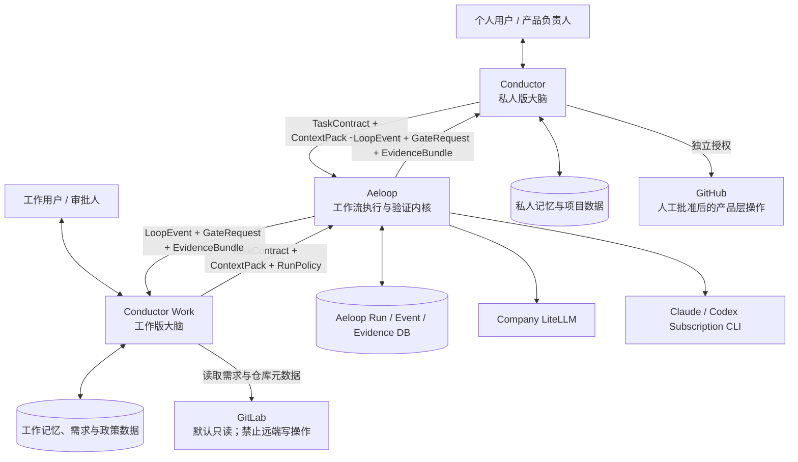
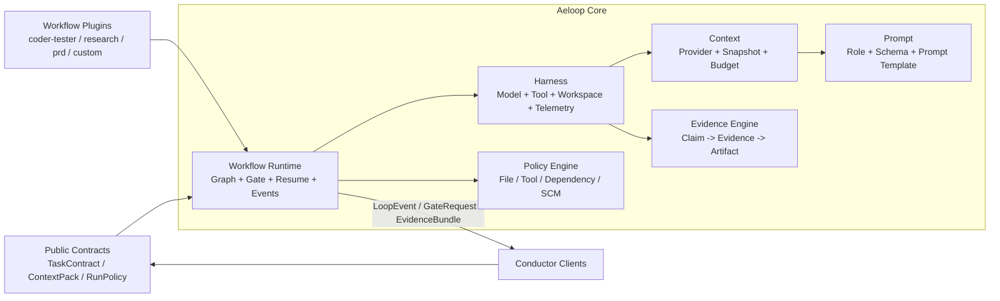
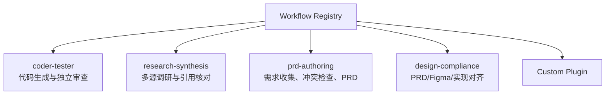
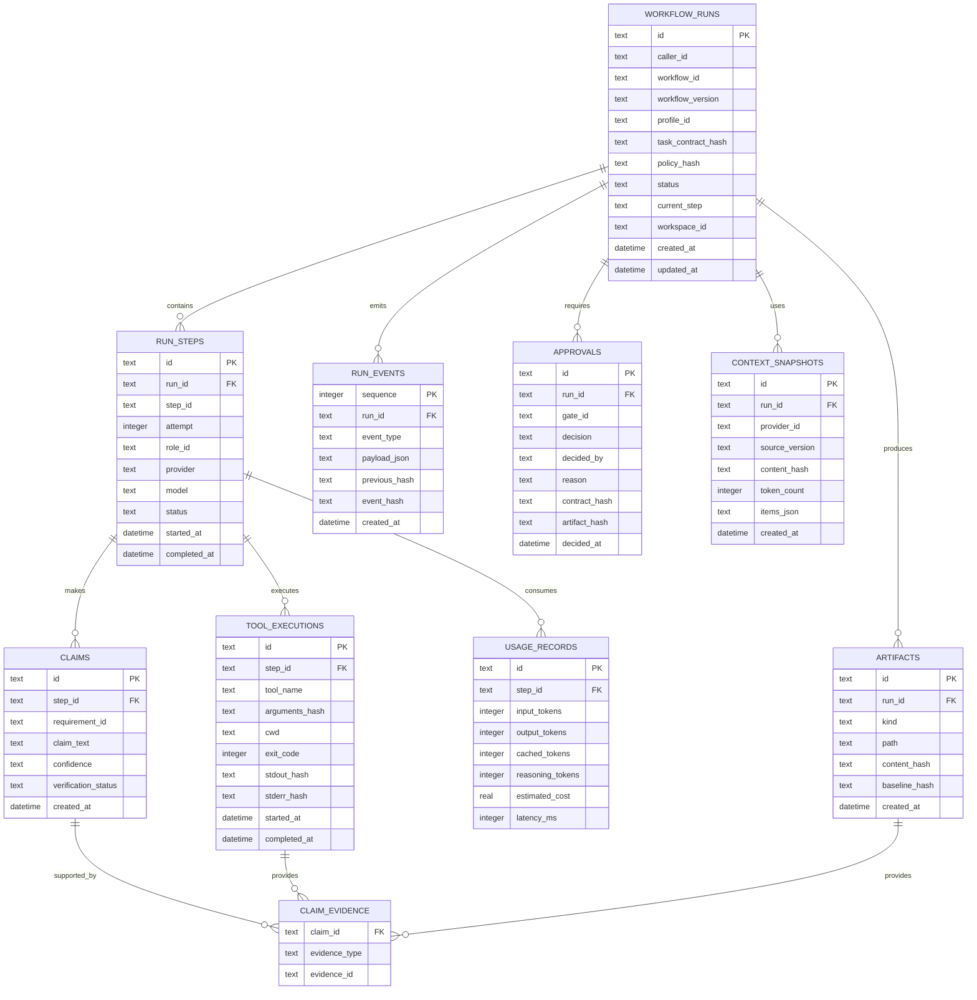
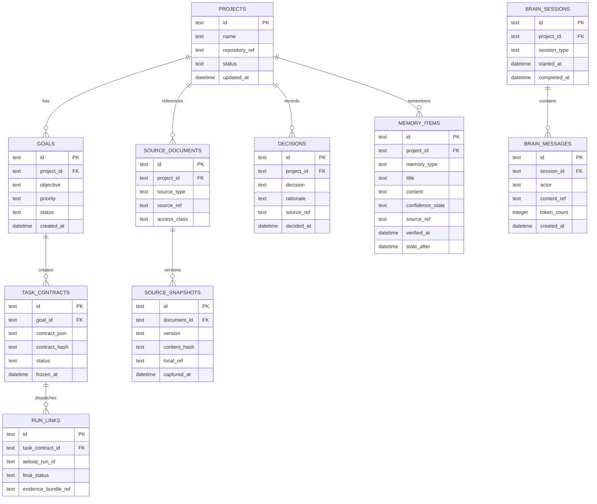

# Aeloop + Conductor 完整方案设计（个人决策版）

> 状态：个人决策稿 / 中文版（包含私人版与工作版，不作为领导演示材料）  
> 日期：2026-07-21  
> 目标：设计一个可开源的 AI 工作流执行内核，以及面向私人和工作场景的两套独立“大脑”产品。  
> 工作名称：`Aeloop`（执行内核）、`Conductor`（私人版）、`Conductor Work`（工作版）。产品名称为暂定名，公开发布前需完成名称与商标可用性检查。

---

## 1. 执行摘要

本方案采用“**一套执行内核、两套独立大脑、两套完全隔离的数据与策略**”的架构：

- **Aeloop** 是模型无关、产品无关的工作流执行与验证内核。它负责 Prompt、Context、Harness、Workflow Runtime、人工闸门、审计、恢复、证据和资源约束。
- **Conductor** 是私人版大脑，由现有 Helix 重构而来。它负责长期记忆、需求头脑风暴、跨项目优先级、私人项目编排，以及在人工批准后的 GitHub 协作。
- **Conductor Work** 是工作版大脑。它负责严格理解外部 PRD/Figma、冻结需求范围、执行公司安全与依赖政策，并通过 LiteLLM 调用 Aeloop。它不自动 commit、push、创建 PR 或 merge。

三者通过稳定的契约通信：

1. 大脑向 Aeloop 提交 `TaskContract + ContextPack + RunPolicy`；
2. Aeloop 通过 `LoopEvent + GateRequest` 报告执行过程；
3. Aeloop 最终返回 `EvidenceBundle`；
4. 大脑负责向用户展示结果并决定后续动作。

本方案保留未来扩展成通用工作流平台的能力。首个内置工作流仍是 `coder-tester`，但 Workflow、Role、Schema、Policy、Context Provider 和工具能力全部通过注册接口扩展，未来可以支持调研、竞品分析、PRD 编写、设计核对、数据整理等非编程工作流。

### 核心决策

1. **不重写 Aeloop。** 当前 A0–A5 已有大量有效实现和测试，应增量重构，而不是放弃已有验证资产。
2. **A6 暂缓到核心改造后执行，并保留为 Engine Baseline Acceptance。** 先完成公共契约、事件/API、workspace/evidence 和 Profile/Brain 接缝；再用 A6 对改造后的引擎做两种 Provider Profile 的真实验收。A6 不删除，也不以 mock 替代。
3. **大脑不写进 Aeloop。** Aeloop 只提供中立协议和执行机制。
4. **私人版和工作版使用相同工作名称、不同发行标识。** 建议使用 `Conductor` 与 `Conductor Work`；不要使用 `coder/tester` 作为产品名，因为那只是一个工作流角色组合，会限制未来非编程场景。
5. **代码可以公开，运行数据必须隔离。** 三个公开仓库不得包含私人记忆、公司 PRD、Figma 内容、内部 GitLab 地址、模型 ID、凭据或运行日志。
6. **Aeloop 永不直接执行远端 SCM 操作。** commit/push/PR/merge 属于产品层后处理，并受独立人工授权；工作版策略永久禁止这些动作。

---

## 2. 产品定位与关系

### 2.1 系统上下文



### 2.2 三个产品的职责

| 能力 | Aeloop | Conductor | Conductor Work |
|---|---|---|---|
| 产品身份与人格 | 不负责 | 私人军师、长期伙伴 | 严格、可解释的工作助手 |
| 长期记忆 | 不负责业务长期记忆 | 私人项目、决策、偏好 | 工作需求、项目规则、批准记录 |
| 需求形成 | 接收冻结契约 | 允许头脑风暴与挑战需求 | 严格依据外部 PRD/Figma |
| 项目优先级 | 不负责 | 跨私人项目调度 | 只在授权工作队列内调度 |
| 模型调用 | 负责 | 选择私人 Profile | 选择工作 Profile |
| 工作流执行 | 负责 | 选择工作流 | 选择工作流 |
| 人工闸门机制 | 生成与暂停 | 展示并收集决定 | 展示并收集决定 |
| 证据与审计 | 负责产生 | 投影到私人记录 | 投影到工作审计 |
| GitHub/GitLab | 不执行远端操作 | 可在额外批准后操作 GitHub | GitLab 默认只读，禁止远端写操作 |

### 2.3 “大脑”和 “Profile”不是同一件事

大脑负责“做什么、为什么、是否值得、如何与人协作”；Profile 负责“用哪个模型、什么权限、多少预算、哪些工具”。

因此正确关系是：

```text
Conductor       -> personal-subscription profile -> Aeloop
Conductor Work  -> work-litellm-strict profile   -> Aeloop
```

未来 Conductor 可以改用 API，Conductor Work 也可以换内部模型；这不会改变两个大脑的身份与数据边界。

---

## 3. 目标能力

### 3.1 减少幻觉

Aeloop 不依赖“请模型诚实”，而是建立可验证链路：

```text
Requirement
  -> Claim
  -> Changed Artifact
  -> Evidence
  -> Verification Result
  -> Human Decision
```

每条行为声明只能处于以下状态：

- `verified`：存在可复现证据；
- `failed`：验证失败；
- `not_proven`：没有足够证据；
- `stale`：证据或来源已经变化。

不得把模型自述、测试名称或任意一次工具调用当作完整证明。Claim 必须绑定具体命令、工作目录、退出码、输出摘要和 artifact hash。

### 3.2 上下文连续性

连续性分为两类：

- **Brain continuity**：由 Conductor/Conductor Work 保存长期记忆、项目历史、需求与判断。
- **Run continuity**：由 Aeloop 保存 TaskContract、ContextSnapshot、代码基线、步骤状态、未解决问题、测试证据和 gate 状态。

恢复时必须校验：

- 仓库 HEAD 与工作区是否变化；
- PRD/Figma/文档快照 hash 是否变化；
- 当前目录是否为原 run 的 workspace；
- 依赖与工具政策版本是否变化。

变化时暂停并要求重新确认，禁止静默继续。

### 3.3 Token 与成本效率

优化目标不是“单个 Prompt 最短”，而是：

```text
Total tokens / Accepted outcome
```

需要：

- 输入、输出、缓存、推理 Token 记录；
- 每个 Workflow/Step/Role 的预算；
- Context top-k、最低相关度、去重和截断；
- Coder 与 Reviewer 使用不对称上下文；
- 返工仅发送问题、增量 diff 和相关文件；
- 简单任务走单模型或确定性工具；
- 高风险任务才启用双模型与更多人工 gate；
- 达到 Token、费用、时间或回合上限后自动暂停。

### 3.4 提高结果可信度并减少漂移

工作版必须建立 Requirement Coverage Matrix：

| Requirement | Implementation | Test/Evidence | Result |
|---|---|---|---|
| REQ-001 | 文件与符号位置 | 命令与输出引用 | PASS/FAIL/NOT_PROVEN |

此外还要机械检查：

- 修改文件是否在 allowlist；
- 是否新增 PRD 未授权功能；
- 是否删除已有功能；
- 新依赖是否在 allowlist；
- registry 是否为允许的内部 registry；
- 是否出现 commit/push/PR/merge 命令；
- Reviewer 是否只读；
- Coder 与 Reviewer 是否使用独立模型。

---

## 4. 目标架构

### 4.1 Aeloop 内核



### 4.2 公共协议

#### TaskContract

```ts
export interface TaskContract {
  id: string;
  objective: string;
  requirements: Requirement[];
  acceptanceCriteria: AcceptanceCriterion[];
  sourceSnapshots: SourceSnapshot[];
  allowedPaths?: string[];
  forbiddenChanges: string[];
  riskLevel: "low" | "medium" | "high";
}
```

#### RunPolicy

```ts
export interface RunPolicy {
  workspace: WorkspacePolicy;
  tools: ToolPolicy;
  dependencies: DependencyPolicy;
  scm: ScmPolicy;
  budget: BudgetPolicy;
  gates: GatePolicy;
}
```

#### ContextProvider

```ts
export interface ContextProvider {
  id: string;
  retrieve(request: ContextRequest): Promise<ContextItem[]>;
  snapshot(items: ContextItem[]): Promise<ContextSnapshot>;
}
```

#### EvidenceBundle

```ts
export interface EvidenceBundle {
  runId: string;
  contractHash: string;
  workspaceBaseline: WorkspaceBaseline;
  requirementResults: RequirementResult[];
  claims: VerifiedClaim[];
  artifacts: ArtifactRecord[];
  toolExecutions: ToolExecutionRecord[];
  approvals: ApprovalRecord[];
  usage: UsageSummary;
  finalStatus: "accepted" | "rejected" | "cancelled" | "failed";
}
```

### 4.3 Workflow 插件模型

当前 `coder-tester` 不再代表整个产品，只是一个内置插件。

```ts
export interface WorkflowPlugin<TInput, TOutput> {
  manifest: WorkflowManifest;
  inputSchema: Schema<TInput>;
  outputSchema: Schema<TOutput>;
  build(deps: WorkflowDependencies): CompiledWorkflow<TInput, TOutput>;
}
```

```ts
export interface WorkflowManifest {
  id: string;
  version: string;
  title: string;
  roles: RoleDefinition[];
  requiredCapabilities: Capability[];
  supportedGates: GateDefinition[];
}
```

第一阶段使用 TypeScript 插件，每个插件内部仍然手写并测试 LangGraph，保持强类型和可审计。第二阶段再为简单流程增加声明式 YAML/JSON DSL；不在第一阶段直接建设 Ruflo 规模的通用动态图平台。



### 4.4 两级调度

系统明确区分：

- **Brain Orchestrator**：在 Conductor 中负责选择任务、项目、Workflow、Profile、风险与预算。
- **Workflow Runtime**：在 Aeloop 中负责单个 Run 内节点、重试、gate、checkpoint 和证据。

未来出现多任务并发需求后，可以增加可选的 `RunScheduler`，负责队列、优先级、并发、worker lease、worktree 分配和额度，但它不负责业务判断，也不进入四层内核。

---

## 5. 私人版与工作版

### 5.1 Conductor（私人版）

定位：私人项目大脑和一人公司的战略调度员。

主要能力：

- 与用户头脑风暴并挑战需求；
- 管理多个私人项目和优先级；
- 保存长期决策、偏好与失败经验；
- 将确认后的需求编译成 TaskContract；
- 选择 Aeloop Workflow 与 subscription Profile；
- 展示 gate、事件和 EvidenceBundle；
- 在独立人工授权后执行 GitHub 后处理。

### 5.2 Conductor Work（工作版）

定位：严格执行外部需求、强调安全与可追溯的工作助手。

主要能力：

- 读取 PRD、Figma snapshot、仓库规范；
- 将每条需求转换成稳定 Requirement ID；
- 发现需求冲突时暂停，不自行修改需求；
- 强制 work-litellm-strict Profile；
- 强制文件、工具、网络和依赖政策；
- 将 Aeloop EvidenceBundle 投影为工作审计报告；
- 永久禁止 commit、push、PR 和 merge。

### 5.3 代码公开与数据隔离

两个大脑的程序代码可以公开，但运行数据必须外置：

```text
Public repository
  - application code
  - generic personas
  - generic policy examples
  - sample TaskContracts
  - fake/demo providers

Never committed
  - private memories
  - company PRDs and Figma content
  - internal repository URLs
  - LiteLLM endpoints, model IDs and credentials
  - run databases and logs
  - real project snapshots
```

---

## 6. 目标文件结构

### 6.1 Aeloop

保持当前单包结构，先增量整理；暂不为了“看起来先进”切换 monorepo。

```text
aeloop/
├── src/
│   ├── contracts/                 # Public, product-neutral contracts
│   │   ├── task-contract.ts
│   │   ├── context-pack.ts
│   │   ├── run-policy.ts
│   │   ├── events.ts
│   │   └── evidence-bundle.ts
│   ├── prompt/                    # Prompt templates and schema registry
│   ├── context/
│   │   ├── providers/             # ContextProvider implementations
│   │   ├── budget.ts
│   │   ├── snapshot.ts
│   │   └── cache-store.ts
│   ├── harness/
│   │   ├── adapters/              # Claude/Codex/LiteLLM adapters
│   │   ├── tools/                 # Tool execution abstraction
│   │   ├── workspace/             # Isolated worktree/sandbox
│   │   ├── telemetry/             # Token/cost/time
│   │   └── provider-router.ts
│   ├── policy/
│   │   ├── engine.ts
│   │   ├── file-policy.ts
│   │   ├── dependency-policy.ts
│   │   ├── tool-policy.ts
│   │   └── scm-policy.ts
│   ├── evidence/
│   │   ├── collector.ts
│   │   ├── claim-verifier.ts
│   │   └── artifact-hasher.ts
│   ├── loop/                      # Workflow runtime, checkpoint, gates
│   ├── workflows/
│   │   ├── registry.ts
│   │   └── coder-tester/          # First built-in workflow plugin
│   ├── plugins/                   # Plugin loading and capability checks
│   ├── cli/
│   └── index.ts                   # Stable public API only
├── profiles/
│   └── examples/                  # Generic examples only
├── docs/                          # English technical documentation
├── examples/
├── tests/
├── SECURITY.md
├── CONTRIBUTING.md
├── LICENSE
└── README.md                      # English + optional Chinese section
```

### 6.2 Conductor

```text
conductor/
├── src/
│   ├── brain/
│   │   ├── identity.ts
│   │   ├── planner.ts
│   │   ├── risk-classifier.ts
│   │   └── task-contract-builder.ts
│   ├── orchestrator/
│   │   ├── conductor.ts
│   │   ├── run-dispatcher.ts
│   │   └── gate-handler.ts
│   ├── memory/
│   ├── context-providers/
│   │   ├── local-docs.ts
│   │   ├── github.ts
│   │   └── project-state.ts
│   ├── aeloop-client/
│   ├── scm/github/                # Separate authorization boundary
│   ├── projections/               # LoopEvent -> brain state
│   └── cli/
├── config/examples/
├── policies/
├── docs/                          # English
├── private/                       # gitignored local overlay
├── SECURITY.md
├── CONTRIBUTING.md
├── LICENSE
└── README.md                      # Bilingual allowed
```

### 6.3 Conductor Work

```text
conductor-work/
├── src/
│   ├── brain/
│   │   ├── identity.ts
│   │   ├── strict-planner.ts
│   │   ├── requirement-compiler.ts
│   │   └── ambiguity-detector.ts
│   ├── orchestrator/
│   ├── memory/
│   ├── context-providers/
│   │   ├── prd.ts
│   │   ├── figma.ts
│   │   ├── gitlab-readonly.ts
│   │   └── repository-rules.ts
│   ├── aeloop-client/
│   ├── policies/
│   │   ├── company-strict.ts
│   │   ├── dependency-allowlist.ts
│   │   ├── network-allowlist.ts
│   │   └── scm-deny.ts
│   ├── projections/
│   ├── reports/
│   └── cli/
├── config/examples/
├── docs/                          # English
├── local/                         # gitignored company overlay
├── SECURITY.md
├── CONTRIBUTING.md
├── LICENSE
└── README.md                      # Bilingual allowed
```

---

## 7. 数据库设计

### 7.1 Aeloop Run Database

Aeloop 数据库只保存执行事实，不保存私人或公司长期业务记忆。



LangGraph checkpoint 表继续由其官方 SQLite saver 管理，不手工耦合其内部 schema。业务审计表与 checkpoint 表保持职责分离。

### 7.2 Brain Database

Conductor 和 Conductor Work 可以采用相似的逻辑 schema，但必须使用不同数据库、不同路径、不同加密与备份策略。



工作版可以在此基础上增加 Requirement、PolicyVersion、ApprovalAuthority 等表，但这些属于 Conductor Work，不进入 Aeloop。

---

## 8. 对当前 Aeloop 的改造判断

### 8.1 保留

- 四层依赖方向；
- ProviderRouter 与 AdapterRegistry；
- Claude/Codex/LiteLLM adapters；
- Zod 结构化输出验证；
- SQLite checkpoint；
- coder-tester 状态机；
- escalation threshold；
- 当前 audit 表作为迁移基线；
- A5 CLI 的 start/resume/list；
- 当前事件分支的 LoopEvent/Emitter。

### 8.2 必须尽快改造

#### P0：可信执行与产品接入

1. 合并 A5 与 Event System，解决分支基线分离。
2. 从 `src/index.ts` 正式导出公共 Contracts、Runner、Events 和 Gate API。
3. 增加强制 Workspace ID、cwd、baseline hash 校验；错误 worktree 不再只警告。
4. 明确定义候选变更生命周期，修复“Coder 已写文件但 apply 只是布尔值”的语义冲突。
5. 将 ToolExecVerifier 从存在性检查升级为 Claim-to-Evidence 绑定。
6. 增加 SCM deny policy，工作 Profile 在任何情况下都禁止远端写操作。
7. 为 LiteLLM 路径补足真实代码 artifact 与确定性测试证据的连接方式。

#### P1：连续性与 Token

1. 引入 TaskContract、ContextPack、ContextSnapshot、RunPolicy。
2. 增加 Token/费用/延迟 telemetry。
3. 为 Context 增加 top-k、预算、去重、截断和来源 hash。
4. 不再无条件注入全部 decision；大脑提供长期上下文，Aeloop只保存 run snapshot。
5. Coder 与 Reviewer 使用独立、最小化上下文。
6. 返工仅发送增量信息。

#### P2：通用 Workflow

1. 将固定 `Role` 类型泛化为 Role Registry。
2. 将 CoderOutput/TesterOutput 移入内置 coder-tester 插件。
3. 将当前硬编码图封装为真实 WorkflowPlugin。
4. 让 Event、Audit 和 UI 使用通用 `stepId/roleId`，不硬编码 draft/review。
5. 增加 plugin manifest、capability negotiation 和 version pinning。
6. 至少用第二个非编程 workflow 验证接口，推荐 `research-synthesis`。

### 8.3 不建议重写

当前 Aeloop 已积累数百个测试，并且 Context、Harness、Loop、Checkpoint 和 CLI 都有真实实现。重写会丢失最有价值的验证资产，并重新暴露已经修复过的 checkpoint、resume、schema、adapter 和审计缺陷。

建议在当前仓库完成增量迁移，每个主题使用独立 feature branch 和 PR，不创建一个跨数周的大型重构分支。

---

## 9. A6 决策

### 9.1 A6 应暂缓，但不能删除

A6 是核心改造后的 Engine Baseline Acceptance，暂缓的原因是当前 A5 仍缺少稳定的 Brain 接缝和完整证据链；现在先跑会把旧架构的限制固化成错误基线。改造后 A6 需要回答：

- subscription profile 是否能真实调用 Claude/Codex；
- apikey profile 是否能真实调用公司 LiteLLM；
- 两种路径是否都能输出合法结构；
- start/gate/resume 是否真实跨进程；
- 当前 Token、workspace、artifact 与安全能力有哪些真实缺口。

已有 `profiles/apikey/config.yaml` 在公司环境跑通，降低了 A6 的 Provider 风险，但不能替代完整 Loop 验收。

### 9.2 推荐执行顺序

1. 完成并合并 A5 CLI。
2. 将 Event System rebase 到包含 A5 的最新 main，独立审查后合并。
3. 从 Contracts/Public API 开始增量改造。
4. 完成 Workspace/Evidence、Context/Token 和 Profile/Brain 接缝。
5. 执行 A6 subscription 与 apikey 真实任务，冻结改造后的基线报告。
6. 进入两个 Conductor 产品的真实接入与第二个 Workflow。

### 9.3 A6 不应声称

- 已经节省 Token；
- LiteLLM 模型已经真实执行代码工具；
- `apply` 已安全应用 patch；
- 工具声明已形成完整证据链；
- 工作版已达到生产安全要求。

这些应作为后续里程碑的显式验收项。

---

## 10. 建议路线图

| 阶段 | 目标 | 关键交付 |
|---|---|---|
| A6 (deferred) | Engine Baseline Acceptance | 核心改造后，两种 Profile 真实运行与缺口报告 |
| A7 | Public Contracts & Events | TaskContract、RunPolicy、ContextPack、EvidenceBundle、稳定 API |
| A8 | Trusted Workspace & Evidence | worktree、baseline、artifact、claim-evidence、SCM deny |
| A9 | Context Continuity & Token | ContextProvider、snapshot、budget、usage telemetry |
| A10 | Workflow Plugin Runtime | Role Registry、WorkflowPlugin、coder-tester 内置插件 |
| A11 | Conductor Personal MVP | Helix 迁移、私人记忆、TaskContract、Aeloop Client |
| A12 | Conductor Work MVP | PRD/Figma、严格 policy、LiteLLM、GitLab read-only、报告 |
| A13 | Second Workflow Proof | research-synthesis 或 prd-authoring 插件 |
| A14 | Evaluation & Open-source Hardening | benchmark、安全、文档、license、release automation |

### 建议的实现并行度

在 A7 稳定前，不应同时大规模开发两个大脑。可以先建立两个仓库骨架，但真实接入顺序建议：

1. Aeloop A7/A8；
2. Conductor Work 最小 Demo（需求明确、范围最窄，适合验证契约）；
3. Conductor 私人版迁移（Helix 数据与历史更复杂）；
4. A9/A10；
5. 第二个非编程 Workflow。

---

## 11. 明早工作版 Demo 范围

建议把首个 Demo 定义为“严格、安全、可追溯的候选变更闭环”，而不是宣称完全无人值守开发。

```text
加载示例 PRD
-> Conductor Work 生成 Requirement IDs
-> 冻结 TaskContract
-> 选择 work-litellm-strict Profile
-> Aeloop Coder 生成候选 diff
-> 人工 G1
-> 独立 Tester 审查
-> G3
-> 输出 Evidence/Audit Report
-> 明确停止，不执行任何远端 Git 动作
```

Demo 必须展示：

- 同一需求如何被两个不同模型处理；
- Requirement Coverage；
- Gate 暂停与恢复；
- 事件流；
- 禁止 SCM 远端写操作；
- 当前已验证与未证明的边界；
- 最终报告如何供人 review。

如果需要现场修改代码，只允许在隔离演示仓库中通过受限 patch runner 进行，并只运行 allowlist 中的测试命令。首次 Demo 不应使用真实核心工作仓库进行自动写入实验。

---

## 12. 开源标准

### 12.1 语言

- 代码标识、代码注释、错误信息、技术文档：英文；
- README：英文为主，可保留独立中文章节；
- 本领导评审方案：中文；
- 私人或公司运行时内容：不进入公共仓库。

### 12.2 仓库要求

每个仓库至少包含：

- 明确 License；
- `SECURITY.md`；
- `CONTRIBUTING.md`；
- Code of Conduct；
- Threat model；
- 示例配置但无真实 endpoint/model/credential；
- CI build/test/lint；
- Secret scanning；
- Dependency review；
- SemVer 与 changelog；
- 公共 API compatibility policy；
- 所有示例数据为人工构造数据。

### 12.3 公司安全边界

公共 `Conductor Work` 只包含机制。公司实际使用时，以下内容通过 repo 外部配置或公司内部 overlay 注入：

- LiteLLM endpoint/token/model IDs；
- GitLab URL/project IDs；
- dependency allowlist 和 registry；
- PRD/Figma 数据；
- 日志策略、脱敏规则和保留周期；
- 用户与审批权限。

---

## 13. 验收指标

### 13.1 减少幻觉

- unsupported claims / total claims；
- claims with reproducible evidence；
- Tester 捕获的错误声明；
- 人工发现但双模型未发现的问题。

### 13.2 连续性

- 跨进程恢复成功率；
- 恢复时发现 context/repo drift 的比例；
- 需要用户重新解释完整背景的次数。

### 13.3 Token

- total tokens / accepted outcome；
- context tokens / invocation；
- cache hit rate；
- schema retry rate；
- 单模型与双模型的任务分流比例。

### 13.4 可信与自动化

- requirement coverage；
- out-of-scope change rate；
- escaped defect rate；
- human rework time；
- 无人工介入完成到第一个 gate 的比例；
- policy violation 拦截率。

---

## 14. 最终建议

1. 保留并增量改造现有 Aeloop，不重写。
2. 继续 A6，将它作为重构前真实基线。
3. 将 Helix 重构为 `Conductor`，但私人记忆继续保持私有和本地化。
4. 新建独立的 `Conductor Work`，使用相同公共契约、完全独立的数据与政策。
5. 两个大脑都通过 Aeloop 的稳定 API 工作，不深层导入内部文件。
6. 先完成 Typed Workflow Plugin，再考虑声明式 Workflow DSL。
7. 通过第二个非编程工作流证明系统不是 coder-tester 专用工具。
8. Aeloop 停在可信执行层；大脑、产品 UI、SCM 后处理永远留在产品层。

这套设计最终形成的不是另一个 Ruflo，而是一个更聚焦的体系：

> **Aeloop 提供可验证、可恢复、可治理的工作流执行；Conductor 提供长期上下文、判断和人与系统之间的协作。**
