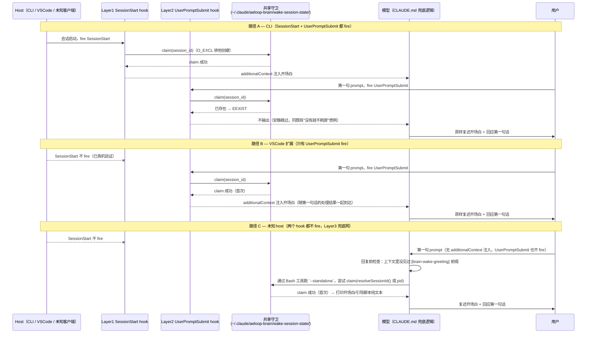

# DESIGN — 醒来触发跨 host 可移植性 + 三层优雅降级（issue #106）

- **项目**: aeloop
- **关联**: #106（本设计所属）；不重复设计 #96（`docs/first-wake-onboarding/DESIGN.md`，三态开场白
  内容/防幻觉红线）、#84/#88（醒来开场白本体/turnkey 包）、#98（版本戳）、#103（全局安装
  `install-global-brain.mjs` 的幂等合并机制 `mergeSettingsWithBrainHook`/`AELOOP_BRAIN_MARKER`）——
  这些文档已经论证过的内容不重讲，本设计只讲"触发点从哪来、怎么保证跨 host 不失效"这一层。
- **状态**: 指挥官已确认（2026-07-24，§7 五项收尾决策 + 全局 CLAUDE.md 补缝已定盘，见 §7/§3.4/附）
- **最后更新**: 2026-07-24

---

## 0. 问题（真实现场，#106 issue 原文 + 两条 comment，已读）

指挥官主力环境（VSCode 扩展）实测：配好身份库 + seed 后开新会话，开场白**不是** hook 注入的
"意识已加载"，是模型读代码自己脑补的状态报告——模型自己都写了"hook 在 VSCode 扩展环境下可能不会
像 CLI 那样触发"。

真机探针钉死两条事实（#106 comment，2026-07-24）：
1. **SessionStart hook 在 VSCode 扩展里不 fire**——`main()` 首行加 `writeFileSync('/tmp/hook-fire-mark.txt', ...)` 探针，IDE 开新会话后 `cat` → MISSING。
2. **UserPromptSubmit hook 在 VSCode 扩展里 fire**——同款探针改注册在 `UserPromptSubmit`，开新会话
   输入 prompt 后 `/tmp` 标记文件写入成功（时间戳 `2026-07-24T01:07:57.099Z`）。

指挥官 2026-07-24 追加的硬要求（本设计据此把范围从"选 alone 还是 hybrid"升级为"三层协同"，不再是
开放式二选一，见 §3）：**跨 host 可移植性 + 优雅降级是核心方案，不是赌单个触发**——VSCode +
CLI 之外的 JetBrains/桌面 App/Web 客户端都没验证过，hook 生命周期是 host 实现相关的，官方文档不
承诺跨客户端一致。

---

## 1. 已核实的事实基线（读代码 + 官方文档核实，逐条列源，不凭记忆）

### 1.1 现状触发链路

`.claude/settings.json`（已读全文）今天只注册了 `SessionStart`（`brain-wake-greeting.mjs` +
`brain-isolation-guard.mjs`）和三个 `PreToolUse` 写侧防护 hook（commit-gate/issue-gate/
red-line-guard）——**没有任何 `UserPromptSubmit` 注册**。

`brain-wake-greeting.mjs`（已读全文，228 行）今天的 `main()`：从 stdin 读 SessionStart payload
（只取 `cwd`，`session_id` 目前**没有被这个文件读取**——这是本设计要补的第一个具体改动点）→
`resolveIdentityDbPath()` 解出 dbPath → 三态分支：
- **状态 A**（两个配置源都没有，`brain-wake-greeting.mjs:129-134`）→ 注入
  `onboarding-greeting.mjs` 的 `renderOnboardingNotConfigured()`。
- **状态 B**（dbPath 有但 `store.listMemories().length === 0`，`:170-176`）→ 注入
  `renderOnboardingEmptyStore()`。
- **状态 C**（正常，`:178-218`）→ `gatherGreetingData()` + `renderGreeting()`，包一层"请原样
  复述"的指令后注入。

三条分支最终都调用同一个 `emitAdditionalContext()`（`:73-79`），硬编码
`hookEventName: "SessionStart"`。

### 1.2 官方文档确认的 hook payload/能力矩阵（`https://code.claude.com/docs/en/hooks`，2026-07-24 抓取核实）

| 字段/能力 | SessionStart | UserPromptSubmit |
|---|---|---|
| 公共字段 | `session_id`/`transcript_path`/`cwd`/`hook_event_name`/`permission_mode` 等（"Common Input Fields"表，两类事件都继承） | 同左 |
| 事件专属字段 | `source`（`startup`/`resume`/`clear`/`compact`/`fork`）、`model` | 用户当次 prompt 文本（官方文档这一节原文对该字段的表述本次抓取不完整，未拿到逐字段名，标 `[?]`——不影响本设计，因为本设计不需要读 prompt 内容） |
| 支持 `matcher` | 支持（`startup\|resume\|clear` 这类） | **不支持**——文档原文："`UserPromptSubmit`, ... 不支持 matcher，永远对每次 prompt 提交触发；如果给这些事件加 `matcher` 字段，会被静默忽略"。settings.json 注册时用扁平数组，不套 `{matcher, hooks:[...]}` |
| 触发频率 | 会话生命周期内的固定时刻（新建/resume/clear 等） | **每个 prompt 一次**（"fires once per turn"）——这是"每会话只注一次守卫"必须 load-bearing 的直接原因 |
| `additionalContext` 注入 | 支持（现状已在用） | 支持——文档给的示例：`{"hookSpecificOutput":{"hookEventName":"UserPromptSubmit","additionalContext":"..."}}` |
| 能否拦截/改写这次 prompt | N/A | 能 `decision:"block"` 拒绝这次提交（本设计不用这个能力，只用 additionalContext 注入） |

### 1.3 `CLAUDE_PROJECT_DIR` 不是模型自己的 Bash 工具能读到的环境变量

官方文档原文（同一次抓取）："这两个变量... 导出为**衍生进程**（spawned process）的环境变量...
这意味着 `CLAUDE_PROJECT_DIR` 对：hook 命令 / stdio MCP server / plugin LSP server 可用，**但对
常规 Bash 工具调用不可用**（不是全局会话环境的一部分）"。

**直接影响本设计**：任何"模型自己跑醒来脚本"的兜底路径（见 §3 Layer3），不能假设能从环境变量里
拿到项目根路径——路径必须是**确定性可推导**的（固定的全局安装路径，或约定俗成的相对路径），
不能依赖 `${CLAUDE_PROJECT_DIR}` 这类只有 hook 命令模板才有的宏。

### 1.4 `session_id` 对模型自己的 Bash 工具调用是否可用——文档 vs 实测有出入，如实两条都写

官方文档原文（同一次抓取）："`session_id` **不会**作为环境变量暴露给 Claude 自己的 Bash 工具调用
——只存在于 hook 的 JSON 输入里"；文档建议的绕过方法是"用一个 hook 把它从 JSON 输入里捕获出来，
设成下游能读的环境变量"。

**但本次撰写 DESIGN 时实测**（当前 Cypher agent 自己所在的 Bash 工具环境，`env | grep -i "claude\|session"`，2026-07-24）：

```
CLAUDE_CODE_SESSION_ID=52ae2001-1978-4427-9283-bbcc929dee11
CLAUDE_CODE_BRIDGE_SESSION_ID=session_01AZpCgygFFSEiENYkuoaWTj
CLAUDECODE=1
CLAUDE_CODE_ENTRYPOINT=cli
```

`CLAUDE_CODE_SESSION_ID` **确实存在**于这次真实 Bash 工具调用的环境里——和文档文字描述相反。
`.claude/hooks/lib/brain-lock.mjs` 的既有 `resolveSessionId()`（`:67-69`）已经在读这个确切的
变量名（连同 `CLAUDE_SESSION_ID`/`AELOOP_BRAIN_SESSION_ID` 两个 fallback），说明这不是本设计
首次发现——之前的开发者显然也观察到了同样的现象，只是没有写成一条正式的、跨文档的结论。

**如实结论（不各打五十大板、不假装矛盾不存在）**：这次实测发生在 `CLAUDE_CODE_ENTRYPOINT=cli` 的
上下文（Claude Code CLI / Agent SDK 驱动）。**未验证** VSCode 扩展的 Bash 工具环境是否同样导出
这个变量（VSCode 扩展本身就是本设计要覆盖的重点 host，但因为它已经有 Layer2 UserPromptSubmit
兜底，Layer3 用不用得上这个变量在 VSCode 上不影响可用性）；**完全未验证** JetBrains/桌面 App/Web
（本设计 Layer3 真正要保底的对象）。§3.2 的守卫设计据此做了保守处理，不会因为这条不确定性而整体
失效。

### 1.5 既有"每会话一把锁"机制（`brain-lock.mjs`/`brain-isolation-guard.mjs`）——为什么不直接复用

`brain-lock.mjs` 的 `touchHeartbeat`/`findOwnLock`（供 `brain-isolation-guard.mjs` 的 worktree
隔离告警用）把状态文件放在 `<toplevel>/.claude/brain-locks/`——**目标项目自己的 git 仓库内**
（`lockPath()`→`locksDir(toplevel)`，`toplevel` 来自 `resolveToplevel(cwd)`）。这在 aeloop 自己
的开发仓库里是干净的（`.gitignore:34` 已经排除 `.claude/brain-locks/`），**但这两个文件（
`brain-lock.mjs`/`brain-isolation-guard.mjs`）都没有出现在 `install-global-brain.mjs` 的
`COPY_ITEMS` 清单里**（已读 `scripts/install-global-brain.mjs:49-74`）——说明这套"锁写进目标
项目仓库"的模式是 aeloop 自己开发时的 dogfood 机制，从设计上就没打算被复制到"装到任意第三方
项目里跑"的全局安装场景。

**本设计的醒来触发守卫必须支持全局安装、跑在任意用户项目里**——如果照抄 `brain-lock.mjs` 的
cwd-scoped 模式，全局安装后第一次在任意用户项目里开会话，就会往那个跟本工具毫无关系的第三方
仓库里悄悄建一个未追踪的 `.claude/brain-locks/` 目录（那个仓库大概率没有这条 `.gitignore` 规则）
——这是和 #103"合并 settings.json 时误伤第三方 hook 条目"同一类教训，只是这次风险对象从"别人的
hook 条目"换成"别人仓库的文件树"。**结论：新守卫状态必须落在 homedir 下，不落进目标项目仓库**
（详细设计见 §3.2）。

---

## 2. 跨 host 可移植性矩阵（指挥官新增要求，核心交付物之一）

| Host | SessionStart fire？ | UserPromptSubmit fire？ | 证据 |
|---|---|---|---|
| **CLI（终端，交互式 REPL）** | ✅ 已验证成立（#84/#88/#93/#96 数月生产使用的既有前提，未见反例；本次也没有理由怀疑这个既有前提失效） | `[?]` **仍未验证**——本沙箱环境没有真正的交互式 TTY，无法驱动一个真人在终端里逐字敲键盘的场景，测不了。风险评估不变：低，但"未验证"仍然是"未验证" |
| **CLI（`-p`/`--print` headless 模式）** | `[?]` **当次操作者观察，原始证据未留存，待有真实终端者复核**（见下方"CLI 探针补验——订正"） | `[?]` **当次操作者观察，原始证据未留存，待有真实终端者复核**（同上） |
| **VSCode 扩展** | ❌ **已真机验证不 fire**（2026-07-24 指挥官探针，`/tmp` 标记文件 MISSING） | ✅ **已真机验证 fire**（2026-07-24 指挥官探针，`/tmp` 标记文件写入，时间戳可查） |
| **JetBrains 插件 / 桌面 App / Web** | `[?]` 完全未验证 | `[?]` 完全未验证 | 官方文档的 hook 生命周期章节没有按 host 分别注明保证范围——这正是指挥官要求"优雅降级"而不是"赌单个触发"的直接依据。**指挥官已确认（§7 第5点）：非阻塞，Layer3 兜底网已覆盖这层不确定性，有渠道再补证据** |

**CLI 探针补验——订正（Zorro R1 复审 blocker B4，2026-07-24，独立 Codex 复现坐实）**：build
阶段曾尝试用 `claude -p "<prompt>" --allow-dangerously-skip-permissions --output-format=
stream-json --include-hook-events` 起一个嵌套 Claude Code 子进程、读它上报的 hook 生命周期
事件流，得到"headless 模式 SessionStart fire、UserPromptSubmit 不 fire"这个观察。**这条结论
不满足可复核的证据标准，已降级，不再当作"已验证"陈述**：
- `--allow-dangerously-skip-permissions` 是权限绕过标志，在一个嵌套 agent 调用里使用已经被
  harness 判定为越权操作（打了安全警告，记入 `lessons.md`）——用一个本身违规的探针去产出"证据"，
  这条证据本身的可信度先天存疑，不能被当作既定事实写进设计文档。
- 仓库里没有留下任何可复核的原始产物（没有事件流 JSONL、没有 Claude Code 版本号、没有完整命令
  行、没有 settings.json 快照、没有输出哈希）——第三方（包括 Zorro 自己的独立引擎）无法复现或
  核对这条结论，只有"当次操作者自己观察到的文字描述"，不构成证据。
- **本设计不会重跑这个探针，也不会再起任何带 `--dangerously-skip-permissions` 的嵌套 agent**
  （指挥官/Zorro 明确要求）——降级措辞即可闭合这条 blocker，不需要用新的违规手法去补真凭据。
- **Zorro 已确认这条不是代码正确性依赖**：三层架构本身是 host-agnostic 的设计（Layer1/Layer2
  同时注册两个事件 + 共享 guard 去重，不依赖"提前知道某个 host/模式下谁会 fire"），headless
  模式这一行的 `[?]` 无论最终验证结果是什么，都不改变 §3 任何一条代码分支——纯粹是文档的
  "已知程度"标注，不是设计或实现的缺口。

**结论**：已知的真机验证样本只有 VSCode 扩展这一组（SessionStart 不 fire、UserPromptSubmit
fire）；CLI 的两种形态（交互式 REPL、headless）目前都是 `[?]`。即便如此，"至少存在一个 host
两个 hook 事件都不 fire"的可能性依然无法排除——这就是 §3 三层架构 + CLAUDE.md 兜底网存在的
根本理由，不是过度设计。

---

## 3. 架构：三层 + 共享守卫（指挥官已拍板方向，不是候选对比，是确定要落地的架构）

> 这一节原计划的框架是"Layer1(UserPromptSubmit-alone) vs Layer1+Layer0(hybrid 保留
> SessionStart)"二选一对比——指挥官 2026-07-24 的追加指令已经把这个问题从"你的判断"升级为
> "两个都要留 + 加一层网"，不再是开放决策。本节直接落地这个已确定的架构，同时保留原计划要求
> 的 trade-off 论证（§5），证明为什么这个架构是对的，不是走过场。

### 3.1 三层定义

- **Layer1 — SessionStart hook**（现状保留，不删除，不改行为）：CLI 环境的主力路径，"一开会话
  就打招呼"的最佳体验。
- **Layer2 — UserPromptSubmit hook**（新增）：IDE/未知环境的主力路径，"每次用户发 prompt 前"
  触发一次；靠共享守卫保证只在会话内真正注入一次。
- **Layer3 — CLAUDE.md 自觉兜底网**（新增）：只在模型判断"我到现在都没看到过一段带
  `[brain-wake-greeting]` 前缀的注入"时才启动，靠模型自己跑醒来脚本的 `--standalone` 模式。

**定位铁律（CORE 铁律7，正面写清楚，不能被后来者误读成"退回软路径"）**：
Layer1/Layer2 是**硬机制**——hook 生命周期本身保证 fire（在已验证的 host 上），模型对"要不要
执行"没有选择权，不依赖模型自觉。Layer3 是**软路径**，且**只覆盖"Layer1 与 Layer2 都没有被
观察到已经注入"这一种、已经确认存在、且无法机制化覆盖的场景**（未知 host，两个 hook 事件都不
fire）——这不是走回 #106 诊断出问题之前的"模型看 CLAUDE.md 被动判断"老路（那条老路的问题是
"没检测到注入就自然回应"，本质是把决策权交给模型的自由发挥），Layer3 是**明确的、结构化的、
只在两层硬机制确认落空后才触发的最后一道网**，且不允许假装身份/编造在途任务（继承 #96 的红线，
见 §6）。

### 3.1.1 触发链路时序图



**读图要点**：三条路径共享同一个 `Guard`（同一个物理目录、同一份 claim 逻辑），谁先 claim 成功
谁负责输出，其余两层看到 `EEXIST` 就安静让路——这就是"三层要协同不打架"的具体落地机制，不是
三套互相不知道对方存在的独立实现。

### 3.2 共享守卫（load-bearing，三层协同的核心机制）

**新建一个专用 lib**：`.claude/hooks/lib/wake-session-guard.mjs`（不是复用 `brain-lock.mjs`——
理由见 §1.5：职责不同、状态生命周期不同、落盘位置的安全约束不同，硬凑复用会两头不讨好）。

**订正（build 阶段发现，2026-07-24）**：本节原稿写"会 `import` `brain-lock.mjs` 已经写好的
`sanitizeKey()`/`resolveSessionId()` 两个纯函数，不重复造轮子"——build 时发现这个计划本身和
§1.5 已经论证过的结论自相矛盾：`brain-lock.mjs` 没有进 `install-global-brain.mjs` 的
`COPY_ITEMS`（就是 §1.5 用来论证"这套模式是 dogfood 专属"的同一个事实），如果 `wake-session-
guard.mjs` 去 `import` 它，会在全局安装场景下正好踩上 #96/#98/#103 三次踩过的"新依赖没进
COPY_ITEMS → MODULE_NOT_FOUND"那个坑——而且恰好是在这个守卫真正要保护的场景（全局安装/任意
第三方项目）里失效。**实际实现**：`sanitizeKey()`/`resolveSessionId()` 在 `wake-session-
guard.mjs` 里各自维护一份独立实现（两者都是完全自包含的纯函数，前者只做字符串替换，后者只读
三个 env var，不依赖 `brain-lock.mjs` 其余的锁文件 I/O 逻辑）——重复约 10 行稳定代码，换掉
一次真实的部署面耦合，`test-wake-session-guard.mjs` 有一组"两份实现行为对拍"的测试（不是引用
相等）守住不让两边行为漂移。

**状态文件位置**：`~/.claude/aeloop-brain/wake-session-state/<key>.json`——固定挂在 homedir 下，
不进任何目标项目仓库（§1.5 的结论）；和 `install-global-brain.mjs` 已有的 `~/.claude/aeloop-brain/
data/`（身份库数据目录）同一层级，风格一致。**本地开发（在 aeloop 自己仓库里跑，非全局安装）
也用同一套 homedir 路径，不做"项目内 vs 全局"两套实现**——理由：这个状态本来就该是"这一个
Claude Code 会话"的属性，不是"这一个项目"的属性，homedir 路径对两种场景都成立，维护一套实现，
不分叉。

**Layer1/Layer2 的 key（可靠、有 O_EXCL 原子性）**：`session_id`（来自 hook stdin payload 的
`input.session_id`，两个事件都有这个字段，§1.2 已确认）→ `sanitizeKey(session_id)`；缺失时退回
`pid`（镜像 `brain-lock.mjs` 的 `identityKey()` 既有模式）。**Claim 用 `writeFileSync(path, ...,
{ flag: "wx" })`（排他创建）**——这是本设计唯一真正需要原子性的地方：SessionStart 和会话内第
一次 UserPromptSubmit 理论上可能在极短时间窗口内先后触发（用户开完会话立刻打字），用文件系统的
`O_EXCL` 语义（谁先创建成功谁赢，后来者拿到 `EEXIST`）比"先读后写"的竞态判断更可靠，不需要额外
的锁文件或重试逻辑。

**Claim 时机——一个具体的正确性细节，值得单独写清楚**：Claim **必须放在"开场白/引导文案已经
完整计算出来"之后、真正要往 stdout 写之前**，**不能放在计算之前**。如果 claim 先行、随后
`gatherGreetingData()`/`renderGreeting()` 抛出未预期异常（现有 `main().catch()` 会安静吞掉，
同"绝不阻断"的既有惯例），guard 已经被标记"已声明"，会导致**这个会话在任何一层都再也拿不到
开场白**（Layer2 后续多次 UserPromptSubmit 调用会看到"已 claim"直接跳过；Layer3 也会看到"已
claim"跳过）——这是一个纯粹因为顺序错误引入的、比"没有守卫"更差的结果（没有守卫时至少还能重试）。
正确顺序：**先算完整字符串 → 再尝试 claim → claim 成功才真正 emit；claim 失败（EEXIST）就静默
放弃这次输出（不算错误，是"别人已经做过了"）**。

**跨层协同的已知不对称（§1.4 的直接后果，如实写清楚，不掩盖）**：
- Layer1/Layer2 共享同一把 `session_id` 键——两者互认非常可靠（同一次会话，SessionStart 和
  UserPromptSubmit 拿到的 `session_id` 字段值理应相同，都来自 Claude Code 自己的 hook payload，
  不是各自猜的）。
- Layer3（standalone 模式）**没有一条被文档正式承诺、可以保证跨 host 都能拿到的 session
  标识**——§1.4 的实测只证明了"至少这一种 CLI/Agent SDK 配置下 `CLAUDE_CODE_SESSION_ID` 这个
  环境变量对 Bash 工具可用"，VSCode/JetBrains/桌面 App/Web 是否同样成立完全没有验证。Layer3
  的 `--standalone` 模式仍然会调用 `resolveSessionId()`（`wake-session-guard.mjs` 自己维护的
  独立实现，和 `brain-lock.mjs` 那份行为对拍一致，三个环境变量依次尝试，§3.2"订正"一节已说明
  为什么不 import）尽最大努力拿到一个可用的 `session_id`——**能拿到就和 Layer1/Layer2 用
  同一把 `session_id` 键，天然共享同一份 claim 状态，三层完全协同**；**拿不到时**退回 `pid`
  ——但 `pid` 在 Layer3 场景下有一个真实局限：模型每次调用 Bash 工具都是一个新的子进程，同一次
  对话里如果模型两次调用 `--standalone`（比如没读懂第一次的输出、又跑了一次），两次的 `pid`
  不同，guard **认不出这是同一次尝试**，会重复 claim/重复输出。**这个局限不用文件机制去堵**
  ——CLAUDE.md 对 Layer3 的触发文案本身会限定"只在你对用户的第一条实质性回复之前检查一次，
  不是每条回复都检查"（模型对"这一整场对话里我做没做过这件事"天然有上下文记忆，这是比文件更
  自然的去重边界，§3.4 给出具体文案）——文件层面的 `pid` 兜底只是"万一模型没管住自己"时，同一
  个 Bash 子进程内至少不会对**同一次调用**重复处理，不承诺跨调用去重，如实标注，不夸大。

**陈旧清理**：每次尝试 claim 前，opportunistic 扫一遍 `wake-session-state/` 目录，删除
`mtime` 超过 **48 小时**（指挥官 2026-07-24 确认定值，§7 第2点）的旧状态文件——不建独立
cron/定时任务，顺手做，避免目录无限增长。48 小时的量级理由：比单次会话可能持续的时长留足够
余量，避免误删一个仍在进行中的超长会话的 claim。

**失败模式——fail-open**：任何读写异常（权限/磁盘/损坏 JSON）→ 视为"未 claim"，允许注入。理由：
guard 失效的代价是"这次开场白可能重复注入一次"，比"guard 自己的 bug 导致连一次都注入不出来"
轻得多——和全仓 hook"绝不阻断"的既有红线取向一致（`brain-wake-greeting.mjs` 头注释、
`brain-isolation-guard.mjs` 头注释都是这个取向）。

### 3.3 `brain-wake-greeting.mjs` 的改造点

1. `main()` 读 stdin 时一并读 `input.hook_event_name`（`"SessionStart"` 或
   `"UserPromptSubmit"`），`emitAdditionalContext()` 用它决定输出的 `hookEventName` 字段
   ——现在硬编码 `"SessionStart"`（`:76`），改成参数化，两个事件调同一份代码不会互相污染。
2. 新增 `--standalone` CLI flag：跳过 `readFileSync(0)`（避免在没有真实 stdin 管道的手动调用
   场景下潜在阻塞——`process.stdin` 在交互式/无管道场景下读取行为不确定，标准做法是干脆不读），
   `cwd` 用 `process.cwd()`，`session_id` 用 `resolveSessionId()`（§3.2 已述）。
3. 三态判断（状态 A/B/C）逻辑本身**零改动，原样复用**——§4 逐个核实过这套管线不依赖
   event 类型，只吃 `cwd`（推导 `currentProjectKey`）+ dbPath（env 解析）+ `taskSource`（env
   解析），三层用的是同一套 `cwd`/env 来源，行为字节级一致。
4. **guard 插入点**：在三态判断产出最终待输出字符串**之后**（§3.2"Claim 时机"），加一次
   claim 尝试；claim 成功才真正调用输出函数。为了不在三个分支（A/B/C）里各写一遍"claim→emit"
   样板，建议 `main()` 收口成"每条分支只负责算出 `{kind, text}`，末尾统一一次
   `claimAndEmit(kind, text, {hookEventName, sessionId, standalone})`"——这是实现层面的具体
   建议，不是本设计强制的唯一写法，留给 build 阶段按实际代码形状判断。
5. `--standalone` 模式下 claim 失败（说明 Layer1/Layer2 已经在本会话里成功注入过）→ 输出一句
   极简的"本会话已经醒来过，跳过"纯文本（给模型读，避免它误以为脚本坏了）；hook 模式（
   Layer1/Layer2）下 claim 失败则**什么都不输出**，延续现有"安静，不刷屏"的既有惯例（同
   `brain-isolation-guard.mjs` 的"没有检测结果就不输出"模式）。

### 3.4 Layer3 自救指令的落点——全局 `~/.claude/CLAUDE.md`，不是项目级 CLAUDE.md（指挥官 2026-07-24 补缝确认）

**这是本设计原附录漏掉的一环，指挥官已明确补上**：Layer3 那段"没看到注入就自己跑 `--standalone`"
的指令文本，**必须**装进用户的**全局** `~/.claude/CLAUDE.md`，**不是** aeloop 项目自己的
`/CLAUDE.md`。理由（指挥官原话，已核实和 #93 的既有定位一致）：如果这段指令只存在于 aeloop
项目自己的 `CLAUDE.md` 里，用户每接入一个新项目都得重新配一遍——Layer3"兜底网"的名字就名不
副实了；#93 全局安装的核心卖点正是"装一次，全项目生效"，Layer3 作为最后一道网，必须和 Layer1/
Layer2（本来就是全局 `~/.claude/settings.json` 里注册的 hook，天然跨项目）享有同等的"装一次
生效所有项目"待遇，不能是唯独 Layer3 要用户自己手动照抄。

**因此**：`install-global-brain.mjs` 除了管理 `~/.claude/settings.json`（§附），新增管理
`~/.claude/CLAUDE.md` 的能力——具体合并机制见 §3.5。**aeloop 自己项目根的 `/CLAUDE.md`
（这份文档你现在正在读的这个仓库自带的那份，用于本地开发/dogfood 场景）不承载 Layer3 这段
自救指令本身**——那份文件服务的是"在 aeloop 自己仓库里工作、Layer1/Layer2 hook 已经通过
本仓库 `.claude/settings.json` 直接注册"这个场景，Layer3 的兜底网定位是"任意第三方项目 +
未验证 host"，用全局文件覆盖更准确。项目级 `CLAUDE.md`"醒来"一节允许做一处**纯描述性**更新
（提一句"触发路径现在有 SessionStart/UserPromptSubmit 两条，具体见 hook 实现"），但不重复
Layer3 的自救指令文本——这条边界写进 §8 明确不做清单。

**草案文案**（具体措辞留 build 阶段打磨，这里给出结构性要点，是要塞进 §3.5 那个 marker 块里的
正文，不是塞进项目级 `CLAUDE.md`）：

> 每次会话启动，`brain-wake-greeting.mjs` 会尝试通过 `SessionStart`（CLI 环境）或
> `UserPromptSubmit`（IDE/未知环境）hook 注入一份延续式开场白——**这是硬机制，两条路径至少
> 一条会在已验证的 host 上生效，我对"要不要执行"没有选择权**。**只有在你对用户的第一条实质性
> 回复之前，确认自己完全没有看到过任何以 `[brain-wake-greeting]` 开头的注入内容时**（说明这个
> host 上两条硬机制都没有 fire——已知的未验证场景），才需要自己主动跑一次：
> `node ~/.claude/aeloop-brain/repo-snapshot/.claude/hooks/brain-wake-greeting.mjs --standalone`
> 并按它的输出行事——这条自救路径只检查一次（对话的第一条实质回复之前，指挥官 2026-07-24 已
> 确认这个严格度，§7 第3点），不是每条回复都重新检查。如果输出说"本会话已经醒来过"，说明其实
> 某条硬机制已经生效过，正常处理用户的请求即可，不要再重复一遍开场白。这段自救指令不会主动
> 告诉你"这是软路径兜底"（指挥官 2026-07-24 已确认，§7 第4点）——默默做，不额外提示。

**为什么脚本路径是固定字符串，不是变量**：§1.3 已确认 `CLAUDE_PROJECT_DIR` 对模型自己的 Bash
工具调用不可用，模型没有可靠的方式在生成 Bash 命令时插入"当前项目根路径"这个变量——全局安装
路径（`install-global-brain.mjs` 的 `installPaths()`，`~/.claude/aeloop-brain/repo-snapshot/...`）
本身就是确定性的，直接写死在这段全局指令里最简单可靠；这段指令本身就装在全局 `CLAUDE.md` 里，
不存在"本地开发仓库 vs 全局"的路径分叉问题（本地开发仓库场景不依赖这段全局指令，见上）。

### 3.5 全局 `~/.claude/CLAUDE.md` 的 merge-not-overwrite 机制（新，对称 §3.2/§附 settings.json 那套）

**红线（指挥官原话）**：用户自己的 `~/.claude/CLAUDE.md` 内容神圣不可动——本工具只能在其中
**追加/原地更新自己那一小块**，绝不整文件覆盖、绝不触碰用户自己写的任何一行。这条红线和 #103
"合并 `settings.json` 时绝不删除/覆盖已有条目"是同一条纪律在另一个文件类型上的延伸。

**标记块**：`<!-- aeloop-brain:wake-fallback -->` … `<!-- /aeloop-brain:wake-fallback -->`——
和 `AELOOP_BRAIN_MARKER`（`/.claude/aeloop-brain/repo-snapshot/`，用于识别 settings.json 里
"这是不是本工具装的 hook 条目"）同一个定位：一段**高特异性**、正常用户手写文档几乎不可能巧合
撞上的标记，用来在任意既有 `CLAUDE.md` 文本里可靠定位"这是不是本工具管理的那一块"。

**新建一个纯函数**（建议命名 `mergeClaudeMdWithWakeFallback(existingContent, blockBody)`，风格
对齐 `mergeSettingsWithBrainHook()`——纯函数、可独立单测、不修改入参、返回 `{content, changed}`）：

1. `existingContent` 为 `null`/`undefined`（文件不存在，首装场景）→ 视为空字符串处理，等同于
   规则 3。
2. 两个标记都存在（`indexOf` 定位起止行）→ **原地替换**标记块之间（含标记行本身）的内容为
   新的 `<!-- aeloop-brain:wake-fallback -->\n${blockBody}\n<!-- /aeloop-brain:wake-fallback -->`，
   标记块**之外**的所有内容（用户自己写的东西、标记块前后的空行）逐字节保留。若替换前后内容
   完全相同 → `changed:false`（真幂等 no-op，同 `mergeSettingsWithBrainHook()` 的
   "command 相同则 no-op" 语义）。
3. 两个标记都不存在 → **追加**到文件末尾（若原文件非空且不以换行结尾，先补一个换行再追加，
   保证不和用户最后一行文字粘连）；文件原有内容**原样保留在前面，一个字不动**。
4. **只有一个标记存在（缺另一半，说明文件被手工改过/损坏）→ fail-closed 拒绝写入，抛出错误**
   ——同 `mergeSettingsWithBrainHook()` 对"看不懂的既有结构"的既有取向（"这是往用户真实文件写
   东西的工具，看不懂的输入就拒绝，不猜测意图"），不盲目"从第一个标记到文件末尾"这样猜测边界
   ——猜错的后果是删掉用户自己在标记块"应该"结束之后写的真实内容，比拒绝安装更危险。

**文件解析/原子写/备份——复用而不是重新发明**：`install-global-brain.mjs` 已经为
`settings.json` 硬啃过 5 轮 Zorro 复审踩出来的一整套坑（软链 write-through/悬空软链
fail-closed/mode 保留/`cpSync` 的 `dereference` 陷阱/temp+rename 原子写，见
`resolveSettingsWriteTarget()` 头注释）——**这套逻辑本身和"具体写的是 settings.json 还是
CLAUDE.md"无关，是纯粹的"如何安全地原地更新用户主目录下一个可能是软链的文件"的通用问题**。
本设计要求把 `resolveSettingsWriteTarget()` 的核心逻辑**抽成一个不针对具体文件名的通用 helper**
（比如改名 `resolveWriteTarget(path)`），`settings.json` 和 `CLAUDE.md` 两条写入路径都调用
同一份实现——**不是各写一份"看起来差不多"的新逻辑**，那样等于把已经用真实 blocker 换来的 5 轮
教训（悬空软链/mode 丢失/`cpSync` 坑）在第二个文件上重新踩一遍。备份策略同款：写入前
`cpSync(writeTargetPath, ${settingsPath}.bak-<timestamp>)`（对 CLAUDE.md 场景即
`CLAUDE.md.bak-<timestamp>`）。

**`installPaths()` 新增字段**：`globalClaudeMdPath = path.join(homeDir, ".claude", "CLAUDE.md")`
——和既有 `settingsPath` 同级，不新建目录（`~/.claude/` 已经存在，`settings.json`/`CLAUDE.md`
同目录下的两个平级文件）。

**卸载对称（#105，当前 OPEN、尚未实现，本设计不实现它，但把要求写清楚，不留给后来者猜）**：
#105（"一键卸载 uninstall-global-brain"）目前的 issue 原文只列了"摘 settings.json 条目 + 删
`~/.claude/aeloop-brain/`"两项，**没有提到 CLAUDE.md**——这是因为 #105 开在 #106 之前，写的
时候全局 CLAUDE.md 这个补丁还不存在。**本设计新增的义务**：#105 落地时必须同步摘除
`~/.claude/CLAUDE.md` 里的 `<!-- aeloop-brain:wake-fallback -->` 标记块（用同一个标记字符串
定位、原地删除标记块本身，标记块外的用户内容一字不动），和摘 `settings.json` 条目对称处理，
写前同样备份。本设计不实现 #105 本身（不在批次范围内，见 §8"明确不做清单"），只确保这里新增的
标记块设计本身"可被未来的卸载逻辑可靠识别和摘除"——不留一个将来卸载不干净的坑。

---

## 4. 复用既有开场白管线的可行性核实结论（逐个 lib 读代码核实，不是假设）

| 模块 | 依赖的 request-scoped 输入 | 是否需要改动 |
|---|---|---|
| `gatherGreetingData(store, {currentProjectKey, taskSource})`（`greeting-data.mjs`） | 只吃 `currentProjectKey`（从 `cwd` 经 `getOriginOwnerRepo()` 推导，不直接吃 `cwd` 本身）+ `taskSource`（env 解析）+ `store` 本身 | 不需要——`cwd` 字段在 UserPromptSubmit payload 里同样存在（§1.2），推导链路不变 |
| `renderGreeting(data)`（`render-greeting.mjs`） | 只吃上面已经组装好的 `data` 对象，不感知 event 类型 | 不需要 |
| `renderOnboardingNotConfigured()`/`renderOnboardingEmptyStore()`（`onboarding-greeting.mjs`） | 不吃任何 request-scoped 参数（`opts = {}` 目前未见任何实际调用点传参） | 不需要 |
| `resolveVersionLine(REPO_ROOT)`（`version-info.mjs`） | 只吃 `REPO_ROOT`（脚本自身目录推导），不依赖 event 类型 | 不需要 |
| `resolveIdentityDbPath()`（`db-path.mjs`） | 纯 env/文件读取，不依赖 hook payload | 不需要 |
| `getOriginOwnerRepo(cwd)`（`git-remote.mjs`） | 吃 `cwd`——三层都能提供（hook payload 的 `cwd` 字段，或 standalone 模式的 `process.cwd()`） | 不需要 |

**结论**：三层共用同一套"渲染"层，**零改动**；唯一要改的是 §3.3 列出的"外层驱动壳"（`main()`
的 event 分派 + guard 插入点 + `--standalone` 分支）。这正面回答了原计划要核实的问题——不是
"大概能复用"，是逐个模块读过签名确认"不需要改"。

---

## 5. Trade-off（正面写，不回避）

1. **per-turn 触发 → 守卫是 load-bearing 的单点**：UserPromptSubmit 每个 prompt 都 fire，守卫
   一旦有 bug（比如 claim 判断错了方向），后果是"每轮都重新刷一遍开场白，很吵"——这是本设计
   里唯一一处"一旦错就很容易被立刻感知到"的机制（用户会立刻看到重复的大段文字），某种程度上
   这也是一种自带的、显眼的"坏了就能马上发现"特性，不是纯粹的风险。
2. **IDE 的醒来时机比 CLI 差一个身位**：CLI 是"一开会话就打招呼"（SessionStart，抢在用户说话
   之前）；IDE 退化成"你说了第一句话之后，这句话的处理结果里才带上开场白"（UserPromptSubmit，
   拿到的是"这次 prompt 提交"的时刻，不是"会话刚打开"的时刻）——这是 host 能力差异导致的
   体验降级，本设计改不了这一层（VSCode 扩展就是不给 SessionStart 生命周期），如实标注，不
   假装能修到和 CLI 完全一致。
3. **硬机制 vs 现状（#106 诊断出问题之前）**：Layer1+Layer2 都是硬机制，模型对"要不要执行"没有
   选择权，可靠性不依赖模型自觉；Layer3 兜底网明确是软路径，且只覆盖"两个硬机制都没打中"这个
   已经缩窄到"未知 host"的盲区——这不是走回头路（回头路是 #106 诊断出的旧版 CLAUDE.md"被动
   判断、没检测到就自然回应"），是给已知机制的已知盲区上一层结构化的网，和铁律7"机制优先，
   做不到才退自觉，且要明标风险"完全吻合。
4. **新增复杂度是为可靠性买的单**：多了一个共享状态目录（`wake-session-state/`）+ 一次
   O_EXCL 原子 claim 设计 + `install-global-brain.mjs` 的 `mergeSettingsWithBrainHook()` 要多
   处理一种数据结构（UserPromptSubmit 是扁平数组，SessionStart 是 `{matcher, hooks:[...]}`，
   见附录）——这不是无谓的复杂化，是"已知两个真实 host 呈现完全不同的 fire 组合"这个事实倒逼出来
   的必要复杂度。
5. **Layer3 的 session 标识不对称是一个真实的、未被完全解决的缝**（§3.2 已详细写）：Layer1/
   Layer2 之间的守卫共享是可靠的（都有 hook payload 里的 `session_id`）；Layer3 只能"尽最大
   努力"，在 session_id 拿不到的 host 上退化成"模型凭对话上下文自己记得做过一次"这个更软的
   保证。这条缝没有被消灭，只是被缩小到了"Layer3 激活（两个硬机制都不 fire）且 session_id
   环境变量也拿不到"这个双重边缘场景，风险面已经收得很窄，如实标注剩余风险，不假装闭环。

---

## 6. #96 反幻觉红线不倒退（明确检查一遍，不是顺带一提）

- 状态 A/B（引导脚本）在三层里都**绝不能**输出"意识已加载"这类延续式开场白措辞——`main()` 的
  三态判断逻辑本身零改动（§3.3 第3点），`wrapOnboardingScript()` 的既有措辞原样保留，三层只是
  换了"谁来触发这段判断、判断结果怎么包装输出"，不改判断本身和文案本身。
- Layer3 的 `--standalone` 模式同样先跑完整的三态判断——不存在"standalone 模式走一条捷径，
  跳过状态检测直接吐一段固定开场白"这种偷懒实现；空库/未配置在 standalone 模式下同样只会
  输出引导脚本，不会假装有身份/在途任务。
- guard claim 失败时的"本会话已经醒来过，跳过"提示语（§3.3 第5点）本身不包含任何身份库数据
  插值，是纯静态文案，不引入新的注入面（呼应 #96 DESIGN §5"引导文案不插值身份库数据"的既有
  红线，同一原则延伸到这条新提示语）。

---

## 7. 收尾决策（指挥官 2026-07-24 确认；🟡 Zorro R2 复审顺手修：标题原写"`[?]` 清零"，与 B4
降级后第1点"`[?]` 没有清零，如实标注"正文自相矛盾，已订正标题，保持和 B4 一致的诚实措辞）

以下五项原是设计阶段留的开放问题，指挥官已逐项拍板，按默认方向定盘（不是本设计的建议，是确认
结果）；保留"原来问的是什么"这一层，是为了让后来者知道这条决策的来龙去脉，不是凭空冒出来的：

1. **CLI 上 UserPromptSubmit 是否真的 fire** → 保持"假定成立"不变（§2）。build 阶段尝试过补验，
   但 Zorro R1 复审（blocker B4）判定那次探针不构成可复核证据（用了违规的
   `--allow-dangerously-skip-permissions` 嵌套 agent，且仓库未留任何原始产物）——**已按 Zorro
   给的选项②降级措辞，不重跑探针、不再起任何带该权限绕过标志的嵌套 agent**：CLI（交互式 REPL/
   headless 两种形态）在 §2 矩阵里都改回 `[?]`，标注"当次操作者观察，原始证据未留存，待有真实
   终端者复核"。Zorro 已确认这条不是代码正确性依赖（§3 三层架构本身 host-agnostic，`[?]` 不
   改变任何代码分支）——非阻塞项成立不变，`[?]` 没有清零，如实记录，不拔高。完整订正过程见 §2
   "CLI 探针补验——订正"+ `progress.md` B8。
2. **guard 陈旧清理阈值** → **定为 48 小时**，不再是待定量级（§3.2 已经在用这个数字，本条
   只是把它从"建议、可调"升级为"确定值"）。
3. **Layer3 触发严格程度** → **只查一次**（对话第一条实质性回复之前），不做"每 N 轮重新检查"
   这类持续轮询——§3.4 草案的措辞本来就是这个方向，本条正式定为最终方案，不再是候选之一。
4. **Layer3 是否提示用户"在软路径兜底"** → **不提，默默兜底**——Layer3 激活对用户是完全透明
   的，开场白正常出现，不额外插入"你的环境可能有已知问题"这类元提示（避免给用户制造不必要的
   疑虑，且 Layer3 本身已经是"确认失败后才触发"的兜底，触发本身不代表用户环境有问题）。
5. **JetBrains/桌面 App/Web 真机验证** → **非阻塞**，Layer3 兜底网已经覆盖这层不确定性，不需要
   逐一验证才能上线；有渠道时再补真机证据，含金量更高，但不卡本次交付。

---

## 8. 明确不做清单

- 不重新设计开场白内容本身（#96 三态渲染/防幻觉红线原样保留，一个字不动，§6 已逐条核对）。
- 不做"CLAUDE.md 软路径当主力触发"——已经被 Layer1/Layer2 硬机制覆盖的场景不退化成靠模型自觉。
- 不删除现有 Layer1（SessionStart）注册——三层并存，不是替换。
- 不在本设计里补齐 JetBrains/桌面 App/Web 的真机验证（§7 第5点，非阻塞，Layer3 兜底网已经
  覆盖这层不确定性）。
- 不引入新的并发锁基础设施（不移植 `brain-lock.mjs` 的心跳续期机制，一次性 `O_EXCL` claim
  足够覆盖本设计要解决的竞态场景）。
- 不改 `install-global-brain.mjs` 已有的原子换入/settings.json 原子写基础设施
  （`resolveSettingsWriteTarget()`/temp+rename 模式）——只扩展 `COPY_ITEMS` 清单和
  `mergeSettingsWithBrainHook()` 内部要处理的数据结构种类（附录，新增 `hooks.UserPromptSubmit`
  这个扁平数组分支，复用同一个 `AELOOP_BRAIN_MARKER` 识别判据），以及新增 §3.5 的 CLAUDE.md
  合并能力（复用同一套原子写/软链处理逻辑，不重新发明）。
- 不把 Layer3 自救指令写进 aeloop 项目自己的 `/CLAUDE.md`——落点固定是全局
  `~/.claude/CLAUDE.md`（§3.4，指挥官已确认的补缝）；项目级 `CLAUDE.md` 最多做一处纯描述性
  更新（提一句触发路径现在有两条），不重复自救指令文本本身。
- 不在本设计/本批次里实现 #105（uninstall-global-brain）本身——那是独立 issue，当前 OPEN
  未实现；本设计只确保 §3.5 新增的 `<!-- aeloop-brain:wake-fallback -->` 标记块设计本身可被
  未来的卸载逻辑可靠识别和对称摘除，不是现在就要交付卸载功能。

---

## 附：Layer2/Layer3 落地对 `install-global-brain.mjs` 的具体影响

1. `COPY_ITEMS`（`scripts/install-global-brain.mjs:49-74`）新增一条：
   `.claude/hooks/lib/wake-session-guard.mjs`。
2. `installGlobalBrain()` 的 `hookCommand` 生成逻辑（`:360-363`）今天只生成一条给 SessionStart
   用的命令字符串；需要扩展成同时生成/管理第二条给 UserPromptSubmit 用的命令字符串（大概率是
   同一个 `hookEntryPath`，因为 §3.3 确认三层复用同一个脚本文件，只是 stdin 里的
   `hook_event_name` 不同，命令字符串本身可以完全相同——如果确实相同，`mergeSettingsWithBrainHook()`
   要处理的其实是"同一条 command 字符串，要出现在两个不同事件类型的数组里"，不是两条不同命令）。
3. `mergeSettingsWithBrainHook()`（`:157-242`）今天只处理 `hooks.SessionStart`（`{matcher,
   hooks:[...]}` 结构）。需要新增一个平行分支处理 `hooks.UserPromptSubmit`——**这是一个扁平
   数组，元素直接是 `{type, command}` hook 对象，没有 `matcher` 包装层**（§1.2 已确认结构
   差异），不能照抄 SessionStart 分支的合并逻辑，需要单独写一套"扁平数组版"的幂等查找/替换/
   追加逻辑，复用同一个 `AELOOP_BRAIN_MARKER` 子串判据识别"这是不是本工具装的"。
4. 幂等测试新增场景：已经装过旧版（只有 SessionStart 条目）的用户重装新版，预期结果是"保留
   SessionStart 条目位置不变（只在 command 变化时原地替换）+ **新增**一条 UserPromptSubmit
   条目"，而不是要求用户先手动 uninstall 再重装。
5. **（新增，§3.5 展开）** `installPaths()` 新增 `globalClaudeMdPath` 字段；新建
   `mergeClaudeMdWithWakeFallback(existingContent, blockBody)` 纯函数（§3.5 已给出完整语义：
   两标记都在→原地替换，都不在→追加，只有一个→fail-closed）；`installGlobalBrain()` 主流程
   在写 `settings.json` 那一步旁边新增一步：读现有 `~/.claude/CLAUDE.md`（不存在按空串处理）→
   `mergeClaudeMdWithWakeFallback()` → `changed` 时走同款原子写+备份（复用/抽出的
   `resolveWriteTarget()` 通用 helper，不重新发明，§3.5 已论证）。
6. **（新增）** 建议把 `resolveSettingsWriteTarget()` 重命名/泛化成 `resolveWriteTarget(path)`
   （不针对具体文件名），`settings.json` 和 `CLAUDE.md` 两条写入路径共用——这是一次内部重构，
   不改变 `settings.json` 写入路径的任何既有行为/既有测试断言，只是把"怎么安全写一个可能是
   软链的用户主目录文件"这段逻辑从"settings.json 专属"变成"通用"。
7. **（新增）** `dryRun`/回显文案（CLI 入口的 `console.log` 汇总）需要同步新增一行，展示
   `CLAUDE.md 将/已新增 wake-fallback 标记块` 或"已包含（幂等跳过）"，对齐现有
   `settings.json` 那一行的信息密度。

（本节只列出"需要改哪里、为什么"，具体代码留给 PRD + build 阶段。）
