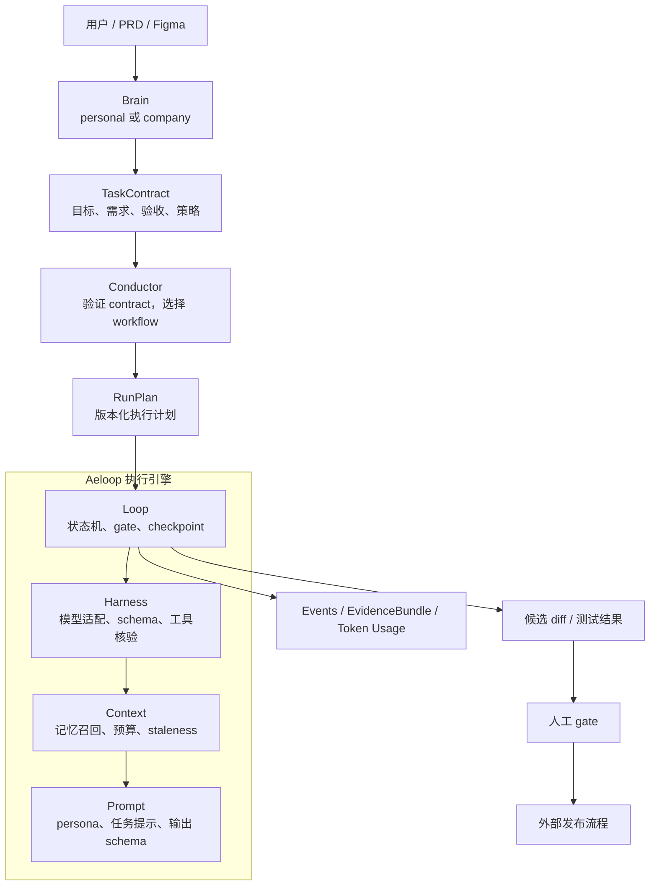

# 1. 产品总览

## 1.1 要解决的问题

普通的“让模型写代码”流程通常是：模型收到一大段上下文，生成代码，然后自己声称任务完成。这个流程有四类结构性风险：

| 风险 | 典型表现 | Aeloop 的处理方向 |
| --- | --- | --- |
| 幻觉和无证据结论 | 模型声称执行过命令或测试，但没有可靠记录 | 结构化 schema、工具轨迹核验、独立 tester、EvidenceBundle |
| 上下文疲劳 | 每轮重新解释背景，旧决定被遗忘或被错误覆盖 | 记忆存储、核心记忆、按需召回、上下文预算、checkpoint |
| 工作漂移 | 模型逐步增加需求外功能或违反约束 | `TaskContract`、policy、允许路径、禁止变更、fail-closed |
| 公司安全风险 | Agent 自动改 Git、上传数据或绕过审批 | 公司 profile 的候选模式、只读 reviewer、人工 gate |

Aeloop 不能保证模型永远不犯错。它的目标是把“模型说它完成了”改造成“系统能够说明它做了什么、依据是什么、哪里仍然需要人判断”。

## 1.2 总体地图



## 1.3 一句话分工

| 组件 | 它回答的问题 | 它不负责什么 |
| --- | --- | --- |
| Brain | “用户真正想做什么？应该拆成哪些要求？” | 不直接写入仓库，不绕过 contract |
| Conductor | “这个任务是否合法？用哪条 workflow 和策略？” | 不替代 coder/tester，不拥有业务长期记忆 |
| Prompt | “这一次应该怎样向模型提问？” | 不负责记忆检索和流程控制 |
| Context | “模型应该看到哪些信息？” | 不决定模型和 gate |
| Harness | “由谁执行，输出是否合格，工具是否真实？” | 不决定整个任务何时结束 |
| Loop | “任务如何循环、暂停、恢复和升级？” | 不解释自然语言需求 |
| 人工 gate | “这个结果是否授权进入下一步？” | 不应该被模型自我批准替代 |

## 1.4 个人与公司是同一引擎的两种 profile

两边共用 Aeloop 的执行机制，但 profile overlay 不同：

```text
同一个 Aeloop
├── personal profile
│   ├── Claude/Codex CLI bridge
│   ├── 个人 persona 与记忆
│   └── 更高的自动化自由度
└── company profile
    ├── LiteLLM / API provider
    ├── 公司 persona、PRD 和 policy
    └── candidate-only、禁止 Git 写操作
```

profile 通过 `AI_AGENT_PROFILE` 选择，profile 根目录可以由 `AELOOP_PROFILES_ROOT` 指定。凭证和公司私有资料不应进入公开仓库。

## 1.5 Aeloop 的核心价值

Aeloop 的护城河不是“又一个可以调用模型的 Agent 框架”，而是把以下机制组合成了一个可审计的编码闭环：

1. 结构化任务和结构化输出。
2. coder 与 tester 的独立视角。
3. 声称、工具轨迹、测试结果和证据的区分。
4. 多道 gate、拒绝阈值和强制升级。
5. 可暂停、可恢复、可解释的运行记录。
6. 个人和公司 profile 共用基座但隔离策略。
