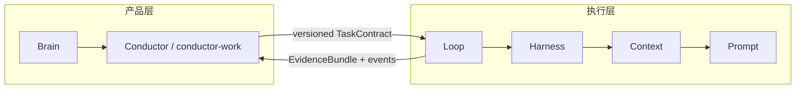

# 2. 系统架构与边界

## 2.1 两个同心系统

Aeloop 项目包含两个逻辑系统。它们在同一个仓库中协作，但职责不同：



### 产品层

产品层面向人。它可以是 Claude Code 中的 brain、CLI、服务或其他对话界面，负责理解需求、维持身份和记忆、生成任务契约，并把运行结果翻译回人能理解的状态。

### 执行层

执行层面向可靠运行。它只消费版本化 contract，不依赖某个 brain 的 prompt。这样同一套执行引擎可以服务个人和公司两种 brain。

## 2.2 四层是嵌套关系，不是四个并行 Agent

```text
Loop
└── Harness
    └── Context
        └── Prompt
```

一次 Loop 迭代会产生多次 Harness 调用；每次 Harness 调用会使用 Context 组装一次 Prompt。

| 层 | 主要职责 | 典型输入 | 典型输出 |
| --- | --- | --- | --- |
| Prompt | persona、任务说明、schema、禁止事项 | contract + context | 一次模型请求 |
| Context | 记忆召回、过滤、优先级、预算 | task + memory store | 注入上下文 |
| Harness | provider、adapter、schema、工具核验 | prompt | 结构化 invoke result |
| Loop | 节点、gate、拒绝、升级、checkpoint、事件 | run plan | 运行状态和证据 |

外层再加上 profile overlay，提供 provider、persona、workflow 参数和运行数据路径。

## 2.3 依赖方向

依赖方向必须向外单向流动：

```text
Prompt 不依赖 Context/Harness/Loop
Context 不依赖 Harness/Loop
Harness 不依赖具体 Loop workflow
Loop 使用前三层，但前三层不知道 Loop 的状态机
```

这样做的好处是：

- 换 provider 不需要重写 workflow。
- 换 workflow 不需要修改 Prompt schema。
- 换 profile 不需要复制一套引擎。
- 单元测试可以在较小边界内验证每一层。

## 2.4 关键边界对象

### TaskContract

Brain 到 Conductor/Aeloop 的唯一正式入口。它至少表达：

- 目标和需求。
- 每条需求的验收标准。
- 风险等级。
- 允许路径、允许命令和允许依赖。
- 是否允许网络。
- Git 写入策略。
- 来源快照和 schema 版本。

### RunPlan

Conductor 验证 contract 后生成的执行计划，包含：

- brain 和 workflow 版本。
- workflow 能力。
- policy 快照。
- budget。
- 本次 run 的唯一标识。

### EvidenceBundle

一次运行对外的安全结果摘要，应该区分：

- 代码或测试产生的独立证据。
- 模型自报的结论。
- 未验证或被拒绝的 claim。
- policy 和 gate 状态。
- token 使用记录。

## 2.5 不能混淆的三个“脑”概念

1. `brains/company` 和 `brains/personal`：仓库里的静态默认模板。
2. Brain runtime：未来/外层运行时的身份、记忆、对话和调度能力。
3. Aeloop engine：不拥有个人或公司的长期人格，只执行 contract。

静态 system prompt 不是完整的长期记忆系统，也不能替代部署方的策略和密钥管理。
