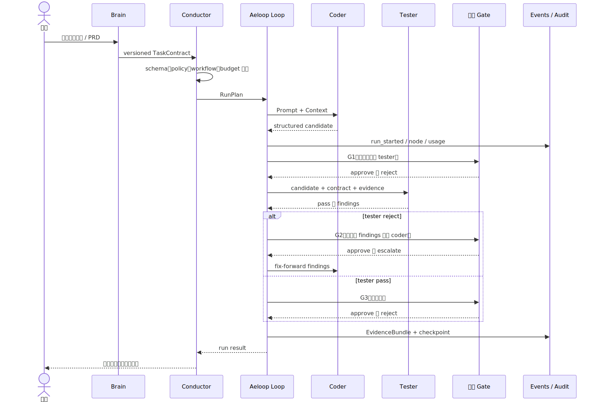

# 3. 一次任务如何运行

## 3.1 完整生命周期

图源：[run-lifecycle.mmd](./diagrams/run-lifecycle.mmd)。

## 3.2 每个阶段做什么

### 阶段 A：需求编译

Brain 把自然语言、PRD、Figma 摘要或已有决定编译为 contract。这里仍然需要模型理解自然语言，但产物必须经过确定性 schema 和 policy 校验。

### 阶段 B：计划验证

Conductor 检查 contract 是否可以执行。失败时应该 fail-closed：不进入模型调用，不“猜一个能跑的计划”。

### 阶段 C：Coder 产出候选

Coder 只负责在 contract 范围内产出候选代码、测试建议、claim 和 evidence。它不是最终批准者。

### 阶段 D：独立 Tester

Tester 使用不同模型或至少不同角色配置，独立检查 coder 的结果。它应该看到 contract、候选结果和必要证据，而不是只复述 coder 的结论。

### 阶段 E：拒绝和修复

Tester 拒绝时，系统增加 rejection count。达到阈值后强制升级给人，避免 coder/tester 无限互相循环。

### 阶段 F：最终 gate 和交付

通过最终 gate 后，Aeloop 产生候选交付物和审计结果。公司 profile 仍然不会自动进行 Git 写操作；发布由外部人工流程负责。

## 3.3 终态

| 终态 | 含义 |
| --- | --- |
| `completed` | contract 要求已完成，并有相应结果 |
| `no_change` | 只读检查或已有状态已经满足要求，没有代码变更 |
| `rejected` | gate 或 policy 拒绝 |
| `escalated` | 达到拒绝阈值或风险需要人工处理 |
| `interrupted` | 等待外部 gate，可从 checkpoint 恢复 |
| `failed` | adapter、schema、运行环境等技术失败 |

`no_change` 不是失败，也不应该因为没有 diff 而自动进入 coder/tester 修复循环。

## 3.4 为什么要有多个 gate

Gate 不是为了增加形式流程，而是把不同风险点分开：

- G1：防止未经人确认的候选结果进入独立复核。
- G2：防止模型自动决定要修改什么，尤其是公司代码。
- G3：防止“tester 通过”被误认为“已经授权发布”。
