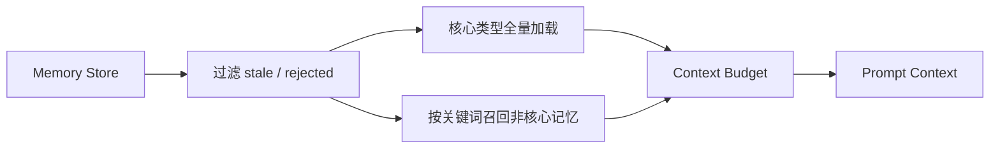

# 4. 四层引擎详解

## 4.1 Prompt 层：一次调用的契约

Prompt 层不只是拼接字符串。它把以下内容组合为一次可解释的模型请求：

- 角色 persona。
- 当前任务和 contract 要求。
- 已筛选的 context。
- 输出 schema。
- 必须声明的 claim、confidence 和 evidence。
- 禁止事项和失败条件。

### Prompt 层如何防止幻觉

它不能凭文本要求模型“不要幻觉”就解决问题，但可以减少自由格式回答：

```text
自由文本回答
    ↓
结构化输出 schema
    ↓
每条 claim 必须有来源/置信度/证据状态
```

最终是否可信，仍由 Harness 的机械校验和 Loop 的独立 tester 决定。

### Prompt 层如何节省 token

- 只注入 Context 选中的内容。
- 明确稳定指令与动态任务的边界。
- 使用 schema，减少模型重复解释流程。
- 对校验失败的重试只补充错误信息，而不是无限重复完整上下文。

PromptDelta 已有设计接口，但当前主线不能把它当成完整的运行时 token 节省能力；是否每轮只发送变化，仍需真实路径验证。

## 4.2 Context 层：决定模型看到什么

Context 层负责从 memory store 和当前任务中选择上下文，而不是把整个数据库塞进 prompt。

### 记忆选择原则



核心记忆通常包括身份、硬约束和已定决策；其他 snapshot、active task、idea、postmortem 等按需召回。

### Context 层如何保持连续性

- 使用 profile 独立的 memory store。
- 记录来源、确认状态、更新时间和新鲜度。
- 将已拒绝或过期内容过滤掉。
- 通过 checkpoint 恢复当前 run，而不是要求模型凭空回忆。
- 用摘要或快照减少重复发送完整历史。

### Context 层如何节省 token

- 按优先级和预算截断低价值内容。
- 记录 omitted context，保持可解释性。
- 核心记忆和按需召回取并集，而不是整表注入。
- 未来可增加语义检索，但不能在未验证前假设它已经存在。

## 4.3 Harness 层：执行和验证边界

Harness 是“模型调用的安全适配层”。它决定：

- 使用哪个 provider 和 model。
- 走 LiteLLM direct API 还是 Claude/Codex CLI bridge。
- 如何解析响应。
- 如何执行 schema 验证和有限重试。
- 如何核对模型声称的工具操作。
- 如何记录 provider、model、latency 和 token usage。

### Provider 路由

角色只声明 provider 名称，具体 adapter 由注册表解析：

```text
role: coder
  provider: litellm-deepseek
        ↓
ProviderRouter
        ↓
LiteLLMAdapter
```

新增 provider 不应该要求修改 Loop 状态机。

### SchemaValidator

模型输出不符合 schema 时：

1. 记录失败原因。
2. 在有限次数内把错误反馈给模型重试。
3. 重试耗尽则 fail-closed。

“返回一段看起来像 JSON 的文字”不能绕过结构化验证。

### ToolExecVerifier

CLI bridge 可以取得工具执行轨迹，因此能够比较：

```text
模型声称执行过的操作  VS  实际工具轨迹
```

纯 API 通常只能得到模型响应，不能同等强度地核对本地工具执行；这会在 EvidenceBundle 中被标记为较弱的 `model-reported` 证据。

## 4.4 Loop 层：整个任务的状态机

Loop 负责把多个 Harness 调用组织成完整 workflow：

- coder/tester 节点。
- G1/G2/G3 gates。
- reject threshold 和 escalation。
- interrupt/resume。
- checkpoint。
- LoopEvent 和审计存储。
- EvidenceBundle 投影。

Loop 不应该把 `coder` 和 `tester` 写死成唯一可能角色。当前 MVP 使用 coder-tester，但 workflow definition 已经为其他角色和产品流程预留了注册表边界。

## 4.5 四层如何共同防止漂移

```text
Prompt：规定输出形状
Context：只提供相关、最新、被允许的背景
Harness：机械验证输出和工具行为
Loop：控制状态、gate、重试、升级和审计
```

任何一层失败都不能由下一层“假装成功”覆盖。
