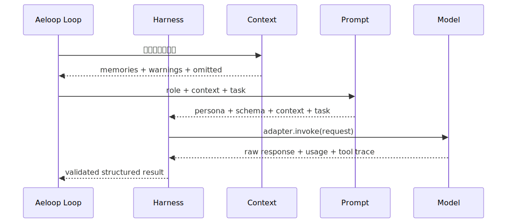

# 4. 四层引擎导航

四层不是四个并行 Agent，而是逐层包裹的执行边界：

```text
Loop
└── Harness
    └── Context
        └── Prompt
```



图源：[engine-layers.mmd](./diagrams/engine-layers.mmd)。

一次 Loop 迭代可能调用多次 Harness；每次 Harness 调用都会使用 Context 选择的信息，由 Prompt 组装一次模型请求。

## 四篇深入文章

| 层 | 要回答的问题 | 详细文章 |
| --- | --- | --- |
| Prompt | 这一次到底要对模型说什么？输出必须长什么样？ | [Prompt 层](./layers/01-prompt.md) |
| Context | 模型应该看到哪些记忆、约束和任务信息？ | [Context 层](./layers/02-context.md) |
| Harness | 谁来调用模型？如何验证输出和工具行为？ | [Harness 层](./layers/03-harness.md) |
| Loop | coder/tester 如何循环、暂停、恢复、升级和审计？ | [Loop 层](./layers/04-loop.md) |

## 共同原则

1. 内层不知道外层实现：Prompt 不 import Loop，Context 不负责调用 provider。
2. 外层不能跳过内层验证：Loop 不能把未通过 Harness schema 的结果当成成功。
3. 失败要显式暴露：召回失败、protected context 放不下、schema 重试耗尽，都应 fail-closed。
4. 模型自报不等于证据：独立工具、测试、轨迹和人工确认拥有更高可信度。
5. 设计完成和代码完成分开记录：有接口不代表真实路径已经接通。

## 一次调用的最小路径



图源：[layer-call-sequence.mmd](./diagrams/layer-call-sequence.mmd)。

先读四篇文章，再读 [一次任务如何运行](./03-run-lifecycle.md)，可以把单次模型调用和完整 coder/tester 闭环对应起来。
