# Prompt 层：一次模型调用的可验证契约

## 1. 这一层解决什么问题

Prompt 层解决的不是“让模型更聪明”，而是把一次模型调用变成边界清楚的请求：

```text
谁在回答（persona）
要处理什么（task / contract）
允许看到什么（context）
必须返回什么（output schema）
哪些行为不可接受（policy / failure rules）
```

如果没有 Prompt 层，coder 和 tester 很容易得到不同格式、不同语义的自由文本，后面的 Harness 无法稳定验证，Loop 也无法可靠分支。

## 2. 输入和输出

Prompt 层的主要入口是 `PromptComposer.compose(role, context, task)`。

| 输入 | 来源 | 作用 |
| --- | --- | --- |
| `role` | Loop 节点 | 决定加载 coder、tester 或未来角色 |
| `ContextInjectionResult` | Context 层 | 已过滤、标记 warning、可能已预算截断的记忆 |
| `task` | contract/run | 当前节点要完成的具体任务 |
| `personasDir` | profile | 角色的 persona 文件目录 |
| `SchemaRegistry` | 引擎/扩展注册表 | role 到输出 schema 的映射 |

输出是一个有固定分段的 prompt：

```text
# Persona
角色行为规则

# Output Schema
JSON schema 描述

# Context
选中的记忆和 warning

# Omitted Context
被预算省略的记忆（如果启用预算）

# Task
本次任务
```

对应实现：[src/prompt/composer.ts](../../src/prompt/composer.ts)。

## 3. Prompt 组装流程



图源：[prompt-flow.mmd](../diagrams/prompt-flow.mmd)。

### 第一步：加载 persona

Persona 是角色的行为边界，例如 coder 应该说明改了什么、如何验证；tester 应该独立检查并具体列出问题。Persona 不是安全策略的唯一来源，真正的 policy 仍由 contract、Conductor 和 Harness 执行。

### 第二步：插入 schema

Prompt 会把角色 schema 转换为 JSON Schema，要求模型返回可验证的 JSON。这样模型输出从“任意文章”变成“具有固定字段的候选数据”。

### 第三步：插入 context

Prompt 层只消费 Context 层已经处理好的结果。它不会重新查询 SQLite，也不会自行判断 memory 是否 rejected；这保证依赖方向单向。

### 第四步：插入任务

任务应尽可能短而明确，contract 的正式约束不能只藏在自然语言任务描述里。任务文本是给模型看的说明，policy/schema 才是引擎可验证的边界。

## 4. 输出 schema 的设计

### 4.1 Claim

每条 claim 可以包含：

| 字段 | 含义 |
| --- | --- |
| `claimText` | 模型正在声称的事实 |
| `confidence` | `verified`、`inferred`、`unconfirmed` 或 `stale` |
| `sourceRef` | 证据来源，例如文件、测试或命令 |
| `verifiedBy` | `tool_execution`、`human` 或 `unverified` |
| `toolsUsed` | 声称使用过的工具名称 |

这些字段只是模型可以自报的内容。`provider`、`model`、`run_id`、`tool_exec_checked` 等由 Harness/Loop 在模型调用之后补充，不能让模型自己声明就算真实。

### 4.2 CoderOutput

Coder 有两个明确终态：

```text
changed
  diff 非空
  claims[]
  confidence

no_change
  reason 非空
  evidence 非空
  claims[]
  confidence
```

`changed` 和 `no_change` 是严格互斥的。`no_change` 不能偷偷带一个 diff；只读检查或需求已经满足时，不应强迫 Loop 进入 G1/tester 修复流程。

### 4.3 TesterOutput

Tester 返回：

- `verdict`: `pass` 或 `reject`。
- `issues[]`: 具体问题列表。
- `claims[]`。
- `confidence`。

Tester 的 schema 只保证格式和非空字段，不能保证问题判断本身正确；判断质量要靠独立角色、测试和人工 gate。

## 5. 它如何减少幻觉

Prompt 层做的是“限制表达空间”，不是直接证明事实：

```text
自由文本：“我已经测试过了。”

结构化 claim：
  claimText: ...
  sourceRef: ...
  verifiedBy: tool_execution
  toolsUsed: [Bash]
```

之后 Harness 还要检查工具轨迹，Loop 还要让 tester 独立复核。因此最终可信度来自多层叠加，而不是来自 persona 里一句“请诚实”。

## 6. 它如何节省 token

### 当前已经有效的部分

- 只渲染 Context 层选中的 memory。
- 省略内容会进入 `# Omitted Context`，不用把全文重复发送。
- schema 明确了模型要返回的形状，减少解释流程的冗余。
- 角色 persona 固定化，避免每次由外层重新描述角色。

### 当前不能夸大的部分

`src/prompt/delta.ts` 有 PromptDelta 类型和测试，但“每一轮真实只发送变化”尚未成为完整 live-run 能力。不要把设计存在写成已经测得 token 节省。

## 7. 失败模式和处理方式

| 失败 | 发生位置 | 正确行为 |
| --- | --- | --- |
| persona 文件不存在 | persona loader | 立即失败，不使用隐含默认人格 |
| role 没有 schema | schema registry | 抛出未注册错误，不发模型请求 |
| 模型返回非法 JSON | Harness validator | 有限重试，耗尽后 fail-closed |
| `diff` 为空或只有空白 | Coder schema | 不能进入 changed 成功路径 |
| no-change 缺少 evidence | Coder schema | 不能直接结束 run |
| context 中有 rejected memory | Context Injector | 不应到达 Prompt |

## 8. 代码和测试地图

| 文件 | 责任 |
| --- | --- |
| `src/prompt/schema.ts` | Claim、CoderOutput、TesterOutput schema |
| `src/prompt/composer.ts` | 分段组装最终 prompt |
| `src/prompt/personas.ts` | 从 profile 加载 persona |
| `src/prompt/schema-registry.ts` | role 到 schema 的扩展注册表 |
| `src/prompt/delta.ts` | PromptDelta 设计类型 |
| `src/prompt/__tests__/schema.test.ts` | schema 边界 |
| `src/prompt/__tests__/composer.test.ts` | 组装结果 |
| `src/prompt/__tests__/personas.test.ts` | persona 加载 |

## 9. 扩展一个新角色时要做什么

1. 写角色 persona。
2. 定义独立输出 schema。
3. 注册 role → schema。
4. 确认 Context 中需要哪些信息。
5. 写 schema、composer 和真实 workflow 集成测试。
6. 不要为了新增角色修改 provider router 或 Loop 的核心分支。

## 10. 这一层不负责什么

- 不查询记忆数据库。
- 不选择 provider。
- 不执行 shell 或文件工具。
- 不决定 gate 是否通过。
- 不把模型自报的 `verified` 自动升级为独立证据。
