# Context 层：决定模型应该看到什么

## 1. 这一层解决什么问题

Context 层解决“上下文连续性”和“上下文过载”之间的矛盾：

- 不给模型足够背景，模型会重复犯错。
- 把整个历史全部塞进去，token 成本高，重点反而被淹没。
- 把 stale 或已经 rejected 的记忆继续注入，会让模型沿着错误方向工作。

Context 层因此不是一个简单的“memory dump”，而是一个带状态、来源、freshness 和预算的选择器。

## 2. Context 的数据模型

实现主要位于：[src/context](../../src/context/)。每条 `Memory` 至少有：

| 字段 | 作用 |
| --- | --- |
| `id` | 稳定标识，便于去重、确认和审计 |
| `type` | 记忆语义类型 |
| `title/content` | 可注入模型的内容 |
| `sourceFile` | 来源文件或外部来源 |
| `tags` | 关键词和分类 |
| `confidenceState` | `unconfirmed`、`confirmed`、`rejected` |
| `staleOverrideDays` | 单条记忆的新鲜度覆盖值 |
| `createdAt/updatedAt` | 时间边界 |
| `confirmedAt/confirmedBy` | 谁、何时确认过 |

记忆类型包括 `identity`、`constraint`、`decision`、`active_task`、`snapshot`、`idea`、`postmortem`、`requirement` 等。类型是封闭词汇，不等同于可随意新增的 role 名称。

## 3. ContextInjector 的完整流程



图源：[context-flow.mmd](../diagrams/context-flow.mmd)。

对应入口：[src/context/injector.ts](../../src/context/injector.ts)。

### 第一步：核心记忆全量加载

当前核心集合是：

- `identity`
- `constraint`
- `decision`

它们代表“醒来时始终需要知道的身份、硬约束和已定决策”。这不是把整张表都当核心；如果所有 memory 都全量加载，FTS5 召回就失去意义。

### 第二步：任务相关召回

如果调用方提供 query，非核心记忆通过 SQLite FTS5 关键词搜索进入候选集合。核心记忆和召回结果按 `id` 去重后合并。

当前阶段依赖 FTS5；语义 embedding/vector search 是后续评估项，不能假设已存在。

### 第三步：过滤 rejected，保留 warning

ContextInjector 只会把 `rejected` memory 完全过滤掉。stale 或 unconfirmed 内容不会静默删除，而是保留并加 warning：

```text
[warning: stale] 旧的接口决定
[warning: unconfirmed] 尚未确认的需求猜测
```

这样模型和人工都能看见“不确定性”，而不是误以为它是正常事实。

## 4. Staleness 和确认状态

### 状态的含义

| 状态 | 语义 | 是否注入 |
| --- | --- | --- |
| `confirmed` | 已经被人工或明确流程确认 | 可以正常注入 |
| `unconfirmed` | 可能有用，但尚未确认 | 注入并标 warning |
| `rejected` | 已明确不可信或不再采用 | 完全过滤 |

### 为什么 stale 不直接过滤

过期内容有时仍然是排查历史问题的线索。如果直接删除，系统会失去可解释性；如果不标记，模型又会把它当成当前事实。因此当前策略是“保留但警告”。

## 5. Context Budget 如何选择

`ContextBudgetManager` 进行确定性、模型无关的选择。候选项按以下因素排序：

1. protected 优先。
2. context priority。
3. relevance。
4. 稳定 id 顺序，保证结果可重复。

优先级大致是：

```text
contract > policy > gate > evidence > memory > general
```

如果非 protected 内容放不下，会被记录为 `omitted`；如果 protected 内容放不下，会抛出 `ContextBudgetExceededError`，而不是静默删掉硬约束。



图源：[context-budget.mmd](../diagrams/context-budget.mmd)。

当前 token 估算是可解释的近似值（按字符长度估算），不是 provider 最终计费账单；真实 usage 仍由 Harness 记录。

## 6. 它如何保持上下文连续性

- profile 之间使用独立 memory 数据路径，个人和公司记忆不混用。
- 记忆有来源、时间和确认记录。
- checkpoint 恢复的是当前执行状态；memory store 保存的是可跨 run 复用的知识。
- 核心记忆每次都出现，任务记忆按 query 召回。
- omitted 记录让人知道系统为了预算省略了什么。

这比把完整 transcript 反复发给模型更稳定，也更容易审计。

## 7. Context 如何防止幻觉和漂移

Context 层不是事实核验器，但它减少错误背景造成的漂移：

1. rejected 记忆不会到达 Prompt。
2. stale/unconfirmed 会带警告。
3. 硬约束和决策拥有更高预算优先级。
4. 召回失败会抛出 `RecallError`，不会悄悄变成空上下文。
5. protected 内容无法放下时 fail-closed。

真正的代码正确性仍需 Harness 和 tester 验证。

## 8. Token 优化的现状

### 已接入

- `context.token_budget` 可启用 budget manager。
- Prompt 中会显示 omitted context。
- 核心全量 + 任务召回并集，避免整库注入。

### 尚未完成或需要实测

- PromptDelta 的 live wiring。
- 跨重启的完整 usage/evidence 持久化。
- embedding/vector search。
- brain 外层对话的滚动摘要。

因此 Context 层可以解释“为什么可能省 token”，但必须用 baseline 运行数据证明“实际省了多少”。

## 9. 代码和测试地图

| 文件 | 责任 |
| --- | --- |
| `src/context/store.ts` | SQLite、memory CRUD、FTS5 搜索 |
| `src/context/types.ts` | Memory、状态和确认类型 |
| `src/context/injector.ts` | 核心/召回合并、过滤、warning、预算接线 |
| `src/context/staleness.ts` | 新鲜度判断 |
| `src/context/confirmation.ts` | confirm/correct/reject 三态变更 |
| `src/context/budget.ts` | 确定性 token budget 选择 |
| `src/context/__tests__/injector.test.ts` | 注入和过滤 |
| `src/context/__tests__/budget.test.ts` | 预算和 fail-closed |
| `src/context/__tests__/staleness.test.ts` | stale 边界 |

## 10. 这一层不负责什么

- 不调用模型。
- 不解释自然语言需求。
- 不决定 workflow 是否进入 G1/G2/G3。
- 不把模型声称的 claim 当成 confirmed memory。
- 不把 checkpoint、对话 transcript 和长期 memory 混成一个对象。
