# Harness 层：模型、工具与确定性验证

## 1. 这一层解决什么问题

Harness 是模型调用和外部世界之间的“受控适配层”。它解决四个问题：

1. 角色应该使用哪个 provider/model？
2. Claude/Codex CLI 和 LiteLLM API 的差异如何统一？
3. 模型返回的内容是否符合预期结构？
4. 模型声称做过的工具操作是否真的发生？

没有 Harness，Loop 只能拿到不可预测的字符串，无法安全地进入 gate 或生成证据。

## 2. Harness 的输入输出

Harness 典型输入是：

```text
InvokeRequest
├── role
├── provider/model route
├── prompt
├── expected schema
├── tool policy
└── retry/budget options
```

典型输出是 `InvokeResult`：

```text
InvokeResult
├── content / parsed structured output
├── provider
├── model
├── usage
├── latency
├── tool trace（CLI bridge 可用时）
└── validation / error metadata
```

模型本身不能决定 `provider`、`model` 或 `tool_exec_checked` 的最终值；这些是 Harness 的运行事实。

## 3. 总体流程



图源：[harness-flow.mmd](../diagrams/harness-flow.mmd)。

## 4. ProviderRouter 和 AdapterRegistry

### 4.1 为什么不能在 Loop 里写 provider if/else

Loop 关心的是“运行 coder/tester 节点”，不应该知道 LiteLLM、Claude CLI 或 Codex CLI 的命令行参数。角色配置只声明 provider id：

```text
roles:
  coder:
    provider: litellm-deepseek
  tester:
    provider: litellm-seed
```

ProviderRouter 根据配置找到 adapter，再把统一的 request 交给它。

### 4.2 Adapter 的共同契约

每个 adapter 都需要处理：

- availability check。
- request 序列化。
- provider 特有的响应解析。
- 错误分类。
- usage 提取。
- 模型/供应商身份回填。

差异留在 adapter 内部，不泄漏到 Loop。

## 5. 三类 adapter

| Adapter | 连接方式 | 优势 | 限制 |
| --- | --- | --- | --- |
| LiteLLM | direct API | 适合公司网关、统一模型池、usage | 通常拿不到完整本地工具轨迹 |
| Claude CLI | cli bridge | 可复用订阅、能观察 CLI 工具轨迹 | 依赖本机 CLI 登录和命令行为 |
| Codex CLI | cli bridge | 可作为独立 tester 或 coder | 依赖本机 CLI 和非交互运行能力 |

个人 profile 可以使用 CLI bridge，公司的 API profile 可以使用 LiteLLM；两者都走 Harness 的统一校验流程。

## 6. SchemaValidator：把自由文本变成可判定结果

SchemaValidator 的职责不是评价业务正确性，而是先回答“这是不是一个合法的角色输出”。

### 验证过程

1. 解析 adapter 返回的内容。
2. 使用 role 对应的 Zod schema 校验。
3. 如果失败，记录具体字段错误。
4. 生成带错误反馈的重试请求。
5. 达到 `schema_max_attempts` 后失败关闭。

重试不能只是把完全相同的 prompt 再发一次；否则只增加 token，却没有提供修复信息。

### Schema 验证不等于事实验证

下面两件事必须区分：

```text
schema valid：字段和类型正确
fact verified：claim 有独立证据支持
```

一个结构合法的幻觉仍然可能是幻觉，所以还需要 ToolExecVerifier、tester、测试结果和人工 gate。

## 7. ToolExecVerifier：声称和事实的对照

CLI bridge 可以取得工具调用轨迹，例如 `Read`、`Bash` 等。对于声明 `verifiedBy: tool_execution` 的 claim，Verifier 会检查声称的工具是否在实际 trace 中出现。

```text
Claim:
  verifiedBy = tool_execution
  toolsUsed = [Read, Bash]

Trace:
  [Read, Bash, Bash]

结果：工具存在，但仍不代表 Bash 的输出证明了 claim
```

这是一个重要的边界：工具轨迹核验能证明“工具被调用过”，不能单独证明“工具输出支持了全部结论”。因此 EvidenceBundle 仍需要区分 verified 和 model-reported。

纯 API 路径拿不到同样完整的本地工具执行流，不能伪装成 CLI bridge 的验证强度。

## 8. Harness 如何防止幻觉

Harness 采用从便宜到昂贵的验证顺序：

1. 请求和配置结构检查。
2. JSON/schema 机械校验。
3. tool trace 与 claim 的一致性检查。
4. usage/provider/model 事实记录。
5. 失败时有限重试。
6. 仍不通过则 fail-closed，不把失败结果送进下一阶段。

这体现“确定性校验优先于让模型自我评价”。

## 9. Harness 如何控制 token

- 只在需要时重试。
- 重试反馈包含具体 schema 错误，而不是重复完整解释。
- 记录 input/output/cache/retry token，后续可以定位浪费。
- provider 路由可按任务风险选择更合适的模型。
- Context 层负责截断输入，Harness 负责记录实际消耗。

注意：Harness 记录 usage 不等于已经优化 usage。优化结果必须与 baseline 对比。

## 10. 失败分类

| 失败类型 | 示例 | 是否应该自动重试 |
| --- | --- | --- |
| 配置错误 | provider 不存在、URL 非法 | 否，直接提示配置问题 |
| 可修复 schema 错误 | 缺字段、JSON 格式错误 | 是，有限次数 |
| provider 暂时错误 | 429、网络超时 | 按明确 retry policy 处理，不能无限重试 |
| 工具核验不一致 | claim 声称 Read，但 trace 没有 | 通常否，标记不可信并交给上层 |
| policy 拒绝 | 禁止命令或路径 | 否，fail-closed |
| 重试耗尽 | 多次仍非法 | 否，终止当前节点 |

## 11. 代码和测试地图

| 文件 | 责任 |
| --- | --- |
| `src/harness/types.ts` | adapter、request、result、usage 类型 |
| `src/harness/provider-router.ts` | role/provider 到 adapter 的路由 |
| `src/harness/adapter-registry.ts` | adapter 注册表 |
| `src/harness/schema-validator.ts` | 结构化输出校验和重试 |
| `src/harness/tool-exec-verifier.ts` | claim 与工具轨迹核对 |
| `src/harness/adapters/litellm-adapter.ts` | LiteLLM direct API |
| `src/harness/adapters/claude-cli-adapter.ts` | Claude CLI bridge |
| `src/harness/adapters/codex-cli-adapter.ts` | Codex CLI bridge |
| `src/harness/__tests__/provider-router.test.ts` | provider 路由 |
| `src/harness/__tests__/schema-validator.test.ts` | schema/retry |
| `src/harness/__tests__/tool-exec-verifier.test.ts` | 工具核验 |

## 12. 这一层不负责什么

- 不决定任务需求是否正确。
- 不决定是否进入 G1/G2/G3。
- 不替代 tester 的业务/代码复核。
- 不把 API provider 的模型自报当成完整工具事实。
- 不为了“成功”而无限重试或放宽 schema。
