# Loop 层：把一次调用组织成可暂停、可恢复的闭环

## 1. 这一层解决什么问题

前三层解决的是“单次模型调用如何更可靠”。Loop 层解决的是更大的问题：

```text
什么时候调用 coder？
什么时候需要人确认？
什么时候交给 tester？
拒绝几次以后怎么办？
进程中断后从哪里继续？
最终结果如何留下审计证据？
```

没有 Loop，Aeloop 只是一个带 schema 的模型 wrapper；有了 Loop，才形成 coder/tester/gate/checkpoint 的工程闭环。

## 2. Loop 的核心状态

实现主要位于：[src/loop](../../src/loop/)。`LoopState` 包含：

| 状态 | 作用 |
| --- | --- |
| `task` | 本次 run 的原始任务 |
| `feedback` | G1/G2/G3 产生的下一轮反馈 |
| `injectedContext` | 外部注入的一次 Context 结果 |
| `coderOutput/coderResult` | coder 的结构化结果和 provider 结果 |
| `testerOutput/testerResult` | tester 的结构化结果和 provider 结果 |
| `rejectCount` | tester reject 累计次数 |
| `rejectThreshold` | 本次 run 的拒绝阈值 |
| `g1Decision/g2Decision/g3Decision` | 各 gate 决定 |
| `gateLog` | 跨整个 run 累积的 gate 审计记录 |
| `applied` | 是否进入 apply 终态 |
| `cancelled` | 是否取消 |
| `noChange` | 是否以 no-change 终态结束 |
| `escalationDecision` | 达阈值后的人工三态决定 |

状态是运行事实，不应由模型在文本中自行伪造。

## 3. 当前 coder/tester 图



图源：[loop-graph.mmd](../diagrams/loop-graph.mmd)。

## 4. 每个节点的语义

### `draft`

调用 coder。Coder 结果必须先通过 Harness schema validation，才能进入路由判断：

- `status: changed` → G1。
- `status: no_change` → no_change 终态。

这一步避免只读任务因为没有 diff 而错误进入 tester 修复循环。

### `g1`

询问是否把候选 diff 发送给 tester。Gate payload 应展示 diff 引用和必要上下文；resume 之后才写 gate log，避免 LangGraph interrupt 重跑节点时重复写审计。

### `review`

调用独立 tester。Tester 的 `pass` 进入 G3；`reject` 增加 `rejectCount`，再根据阈值进入 G2 或 escalation。

### `g2`

询问是否把 tester 的 issues 反馈给 coder。G2 的反馈必须包含 tester 的具体 issues，不能只传一句“请修复”。

### `g3`

最终 sign-off。Tester pass 不等于人工已经授权 apply；G3 把“技术复核通过”和“最终授权”明确分开。

### `escalation`

达到拒绝阈值或人工主动升级后进入。它可以要求重试、转 G3 或取消，防止模型之间无限循环。

### `apply`、`cancel`、`no_change`

三个终态含义不同：

- `apply`：有人批准候选变更进入应用阶段。
- `cancel`：人工或 policy 取消。
- `no_change`：检查完成但不需要代码变更。

公司 runner 仍可以把 apply 作为候选状态，实际 Git 写操作必须在外部公司流程完成。

## 5. Gate 为什么需要 interrupt/resume

Gate 是外部决定，不是模型推理。LangGraph 的 interrupt/resume 让 run 可以：

1. 输出当前 gate payload。
2. 安全暂停。
3. 进程退出或等待人工。
4. 之后用同一个 run handle 恢复。
5. 将 resume decision 写入状态和审计。

关键实现纪律是：`interrupt()` 之前的代码可能在 resume 时重新执行，因此必须保持纯函数；有副作用的 gate log 写入要放在 interrupt 返回之后。

## 6. 拒绝阈值不是 schema 重试次数

这两个旋钮控制不同层次：

| 参数 | 所属层 | 含义 |
| --- | --- | --- |
| `harness.schema_max_attempts` | Harness | 一次模型调用的结构化输出最多重试几次 |
| `workflow.reject_threshold` | Loop | tester 拒绝几轮后触发 escalation |

前者解决“输出格式不合格”；后者解决“候选内容连续被独立复核拒绝”。混用会导致 token 浪费或错误的安全判断。

## 7. Checkpoint 和 resume

Loop checkpoint 保存的是运行状态，例如 coder/tester 结果、gate 决定、reject count 和当前节点。它支持：

- 进程重启后继续。
- gate 等待期间不丢状态。
- 跨实例恢复测试。
- 运行中断后的审计解释。

Checkpoint 不等于长期 memory。长期 memory 需要经过确认后由 Brain/Context 选择性写回。

## 8. Loop 如何生成事件和证据



图源：[loop-events.mmd](../diagrams/loop-events.mmd)。

事件记录过程，EvidenceBundle 提供对外摘要。两者分开可以让 UI、审计和后续 brain 消费同一条事实轨迹。

## 9. Loop 如何防止幻觉和漂移

Loop 本身不验证每个事实，但它保证未经验证的结果不能直接成为最终结果：

1. coder 先经过 Harness schema。
2. changed 结果先过 G1。
3. tester 使用独立视角复核。
4. reject 达阈值会升级。
5. tester pass 之后仍有 G3。
6. 失败、取消和 no-change 都有明确终态。
7. 每个 gate 和节点都留下事件。

这比“模型自己检查自己然后返回 done”更可审计。

## 10. Loop 如何控制 token

- 只在真正需要的节点调用模型。
- no-change 不进入 tester/G1/G3 全套循环。
- schema 错误重试由 Harness 限制。
- tester reject 由 threshold 限制。
- Context 只注入预算内的信息。
- usage event 记录每个节点的实际消耗。

但 Loop 也可能因为重试和多轮 tester 而增加 token。优化目标不是“调用越少越好”，而是用可接受的验证成本换取更高可信度。需要同时衡量质量、拒绝率、人工介入和 token。

## 11. Workflow 扩展边界

当前运行图使用 coder/tester，但 `LOOP_NODES`、`GATE_TYPES`、workflow definition 和 role registry 为后续 workflow 留出边界。新增 workflow 应优先通过：

1. 新的 node/role 定义。
2. 明确的输入输出 schema。
3. 明确的 gate 和 escalation。
4. 同样的 event/evidence/usage 投影。

不要复制一套新的 checkpoint、policy 或 adapter 机制。

## 12. 代码和测试地图

| 文件 | 责任 |
| --- | --- |
| `src/loop/graph.ts` | 构建 LangGraph 状态图 |
| `src/loop/types.ts` | LoopState、node/gate 类型 |
| `src/loop/nodes/coder.ts` | draft/coder 节点 |
| `src/loop/nodes/tester.ts` | review/tester 节点 |
| `src/loop/gates.ts` | G1/G2/G3 和路由 |
| `src/loop/escalation.ts` | escalation 分支 |
| `src/loop/checkpoint.ts` | checkpoint 接线 |
| `src/loop/events.ts` | LoopEvent |
| `src/loop/audit-store.ts` | 审计存储 |
| `src/loop/runner.ts` | run 启动、状态和结果 |
| `src/loop/__tests__/gates.test.ts` | gate 路由 |
| `src/loop/__tests__/checkpoint.test.ts` | checkpoint |
| `src/loop/__tests__/cross-process-resume.test.ts` | 跨进程恢复 |
| `src/loop/__tests__/events.test.ts` | 事件 |
| `src/loop/__tests__/runner.test.ts` | 端到端 runner |

## 13. 这一层不负责什么

- 不替代 Brain 理解自然语言需求。
- 不自己决定 provider 和 schema 验证细节。
- 不把 tester pass 当成最终人工授权。
- 不在公司 profile 中自动执行 Git 发布动作。
- 不以无限循环换取“看起来最终成功”。
